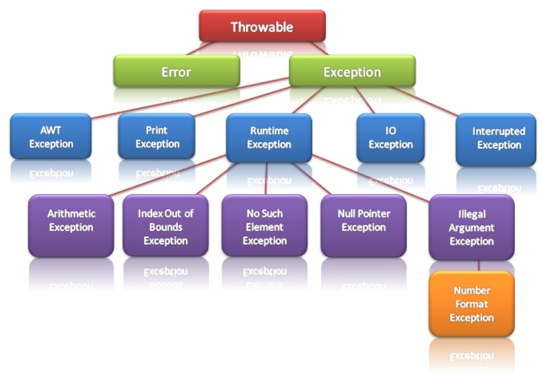
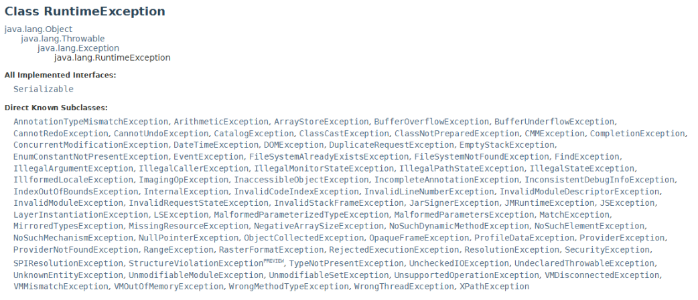

# UD5: Manejo de excepciones

- [1. Introducción a las Excepciones](#1-introducción-a-las-excepciones)
  - [1.1. Concepto de excepción](#11-concepto-de-excepción)
- [2. Jerarquía Básica de Excepciones en Java](#2-jerarquía-básica-de-excepciones-en-java)
- [3. Manejo Básico de Excepciones en Java](#3-manejo-básico-de-excepciones-en-java)
- [4. Propagación de Excepciones](#4-propagación-de-excepciones)
  - [4.1. Concepto de Propagación de Excepciones](#41-concepto-de-propagación-de-excepciones)
  - [4.2. Uso del `throws` en Métodos](#42-uso-del-throws-en-métodos)
  - [4.3. Ejemplo de Método que Lanza una Excepción](#43-ejemplo-de-método-que-lanza-una-excepción)
  - [4.4. Ejercicio Práctico](#44-ejercicio-práctico)
- [5. Buenas Prácticas en el Manejo de Excepciones](#5-buenas-prácticas-en-el-manejo-de-excepciones)
  - [5.1. Capturar Excepciones Específicas en Lugar de Usar Exception o Throwable Genérico](#51-capturar-excepciones-específicas-en-lugar-de-usar-exception-o-throwable-genérico)
  - [5.2. Evitar Bloques catch Vacíos](#52-evitar-bloques-catch-vacíos)
  - [5.3. Ofrecer Mensajes de Error Claros y Útiles](#53-ofrecer-mensajes-de-error-claros-y-útiles)
  - [5.4. Manejo de Recursos con try-with-resources (Java 7 y superior)](#54-manejo-de-recursos-con-try-with-resources-java-7-y-superior)
  - [5.5. Documentar Excepciones en los Métodos](#55-documentar-excepciones-en-los-métodos)
- [6. Creación de Excepciones Personalizadas](#6-creación-de-excepciones-personalizadas)
  - [6.1. ¿Qué es una Excepción Personalizada?](#61-qué-es-una-excepción-personalizada)
  - [6.2. ¿Cuándo Usar Excepciones Personalizadas?](#62-cuándo-usar-excepciones-personalizadas)
  - [6.3. Creación de una Excepción Personalizada](#63-creación-de-una-excepción-personalizada)
    - [6.3.1. Ejemplo de Excepción Personalizada: `InvalidAgeException`](#631-ejemplo-de-excepción-personalizada-invalidageexception)
  - [6.4. Tipos de Constructores en Excepciones Personalizadas](#64-tipos-de-constructores-en-excepciones-personalizadas)
  - [6.5. Buenas Prácticas para Crear Excepciones Personalizadas](#65-buenas-prácticas-para-crear-excepciones-personalizadas)
- [7. Gestión Automática de Recursos con try-with-resources (Java 7 y superior)](#7-gestión-automática-de-recursos-con-try-with-resources-java-7-y-superior)
  - [7.1. ¿Qué es try-with-resources?](#71-qué-es-try-with-resources)
  - [7.2. Sintaxis del try-with-resources](#72-sintaxis-del-try-with-resources)
  - [7.3. Ejemplo de try-with-resources](#73-ejemplo-de-try-with-resources)
  - [7.4. Ventajas de try-with-resources](#74-ventajas-de-try-with-resources)
  - [7.5. Uso de Múltiples Recursos](#75-uso-de-múltiples-recursos)
  - [7.6. `try-with-resources` anidados](#76-try-with-resources-anidados)
  - [7.7. Requisitos para Usar `try-with-resources`](#77-requisitos-para-usar-try-with-resources)
  - [7.8. Buenas Prácticas](#78-buenas-prácticas)

## 1. Introducción a las Excepciones

A lo largo de nuestro aprendizaje de Java nos hemos topado en alguna ocasión con Errores, pero éstos suelen ser los que nos ha indicado el compilador. Un punto y coma por aquí, un nombre de variable incorrecto por allá, pueden hacer que nuestro compilador nos avise de estos descuidos. Cuando los vemos, se corrigen y obtenemos nuestra clase compilada correctamente.

Pero, ¿Sólo existen este tipo de errores? ¿Podrían existir errores no sintácticos en nuestros programas? Está claro que sí, un programa perfectamente compilado en el que no existen Errores de sintaxis, puede generar otros tipos de Errores que quizá aparezcan en tiempo de ejecución. A estos errores se les conoce como **excepciones**.

Aprenderemos a gestionar de manera adecuada estas excepciones y tendremos la oportunidad de utilizar el potente sistema de manejo de errores que Java incorpora. La potencia de este sistema de manejo de errores radica en:

- Que el código que se encarga de manejar los errores, es perfectamente identificable en los programas. Este código puede estar separado del código que maneja la aplicación.  
- Que Java tiene una gran cantidad de errores estándar asociados a multitud de fallos comunes, como por ejemplo divisiones por cero, fallos de entrada de datos, etc. Al tener tantas excepciones localizadas, podemos gestionar de manera específica cada uno de los errores que se produzcan.

En Java se pueden preparar los fragmentos de código que pueden provocar errores de ejecución para que si se produce una excepción, el flujo del programa es **lanzado** (throw) hacia ciertas zonas o rutinas que han sido creadas previamente por el programador y cuya finalidad será el tratamiento efectivo de dichas excepciones. Si no se captura la excepción, el programa se detendrá con toda probabilidad.

En Java, las excepciones están representadas por clases. El paquete `java.lang.Exception` y sus subpaquetes contienen todos los tipos de excepciones. Todas las excepciones derivarán de la clase **Throwable**, existiendo clases más específicas. Por debajo de la clase Throwable existen las clases **Error** y **Exception**. **Error** es una clase que se encargará de los errores que se produzcan en la máquina virtual, no en nuestros programas. Y la clase **Exception** será la que a nosotros nos interese conocer, pues gestiona los errores provocados en los programas.

Java lanzará una excepción en respuesta a una situación poco usual. Cuando se produce un error se genera un objeto asociado a esa excepción. Este objeto es de la clase Exception o de alguna de sus herederas. Este objeto se pasa al código que se ha definido para manejar la excepción. Dicho código puede manipular las propiedades del objeto Exception.

El programador también puede lanzar sus propias excepciones. Las excepciones en Java serán objetos de clases derivadas de la clase base Exception. Existe toda una jerarquía de clases derivada de la clase base Exception. Estas clases derivadas se ubican en dos grupos principales:

- Las excepciones en tiempo de ejecución, que ocurren cuando el programador no ha tenido cuidado al escribir su código.  
- Las excepciones que indican que ha sucedido algo inesperado o fuera de control.

En la siguiente imagen te ofrecemos una aproximación a la jerarquía de las excepciones en Java.



### 1.1. Concepto de excepción

Las **excepciones** son un mecanismo fundamental en la programación que nos permite manejar **situaciones anómalas o inesperadas** que pueden ocurrir **durante la ejecución** de un programa. Imagina que estás conduciendo un auto y de pronto te encuentras con un semáforo en rojo. Eso sería una situación "normal" que te obliga a detenerte. Ahora imagina que en lugar del semáforo, hay un gran bache en la carretera. Eso sería una situación inesperada o "excepcional" que requiere que tomes una acción diferente a la normal.

De manera similar, en un programa de computadora pueden ocurrir situaciones excepcionales, como intentar **dividir un número entre cero**, tratar de **acceder a un índice fuera de los límites de un arreglo** o intentar utilizar un **objeto que es nulo** (no tiene valor asignado). Estas situaciones excepcionales interrumpen el flujo normal de ejecución del programa y deben ser manejadas adecuadamente para evitar que el programa se bloquee o termine de manera abrupta.

Es aquí donde entran en juego las excepciones. **Una excepción es un evento que ocurre durante la ejecución de un programa y que interrumpe el flujo normal de instrucciones**. Cuando se produce una situación excepcional, el programa "lanza" (o "arroja") una excepción, lo que significa que detiene su ejecución en ese punto y transfiere el control a un bloque de código diseñado específicamente para manejar ese tipo de situación.

La gestión de excepciones es una práctica fundamental en la programación, ya que permite a los desarrolladores anticipar y manejar situaciones inesperadas, evitando que el programa se bloquee o termine de manera abrupta. Esto mejora la estabilidad y calidad del software, brindando una mejor experiencia al usuario final.

Ahora, veamos la terminología clave relacionada con las excepciones:

- **`throw`**: Esta palabra clave se utiliza para lanzar o arrojar una excepción de forma manual. Por ejemplo, si un método verifica que un argumento es inválido, puede "lanzar" una excepción para indicar que algo salió mal.  
- **`try`**: Este bloque de código encierra la sección que puede lanzar una excepción. Es donde se espera que ocurra algo que podría generar una situación excepcional.  
- **`catch`**: Este bloque de código maneja una excepción lanzada dentro del bloque `try`. Aquí es donde se define cómo se va a procesar la excepción.  
- **`finally`**: Este bloque de código se ejecuta siempre, independientemente de si se lanzó o no una excepción. Suele utilizarse para liberar recursos, como cerrar archivos o conexiones a bases de datos.

Estas palabras clave son fundamentales para entender cómo funciona el manejo de excepciones en Java.

## 2. Jerarquía Básica de Excepciones en Java

En Java, las excepciones se organizan en una **jerarquía de clases**, donde la **clase base** es `Exception`. Esto significa que todas las excepciones en Java son objetos que pertenecen a esta clase o a alguna de sus subclases. Esto lo comprenderás mejor cuando estudiemos en profundidad el concepto de herencia de clases.

Dentro de la jerarquía de excepciones, podemos distinguir dos tipos principales:

1. **Excepciones comprobadas (Checked Exceptions)**: Son aquellas excepciones que el compilador de Java obliga a manejar de manera explícita. Esto significa que si un método puede lanzar una excepción comprobada, el código que lo llama **debe** encerrar esa llamada en un bloque `try-catch` o declarar que el método también lanza dicha excepción. Si no se utiliza el bloque `try-catch` o se declara el lanzamiento, el programa no compilará con éxito.  
2. **Excepciones no comprobadas (Unchecked Exceptions)**: Son aquellas excepciones que no es obligatorio manejar de manera explícita. Estas excepciones son subclases de `RuntimeException` y, por lo general, son causadas por errores de programación, como intentar acceder a un índice fuera de los límites de un arreglo o hacer una operación matemática ilegal.

Algunas excepciones comunes en Java son:

- **`NullPointerException`**: Se lanza cuando se intenta acceder a un miembro (método o atributo) de un objeto que es nulo (no tiene valor asignado).  
- **`ArrayIndexOutOfBoundsException`**: Se lanza cuando se intenta acceder a un índice de un arreglo que está fuera de los límites válidos (menor que 0 o mayor o igual que el tamaño del arreglo).  
- **`ArithmeticException`**: Se lanza cuando se produce una operación aritmética ilegal, como la división por cero.

Es importante mencionar que las excepciones comprobadas pertenecen a la jerarquía de `Exception`, mientras que las excepciones no comprobadas son subclases de `RuntimeException`. Esta distinción es crucial, ya que el compilador de Java te obliga a manejar las excepciones comprobadas, pero no las no comprobadas.

Por ejemplo, si un método declara que puede lanzar una **`IOException`** (una excepción comprobada), el código que llama a ese método debe encerrar la llamada en un bloque `try-catch` o declarar que también lanza esa excepción. En cambio, si un método lanza una `NullPointerException` (una excepción no comprobada), no es obligatorio manejarla de manera explícita, aunque se recomienda hacerlo para evitar que el programa termine de manera inesperada.

## 3. Manejo Básico de Excepciones en Java

Ahora que conocemos la jerarquía de excepciones en Java, vamos a ver cómo podemos manejar estas situaciones excepcionales dentro de nuestro código. La forma más común de hacerlo es utilizando la estructura `try-catch`.

El bloque `try` encierra el código que puede lanzar una excepción. Dentro de este bloque, escribimos el código que potencialmente puede generar una situación excepcional. Si durante la ejecución de ese código se produce una excepción, el programa dejará de ejecutar el bloque `try` y buscará un bloque `catch` que pueda manejar esa excepción.

El bloque `catch` es el encargado de procesar la excepción que se haya lanzado dentro del bloque `try`. Aquí es donde definimos cómo queremos manejar la situación excepcional. Por ejemplo, podemos mostrar un mensaje de error al usuario, registrar el error en un archivo de log o intentar recuperarnos y continuar con la ejecución del programa.

Veamos un ejemplo sencillo:

```java
public static void dividir(int a, int b) {
    try {
        int resultado = a / b;
        System.out.println("El resultado de la división es: " + resultado);
    } catch (ArithmeticException e) {
        System.out.println("Error: No se puede dividir por cero");
    }
}
```

En este ejemplo, el bloque `try` contiene la operación de división. Si el divisor `b` es cero, se lanzará una `ArithmeticException`, que será capturada por el bloque `catch` correspondiente. Dentro de este bloque `catch`, imprimimos un mensaje de error al usuario.

Es importante mencionar que el flujo de ejecución del programa cambia cuando se lanza una excepción. Cuando se produce una situación excepcional dentro del bloque `try`, el programa deja de ejecutar el resto del bloque y busca un bloque `catch` que pueda manejar esa excepción. Si se encuentra un bloque `catch` adecuado, se ejecutará el código dentro de ese bloque. Si no se encuentra ningún bloque `catch` que pueda manejar la excepción, esta se propagará hacia arriba en la pila de llamadas.

Además del bloque `try-catch`, también existe el bloque `finally`, que se ejecuta siempre, independientemente de si se lanzó o no una excepción. Este bloque se utiliza comúnmente para liberar recursos, como cerrar archivos o conexiones a bases de datos, asegurándose de que se realice esta tarea incluso si se produce una excepción.

Aquí tienes otro ejemplo que muestra el uso del bloque `finally`:

```java
public static void leerArchivo(String nombreArchivo) {
    FileInputStream fis = null;
    try {
        fis = new FileInputStream(nombreArchivo);
        // Código para leer el contenido del archivo
    } catch (FileNotFoundException e) {
        System.out.println("Error: El archivo no se encontró");
    } finally {
        if (fis != null) {
            try {
                fis.close();
            } catch (IOException e) {
                System.out.println("Error al cerrar el archivo");
            }
        }
    }
}
```

En este ejemplo, el bloque `try` intenta abrir un archivo utilizando `FileInputStream`. Si el archivo no se encuentra, se lanza una `FileNotFoundException`, que es capturada por el bloque `catch`. Independientemente de si se lanzó o no una excepción, el bloque `finally` se ejecuta, asegurándose de que el `FileInputStream` se cierre correctamente.

Estos ejemplos muestran cómo utilizar la estructura `try-catch` para manejar excepciones básicas en Java. Los alumnos pueden practicar con ejercicios que incluyan diferentes tipos de excepciones, como `NullPointerException` o `ArrayIndexOutOfBoundsException`, y aprender a manejarlas de manera adecuada.

Puedes encontrar todas las excepciones definidas en Java en su documentación oficial, tanto las [controladas](https://docs.oracle.com/en/java/javase/23/docs/api/java.base/java/lang/Exception.html) como las [no controladas](https://docs.oracle.com/en/java/javase/23/docs/api/java.base/java/lang/RuntimeException.html). Para cada una de las clases, puedes ver todas las clases que heredan de la misma.



A continuación se presenta una lista con algunas de las excepciones controladas y no controladas más comunes.

| Tipo de Excepción | Nombre de la Excepción | Descripción |
| ----- | ----- | ----- |
| Controlada (checked) | IOException | Se produce cuando ocurre un error de entrada/salida, como al intentar leer de un archivo que no existe o no se puede abrir. |
|  | SQLException | Se lanza cuando ocurre un error al interactuar con una base de datos, como al ejecutar una consulta SQL con sintaxis incorrecta. |
|  | ClassNotFoundException | Se produce cuando se intenta cargar una clase que no se encuentra en el classpath. |
|  | InterruptedException | Se lanza cuando un hilo ha sido interrumpido mientras estaba esperando, durmiendo o realizando otra operación de espera. |
|  | FileNotFoundException | Se produce cuando se intenta acceder a un archivo que no existe. |
|  | MalformedURLException | Se lanza cuando se intenta crear una URL con un formato no válido. |
|  | ParseException | Se produce cuando se intenta analizar un valor de un formato incorrecto, como convertir un String a una fecha con un formato no reconocido. |
|  | JAXBException | Se lanza cuando ocurre un error al realizar operaciones de serialización o deserialización con la API JAXB. |
|  | URISyntaxException | Se produce cuando se intenta crear una URI con un formato no válido. |
|  | UnsupportedEncodingException | Se lanza cuando se intenta usar una codificación de caracteres no soportada. |
| No controlada (unchecked) | NullPointerException | Se produce cuando se intenta acceder a un miembro (método o atributo) a través de una referencia nula. |
|  | ArrayIndexOutOfBoundsException | Se lanza cuando se intenta acceder a un índice de un arreglo que está fuera de los límites del arreglo. |
|  | IllegalArgumentException | Se produce cuando se pasa un argumento inválido a un método. |
|  | NumberFormatException | Se lanza cuando se intenta convertir un String a un tipo numérico, pero el String no representa un valor numérico válido. |
|  | ArithmeticException | Se produce cuando se realiza una operación aritmética ilegal, como la división por cero. |
|  | ClassCastException | Se lanza cuando se intenta hacer un casting de un objeto a un tipo incompatible. |
|  | IllegalStateException | Se produce cuando un objeto se encuentra en un estado inesperado o ilegal para una determinada operación. |
|  | UnsupportedOperationException | Se lanza cuando se intenta realizar una operación que no está soportada por un objeto. |
|  | IndexOutOfBoundsException | Se produce cuando se intenta acceder a un índice fuera de los límites de una estructura de datos, como un arreglo o una lista. |
|  | NoSuchElementException | Se lanza cuando se intenta obtener un elemento de una estructura de datos vacía, como un Iterator sin más elementos. |

## 4. Propagación de Excepciones

### 4.1. Concepto de Propagación de Excepciones

La **propagación de excepciones** es el proceso por el cual una excepción, cuando se lanza en un método, se “propaga” hacia los métodos que lo llamaron, hasta encontrar uno que pueda manejarla con un bloque `try-catch`.

1. **Lanzamiento de una excepción**: Cuando ocurre una excepción en un método y no es manejada en ese mismo método (es decir, no se usa un bloque `try-catch` allí dentro), la excepción se "lanza" hacia arriba, al método que invocó al método donde ocurrió la excepción.  
2. **Propagación en la pila de llamadas**: Si el método que llamó tampoco maneja la excepción, esta se sigue propagando hacia el siguiente método en la "pila de llamadas", y así sucesivamente. Esto continúa hasta que se encuentra un método con un bloque `try-catch` que pueda manejar esa excepción. Si la excepción llega hasta el método principal (`main`) y no es manejada, el programa se detiene con un error.  
3. **Declaración de excepciones con `throws`**: Cuando un método no maneja una excepción directamente pero quiere informar que puede lanzarla, se utiliza la cláusula `throws`. Esto le indica a los llamadores de ese método que deberán manejar la excepción o también declararla con `throws`.

**Ejemplo básico**: Imaginemos que el método `A` llama al método `B`, y `B` llama al método `C`. Si `C` lanza una excepción que no es manejada, esta excepción "subirá" al método `B`, y luego al método `A`, hasta encontrar un `try-catch` o detener el programa.

### 4.2. Uso del `throws` en Métodos

La palabra clave `throws` se utiliza en la declaración de un método para indicar que dicho método **puede lanzar una o más excepciones** que deben ser manejadas por los métodos que lo llamen, o bien propagarse hasta un nivel superior. Esto no significa que el método necesariamente lanzará la excepción cada vez que se ejecute, sino que es posible que ocurra en ciertas condiciones.

- **Propósito del `throws`**: Permite a un método delegar el manejo de la excepción a otro método, en lugar de capturarla él mismo. De esta forma, si una excepción ocurre en este método, el llamador será responsable de gestionarla.  
- **Obliga a los llamadores a manejar la excepción**: Al declarar una excepción con `throws`, el método informa a quien lo llame que debe manejar la excepción con `try-catch` o declararla también con `throws`.

### 4.3. Ejemplo de Método que Lanza una Excepción

En este ejemplo, crearemos un método `divide` que recibe dos enteros `a` y `b`. Este método lanza una `ArithmeticException` si `b` es cero, ya que en Java no se puede dividir entre cero. Al declarar `throws ArithmeticException` en la firma del método, indicamos que este método puede lanzar esta excepción, y es responsabilidad del llamador manejarla.

```java
public static int divide(int a, int b) throws ArithmeticException {
    return a / b;
}
```

En este caso, si se llama a `divide(10, 0)`, la excepción se lanzará (no se puede dividir por 0\) y se propagará hacia el método que hizo la llamada, si no se maneja ahí mismo.

### 4.4. Ejercicio Práctico

A continuación, se plantea un ejercicio para el uso de `throws` y el manejo de excepciones. Puedes intentar resolver el ejercicio antes de revisar la solución propuesta.

**Ejercicio: Crear un método que lance una `IllegalArgumentException` y llamarlo desde otro método**

**Objetivo**: Implementar un método que valide la edad de una persona. Si la edad es negativa, el método debe lanzar una `IllegalArgumentException`. Luego, en otro método, se llamará a este método de validación y se manejará la excepción en caso de que ocurra.

**Instrucciones**:

1. Define un método llamado `validarEdad(int edad)`, que recibe un parámetro `edad`.  
2. Si `edad` es menor que 0, el método debe lanzar una `IllegalArgumentException` usando la palabra clave `throw`, con un mensaje que diga `"La edad no puede ser negativa"`.  
3. En otro método, llamado `comprobarEdad`, llama a `validarEdad` y maneja la posible excepción usando `try-catch`.  
4. Imprime un mensaje de error en el bloque `catch` si ocurre una excepción.

**Código de Solución**:

```java
public class EjemploPropagacionExcepciones {

    // Método que valida si la edad es negativa y lanza IllegalArgumentException si lo es
    public static void validarEdad(int edad) throws IllegalArgumentException {
        if (edad < 0) {
            throw new IllegalArgumentException("La edad no puede ser negativa");
        }
        System.out.println("La edad es válida: " + edad);
    }

    // Método que llama a validarEdad y maneja la excepción
    public static void comprobarEdad(int edad) {
        try {
            validarEdad(edad);
        } catch (IllegalArgumentException e) {
            System.out.println("Error: " + e.getMessage());
        }
    }

    public static void main(String[] args) {
        comprobarEdad(25);   // Este llamado es válido
        comprobarEdad(-5);   // Este llamado lanzará la excepción y la manejará
    }
}
```

**Explicación del Código**:

- El método `validarEdad` usa `throws IllegalArgumentException` en su firma para indicar que puede lanzar esta excepción.  
- Dentro de `validarEdad`, si la edad es menor a 0, se lanza `IllegalArgumentException` con un mensaje explicativo.  
- En el método `comprobarEdad`, se llama a `validarEdad` dentro de un bloque `try`, y se captura la excepción en el bloque `catch`, mostrando el mensaje de error.  
- En `main`, se prueban ambos casos: uno con una edad válida (`25`) y otro con una edad negativa (`-5`), lo que permite ver cómo se maneja la excepción.

**Resultado Esperado**:

Al ejecutar el programa, se mostrará lo siguiente:

```plaintext
La edad es válida: 25
Error: La edad no puede ser negativa
```

## 5. Buenas Prácticas en el Manejo de Excepciones

El manejo adecuado de excepciones ayuda a escribir programas más robustos y seguros, permitiendo que los errores sean gestionados de forma controlada y que el código sea más claro y fácil de depurar. A continuación, se presentan algunas buenas prácticas que los alumnos deben tener en cuenta al trabajar con excepciones en Java.

### 5.1. Capturar Excepciones Específicas en Lugar de Usar Exception o Throwable Genérico

Al capturar una excepción, es una **buena práctica capturar tipos de excepción específicos** en lugar de usar la clase genérica `Exception` o `Throwable`. Esto se debe a que capturar excepciones específicas permite que el programa distinga entre diferentes tipos de errores y aplique una respuesta adecuada a cada uno.

- **Por qué evitar capturar `Exception` o `Throwable` genérico**: Capturar todas las excepciones en un solo bloque hace que el programa trate cualquier tipo de error de la misma forma, lo cual puede ocultar errores importantes y hacer que el código sea difícil de mantener.  
- **Ejemplo**: Supongamos que tenemos una operación de división que podría lanzar una `ArithmeticException`. Es preferible capturar esta excepción específica para poder manejar solo este tipo de error.

Forma **incorrecta**:

```java
public static int dividir(int a, int b) {
    try {
        return a / b;  // Podría lanzar una ArithmeticException si b es 0
    } catch (Exception e) {  // Mala práctica: captura las excepciones genéricamente
        System.out.println("Error al dividir.");
        return 0;  // No sabemos exactamente qué ocurrió
    }
}
```

Forma **correcta**:

```java
public static int dividir(int a, int b) {
    try {
        return a / b;
    } catch (ArithmeticException e) {
        System.out.println("Error: No se puede dividir por cero.");
        return 0;
    }
}
```

Aquí, capturamos específicamente `ArithmeticException` en lugar de `Exception`, lo cual hace el código más claro y directo.

### 5.2. Evitar Bloques catch Vacíos

Un **bloque `catch` vacío** ignora la excepción sin hacer nada al respecto. Esto es problemático porque, aunque el programa siga ejecutándose, el error no se maneja ni se notifica, lo que puede dificultar la depuración y provocar comportamientos inesperados. Siempre debe registrarse o imprimirse un mensaje en el bloque `catch` para informar al desarrollador o al usuario de que algo salió mal.

**Ejemplo de un bloque `catch` vacío incorrecto**:

```java
public static void metodo() {
    try {
        // Código que podría lanzar una excepción
    } catch (Exception e) {
        // No hacer nada aquí es una mala práctica
    }
}
```

**Forma correcta**:

```java
public static void metodo() {
    try {
        // Código que podría lanzar una excepción
    } catch (Exception e) {
        System.out.println("Error: " + e.getMessage());  // Informar del error
    }
}
```

### 5.3. Ofrecer Mensajes de Error Claros y Útiles

Un **mensaje de error claro** ayuda a entender qué salió mal y facilita la depuración del programa. Al lanzar o capturar una excepción, es recomendable incluir un mensaje que describa claramente el problema.

- **Ejemplo**: Al lanzar una `IllegalArgumentException`, incluir un mensaje que explique por qué el argumento es incorrecto.

```java
public static void validarEdad(int edad) {
    if (edad < 0) {
        throw new IllegalArgumentException("La edad no puede ser negativa.");
    }
}
```

Este mensaje hace que el error sea fácil de entender y ofrece información específica sobre lo que está mal.

### 5.4. Manejo de Recursos con try-with-resources (Java 7 y superior)

Cuando trabajamos con **recursos externos** (como archivos, conexiones de base de datos, etc.), es importante asegurarse de que estos se cierren adecuadamente después de ser utilizados. En Java, la estructura `try-with-resources` facilita el manejo de recursos al cerrarlos automáticamente cuando ya no se necesitan.

- **Ventaja**: `try-with-resources` garantiza que los recursos se cierren correctamente, incluso si ocurre una excepción. Esto evita fugas de recursos y mejora la eficiencia del programa.

```java
public static void leerArchivo(String rutaArchivo) {
    try (BufferedReader br = new BufferedReader(new FileReader(rutaArchivo))) {
        String linea;
        while ((linea = br.readLine()) != null) {
            System.out.println(linea);
        }
    } catch (IOException e) {
        System.out.println("Error al leer el archivo: " + e.getMessage());
    }
}
```

Aquí, `BufferedReader` se cierra automáticamente al final del bloque `try`, sin importar si ocurre una excepción o no, lo que evita fugas de recursos.

Sobre gestión automática de recursos con try-with-resources, hablaremos más adelante, en el apartado 7 de este mismo manual.

### 5.5. Documentar Excepciones en los Métodos

Es importante **documentar las excepciones** que un método puede lanzar, ya que esto ayuda a otros programadores a entender los posibles errores que pueden surgir al usar dicho método. La documentación se puede hacer usando la cláusula `throws` en el encabezado del método y agregando un comentario `@throws` en la documentación del método.

**Ejemplo de documentación de un método que lanza una excepción**:

```java
/**
 * Divide dos números enteros.
 *
 * @param a el numerador
 * @param b el denominador, que no debe ser cero
 * @return el resultado de la división
 * @throws ArithmeticException si el denominador es cero
 */
public static int dividir(int a, int b) throws ArithmeticException {
    if (b == 0) {
        throw new ArithmeticException("No se puede dividir por cero.");
    }
    return a / b;
}
```

Con esta documentación, el usuario del método sabe que debe manejar o prevenir la `ArithmeticException`.

## 6. Creación de Excepciones Personalizadas

A veces, las excepciones estándar de Java (como `NullPointerException`, `IllegalArgumentException`, etc.) no son suficientes para describir errores específicos en nuestra aplicación. En estos casos, podemos crear **excepciones personalizadas** para representar problemas específicos de nuestra lógica de negocio o de una funcionalidad particular.

### 6.1. ¿Qué es una Excepción Personalizada?

Una **excepción personalizada** es una clase que creamos para representar errores específicos en nuestra aplicación que no están cubiertos por las excepciones estándar de Java. Al crear una excepción personalizada, podemos proporcionar un nombre descriptivo y mensajes específicos que ayuden a otros programadores a entender mejor el tipo de error que ha ocurrido y cómo deben manejarlo.

### 6.2. ¿Cuándo Usar Excepciones Personalizadas?

Usamos excepciones personalizadas cuando necesitamos:

1. **Describir errores específicos de la aplicación**: Cuando un error es único de nuestra aplicación o módulo y no existe una excepción estándar adecuada para representarlo.  
2. **Mejorar la legibilidad y el mantenimiento del código**: Una excepción personalizada con un nombre claro hace que el código sea más fácil de entender y ayuda a los desarrolladores a identificar rápidamente la causa del error.  
3. **Diferenciar tipos de errores**: Cuando queremos distinguir entre varios tipos de errores y aplicar distintas estrategias de manejo para cada uno.

### 6.3. Creación de una Excepción Personalizada

Para crear una excepción personalizada, necesitamos crear una clase que **herede de `Exception`** (si queremos que sea comprobada) o de **`RuntimeException`** (si queremos que sea no comprobada).

1. **Excepciones comprobadas (Checked)**: Heredan de `Exception`. Estas excepciones deben ser manejadas con `try-catch` o declaradas con `throws` en el método.  
2. **Excepciones no comprobadas (Unchecked)**: Heredan de `RuntimeException`. Estas excepciones no requieren un manejo explícito y pueden propagarse libremente en el código.

#### 6.3.1. Ejemplo de Excepción Personalizada: `InvalidAgeException`

Imaginemos un sistema donde se necesita validar la edad de un usuario. Si la edad ingresada no es válida (por ejemplo, es negativa o demasiado alta), queremos lanzar una excepción personalizada llamada `InvalidAgeException` en lugar de una `IllegalArgumentException`.

##### Paso 1: Definir la Excepción Personalizada

En este caso, nuestra excepción personalizada será una **excepción comprobada**, por lo que la haremos extender de `Exception`. Incluiremos un constructor que permita pasar un mensaje personalizado para describir el error.

```java
public class InvalidAgeException extends Exception {
    // Constructor con mensaje personalizado
    public InvalidAgeException(String message) {
        super(message);
    }
}
```

**Nota: ¿Por qué usamos *super* en el constructor de nuestras excepciones personalizadas?** Cuando creamos una excepción personalizada, queremos aprovechar las funcionalidades de la clase Exception (o RuntimeException) para manejar detalles como el mensaje de error o la causa de la excepción. La instrucción super nos permite pasar esta información al constructor de la clase base, de modo que Java pueda manejar y presentar la excepción correctamente en tiempo de ejecución.

En nuestro ejemplo, cuando creemos una nueva instancia de `InvalidAgeException`, el mensaje que proporcionemos se pasará a la clase base Exception, gracias `super(message)`. Esto permite que el mensaje esté disponible si la excepción se imprime o se maneja.

Veremos con más detalle el uso de super cuando estudiemos los conceptos avanzados de POO.

##### Paso 2: Usar la Excepción Personalizada en un Método

Crearemos un método `validarEdad` que lance `InvalidAgeException` si la edad ingresada no es válida.

```java
public class AgeValidator {

    // Método que valida la edad y lanza InvalidAgeException si es inválida
    public static void validarEdad(int edad) throws InvalidAgeException {
        if (edad < 0 || edad > 150) {
            throw new InvalidAgeException("La edad " + edad + " no es válida. Debe estar entre 0 y 150.");
        }
        System.out.println("La edad " + edad + " es válida.");
    }
}
```

##### Paso 3: Manejar la Excepción en el Código Cliente

En el método principal, podemos llamar a `validarEdad` e intentar manejar `InvalidAgeException` con un bloque `try-catch` para capturar el error si ocurre.

```java
public class Main {
    public static void main(String[] args) {
        try {
            AgeValidator.validarEdad(-5);  // Ejemplo de edad inválida
        } catch (InvalidAgeException e) {
            System.out.println("Error: " + e.getMessage());
        }

        try {
            AgeValidator.validarEdad(30);  // Ejemplo de edad válida
        } catch (InvalidAgeException e) {
            System.out.println("Error: " + e.getMessage());
        }
    }
}
```

**Salida esperada**:

```java
Error: La edad -5 no es válida. Debe estar entre 0 y 150
La edad 30 es válida.
```

### 6.4. Tipos de Constructores en Excepciones Personalizadas

Es buena práctica incluir varios constructores en nuestras excepciones personalizadas para que puedan adaptarse a diferentes situaciones:

1. **Constructor sin parámetros**: Para lanzar la excepción sin mensaje específico.  
2. **Constructor con mensaje**: Para proporcionar un mensaje detallado del error.  
3. **Constructor con mensaje y causa**: Para adjuntar otra excepción que causó este error, facilitando la depuración en casos complejos.

**Ejemplo**:

```java
public class InvalidAgeException extends Exception {
    public InvalidAgeException() {
        super("Edad inválida");
    }

    public InvalidAgeException(String message) {
        super(message);
    }

    public InvalidAgeException(String message, Throwable cause) {
        super(message, cause);
    }
}
```

### 6.5. Buenas Prácticas para Crear Excepciones Personalizadas

- **Nombres Descriptivos**: Nombra las excepciones de acuerdo a la situación específica de error que representan. Ejemplos: `InvalidAgeException`, `InsufficientBalanceException`.  
- **Extiende `Exception` o `RuntimeException` según necesidad**: Usa `Exception` para excepciones comprobadas que deberían ser gestionadas explícitamente, y `RuntimeException` para excepciones no comprobadas que se puedan propagar.  
- **Incluye Mensajes Útiles**: Siempre que sea posible, incluye un mensaje detallado que ayude a identificar el problema exacto.  
- **Evita Abusar de Excepciones Personalizadas**: Usa excepciones personalizadas solo cuando sea necesario; en caso contrario, aprovecha las excepciones estándar de Java.

## 7. Gestión Automática de Recursos con try-with-resources (Java 7 y superior)

En Java, al trabajar con recursos que deben cerrarse después de usarse (como archivos, conexiones de red o bases de datos), es importante liberar estos recursos para evitar problemas como fugas de memoria o bloqueos de archivos. La estructura `try-with-resources`, introducida en Java 7, permite gestionar automáticamente la apertura y el cierre de recursos, haciendo el código más seguro y legible.

### 7.1. ¿Qué es try-with-resources?

`try-with-resources` es una forma especial del bloque `try` que garantiza que cualquier recurso utilizado en su interior se cierre automáticamente una vez que termina la ejecución del bloque, ya sea de forma normal o a causa de una excepción. Para utilizarlo, los recursos deben implementar la interfaz `AutoCloseable`, que define el método `close()` que Java llama automáticamente cuando finaliza el bloque.

Aunque aprovechamos esta unidad didáctica para presentar este concepto, lo entenderás mejor conforme veamos los conceptos avanzados de POO (polimorfismo, concepto de interfaz) así como los contenidos relacionados con acceso a ficheros, persistencia de datos y conexión con bases de datos, serialización de datos, etc.

### 7.2. Sintaxis del try-with-resources

La sintaxis básica de `try-with-resources` es la siguiente:

```java
try (ResourceType resource = new ResourceType()) {
    // Código que utiliza el recurso
} catch (ExceptionType e) {
    // Manejo de excepciones
}
```

Al final del bloque `try`, Java llama automáticamente a `resource.close()`, liberando el recurso sin que tengamos que gestionarlo explícitamente.

### 7.3. Ejemplo de try-with-resources

A continuación, se muestra un ejemplo donde se lee un archivo usando un `FileReader` y un `BufferedReader`. Estos recursos deben cerrarse después de usarse, pero con `try-with-resources` no necesitamos hacerlo manualmente:

```java
import java.io.BufferedReader;
import java.io.FileReader;
import java.io.IOException;

public class LeerArchivo {
    public static void main(String[] args) {
        try (BufferedReader reader = new BufferedReader(new FileReader("file.txt"))) {
            String linea;
            while ((linea = reader.readLine()) != null) {
                System.out.println(linea);
            }
        } catch (IOException e) {
            System.out.println("Error al leer el archivo: " + e.getMessage());
        }
    }
}
```

En este ejemplo:

1. El bloque `try-with-resources` abre `BufferedReader` y `FileReader`.  
2. No es necesario llamar explícitamente a `close()` en el `BufferedReader` ni en el `FileReader`.  
3. Al salir del bloque `try`, ambos recursos se cierran automáticamente, ya sea que el bloque termine correctamente o por una excepción.

### 7.4. Ventajas de try-with-resources

1. **Evita fugas de recursos**: `try-with-resources` cierra automáticamente los recursos, asegurando que se liberen incluso si ocurre una excepción.  
2. **Código más limpio**: Elimina la necesidad de bloques `finally` para cerrar recursos manualmente.  
3. **Manejo de múltiples recursos**: Se pueden abrir varios recursos en la misma declaración `try` separados por punto y coma `;`.

### 7.5. Uso de Múltiples Recursos

`try-with-resources` permite abrir múltiples recursos en una sola declaración, y cada recurso se cerrará automáticamente en el orden inverso al que fueron abiertos.

Ejemplo:

```java
try (FileReader fileReader = new FileReader("archivo.txt");
     BufferedReader bufferedReader = new BufferedReader(fileReader)) {
     
    String linea;
    while ((linea = bufferedReader.readLine()) != null) {
        System.out.println(linea);
    }
} catch (IOException e) {
    System.out.println("Error al leer el archivo: " + e.getMessage());
}
```

### 7.6. `try-with-resources` anidados

Es posible anidar dos o más bloques `try-with-resources`. Esta técnica puede ser útil en escenarios donde necesitas gestionar diferentes recursos en distintos niveles de jerarquía. Puedes abrir un bloque try-with-resources dentro de otro, y cada bloque manejará el cierre de sus propios recursos en el orden adecuado.

Veamos el siguiente ejemplo

```java
import java.io.BufferedReader;
import java.io.FileReader;
import java.io.FileWriter;
import java.io.IOException;

public class EjemploAnidadoTryWithResources {
    public static void main(String[] args) {
        try (FileReader fr = new FileReader("entrada.txt");
             BufferedReader br = new BufferedReader(fr)) {
             
            // Lee el contenido del archivo de entrada
            String linea;
            while ((linea = br.readLine()) != null) {
                System.out.println(linea);
                
                // Anida otro bloque try-with-resources para escribir en otro archivo
                try (FileWriter fw = new FileWriter("salida.txt", true)) {
                    fw.write(linea + "\n"); // Escribe línea en el archivo de salida
                } catch (IOException e) {
                    System.out.println("Error al escribir en el archivo de salida: " + e.getMessage());
                }
            }
        } catch (IOException e) {
            System.out.println("Error al leer el archivo de entrada: " + e.getMessage());
        }
    }
}
```

En el **primer bloque `try-with-resources`**:

- Abre `FileReader` y `BufferedReader` para leer el archivo `entrada.txt`.  
- Si ocurre una excepción durante la lectura, el bloque `catch` correspondiente maneja el error.  
- **Nota**: `BufferedReader` se cierra automáticamente cuando el bloque principal `try` finaliza.

En el **bloque `try-with-resources` anidado**:

- Dentro del primer bloque `try`, abrimos otro bloque `try-with-resources` para escribir en el archivo `salida.txt`.  
- Si ocurre una excepción durante la escritura, este bloque `catch` anidado se encargará de manejarla.  
- Este `FileWriter` específico se cierra al finalizar el bloque `try` interno.

Algunas consideraciones sobre el uso de bloques **`try-with-resources`** anidados:

- **Orden de Cierre**: Cada recurso se cierra automáticamente en el orden inverso al que fue abierto en su respectivo bloque `try`.  
- **Legibilidad**: El anidamiento es útil, pero ten en cuenta que puede hacer que el código sea más difícil de leer. Intenta usarlo solo si realmente es necesario gestionar recursos a diferentes niveles.  
- **Manejo de Excepciones**: Cada bloque `try-with-resources` anidado puede tener su propio bloque `catch`, permitiendo un manejo de errores más detallado según el recurso en el que ocurra el problema.

### 7.7. Requisitos para Usar `try-with-resources`

Para usar **`try-with-resources`** hay que tener en cuenta:

- Los recursos deben implementar la interfaz `AutoCloseable` o `Closeable`.  
- Solo se pueden declarar recursos en la declaración `try` (no en el bloque de código de `try`).

### 7.8. Buenas Prácticas

- **Usa `try-with-resources` siempre que sea posible**: Minimiza el riesgo de fugas de recursos y simplifica el código.  
- **Declara solo los recursos necesarios**: Evita abrir y cerrar recursos innecesarios en la misma declaración.  
- **Maneja las excepciones correctamente**: Aunque `try-with-resources` automatiza la gestión de recursos, es importante manejar bien las excepciones para detectar posibles problemas.
