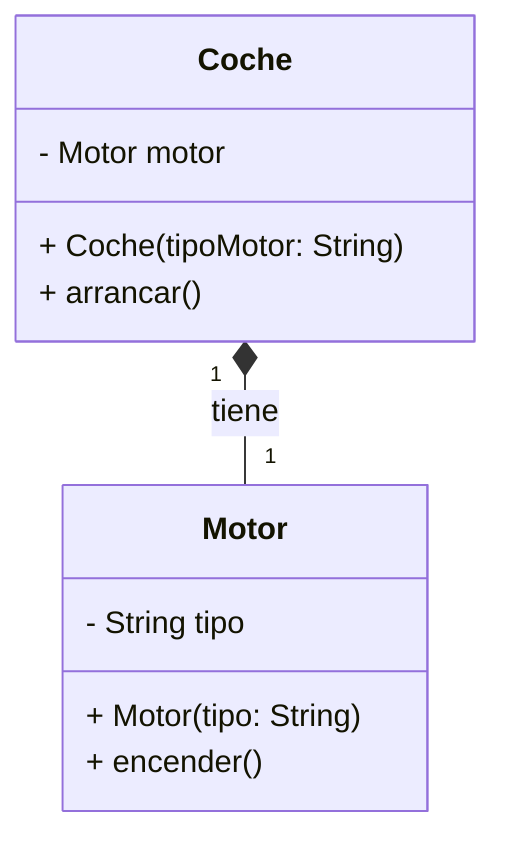

# 1. Conceptos avanzados de programación orientada a objetos

- [1. Conceptos avanzados de programación orientada a objetos](#1-conceptos-avanzados-de-programación-orientada-a-objetos)
  - [1.1. Relaciones entre clases](#11-relaciones-entre-clases)
    - [1.1.1. Composición](#111-composición)
    - [1.1.2. Agregación](#112-agregación)
    - [1.1.3. Herencia](#113-herencia)
    - [1.1.4. Clientela](#114-clientela)
    - [1.1.5. Anidamiento](#115-anidamiento)
    - [1.1.6. Resumen de Relaciones](#116-resumen-de-relaciones)
  - [1.2. Concepto de encapsulamiento](#12-concepto-de-encapsulamiento)
    - [1.2.1. Definición y beneficios del encapsulamiento](#121-definición-y-beneficios-del-encapsulamiento)
    - [1.2.2. Implementación del Encapsulamiento](#122-implementación-del-encapsulamiento)
    - [1.2.3. Relación con herencia y acoplamiento](#123-relación-con-herencia-y-acoplamiento)
      - [1.2.3.1. Encapsulamiento y Herencia](#1231-encapsulamiento-y-herencia)
      - [1.2.3.2. Encapsulamiento y Acoplamiento](#1232-encapsulamiento-y-acoplamiento)
    - [1.2.4. Beneficios del encapsulamiento](#124-beneficios-del-encapsulamiento)
    - [1.2.5. Buenas prácticas del encapsulamiento](#125-buenas-prácticas-del-encapsulamiento)
  - [1.3. Herencia](#13-herencia)
    - [1.3.1. Concepto de Herencia](#131-concepto-de-herencia)
    - [1.3.2. Jerarquías de herencia](#132-jerarquías-de-herencia)
    - [1.3.3. Tipos de Herencia](#133-tipos-de-herencia)
    - [1.3.4. Modificadores de acceso en la herencia](#134-modificadores-de-acceso-en-la-herencia)
    - [1.3.5. Sobreescritura de métodos (Override)](#135-sobreescritura-de-métodos-override)
    - [1.3.6. Uso del operador `super`](#136-uso-del-operador-super)
    - [1.3.7. Constructores en la herencia](#137-constructores-en-la-herencia)
    - [1.3.8. Palabra clave `final` en herencia](#138-palabra-clave-final-en-herencia)
    - [1.3.9. Problemas y limitaciones de la herencia](#139-problemas-y-limitaciones-de-la-herencia)
    - [1.3.10. Buenas prácticas en el uso de la herencia](#1310-buenas-prácticas-en-el-uso-de-la-herencia)
  - [1.4. Sobrecarga y sobrescritura](#14-sobrecarga-y-sobrescritura)
    - [1.4.1. Sobrecarga de métodos](#141-sobrecarga-de-métodos)
    - [1.4.2. Sobreescritura de Métodos](#142-sobreescritura-de-métodos)
    - [1.4.3. Uso de la anotación `@override`](#143-uso-de-la-anotación-override)
    - [1.4.4. Diferencias entre Sobrecarga y Sobreescritura](#144-diferencias-entre-sobrecarga-y-sobreescritura)
    - [1.4.5. Aplicación Práctica Combinada](#145-aplicación-práctica-combinada)
  - [1.5. Polimorfismo en Programación Orientada a Objetos](#15-polimorfismo-en-programación-orientada-a-objetos)
    - [1.5.1. Definición](#151-definición)
    - [1.5.2. Tipos de Polimorfismo](#152-tipos-de-polimorfismo)
    - [1.5.3. Relación con Ligadura Dinámica](#153-relación-con-ligadura-dinámica)
    - [1.5.4. Más ejemplos Prácticos](#154-más-ejemplos-prácticos)
    - [1.5.5. Ventajas del Polimorfismo](#155-ventajas-del-polimorfismo)
    - [1.5.6. Desventajas y Consideraciones](#156-desventajas-y-consideraciones)
    - [1.5.7. Comparativa entre encapsulamiento, herencia y polimorfismo](#157-comparativa-entre-encapsulamiento-herencia-y-polimorfismo)
  - [1.6. Clases abstractas](#16-clases-abstractas)
    - [1.6.1. Características](#161-características)
    - [1.6.2. Métodos abstractos](#162-métodos-abstractos)
    - [1.6.3. Ventajas de las Clases Abstractas](#163-ventajas-de-las-clases-abstractas)
  - [1.7. Interfaces](#17-interfaces)
    - [1.7.1. Características de las Interfaces](#171-características-de-las-interfaces)
    - [1.7.2. Diferencia entre clases abstractas e interfaces](#172-diferencia-entre-clases-abstractas-e-interfaces)
  - [1.8. Clases Anidadas y Clases Internas](#18-clases-anidadas-y-clases-internas)
    - [1.8.1. Clases Internas](#181-clases-internas)
    - [1.8.2. Clases Estáticas Anidadas](#182-clases-estáticas-anidadas)
    - [1.8.3. Ventajas y Desventajas de las Clases Anidadas](#183-ventajas-y-desventajas-de-las-clases-anidadas)
  - [1.9. Métodos y Clases Genéricas](#19-métodos-y-clases-genéricas)
    - [1.9.1. Concepto de Generics](#191-concepto-de-generics)
    - [1.9.2. Clases y Métodos Parametrizados](#192-clases-y-métodos-parametrizados)
    - [1.9.3. Ventajas de Generics](#193-ventajas-de-generics)
    - [1.9.4. Ejemplo Práctico: Uso en Estructuras de Datos](#194-ejemplo-práctico-uso-en-estructuras-de-datos)
  - [1.10. Interfaces funcionales y expresiones Lambda](#110-interfaces-funcionales-y-expresiones-lambda)
    - [1.10.1. Introducción a las Interfaces Funcionales](#1101-introducción-a-las-interfaces-funcionales)
    - [1.10.2. Interfaces Funcionales Predefinidas en Java](#1102-interfaces-funcionales-predefinidas-en-java)
    - [1.10.3. Uso de Expresiones Lambda para Simplificar Código](#1103-uso-de-expresiones-lambda-para-simplificar-código)
      - [1.10.3.1. Sintaxis de las Expresiones Lambda](#11031-sintaxis-de-las-expresiones-lambda)
      - [1.10.3.2. Ejemplo Simple](#11032-ejemplo-simple)
    - [1.10.4. Ventajas de las Expresiones Lambda](#1104-ventajas-de-las-expresiones-lambda)
    - [1.10.5. Ejemplos y Aplicaciones Prácticas](#1105-ejemplos-y-aplicaciones-prácticas)
      - [1.10.5.1. Filtrado de Elementos con `Predicate`](#11051-filtrado-de-elementos-con-predicate)
      - [1.10.5.2. Transformación con `Function`](#11052-transformación-con-function)
      - [1.10.5.3. Iteración con `Consumer`](#11053-iteración-con-consumer)
      - [1.10.5.4. Suministrar Datos con `Supplier`](#11054-suministrar-datos-con-supplier)
      - [1.10.5.5. Composición de Funciones](#11055-composición-de-funciones)
    - [1.10.6. Conclusión](#1106-conclusión)

## 1.1. Relaciones entre clases

Las relaciones entre clases son fundamentales en la programación orientada a objetos (POO) porque permiten organizar, estructurar y modelar el comportamiento y las interacciones entre diferentes entidades en un programa. Una correcta comprensión y uso de estas relaciones mejora la reutilización de código, la modularidad y la flexibilidad del diseño.

En este apartado, analizaremos cinco tipos de relaciones entre clases:

- Composición  
- Agregación  
- Herencia  
- Clientela  
- Anidamiento

### 1.1.1. Composición

La **composición** es una relación **"todo-parte"** donde una clase contiene una o más instancias de otras clases como atributos. Se caracteriza porque el ciclo de vida de las partes depende del objeto que las contiene: si el "todo" se destruye, las partes también se destruyen. Estas son sus **características**:

- Relación **fuerte** entre las clases.  
- El "todo" **posee** las partes.  
- Las partes **no pueden existir independientemente** del objeto contenedor.  
- Representada generalmente como una **asociación fuerte** en un diagrama UML.

A continuación, se presenta un ejemplo en Java:

```java
class Motor {
    private String tipo;

    public Motor(String tipo) {
        this.tipo = tipo;
    }

    public void encender() {
        System.out.println("Motor " + tipo + " encendido.");
    }
}

class Coche {
    private Motor motor; // Composición: El coche contiene un motor

    public Coche(String tipoMotor) {
        this.motor = new Motor(tipoMotor);
    }

    public void arrancar() {
        motor.encender();
        System.out.println("El coche está en marcha.");
    }
}

public class Main {
    public static void main(String[] args) {
        Coche miCoche = new Coche("V8");
        miCoche.arrancar();
    }
}

```

En este ejemplo, la clase `Coche` tiene una relación de composición con la clase `Motor`. El motor es parte integral del coche y no puede existir independientemente. Cuando el objeto `Coche` se destruye, el `Motor` también deja de existir. Este sería su correspondiente diagrama de clases UML:



### 1.1.2. Agregación

La **agregación** es otra relación "todo-parte", pero con una diferencia importante respecto a la composición: las partes pueden existir independientemente del "todo". Es una relación **débil** donde el objeto contenedor y las partes tienen ciclos de vida independientes. Estas son sus **características**:

- Relación **débil** entre las clases.  
- El "todo" **utiliza** las partes, pero no las posee en exclusividad.  
- Las partes pueden existir **fuera del contenedor**.  
- Representada generalmente como una **asociación débil** en un diagrama UML.

A continuación, se presenta un ejemplo en Java:

```java
class Profesor {
    private String nombre;

    public Profesor(String nombre) {
        this.nombre = nombre;
    }

    public String getNombre() {
        return nombre;
    }
}

class Departamento {
    private String nombre;
    private Profesor profesor; // Agregación: un departamento puede tener un profesor

    public Departamento(String nombre, Profesor profesor) {
        this.nombre = nombre;
        this.profesor = profesor;
    }

    public void mostrarInformacion() {
        System.out.println("Departamento: " + nombre + ", Profesor: " + profesor.getNombre());
    }
}

public class Main {
    public static void main(String[] args) {
        Profesor profesor = new Profesor("Dr. Smith");
        Departamento departamento = new Departamento("Informática", profesor);
        departamento.mostrarInformacion();
    }
}
```

En este ejemplo, la clase `Departamento` tiene una relación de agregación con la clase `Profesor`. El profesor no forma parte integral del departamento y puede existir independientemente.

### 1.1.3. Herencia

La herencia es una relación "es un" entre clases, donde una clase (la clase hija o subclase) hereda atributos y métodos de otra clase (la clase padre o superclase). Permite la reutilización de código y facilita la creación de jerarquías de clases. Se expondrá con detalle más adelante.

### 1.1.4. Clientela

La clientela (o asociación de uso) es una relación donde una clase utiliza los servicios o métodos de otra clase. Es una relación muy flexible y frecuente.

Características:

- Relación temporal y no necesariamente fuerte.
- Una clase "cliente" depende de otra clase para realizar sus funciones.

Ejemplo en Java:

```java
class Impresora {
    public void imprimir(String texto) {
        System.out.println("Imprimiendo: " + texto);
    }
}

class Usuario {
    public void enviarAImprimir(Impresora impresora, String texto) {
        impresora.imprimir(texto);
    }
}

public class Main {
    public static void main(String[] args) {
        Usuario usuario = new Usuario();
        Impresora impresora = new Impresora();

        usuario.enviarAImprimir(impresora, "Hola, mundo.");
    }
}
```

La clase `Usuario` es cliente de la clase `Impresora`. El `Usuario` utiliza el método `imprimir` sin ser "dueño" de la impresora.

### 1.1.5. Anidamiento

El anidamiento es una relación en la que una clase está contenida dentro de otra clase. Se implementa usando **clases anidadas** o **clases internas**.

Características:

- Permite organizar y modularizar el código.
- Una clase interna tiene acceso a los miembros de la clase contenedora.
- Puede ser estática o no estática.

Ejemplo en Java:

```java
class Ordenador {
    private String marca;

    public Ordenador(String marca) {
        this.marca = marca;
    }

    class Procesador {
        public void mostrarMarca() {
            System.out.println("El procesador pertenece a un ordenador de marca: " + marca);
        }
    }
}

public class Main {
    public static void main(String[] args) {
        Ordenador ordenador = new Ordenador("Lenovo");
        Ordenador.Procesador procesador = ordenador.new Procesador();
        procesador.mostrarMarca();
    }
}
```

En este caso, la clase `Procesador` está anidada dentro de `Ordenador`, y puede acceder a los atributos de la clase contenedora.

### 1.1.6. Resumen de Relaciones

| Tipo de Relación | Característica principal     | Ejemplo clave           |
| ---------------- | ---------------------------- | ----------------------- |
| Composición      | Relación fuerte "todo-parte" | Motor y Coche           |
| Agregación       | Relación débil "todo-parte"  | Profesor y Departamento |
| Herencia         | Relación "es un"             | Animal y Perro          |
| Clientela        | Uso temporal de servicios    | Usuario e Impresora     |
| Anidamiento      | Una clase dentro de otra     | Procesador y Ordenador  |

## 1.2. Concepto de encapsulamiento

El encapsulamiento es un principio fundamental de la Programación Orientada a Objetos (POO). Se basa en ocultar los detalles internos de una clase (su implementación) y exponer únicamente aquello que es relevante para los usuarios de la clase (su interfaz pública). Este mecanismo permite controlar el acceso a los datos, protegiéndolos de modificaciones indebidas y asegurando la consistencia del estado del objeto.

### 1.2.1. Definición y beneficios del encapsulamiento

El encapsulamiento puede resumirse en dos aspectos principales:

- Ocultación de la información: Los atributos y métodos que no son relevantes para el exterior de una clase se mantienen privados o protegidos.
- Acceso controlado: Se proporcionan métodos públicos (getters y setters) para acceder y modificar los atributos de forma controlada.

El objetivo principal es lograr un **bajo acoplamiento** entre las partes del programa y evitar dependencias innecesarias.

### 1.2.2. Implementación del Encapsulamiento

En lenguajes como Java, el encapsulamiento se logra utilizando modificadores de acceso para controlar la visibilidad de los atributos y métodos. Estos son los modificadores de acceso:

- private: Solo es accesible dentro de la misma clase.
- protected: Es accesible dentro de la misma clase, clases del mismo paquete y clases derivadas.
- public: Es accesible desde cualquier lugar.
- default (sin especificar): Es accesible dentro del mismo paquete.
  
En este ejemplo, los atributos son privados y se acceden mediante métodos públicos:

```java
class Persona {
    // Atributos privados
    private String nombre;
    private int edad;

    // Constructor
    public Persona(String nombre, int edad) {
        this.nombre = nombre;
        this.edad = edad;
    }

    // Métodos públicos para acceder y modificar los atributos
    public String getNombre() {
        return nombre;
    }

    public void setNombre(String nombre) {
        this.nombre = nombre;
    }

    public int getEdad() {
        return edad;
    }

    public void setEdad(int edad) {
        if (edad > 0) { // Controla la validez del dato
            this.edad = edad;
        }
    }
}
```

### 1.2.3. Relación con herencia y acoplamiento

El encapsulamiento interactúa estrechamente con otros principios de POO, como la herencia y el acoplamiento:

#### 1.2.3.1. Encapsulamiento y Herencia

Los atributos privados de una clase base no son accesibles directamente por las clases derivadas.
Sin embargo, los atributos protegidos (protected) y los métodos públicos sí son accesibles.
Ejemplo:

```java
class Animal {
    protected String nombre;

    public void comer() {
        System.out.println(nombre + " está comiendo.");
    }
}

class Perro extends Animal {
    public void ladrar() {
        System.out.println(nombre + " está ladrando."); // Acceso permitido gracias a protected
    }
}
```

#### 1.2.3.2. Encapsulamiento y Acoplamiento

El encapsulamiento reduce el acoplamiento, ya que los detalles internos de una clase están ocultos.
Esto permite que las clases dependan solo de las interfaces públicas y no de las implementaciones concretas.

### 1.2.4. Beneficios del encapsulamiento

- Control de acceso: Protege los datos internos de accesos no deseados o modificaciones indebidas.
- Facilidad de mantenimiento: Permite cambiar la implementación interna de una clase sin afectar a quienes la usan, siempre que la interfaz pública se mantenga.
- Validación de datos: Los métodos setters permiten validar datos antes de asignarlos a los atributos.
- Modularidad: Ayuda a dividir un programa en componentes más manejables y desacoplados.
- Reutilización: Las clases encapsuladas son más fáciles de entender y reutilizar

### 1.2.5. Buenas prácticas del encapsulamiento

- Haz privados los atributos siempre que sea posible.
  - Proporciona acceso solo mediante métodos getters y setters.
  - Evita exponer atributos como public directamente.
  
Mal diseño:

```java
class MalaPractica {
    public String nombre; // Exponer directamente los atributos rompe el encapsulamiento
}
```

Buen diseño:

```java
class BuenaPractica {
    private String nombre;

    public String getNombre() {
        return nombre;
    }

    public void setNombre(String nombre) {
        this.nombre = nombre;
    }
}
```

- Controla el acceso mediante validaciones en los setters.
  - Permite asegurar que los datos asignados a los atributos cumplen con ciertas condiciones.
- Expón solo lo necesario.
  - No todos los atributos de una clase necesitan getters y setters. Considera cuidadosamente qué necesita ser accesible desde el exterior.

## 1.3. Herencia

La herencia es uno de los pilares fundamentales de la Programación Orientada a Objetos (POO). Permite que una clase (clase derivada o hija) reutilice las propiedades y métodos de otra clase (clase base o padre), extendiendo o especializando su comportamiento.

### 1.3.1. Concepto de Herencia

La herencia es una relación "es-un" (is-a) entre dos clases. En esta relación:

- La clase base define atributos y comportamientos comunes a un conjunto de objetos.
- La clase derivada hereda estos atributos y métodos, pudiendo:
  - Añadir nuevos.
  - Sobreescribir los existentes.

Ejemplo básico en Java:

```java
// Clase base
class Animal {
    String nombre;

    public void comer() {
        System.out.println(nombre + " está comiendo.");
    }
}

// Clase derivada
class Perro extends Animal {
    public void ladrar() {
        System.out.println(nombre + " está ladrando.");
    }
}

// Uso de la herencia
public class Main {
    public static void main(String[] args) {
        Perro perro = new Perro();
        perro.nombre = "Max";
        perro.comer();  // Heredado de Animal
        perro.ladrar(); // Propio de Perro
    }
}
```

### 1.3.2. Jerarquías de herencia

Clase Base Única: Una clase derivada tiene una única clase base.
Herencia Múltiple (no soportada directamente en Java): Una clase puede tener varias clases base. Esto se puede simular mediante interfaces.
Ejemplo de jerarquía de herencia:

```
Animal
  ├── Perro
  └── Gato
```

### 1.3.3. Tipos de Herencia

- Simple: Una clase derivada hereda de una única clase base.
- Jerárquica: Varias clases derivadas heredan de una clase base común.
- Multinivel: Una clase derivada hereda de otra clase derivada.
- Múltiple (indirecta en Java): Se logra combinando interfaces.
- Híbrida: Mezcla de los tipos anteriores.

### 1.3.4. Modificadores de acceso en la herencia

Los modificadores de acceso determinan qué miembros se heredan y cómo se accede a ellos:

- private: No se hereda directamente, pero puede ser accesible mediante métodos públicos o protegidos en la clase base.
- protected: Se hereda y es accesible en las clases derivadas.
- public: Se hereda y es accesible desde cualquier lugar.
- default (paquete): Se hereda, pero solo es accesible desde clases del mismo paquete.

Ejemplo:

```java
class Animal {
    private String nombre;  // No se hereda directamente
    protected int edad;     // Accesible en la clase derivada
    public void comer() {   // Heredado y accesible
        System.out.println("El animal está comiendo.");
    }
}
```

### 1.3.5. Sobreescritura de métodos (Override)

La clase derivada puede redefinir métodos de la clase base para adaptar su comportamiento. Esto se realiza usando la anotación @Override:

Ejemplo:

```java
class Animal {
    public void sonido() {
        System.out.println("El animal hace un sonido.");
    }
}

class Perro extends Animal {
    @Override
    public void sonido() {
        System.out.println("El perro ladra.");
    }
}
```

Reglas:

- El método debe tener el mismo nombre, tipo de retorno y parámetros que en la clase base.
- El nivel de acceso no puede ser más restrictivo que en la clase base.
- Si el método de la clase base es final, no puede sobreescribirse.

### 1.3.6. Uso del operador `super`

El operador `super` se utiliza para:

- Llamar al constructor de la clase base.
- Acceder a miembros (atributos o métodos) de la clase base.
  
Ejemplo:

```java
class Animal {
    String nombre;

    public Animal(String nombre) {
        this.nombre = nombre;
    }

    public void comer() {
        System.out.println(nombre + " está comiendo.");
    }
}

class Perro extends Animal {
    public Perro(String nombre) {
        super(nombre); // Llama al constructor de Animal
    }

    @Override
    public void comer() {
        super.comer(); // Llama al método de la clase base
        System.out.println("Y disfruta mucho su comida.");
    }
}
```

### 1.3.7. Constructores en la herencia

En Java, los constructores de una clase base no se heredan, pero se pueden invocar desde la clase derivada usando `super`.

Reglas importantes:

- Si el constructor de la clase base tiene parámetros, debe ser invocado explícitamente desde el constructor de la clase derivada.
- Si no se especifica, el compilador agrega automáticamente una llamada al constructor sin parámetros de la clase base.

Ejemplo:

```java
class Animal {
    public Animal(String nombre) {
        System.out.println(nombre + " es un animal.");
    }
}

class Perro extends Animal {
    public Perro(String nombre) {
        super(nombre); // Obligatorio si el constructor base tiene parámetros
    }
}
```

### 1.3.8. Palabra clave `final` en herencia

La palabra reservada `final` puede ser empleada sobre las clases o sus métodos, con comportamientos diferentes a su habitual aplicación sobre los atributos (que implica que su valor no puede ser modificado en el programa, es decir, que es constante).

- Clases `final`: No pueden ser extendidas.
- Métodos `final`: No pueden ser sobreescritos.

A continuación se muestran dos ejemplos. En el primero, la clase `Usuario` lleva el modificador `final`, por lo que directamente no se podrían definir clases que hereden de ella. En el segundo, la clase `Animal` no es final, pero sí su método respirar, por lo que no se puede sobreescribir. 

```java
final class Usuario {
    // No se puede extender esta clase
}

/*
// Esta clase no puede heredar de persona porque es final
class Cliente extends Usuario {
    // Error
}
*/

```

```java
class Animal {
    // Método final
    public final void respirar() {
        System.out.println("Este animal está respirando.");
    }

    // Método no final, puede ser sobrescrito
    public void comer() {
        System.out.println("Este animal está comiendo.");
    }
}

class Perro extends Animal {
    // Este método no puede ser sobrescrito porque es final
    /*
    @Override
    public void respirar() {
        // Error: Cannot override the final method from Animal
        System.out.println("El perro está respirando.");
    }
    */

    @Override
    public void comer() {
        System.out.println("El perro está comiendo.");
    }
}

public class Main {
    public static void main(String[] args) {
        Animal animal = new Animal();
        animal.respirar(); // Imprime: Este animal está respirando.

        Perro perro = new Perro();
        perro.respirar(); // También imprime: Este animal está respirando.
        perro.comer();    // Imprime: El perro está comiendo.
    }
}
```

### 1.3.9. Problemas y limitaciones de la herencia

- Acoplamiento: Las clases derivadas dependen fuertemente de la clase base. Cambios en la clase base pueden romper el comportamiento de las derivadas.
- Herencia innecesaria: Puede generar una jerarquía compleja si no se utiliza correctamente.
- Herencia múltiple (no soportada en Java): Restringe el uso directo de múltiples clases base, pero se soluciona con interfaces.

### 1.3.10. Buenas prácticas en el uso de la herencia

Usa herencia solo cuando exista una relación clara "es-un" entre las clases.
Prefiere composición sobre herencia cuando sea posible.
Mantén las clases base lo más simples posible.
Utiliza @Override para evitar errores al redefinir métodos.
Evalúa si una clase debe ser final para evitar su extensión indebida.

## 1.4. Sobrecarga y sobrescritura

La sobrecarga y la sobreescritura son conceptos fundamentales en la programación orientada a objetos que permiten la flexibilidad y reutilización del código. Aunque ambos conceptos están relacionados con el manejo de métodos, tienen diferencias significativas en su propósito y aplicación.

### 1.4.1. Sobrecarga de métodos

La sobrecarga ocurre cuando varios métodos en una clase tienen el mismo nombre pero diferentes firmas. Esto significa que los métodos deben diferir en el **número** o **tipo de parámetros**.

Características Clave:

- **Mismo nombre**: Los métodos tienen el mismo nombre pero distintas firmas.
- **Diferentes parámetros**: La diferencia puede ser:
  - Número de parámetros.
  - Tipo de parámetros.
  - Orden de los parámetros.
- **Misma clase**: Todos los métodos sobrecargados deben pertenecer a la misma clase.

Ventajas:

- Proporciona flexibilidad para usar un método en diferentes contextos.
- Mejora la legibilidad y reutilización del código.

```java
class Calculadora {
    // Método para sumar dos números enteros
    public int sumar(int a, int b) {
        return a + b;
    }

    // Sobrecarga: Método para sumar tres números enteros
    public int sumar(int a, int b, int c) {
        return a + b + c;
    }

    // Sobrecarga: Método para sumar dos números de punto flotante
    public double sumar(double a, double b) {
        return a + b;
    }
}

public class Main {
    public static void main(String[] args) {
        Calculadora calc = new Calculadora();

        System.out.println("Suma de dos enteros: " + calc.sumar(3, 5)); // 8
        System.out.println("Suma de tres enteros: " + calc.sumar(3, 5, 7)); // 15
        System.out.println("Suma de dos flotantes: " + calc.sumar(2.5, 4.3)); // 6.8
    }
}
```

### 1.4.2. Sobreescritura de Métodos

La sobreescritura ocurre cuando una subclase proporciona una implementación específica de un método que ya está definido en su clase base.

**Características Clave**:

- Misma firma: El método en la subclase debe tener el mismo nombre, tipo de retorno y parámetros que el método de la clase base.
- Herencia: La sobreescritura requiere que exista una relación de herencia entre las clases.
- Polimorfismo: La sobreescritura permite a las subclases redefinir el comportamiento de un método y es fundamental para implementar el polimorfismo.

**Reglas** para la Sobreescritura:

- El método sobrescrito debe tener el mismo modificador de acceso o uno más permisivo.
- El método no puede ser final, ya que los métodos final no pueden sobrescribirse.
- El tipo de retorno debe ser compatible con el tipo de retorno del método de la clase base.
- Se puede usar la anotación @Override para verificar que el método sobrescribe correctamente uno de la clase base.

**Ventajas**:

- Permite a las subclases personalizar o extender el comportamiento de la clase base.
- Soporta el polimorfismo en tiempo de ejecución (lo veremos en profundidad más adelante).

```java
class Animal {
    // Método que será sobrescrito
    public void hacerSonido() {
        System.out.println("El animal hace un sonido.");
    }
}

class Perro extends Animal {
    @Override
    public void hacerSonido() {
        System.out.println("El perro ladra.");
    }
}

public class Main {
    public static void main(String[] args) {
        Animal animal = new Animal();
        animal.hacerSonido(); // Imprime: El animal hace un sonido.

        Animal perro = new Perro();
        perro.hacerSonido(); // Imprime: El perro ladra.
    }
} 
```

### 1.4.3. Uso de la anotación `@override`

La etiqueta `@Override` es una anotación en Java que indica que un método en una subclase sobrescribe un método en su clase base. Es una herramienta importante que mejora la legibilidad y la seguridad del código, ya que permite al compilador verificar que la firma del método sobrescrito coincide exactamente con la del método en la clase padre. Si la anotación se usa incorrectamente (por ejemplo, si el método no sobrescribe realmente uno en la clase base), el compilador **generará un error**, lo que ayuda a evitar errores sutiles como diferencias en nombres de métodos o tipos de parámetros. Aunque **no es obligatoria**, su uso es altamente recomendado para mejorar la claridad y garantizar que el propósito de sobrescritura sea explícito.

```java
class Animal {
    public void hacerSonido() {
        System.out.println("El animal hace un sonido.");
    }
}

class Perro extends Animal {
    @Override
    public void hacerSonido() {
        System.out.println("El perro ladra.");
    }
} 
```

***¿Es obligatorio el uso de `@override`?***

En Java no es obligatorio usar la etiqueta @Override. Sin embargo, es altamente recomendable incluirla siempre que sobrescribas un método, por las siguientes razones:

- **Detección de errores de compilación**: Si accidentalmente escribes un método que no coincide con la firma del método en la clase base (por ejemplo, por un error tipográfico o un tipo de parámetro incorrecto), el compilador **generará un error** si usas @Override. Sin esta anotación, el compilador trataría el método como uno nuevo en lugar de sobrescribir el existente, lo que podría causar problemas en la lógica de tu programa.
- **Mayor claridad**: La anotación hace explícito para otros desarrolladores (y para ti mismo en el futuro) que un método está sobrescribiendo uno de la clase base. Esto mejora la legibilidad del código.
- **Mejor mantenimiento**: Si el método en la clase base cambia (por ejemplo, se elimina o se modifica su firma), el compilador te advertirá si tienes métodos marcados con @Override que ya no coinciden.

***Qué sucede si no se usa @Override***

Si decides no usar `@Override`, el método seguirá funcionando y sobrescribirá correctamente el método de la clase base **si y solo si** la firma del método coincide exactamente con el método padre. No obstante, perderás las ventajas de detección de errores y claridad mencionadas.

Ejemplo sin @Override (**riesgos**):

```java
class Animal {
    public void hacerSonido() {
        System.out.println("El animal hace un sonido.");
    }
}

class Perro extends Animal {
    // Supongamos que cometemos un error tipográfico aquí
    public void hacerSonid() {
        System.out.println("El perro ladra.");
    }
}

public class Main {
    public static void main(String[] args) {
        Animal animal = new Perro();
        animal.hacerSonido(); // Llamará al método de la clase Animal, no al supuesto método sobrescrito
    }
}
```

En este ejemplo, debido al error tipográfico en el método hacerSonid de la clase Perro, el método hacerSonido de la clase Animal sigue siendo llamado. Si hubiéramos usado `@Override`, el compilador habría generado un error, ayudándonos a identificar el problema.

***¿Qué son las anotaciones en Java?***

Las **anotaciones** en Java son **metadatos** que se asocian con elementos del programa como clases, métodos, campos, parámetros, etc. No afectan directamente la lógica del programa, pero proporcionan **información adicional** que puede ser usada por el **compilador**, **herramientas** de desarrollo o incluso en tiempo de ejecución mediante **reflexión**.

Características clave de las anotaciones:

- Comienzan con el símbolo '@' (por ejemplo, `@Override`, `@Deprecated`, `@SuppressWarnings`).
- Son procesadas por el **compilador** o en tiempo de ejecución si están configuradas para ello.
- Pueden ser definidas por el usuario para propósitos específicos (anotaciones personalizadas).
  
Ejemplo de uso de anotaciones:

- `@Override`: Indica que un método sobrescribe otro en una superclase o implementa un método de una interfaz.
- `@Deprecated`: Señala que un elemento (método, clase, etc.) está en desuso.
- `@SuppressWarnings`: Instruye al compilador para ignorar ciertas advertencias.

### 1.4.4. Diferencias entre Sobrecarga y Sobreescritura

| Aspecto                | Sobrecarga                                                      | Sobreescritura                                               |
| ---------------------- | --------------------------------------------------------------- | ------------------------------------------------------------ |
| **Relación de clases** | Ocurre en la misma clase.                                       | Requiere herencia entre clases.                              |
| **Firma del método**   | Los métodos deben diferir en el número o tipo de parámetros.    | El método debe tener la misma firma que el de la clase base. |
| **Tipo de retorno**    | Puede ser diferente.                                            | Debe ser igual o compatible con el de la clase base.         |
| **Propósito**          | Proporcionar múltiples formas de un método con el mismo nombre. | Redefinir el comportamiento de un método heredado.           |
| **Tiempo de decisión** | Resuelto en tiempo de compilación.                              | Resuelto en tiempo de ejecución.                             |

### 1.4.5. Aplicación Práctica Combinada

La combinación de sobrecarga y sobreescritura puede ser útil en jerarquías de clases complejas.

```java
class Figura {
    public double calcularArea() {
        return 0; // Área genérica
    }
}

class Circulo extends Figura {
    private double radio;

    // Constructor para sobrecargar inicialización
    public Circulo(double radio) {
        this.radio = radio;
    }

    @Override
    public double calcularArea() {
        return Math.PI * radio * radio;
    }
}

class Rectangulo extends Figura {
    private double ancho;
    private double alto;

    // Sobrecarga para inicializar un cuadrado o rectángulo
    public Rectangulo(double lado) {
        this.ancho = lado;
        this.alto = lado;
    }

    public Rectangulo(double ancho, double alto) {
        this.ancho = ancho;
        this.alto = alto;
    }

    @Override
    public double calcularArea() {
        return ancho * alto;
    }
}

public class Main {
    public static void main(String[] args) {
        Figura[] figuras = {new Circulo(5), new Rectangulo(4), new Rectangulo(3, 6)};

        for (Figura figura : figuras) {
            System.out.println("Área: " + figura.calcularArea());
        }
    }
}
```


## 1.5. Polimorfismo en Programación Orientada a Objetos

El **polimorfismo** es uno de los pilares fundamentales de la programación orientada a objetos (POO), junto con la encapsulación y la herencia. Este concepto describe la capacidad de un objeto para adoptar múltiples formas, lo que permite a diferentes clases responder de manera única a la misma operación o mensaje.

### 1.5.1. Definición

El término "polimorfismo" proviene del griego, que significa "muchas formas". En POO, el polimorfismo permite que un método, una interfaz o un operador tenga diferentes implementaciones o comportamientos según el contexto.

**Ventajas del Polimorfismo**

1. **Flexibilidad del código**: Permite escribir código genérico que puede trabajar con cualquier clase que cumpla ciertas condiciones.  
2. **Reutilización del código**: Facilita extender o modificar programas sin cambiar el código existente.  
3. **Mantenibilidad**: Reduce la necesidad de duplicar código y centraliza las operaciones comunes.

### 1.5.2. Tipos de Polimorfismo

Existen dos tipos principales de polimorfismo en POO: **polimorfismo estático** y **polimorfismo dinámico**.

**Polimorfismo Estático (Early Binding)**

El polimorfismo estático, también conocido como **ligadura temprana**, ocurre cuando el compilador decide cuál versión de un método o función se ejecutará en tiempo de compilación. Este tipo de polimorfismo se logra principalmente a través de:

1. **Sobrecarga de métodos**: Permite que varias versiones de un método tengan el mismo nombre, pero con diferentes firmas (tipo o número de parámetros). 

**Ejemplo de sobrecarga de métodos:**  
```java  
  
public class Calculadora {

    // Método suma con dos parámetros
    public int sumar(int a, int b) {
        return a + b;
    }

    // Método suma con tres parámetros
    public int sumar(int a, int b, int c) {
        return a + b + c;
    }

}

public class Main {
    public static void main(String[] args) {
        Calculadora calc = new Calculadora();
        System.out.println(calc.sumar(3, 5));        // 8
        System.out.println(calc.sumar(3, 5, 7));    // 15
    }
}
```

2. **Sobrecarga de operadores** (disponible en algunos lenguajes, como C++, pero no en Java). Permite redefinir el funcionamiento de operadores básicos, como el de asignación `=`, el de suma `+`, el de multiplicación `*`... En Java, el único operador sobrecargado de manera predeterminada es el `+`, para realizar la concatenación de cadenas, pero se trata de una sobrecarga interna del lenguaje.

**Polimorfismo Dinámico (Late Binding)**

El polimorfismo dinámico, o **ligadura tardía**, ocurre cuando la decisión sobre qué método invocar se toma en **tiempo de ejecución**. Este tipo de polimorfismo se logra mediante:

**Sobreescritura de métodos**: Permite que una subclase proporcione su propia implementación de un método heredado de la clase padre.  
**Ejemplo de sobreescritura de métodos:**  

```java  
class Animal {
    public void hacerSonido() {
        System.out.println("El animal hace un sonido.");
    }
}

class Perro extends Animal {
    @Override
    public void hacerSonido() {
        System.out.println("El perro ladra.");
    }
}

class Gato extends Animal {
    @Override
    public void hacerSonido() {
        System.out.println("El gato maúlla.");
    }
}

public class Main {
    public static void main(String[] args) {
        Animal miAnimal;  // Referencia polimórfica

        miAnimal = new Perro();
        miAnimal.hacerSonido(); // El perro ladra.

        miAnimal = new Gato();
        miAnimal.hacerSonido(); // El gato maúlla.
    }
}
```

**Relación con la herencia y las interfaces**:  
   * En Java, las **interfaces** también son una herramienta clave para implementar el polimorfismo dinámico, ya que permiten definir un contrato común para múltiples clases, como veremos en apartados posteriores.

### 1.5.3. Relación con Ligadura Dinámica

La **ligadura dinámica** (dynamic binding) es un mecanismo mediante el cual la invocación de un método se resuelve en tiempo de ejecución. Esto está directamente relacionado con el polimorfismo dinámico.

* Cuando un objeto de una clase derivada es tratado como si fuera de su clase base, el método que se ejecuta es el correspondiente a la clase del objeto real, no el de la referencia.

**Ejemplo de ligadura dinámica:**

```java
class Vehiculo {
    public void mover() {
        System.out.println("El vehículo se está moviendo.");
    }
}

class Bicicleta extends Vehiculo {
    @Override
    public void mover() {
        System.out.println("La bicicleta pedalea.");
    }
}

class Coche extends Vehiculo {
    @Override
    public void mover() {
        System.out.println("El coche está conduciendo.");
    }
}

public class Main {
    public static void main(String[] args) {
        Vehiculo vehiculo1 = new Bicicleta();
        Vehiculo vehiculo2 = new Coche();

        vehiculo1.mover(); // La bicicleta pedalea.
        vehiculo2.mover(); // El coche está conduciendo.
    }
}
```


### 1.5.4. Más ejemplos Prácticos

**Uso con colecciones genéricas:** Polimorfismo dinámico es esencial en el manejo de colecciones genéricas en Java.  
java  
Copiar código  
`List<Animal> animales = new ArrayList<>();`

`animales.add(new Perro());`

`animales.add(new Gato());`

`for (Animal animal : animales) {`

    `animal.hacerSonido(); // Llama a la implementación específica de cada animal`

`}`

1.   
2. **Diseño de aplicaciones modulares:** El polimorfismo permite desarrollar sistemas modulares, donde las clases derivadas pueden reemplazar o extender funcionalidades sin modificar el código base.

---

### 1.5.5. Ventajas del Polimorfismo

1. **Flexibilidad**: Permite escribir código más genérico y adaptable.  
2. **Extensibilidad**: Facilita la extensión de aplicaciones al permitir añadir nuevas clases con comportamientos específicos.  
3. **Reutilización**: Reduce la duplicación de código al centralizar funcionalidades en clases base.

---

### 1.5.6. Desventajas y Consideraciones

1. **Mayor complejidad**: Puede dificultar la comprensión del flujo del programa para desarrolladores novatos.  
2. **Impacto en el rendimiento**: La resolución de métodos en tiempo de ejecución (ligadura dinámica) puede ser ligeramente más lenta que en tiempo de compilación.


### 1.5.7. Comparativa entre encapsulamiento, herencia y polimorfismo

| Aspecto              | Encapsulamiento                                                               | Herencia                                                                  | Polimorfismo                                                                       |
| -------------------- | ----------------------------------------------------------------------------- | ------------------------------------------------------------------------- | ---------------------------------------------------------------------------------- |
| Propósito            | Ocultar la implementación interna.                                            | Reutilizar y extender comportamientos.                                    | Cambiar el comportamiento dinámicamente.                                           |
| Ventaja principal    | Protección de datos y modularidad.                                            | Reutilización de código.                                                  | Flexibilidad y adaptabilidad.                                                      |
| Relación entre ellos | La herencia respeta el encapsulamiento (p.ej., no hereda atributos privados). | La herencia aprovecha el encapsulamiento al reutilizar la implementación. | El polimorfismo utiliza el encapsulamiento para trabajar con interfaces genéricas. |

## 1.6. Clases abstractas

Las **clases abstractas** son un concepto clave en la programación orientada a objetos (POO). Se utilizan para definir **comportamientos generales** que serán compartidos por diferentes clases derivadas, mientras dejan ciertos detalles específicos para ser implementados en esas clases hijas. En esencia, una clase abstracta actúa como una **plantilla** o un **modelo**.

### 1.6.1. Características

- No se pueden instanciar: una clase abstracta no puede ser utilizada directamente para crear objetos. Debe ser heredada por otras clases que implementen sus métodos abstractos.

```java
abstract class Figura {
    // Clase abstracta, no puede instanciarse
}

Figura figura = new Figura(); // Error: no se puede instanciar una clase abstracta
```

- Pueden contener métodos abstractos y concretos: los métodos abstractos no tienen implementación en la clase abstracta; las clases derivadas están obligadas a implementarlos; mientras tanto, los métodos concretos tienen una implementación por defecto que las clases derivadas pueden usar o sobrescribir si lo necesitan.

```java

abstract class Figura {
    abstract double calcularArea(); // Método abstracto

    void descripcion() { // Método concreto
        System.out.println("Soy una figura.");
    }
}
```

- Pueden tener atributos y constructores: aunque no se puedan instanciar, las clases abstractas pueden tener atributos y constructores que serán utilizados por sus subclases.
  
```java

abstract class Figura {
    String color;

    Figura(String color) {
        this.color = color;
    }

    String getColor() {
        return color;
    }
}
```

- Sirven como punto común para la herencia: permiten crear una jerarquía de clases que comparten una estructura común, promoviendo el concepto de reutilización de código.

```java
// Clase abstracta Empleado
abstract class Empleado {
    private String nombre;
    private double salarioBase;

    public Empleado(String nombre, double salarioBase) {
        this.nombre = nombre;
        this.salarioBase = salarioBase;
    }

    // Método concreto: común para todas las clases derivadas
    public void mostrarInformacion() {
        System.out.println("Nombre: " + nombre);
        System.out.println("Salario Base: " + salarioBase);
    }

    // Método abstracto: cada tipo de empleado lo implementará de forma distinta
    public abstract double calcularSalario();
}

// Clase concreta: EmpleadoFijo
class EmpleadoFijo extends Empleado {
    private double bonificacion;

    public EmpleadoFijo(String nombre, double salarioBase, double bonificacion) {
        super(nombre, salarioBase);
        this.bonificacion = bonificacion;
    }

    @Override
    public double calcularSalario() {
        return super.salarioBase + bonificacion;
    }
}

// Clase concreta: EmpleadoPorHoras
class EmpleadoPorHoras extends Empleado {
    private double horasTrabajadas;
    private double tarifaPorHora;

    public EmpleadoPorHoras(String nombre, double salarioBase, double horasTrabajadas, double tarifaPorHora) {
        super(nombre, salarioBase);
        this.horasTrabajadas = horasTrabajadas;
        this.tarifaPorHora = tarifaPorHora;
    }

    @Override
    public double calcularSalario() {
        return super.salarioBase + (horasTrabajadas * tarifaPorHora);
    }
}

public class Main {
    public static void main(String[] args) {
        // Crear empleados de diferentes tipos
        Empleado empleadoFijo = new EmpleadoFijo("Ana López", 1500, 300);
        Empleado empleadoPorHoras = new EmpleadoPorHoras("Carlos García", 1000, 40, 15);

        // Mostrar información y calcular salario para cada empleado
        System.out.println("Empleado Fijo:");
        empleadoFijo.mostrarInformacion();
        System.out.println("Salario Total: " + empleadoFijo.calcularSalario());

        System.out.println("\nEmpleado Por Horas:");
        empleadoPorHoras.mostrarInformacion();
        System.out.println("Salario Total: " + empleadoPorHoras.calcularSalario());
    }
}
```

### 1.6.2. Métodos abstractos

Un método abstracto es un **método declarado sin cuerpo** en una clase abstracta. Las **subclases deben proporcionar su propia implementación**.

```java
abstract class Figura {
    abstract double calcularArea(); // Declaración de un método abstracto
}

class Circulo extends Figura {
    double radio;

    Circulo(double radio) {
        this.radio = radio;
    }

    @Override
    double calcularArea() { // Implementación obligatoria
        return Math.PI * radio * radio;
    }
}
```

### 1.6.3. Ventajas de las Clases Abstractas

- **Estandarización**: Proveen una estructura común que todas las clases derivadas deben seguir.
- **Promueven la reutilización**: Los métodos concretos y los atributos compartidos se implementan una vez y se reutilizan en todas las subclases.
- **Flexibilidad**: Permiten implementar métodos concretos que las subclases pueden sobrescribir si es necesario.
- **Facilitan la extensión**: Las clases abstractas son ideales para modelar jerarquías donde se espera que las clases concretas amplíen y personalicen el comportamiento.

## 1.7. Interfaces

En programación orientada a objetos, una interfaz es un **contrato** que define un **conjunto de métodos** que una clase **debe implementar**. A diferencia de las clases abstractas, las interfaces no proporcionan implementación (salvo desde Java 8, donde se pueden usar métodos predeterminados y estáticos). Las interfaces son una herramienta poderosa para garantizar la **uniformidad de comportamiento** en las clases que las implementan.

### 1.7.1. Características de las Interfaces

- **Definición de métodos abstractos**: Todos los métodos definidos en una interfaz son **implícitamente** abstractos y públicos (hasta Java 8, cuando no tenían implementación predeterminada).

```java
interface Animal {
    void comer();
    void dormir();
}
```

- **No contienen atributos con estado**: las interfaces no pueden tener atributos con estado mutable, pero pueden tener constantes (public static final).
```java
interface Configuracion {
    int TIEMPO_MAXIMO = 60; // Equivalente a "public static final int TIEMPO_MAXIMO = 60;"
}
```

- Implementación múltiple: una clase puede implementar múltiples interfaces, lo que permite una forma de herencia múltiple, algo que no es posible con clases.

```java
interface Volador {
    void volar();
}

interface Nadador {
    void nadar();
}

class Pato implements Volador, Nadador {
    @Override
    public void volar() {
        System.out.println("El pato vuela.");
    }

    @Override
    public void nadar() {
        System.out.println("El pato nada.");
    }
}
```

- **Métodos predeterminados y estáticos** (desde Java 8): los métodos predeterminados (`default`) permiten a las interfaces proporcionar implementaciones básicas que las clases pueden sobrescribir si lo necesitan. Los métodos estáticos  (`static`) pertenecen a la interfaz y no a las clases que la implementan.

```java

interface Saludo {
    default void saludar() {
        System.out.println("Hola!");
    }

    static void despedirse() {
        System.out.println("Adiós!");
    }
}
```

- **No pueden ser instanciadas**: las interfaces no se pueden usar directamente para crear objetos.
  
```java
Animal a = new Animal(); // Error: no se puede instanciar una interfaz
```

### 1.7.2. Diferencia entre clases abstractas e interfaces

Aunque ambas se usan para definir comportamientos, tienen diferencias clave:

| Característica | Clases Abstractas | Interfaces |
| ----- | ----- | ----- |
| **Instanciación** | No se pueden instanciar | Tampoco se pueden instanciar |
| **Métodos concretos** | Pueden tener métodos concretos | Desde Java 8, permiten métodos por defecto y estáticos |
| **Herencia múltiple** | Una clase solo puede extender una clase abstracta | Una clase puede implementar múltiples interfaces |
| **Atributos** | Pueden tener atributos con estado | Solo pueden tener constantes |

## 1.8. Clases Anidadas y Clases Internas

En Java, las clases pueden ser definidas dentro de otras clases. Este enfoque puede ser útil para agrupar clases relacionadas, reducir la complejidad del código y mejorar su encapsulación. Estas se clasifican principalmente en **clases internas** y **clases estáticas anidadas**.

### 1.8.1. Clases Internas

Las **clases internas** son aquellas definidas dentro de otra clase, y están asociadas a una instancia de la clase externa. Tienen acceso a los miembros (incluso privados) de la clase que las contiene.

**Tipos de Clases Internas:**

1. **Inner Classes**  
   Son clases **no estáticas** definidas dentro de otra clase.  
   * Tienen acceso directo a los atributos y métodos de la clase externa.  
   * Se crean siempre en relación con una instancia de la clase externa.

**Ejemplo:** 

```java  
public class Externa {
    private String mensaje = "Hola desde la clase externa";

    public class Interna {
        public void imprimir() {
            System.out.println(mensaje); // Accede al atributo de la clase externa
        }
    }
}

public class Main {
    public static void main(String[] args) {
        Externa externa = new Externa();
        Externa.Interna interna = externa.new Interna(); // Crear instancia de la clase interna
        interna.imprimir(); // Hola desde la clase externa
    }
}
```


2. **Local Inner Classes**  
Son clases internas declaradas dentro de un bloque, generalmente un método o un constructor. Estas tienen acceso a las variables locales del bloque, siempre que sean **final** o **efectivamente final**.  

**Ejemplo:**  
```java  

public class Externa {

    public void metodo() {
        String local = "Variable local";

        class LocalInterna {
            public void imprimir() {
                System.out.println(local); // Accede a la variable local
            }
        }

        LocalInterna interna = new LocalInterna();
        interna.imprimir(); // Variable local
    }
}
```

3. **Anonymous Classes**  
Son clases internas sin nombre que se declaran e instancian en una única línea. Se usan comúnmente para implementar interfaces o extender clases de forma breve.  

**Ejemplo:**  

```java  
 
interface Saludo {
    void decirHola();
}

public class Main {
    public static void main(String[] args) {
        Saludo saludo = new Saludo() { // Clase anónima que implementa la interfaz
            @Override
            public void decirHola() {
                System.out.println("Hola desde una clase anónima");
            }
        };

        saludo.decirHola(); // Hola desde una clase anónima
    }
}

```

### 1.8.2. Clases Estáticas Anidadas

Las clases estáticas anidadas son clases definidas dentro de otra clase pero con el modificador **static**. A diferencia de las clases internas, no están asociadas a una instancia de la clase externa y solo pueden acceder a miembros estáticos de esta.

* Se comportan como clases independientes pero están agrupadas dentro de otra clase por motivos lógicos.  
* No tienen acceso implícito a los atributos o métodos de instancia de la clase externa.

**Ejemplo:**
```java

public class Externa {
    private static String mensaje = "Hola desde la clase externa";

    public static class EstaticaAnidada {
        public void imprimir() {
            System.out.println(mensaje); // Accede solo a miembros estáticos
        }
    }
}

public class Main {
    public static void main(String[] args) {
        Externa.EstaticaAnidada anidada = new Externa.EstaticaAnidada(); // No requiere instancia de la clase externa
        anidada.imprimir(); // Hola desde la clase externa
    }
}
```


### 1.8.3. Ventajas y Desventajas de las Clases Anidadas

**Ventajas:**

1. **Organización lógica del código**: Permite agrupar clases relacionadas, facilitando la lectura y el mantenimiento.  
2. **Encapsulación mejorada**: Las clases internas pueden acceder a los miembros privados de la clase externa, promoviendo un diseño más encapsulado.  
3. **Reducción de complejidad**: Ayuda a evitar la creación de múltiples clases a nivel superior (top-level).  
4. **Flexibilidad**: Las clases anidadas (en particular las anónimas) son ideales para implementar comportamientos simples y específicos de manera concisa.

**Desventajas:**

1. **Mayor acoplamiento**: Las clases internas dependen fuertemente de la clase externa, lo que puede dificultar el testeo y la reutilización.  
2. **Complejidad del código**: Si se abusa de las clases internas, el código puede volverse menos legible.  
3. **Sobrecarga en la memoria**: Las clases internas no estáticas llevan una referencia implícita a la instancia de la clase externa, lo que puede impactar en el rendimiento.

## 1.9. Métodos y Clases Genéricas

Los métodos y clases genéricas son un mecanismo en Java que permite definir estructuras de datos y algoritmos que pueden operar con cualquier tipo de objeto, garantizando al mismo tiempo seguridad en el tipo durante el tiempo de compilación.

### 1.9.1. Concepto de Generics

Los **generics** introducen el concepto de parametrización de tipos en Java. Esto significa que, en lugar de especificar un tipo concreto al declarar una clase o un método, puedes definirlos con un parámetro de tipo. Este parámetro es sustituido por un tipo real en el momento de la ejecución, asegurando flexibilidad y seguridad de tipo.

**Ejemplo básico de Generics:**

```java
// Clase genérica
public class Caja<T> {
    private T contenido;

    public void setContenido(T contenido) {
        this.contenido = contenido;
    }

    public T getContenido() {
        return contenido;
    }
}
```

### 1.9.2. Clases y Métodos Parametrizados

**Clases Genéricas**: Una clase genérica permite definir una plantilla que puede operar con diferentes tipos de datos. Esto evita la necesidad de crear múltiples clases para manejar distintos tipos.

**Ejemplo de Clase Genérica:**

```java
// Clase genérica para almacenar pares de datos
public class Par<K, V> {
    private K clave;
    private V valor;

    public Par(K clave, V valor) {
        this.clave = clave;
        this.valor = valor;
    }

    public K getClave() {
        return clave;
    }

    public V getValor() {
        return valor;
    }
}

// Uso:
public class Main {
    public static void main(String[] args) {
        Par<String, Integer> par = new Par<>("Edad", 30);
        System.out.println("Clave: " + par.getClave());
        System.out.println("Valor: " + par.getValor());
    }
}
```

**Salida:**

```java
`Clave: Edad`
`Valor: 30`
```

**Métodos Genéricos**: Los métodos genéricos permiten definir un único método que puede trabajar con diferentes tipos de datos.

**Ejemplo de Método Genérico:**

```java
// Método genérico para encontrar el máximo de dos elementos
public class Util {
    public static <T extends Comparable<T>> T maximo(T a, T b) {
        return (a.compareTo(b) > 0) ? a : b;
    }
}

// Uso:
public class Main {
    public static void main(String[] args) {
        System.out.println("Mayor entre 10 y 20: " + Util.maximo(10, 20));
        System.out.println("Mayor entre 'gato' y 'perro': " + Util.maximo("gato", "perro"));
    }
}
```

**Salida:**

```java
Mayor entre 10 y 20: 20
Mayor entre 'gato' y 'perro': perro
```

En este ejemplo, `maximo` puede trabajar con cualquier tipo que implemente la interfaz `Comparable`.

### 1.9.3. Ventajas de Generics

1. **Reutilización del código**: Permiten diseñar clases y métodos más versátiles que pueden manejar múltiples tipos sin necesidad de duplicar código.  
2. **Seguridad de tipo**: Detectan errores de tipo en tiempo de compilación, reduciendo posibles fallos en tiempo de ejecución.  
3. **Legibilidad y mantenimiento**: El código genérico es más fácil de entender y mantener porque evita la proliferación de clases específicas para cada tipo.  
4. **Eliminación de conversiones explícitas**: Reducen la necesidad de realizar conversiones (`casting`) manuales al trabajar con tipos genéricos.

### 1.9.4. Ejemplo Práctico: Uso en Estructuras de Datos

Un ejemplo clásico del uso de generics es la clase `ArrayList`, que permite almacenar cualquier tipo de objeto:

```java
import java.util.ArrayList;

public class Main {
    public static void main(String[] args) {
        // Lista genérica para almacenar cadenas de texto
        ArrayList<String> lista = new ArrayList<>();
        lista.add("Manzana");
        lista.add("Pera");

        for (String fruta : lista) {
            System.out.println(fruta);
        }
    }
}
```

Sin **generics**, tendríamos que utilizar una lista sin tipo y realizar conversiones manuales, lo cual es propenso a errores.

Los generics son una herramienta poderosa en Java que facilita la creación de clases y métodos flexibles y seguros. Su uso adecuado promueve la reutilización de código, mejora la seguridad en tiempo de compilación y reduce la complejidad del desarrollo. Además, son fundamentales para trabajar con las colecciones del framework estándar de Java (`List`, `Map`, `Set`, etc.), lo que los convierte en un concepto esencial para cualquier desarrollador en el ecosistema Java. Todo lo relacionado con las colecciones de datos en Java, lo veremos en próximas unidades didácticas

## 1.10. Interfaces funcionales y expresiones Lambda

Las expresiones lambda, introducidas en **Java 8**, representan un cambio importante en el paradigma de programación del lenguaje, permitiendo escribir código más conciso y funcional. Se utilizan principalmente para implementar interfaces funcionales de forma clara y simplificada.

### 1.10.1. Introducción a las Interfaces Funcionales

Una **interfaz funcional** es una interfaz que tiene exactamente **un único método abstracto**. Este método abstracto representa la funcionalidad que implementará la expresión lambda.  
Las interfaces funcionales pueden tener:

* Métodos abstractos (uno obligatorio).  
* Métodos por defecto y estáticos adicionales (sin restricciones en su cantidad).

Se identifican con la anotación `@FunctionalInterface` (opcional, pero recomendada).

**Ejemplo de una Interfaz Funcional:**

```java
@FunctionalInterface
public interface Operacion {
    int ejecutar(int a, int b); // Un único método abstracto
}
```

### 1.10.2. Interfaces Funcionales Predefinidas en Java

Java 8 incluye muchas interfaces funcionales en el paquete `java.util.function`. Algunas de las más comunes son:

- **Predicate\<T\>:** Devuelve un valor booleano basado en una condición.  
  
```java
boolean test(T t);
```

- **Function\<T, R\>:** Aplica una transformación y devuelve un resultado.  
  
```java  
R apply(T t);
```

- **Consumer\<T\>:** Ejecuta una operación sobre un objeto recibido.  

```java
void accept(T t);
```

- **Supplier\<T\>:** Proporciona un resultado sin entrada.  

```java
T get();
```

**BiFunction\<T, U, R\>:** Aplica una función que toma dos argumentos y devuelve un resultado.  

```java  
R apply(T t, U u);
```

### 1.10.3. Uso de Expresiones Lambda para Simplificar Código

#### 1.10.3.1. Sintaxis de las Expresiones Lambda

La expresión lambda permite definir un comportamiento en una única línea o bloque compacto. Su estructura es:

```java
(parametros) -> { cuerpo };
```

- **Parámetros:** La lista de argumentos que recibe el método. Pueden omitirse los tipos si son inferibles.  
- **Operador `->`:** Separa los parámetros del cuerpo de la función.  
- **Cuerpo:** El bloque de código que implementa la funcionalidad.

#### 1.10.3.2. Ejemplo Simple

```java
Operacion suma = (a, b) -> a + b;
System.out.println(suma.ejecutar(5, 3)); // Salida: 8
```

En este caso:

* `(a, b)` son los parámetros.  
* `a + b` es la implementación del método `ejecutar`.

### 1.10.4. Ventajas de las Expresiones Lambda

1. **Concisión:** Eliminan la necesidad de clases anónimas para implementar interfaces funcionales.  
2. **Legibilidad:** Reducen el código ceremonial y facilitan la comprensión.  
3. **Flexibilidad:** Permiten combinar programación funcional y orientación a objetos.

**Sin Lambda (Clase Anónima):**

```java

Operacion suma = new Operacion() {
    @Override
    public int ejecutar(int a, int b) {
        return a + b;
    }
};
```

**Con Lambda:**

```java
Operacion suma = (a, b) -> a + b;
```


### 1.10.5. Ejemplos y Aplicaciones Prácticas

#### 1.10.5.1. Filtrado de Elementos con `Predicate`

Las expresiones lambda son ideales para filtrar colecciones.

**Ejemplo:**

```java
import java.util.Arrays;
import java.util.List;
import java.util.function.Predicate;

public class Main {
    public static void main(String[] args) {
        List<String> nombres = Arrays.asList("Ana", "Pedro", "Luis", "Marta");

        // Filtrar nombres que comienzan con "M"
        Predicate<String> empiezaConM = nombre -> nombre.startsWith("M");
        nombres.stream().filter(empiezaConM).forEach(System.out::println); 
        // Salida: Marta
    }
}
```

#### 1.10.5.2. Transformación con `Function`

Permiten transformar datos fácilmente.

**Ejemplo:**

```java
import java.util.function.Function;

public class Main {
    public static void main(String[] args) {
        Function<Integer, String> convertir = num -> "Número: " + num;

        System.out.println(convertir.apply(5)); // Salida: Número: 5
    }
}

```

#### 1.10.5.3. Iteración con `Consumer`

Ideal para realizar operaciones sobre cada elemento de una colección.

**Ejemplo:**

```java
import java.util.Arrays;
import java.util.List;
import java.util.function.Consumer;

public class Main {
    public static void main(String[] args) {
        List<String> frutas = Arrays.asList("Manzana", "Pera", "Uva");

        Consumer<String> imprimir = fruta -> System.out.println("Fruta: " + fruta);
        frutas.forEach(imprimir);
        // Salida:
        // Fruta: Manzana
        // Fruta: Pera
        // Fruta: Uva
    }
}
```

#### 1.10.5.4. Suministrar Datos con `Supplier`

Se utilizan para generar datos dinámicamente.

**Ejemplo:**

```java
import java.util.function.Supplier;

public class Main {
    public static void main(String[] args) {
        Supplier<Double> generarAleatorio = () -> Math.random();

        System.out.println("Número aleatorio: " + generarAleatorio.get());
    }
}
```


#### 1.10.5.5. Composición de Funciones

Las expresiones lambda permiten la composición de múltiples operaciones.

**Ejemplo:**

```java
import java.util.function.Function;

public class Main {
    public static void main(String[] args) {
        Function<Integer, Integer> duplicar = x -> x * 2;
        Function<Integer, Integer> sumarTres = x -> x + 3;

        Function<Integer, Integer> combinar = duplicar.andThen(sumarTres);

        System.out.println(combinar.apply(4)); // Salida: 11 (4 * 2 + 3)
    }
}
```

### 1.10.6. Conclusión

Las expresiones lambda son una herramienta poderosa para escribir código funcional y conciso en Java. Junto con las interfaces funcionales y las herramientas de la API de streams, permiten manejar colecciones y funciones de una manera más declarativa y legible, mejorando la productividad del desarrollo.