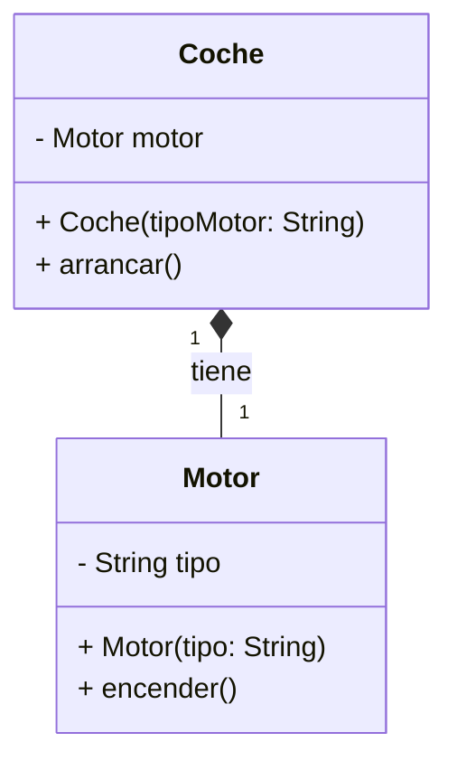

# 1. Conceptos avanzados de programación orientada a objetos

- [1. Conceptos avanzados de programación orientada a objetos](#1-conceptos-avanzados-de-programación-orientada-a-objetos)
  - [1.1. Relaciones entre clases](#11-relaciones-entre-clases)
    - [1.1.1. Composición](#111-composición)
    - [1.1.2. Agregación](#112-agregación)
    - [1.1.3. Herencia](#113-herencia)
    - [1.1.4. Clientela](#114-clientela)
    - [1.1.5. Anidamiento](#115-anidamiento)
  - [1.2. Concepto de encapsulamiento](#12-concepto-de-encapsulamiento)
    - [1.2.1. Definición y beneficios del encapsulamiento](#121-definición-y-beneficios-del-encapsulamiento)
    - [1.2.2. Relación con **herencia** y **acoplamiento**](#122-relación-con-herencia-y-acoplamiento)
    - [1.2.3. Modificadores de acceso: `public`, `private`, `protected`, y default](#123-modificadores-de-acceso-public-private-protected-y-default)
  - [1.3. Herencia](#13-herencia)
    - [Concepto de Herencia](#concepto-de-herencia)
    - [Jerarquías de herencia](#jerarquías-de-herencia)
    - [Tipos de Herencia](#tipos-de-herencia)
    - [Modificadores de acceso en la herencia](#modificadores-de-acceso-en-la-herencia)
    - [Sobreescritura de métodos (Override)](#sobreescritura-de-métodos-override)
    - [Uso del operador `super`](#uso-del-operador-super)
    - [Constructores en la herencia](#constructores-en-la-herencia)
    - [Palabra clave `final` en herencia](#palabra-clave-final-en-herencia)
    - [Problemas y limitaciones de la herencia](#problemas-y-limitaciones-de-la-herencia)
    - [Buenas prácticas en el uso de la herencia](#buenas-prácticas-en-el-uso-de-la-herencia)
  - [1.4. Sobrecarga y sobrescritura](#14-sobrecarga-y-sobrescritura)
    - [1.4.1. Diferencias entre **sobrecarga** (Overloading) y **sobrescritura** (Overriding)](#141-diferencias-entre-sobrecarga-overloading-y-sobrescritura-overriding)
    - [1.4.2. Ejemplos prácticos y reglas de uso](#142-ejemplos-prácticos-y-reglas-de-uso)
  - [1.5. Uso de `final`](#15-uso-de-final)
    - [1.5.1. Final aplicado a clases: cómo evitar la herencia {#final-aplicado-a-clases:-cómo-evitar-la-herencia}](#151-final-aplicado-a-clases-cómo-evitar-la-herencia-final-aplicado-a-clases-cómo-evitar-la-herencia)
    - [1.5.2. Final aplicado a métodos: cómo evitar la sobrescritura {#final-aplicado-a-métodos:-cómo-evitar-la-sobrescritura}](#152-final-aplicado-a-métodos-cómo-evitar-la-sobrescritura-final-aplicado-a-métodos-cómo-evitar-la-sobrescritura)
    - [1.5.3. Final aplicado a variables: creación de constantes {#final-aplicado-a-variables:-creación-de-constantes}](#153-final-aplicado-a-variables-creación-de-constantes-final-aplicado-a-variables-creación-de-constantes)
  - [1.6. Clases abstractas {#clases-abstractas}](#16-clases-abstractas-clases-abstractas)
    - [1.6.1. Definición y características](#161-definición-y-características)
    - [1.6.2. Diferencias con clases concretas](#162-diferencias-con-clases-concretas)
    - [1.6.3. Relación con herencia y polimorfismo](#163-relación-con-herencia-y-polimorfismo)
  - [1.7. Interfaces](#17-interfaces)
    - [1.7.1. Definición y uso de interfaces](#171-definición-y-uso-de-interfaces)
    - [1.7.2. Diferencias entre interfaces y clases abstractas](#172-diferencias-entre-interfaces-y-clases-abstractas)
    - [1.7.3. Implementación múltiple de interfaces](#173-implementación-múltiple-de-interfaces)
  - [1.8. Clases anidadas y clases internas](#18-clases-anidadas-y-clases-internas)
    - [1.8.1. **Clases internas**: Inner classes, Local inner classes y Anonymous classes](#181-clases-internas-inner-classes-local-inner-classes-y-anonymous-classes)
    - [1.8.2. **Clases estáticas anidadas** (Static nested classes)](#182-clases-estáticas-anidadas-static-nested-classes)
    - [1.8.3. Ventajas y desventajas de las clases anidadas](#183-ventajas-y-desventajas-de-las-clases-anidadas)
  - [1.9. Polimorfismo](#19-polimorfismo)
    - [1.9.1. Definición y tipos: polimorfismo estático y dinámico](#191-definición-y-tipos-polimorfismo-estático-y-dinámico)
    - [1.9.2. Ejemplos prácticos usando herencia, clases abstractas e interfaces](#192-ejemplos-prácticos-usando-herencia-clases-abstractas-e-interfaces)
  - [1.10. Métodos y clases genéricas](#110-métodos-y-clases-genéricas)
    - [1.10.1. Concepto de **generics**](#1101-concepto-de-generics)
    - [1.10.2. Clases y métodos parametrizados](#1102-clases-y-métodos-parametrizados)
    - [1.10.3. Ventajas y ejemplos de uso](#1103-ventajas-y-ejemplos-de-uso)
  - [1.11. Expresiones lambda](#111-expresiones-lambda)
    - [1.11.1. Introducción a las **interfaces funcionales**](#1111-introducción-a-las-interfaces-funcionales)
    - [1.11.2. Uso de **expresiones lambda** para simplificar código](#1112-uso-de-expresiones-lambda-para-simplificar-código)
    - [1.11.3. Ejemplos y aplicaciones prácticas](#1113-ejemplos-y-aplicaciones-prácticas)

## 1.1. Relaciones entre clases

Las relaciones entre clases son fundamentales en la programación orientada a objetos (POO) porque permiten organizar, estructurar y modelar el comportamiento y las interacciones entre diferentes entidades en un programa. Una correcta comprensión y uso de estas relaciones mejora la reutilización de código, la modularidad y la flexibilidad del diseño.

En este apartado, analizaremos cinco tipos de relaciones entre clases:

- Composición  
- Agregación  
- Herencia  
- Clientela  
- Anidamiento

### 1.1.1. Composición

La **composición** es una relación **"todo-parte"** donde una clase contiene una o más instancias de otras clases como atributos. Se caracteriza porque el ciclo de vida de las partes depende del objeto que las contiene: si el "todo" se destruye, las partes también se destruyen. Estas son sus **características**:

- Relación **fuerte** entre las clases.  
- El "todo" **posee** las partes.  
- Las partes **no pueden existir independientemente** del objeto contenedor.  
- Representada generalmente como una **asociación fuerte** en un diagrama UML.

A continuación, se presenta un ejemplo en Java:

```java
class Motor {
    private String tipo;

    public Motor(String tipo) {
        this.tipo = tipo;
    }

    public void encender() {
        System.out.println("Motor " + tipo + " encendido.");
    }
}

class Coche {
    private Motor motor; // Composición: El coche contiene un motor

    public Coche(String tipoMotor) {
        this.motor = new Motor(tipoMotor);
    }

    public void arrancar() {
        motor.encender();
        System.out.println("El coche está en marcha.");
    }
}

public class Main {
    public static void main(String[] args) {
        Coche miCoche = new Coche("V8");
        miCoche.arrancar();
    }
}

```

En este ejemplo, la clase `Coche` tiene una relación de composición con la clase `Motor`. El motor es parte integral del coche y no puede existir independientemente. Cuando el objeto `Coche` se destruye, el `Motor` también deja de existir. Este sería su correspondiente diagrama de clases UML:



### 1.1.2. Agregación

La **agregación** es otra relación "todo-parte", pero con una diferencia importante respecto a la composición: las partes pueden existir independientemente del "todo". Es una relación **débil** donde el objeto contenedor y las partes tienen ciclos de vida independientes. Estas son sus **características**:

- Relación **débil** entre las clases.  
- El "todo" **utiliza** las partes, pero no las posee en exclusividad.  
- Las partes pueden existir **fuera del contenedor**.  
- Representada generalmente como una **asociación débil** en un diagrama UML.

A continuación, se presenta un ejemplo en Java:

```java
class Profesor {
    private String nombre;

    public Profesor(String nombre) {
        this.nombre = nombre;
    }

    public String getNombre() {
        return nombre;
    }
}

class Departamento {
    private String nombre;
    private Profesor profesor; // Agregación: un departamento puede tener un profesor

    public Departamento(String nombre, Profesor profesor) {
        this.nombre = nombre;
        this.profesor = profesor;
    }

    public void mostrarInformacion() {
        System.out.println("Departamento: " + nombre + ", Profesor: " + profesor.getNombre());
    }
}

public class Main {
    public static void main(String[] args) {
        Profesor profesor = new Profesor("Dr. Smith");
        Departamento departamento = new Departamento("Informática", profesor);
        departamento.mostrarInformacion();
    }
}
```

En este ejemplo, la clase `Departamento` tiene una relación de agregación con la clase `Profesor`. El profesor no forma parte integral del departamento y puede existir independientemente.

### 1.1.3. Herencia

### 1.1.4. Clientela

### 1.1.5. Anidamiento

## 1.2. Concepto de encapsulamiento

### 1.2.1. Definición y beneficios del encapsulamiento

### 1.2.2. Relación con **herencia** y **acoplamiento**

### 1.2.3. Modificadores de acceso: `public`, `private`, `protected`, y default 

## 1.3. Herencia

La herencia es uno de los pilares fundamentales de la Programación Orientada a Objetos (POO). Permite que una clase (clase derivada o hija) reutilice las propiedades y métodos de otra clase (clase base o padre), extendiendo o especializando su comportamiento.

### Concepto de Herencia

La herencia es una relación "es-un" (is-a) entre dos clases. En esta relación:

- La clase base define atributos y comportamientos comunes a un conjunto de objetos.
- La clase derivada hereda estos atributos y métodos, pudiendo:
  - Añadir nuevos.
  - Sobreescribir los existentes.

Ejemplo básico en Java:

```java
// Clase base
class Animal {
    String nombre;

    public void comer() {
        System.out.println(nombre + " está comiendo.");
    }
}

// Clase derivada
class Perro extends Animal {
    public void ladrar() {
        System.out.println(nombre + " está ladrando.");
    }
}

// Uso de la herencia
public class Main {
    public static void main(String[] args) {
        Perro perro = new Perro();
        perro.nombre = "Max";
        perro.comer();  // Heredado de Animal
        perro.ladrar(); // Propio de Perro
    }
}
```

### Jerarquías de herencia

Clase Base Única: Una clase derivada tiene una única clase base.
Herencia Múltiple (no soportada directamente en Java): Una clase puede tener varias clases base. Esto se puede simular mediante interfaces.
Ejemplo de jerarquía de herencia:

`
Animal
  ├── Perro
  └── Gato
`

### Tipos de Herencia

- Simple: Una clase derivada hereda de una única clase base.
- Jerárquica: Varias clases derivadas heredan de una clase base común.
- Multinivel: Una clase derivada hereda de otra clase derivada.
- Múltiple (indirecta en Java): Se logra combinando interfaces.
- Híbrida: Mezcla de los tipos anteriores.

### Modificadores de acceso en la herencia

Los modificadores de acceso determinan qué miembros se heredan y cómo se accede a ellos:

- private: No se hereda directamente, pero puede ser accesible mediante métodos públicos o protegidos en la clase base.
- protected: Se hereda y es accesible en las clases derivadas.
- public: Se hereda y es accesible desde cualquier lugar.
- default (paquete): Se hereda, pero solo es accesible desde clases del mismo paquete.

Ejemplo:

```java
Copiar código
class Animal {
    private String nombre;  // No se hereda directamente
    protected int edad;     // Accesible en la clase derivada
    public void comer() {   // Heredado y accesible
        System.out.println("El animal está comiendo.");
    }
}
```

### Sobreescritura de métodos (Override)

La clase derivada puede redefinir métodos de la clase base para adaptar su comportamiento. Esto se realiza usando la anotación @Override:

Ejemplo:

```java
class Animal {
    public void sonido() {
        System.out.println("El animal hace un sonido.");
    }
}

class Perro extends Animal {
    @Override
    public void sonido() {
        System.out.println("El perro ladra.");
    }
}
```

Reglas:

- El método debe tener el mismo nombre, tipo de retorno y parámetros que en la clase base.
- El nivel de acceso no puede ser más restrictivo que en la clase base.
- Si el método de la clase base es final, no puede sobreescribirse.

### Uso del operador `super`
El operador `super` se utiliza para:

- Llamar al constructor de la clase base.
- Acceder a miembros (atributos o métodos) de la clase base.
  
Ejemplo:

```java

class Animal {
    String nombre;

    public Animal(String nombre) {
        this.nombre = nombre;
    }

    public void comer() {
        System.out.println(nombre + " está comiendo.");
    }
}

class Perro extends Animal {
    public Perro(String nombre) {
        super(nombre); // Llama al constructor de Animal
    }

    @Override
    public void comer() {
        super.comer(); // Llama al método de la clase base
        System.out.println("Y disfruta mucho su comida.");
    }
}
```

### Constructores en la herencia

En Java, los constructores de una clase base no se heredan, pero se pueden invocar desde la clase derivada usando super.

Reglas importantes:

Si el constructor de la clase base tiene parámetros, debe ser invocado explícitamente desde el constructor de la clase derivada.
Si no se especifica, el compilador agrega automáticamente una llamada al constructor sin parámetros de la clase base.
Ejemplo:

java
Copiar código
class Animal {
    public Animal(String nombre) {
        System.out.println(nombre + " es un animal.");
    }
}

class Perro extends Animal {
    public Perro(String nombre) {
        super(nombre); // Obligatorio si el constructor base tiene parámetros
    }
}

### Palabra clave `final` en herencia

Clases final: No pueden ser extendidas.
Métodos final: No pueden ser sobreescritos.
Ejemplo:

java
Copiar código
final class Animal {
    // No se puede extender esta clase
}

### Problemas y limitaciones de la herencia

- Acoplamiento: Las clases derivadas dependen fuertemente de la clase base. Cambios en la clase base pueden romper el comportamiento de las derivadas.
- Herencia innecesaria: Puede generar una jerarquía compleja si no se utiliza correctamente.
- Herencia múltiple (no soportada en Java): Restringe el uso directo de múltiples clases base, pero se soluciona con interfaces.

### Buenas prácticas en el uso de la herencia

Usa herencia solo cuando exista una relación clara "es-un" entre las clases.
Prefiere composición sobre herencia cuando sea posible.
Mantén las clases base lo más simples posible.
Utiliza @Override para evitar errores al redefinir métodos.
Evalúa si una clase debe ser final para evitar su extensión indebida.

## 1.4. Sobrecarga y sobrescritura

### 1.4.1. Diferencias entre **sobrecarga** (Overloading) y **sobrescritura** (Overriding)

### 1.4.2. Ejemplos prácticos y reglas de uso

## 1.5. Uso de `final`

### 1.5.1. Final aplicado a clases: cómo evitar la herencia {#final-aplicado-a-clases:-cómo-evitar-la-herencia}

### 1.5.2. Final aplicado a métodos: cómo evitar la sobrescritura {#final-aplicado-a-métodos:-cómo-evitar-la-sobrescritura}

### 1.5.3. Final aplicado a variables: creación de constantes {#final-aplicado-a-variables:-creación-de-constantes}

## 1.6. Clases abstractas {#clases-abstractas}

### 1.6.1. Definición y características

### 1.6.2. Diferencias con clases concretas

### 1.6.3. Relación con herencia y polimorfismo

## 1.7. Interfaces

### 1.7.1. Definición y uso de interfaces

### 1.7.2. Diferencias entre interfaces y clases abstractas

### 1.7.3. Implementación múltiple de interfaces

## 1.8. Clases anidadas y clases internas

### 1.8.1. **Clases internas**: Inner classes, Local inner classes y Anonymous classes

### 1.8.2. **Clases estáticas anidadas** (Static nested classes)

### 1.8.3. Ventajas y desventajas de las clases anidadas

## 1.9. Polimorfismo

### 1.9.1. Definición y tipos: polimorfismo estático y dinámico

### 1.9.2. Ejemplos prácticos usando herencia, clases abstractas e interfaces

## 1.10. Métodos y clases genéricas

### 1.10.1. Concepto de **generics**

### 1.10.2. Clases y métodos parametrizados

### 1.10.3. Ventajas y ejemplos de uso

## 1.11. Expresiones lambda

### 1.11.1. Introducción a las **interfaces funcionales**

### 1.11.2. Uso de **expresiones lambda** para simplificar código

### 1.11.3. Ejemplos y aplicaciones prácticas
