# Introducción a las estructuras de datos

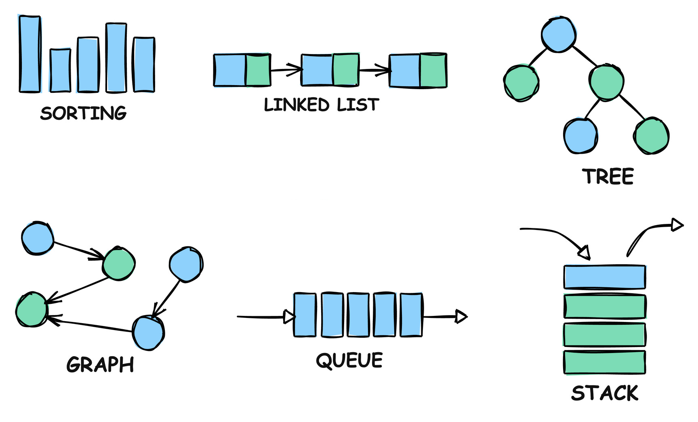

- [1. Introducción](#1-introducción)
  - [1.1. ¿Qué son las estructuras de datos?](#11-qué-son-las-estructuras-de-datos)
  - [1.2. Importancia de las estructuras de datos en programación](#12-importancia-de-las-estructuras-de-datos-en-programación)
  - [1.3. Criterios de selección de estructuras de datos](#13-criterios-de-selección-de-estructuras-de-datos)
  - [1.4. Operaciones básicas con estructuras de datos](#14-operaciones-básicas-con-estructuras-de-datos)
- [2. Tipos de estructuras de datos](#2-tipos-de-estructuras-de-datos)
  - [2.1. Gestión de memoria en Java: la Pila y el Montículo](#21-gestión-de-memoria-en-java-la-pila-y-el-montículo)
    - [2.1.1. Precaución al trabajar con la memoria](#211-precaución-al-trabajar-con-la-memoria)
  - [2.2. Estructuras primitivas vs estructuras de referencia](#22-estructuras-primitivas-vs-estructuras-de-referencia)
    - [2.2.1. Estructuras primitivas](#221-estructuras-primitivas)
    - [2.2.2. Estructuras de referencia](#222-estructuras-de-referencia)
  - [2.3. Estructuras estáticas vs estructuras dinámicas](#23-estructuras-estáticas-vs-estructuras-dinámicas)
    - [2.3.1. Estructuras estáticas](#231-estructuras-estáticas)
    - [2.3.2. Estructuras dinámicas](#232-estructuras-dinámicas)
    - [2.3.3. Consideraciones de rendimiento](#233-consideraciones-de-rendimiento)
  - [2.4. Estructuras lineales vs no lineales](#24-estructuras-lineales-vs-no-lineales)
- [3. Estructuras lineales](#3-estructuras-lineales)
  - [3.1. Estructuras lineales de acceso directo](#31-estructuras-lineales-de-acceso-directo)
    - [3.1.1. Arrays unidimensionales](#311-arrays-unidimensionales)
    - [3.1.2. Arrays multidimensionales (matrices)](#312-arrays-multidimensionales-matrices)
    - [3.1.3. Operaciones con arrays](#313-operaciones-con-arrays)
    - [3.1.4. Ventajas y limitaciones](#314-ventajas-y-limitaciones)
  - [3.2. Estructuras lineales de acceso secuencial](#32-estructuras-lineales-de-acceso-secuencial)
    - [3.2.1. Listas enlazadas (linked lists)](#321-listas-enlazadas-linked-lists)
    - [3.2.2. Pilas (stacks)](#322-pilas-stacks)
    - [3.2.3. Colas (queues)](#323-colas-queues)
- [4. Estructuras no lineales](#4-estructuras-no-lineales)
  - [4.1. Estructuras jerárquicas: árboles (trees)](#41-estructuras-jerárquicas-árboles-trees)
    - [4.1.1. Conceptos básicos](#411-conceptos-básicos)
    - [4.1.2. Tipos de árboles](#412-tipos-de-árboles)
    - [4.1.3. Operaciones con árboles](#413-operaciones-con-árboles)
  - [4.2. Estructuras desordenadas](#42-estructuras-desordenadas)
    - [4.2.1. Grafos (graphs)](#421-grafos-graphs)
    - [4.2.2. Conjuntos (sets)](#422-conjuntos-sets)
    - [4.2.3. Estructuras clave-valor](#423-estructuras-clave-valor)
  - [4.3. Tabla Comparativa de Estructuras de Datos](#43-tabla-comparativa-de-estructuras-de-datos)

## 1. Introducción

### 1.1. ¿Qué son las estructuras de datos?

Una estructura de datos es una manera específica de organizar y manipular la información en un programa, para que puedan ser utilizados de **manera eficiente**. En otras palabras, las estructuras de datos son formas especializadas de **organizar**, **procesar**, **recuperar** y **almacenar datos**.

Imagina que tienes una biblioteca: podrías organizar los libros de diferentes maneras:

- Por orden alfabético
- Por género
- Por fecha de publicación
- Por autor
- Por popularidad

Cada una de estas organizaciones sería análoga a una estructura de datos diferente, y cada una tendría sus ventajas e inconvenientes dependiendo de cómo quieras usar la biblioteca.

### 1.2. Importancia de las estructuras de datos en programación

Las estructuras de datos son fundamentales en la programación por varias razones:

1. **Eficiencia**: Una estructura de datos adecuada puede hacer que un programa sea mucho más rápido y use menos recursos.
2. **Organización**: Permiten mantener los datos organizados de manera lógica y coherente, facilitando su manipulación.
3. **Reutilización**: Las estructuras de datos bien diseñadas pueden reutilizarse en diferentes programas y contextos.
4. **Abstracción**: Nos permiten pensar en los datos de manera abstracta, sin preocuparnos por los detalles de implementación.
5. **Calidad del código**: El uso apropiado de estructuras de datos lleva a un código más limpio, mantenible y eficiente.

### 1.3. Criterios de selección de estructuras de datos

La elección de una estructura de datos depende de varios factores:

1. **Tipo de datos a almacenar**
   - Tamaño de los datos
   - Tipo de los elementos (números, texto, objetos complejos...)
   - Homogeneidad de los datos

2. **Operaciones frecuentes**
   - Inserción y eliminación
   - Búsqueda
   - Ordenación
   - Acceso aleatorio vs secuencial

3. **Restricciones de recursos**
   - Memoria disponible
   - Tiempo de ejecución requerido
   - Capacidad de procesamiento

4. **Características especiales requeridas**
   - Ordenación automática
   - Unicidad de elementos
   - Asociación clave-valor
   - Concurrencia

### 1.4. Operaciones básicas con estructuras de datos

Independientemente de la estructura de datos elegida, hay ciertas operaciones básicas que son comunes a casi todas ellas:

1. **Operaciones de acceso**
   - Insertar (*Insert*): Añadir un nuevo elemento
   - Buscar (*Search*): Encontrar un elemento específico
   - Borrar (*Delete*): Eliminar un elemento
   - Modificar (*Update*): Cambiar el valor de un elemento existente

2. **Operaciones de recorrido**
   - Atravesar (*Traverse*): Visitar cada elemento una vez
   - Ordenar (*Sort*): Organizar los elementos según cierto criterio
   - Mezclar (*Merge*): Combinar dos estructuras en una
   - Dividir (*Split*): Separar una estructura en dos o más partes

3. **Operaciones de consulta**
   - Tamaño (*Size*): Obtener el número de elementos
   - Vacía (*Empty*): Comprobar si la estructura está vacía
   - Llena (*Full*): Verificar si la estructura está llena (en estructuras con tamaño fijo)
   - Contiene (*Contains*): Verificar si existe un elemento específico

4. **Operaciones de transformación**
   - Copiar (*Copy*): Crear una copia de la estructura
   - Convertir (*Convert*): Transformar la estructura en otro tipo
   - Filtrar (*Filter*): Seleccionar elementos según un criterio
   - Mapear (*Map*): Transformar cada elemento según una función

Cada estructura de datos puede implementar estas operaciones de manera diferente, y la eficiencia de cada operación puede variar significativamente según la estructura elegida. Por ejemplo:

- Un array permite acceso directo a cualquier posición, pero insertar en medio es costoso
- Una lista enlazada permite inserción rápida en cualquier posición, pero el acceso aleatorio es más lento
- Un árbol binario de búsqueda proporciona un buen equilibrio para operaciones de búsqueda, inserción y eliminación

La comprensión de estas operaciones básicas y su eficiencia en diferentes estructuras de datos es fundamental para elegir la estructura más adecuada para cada situación.

## 2. Tipos de estructuras de datos

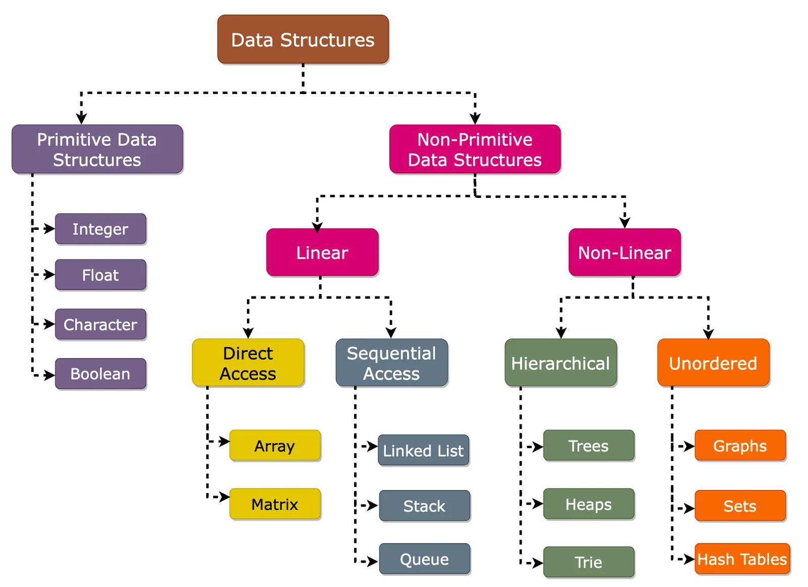

La clasificación de las estructuras de datos nos ayuda a entender mejor sus características y a elegir la más adecuada para cada situación. Vamos a estudiar dos clasificaciones fundamentales.

Para comprender mejor estas clasificaciones, vamos a explicar cómo Java almacena en memoria la información, y para ello hablaremos de la Pila y el Montículo (o stack y heap)

### 2.1. Gestión de memoria en Java: la Pila y el Montículo

Cuando trabajamos con estructuras de datos y colecciones en Java, es fundamental comprender cómo se gestiona la memoria, ya que esto influye en el rendimiento y en la manera en que las estructuras almacenan y manipulan la información. En Java, la memoria se divide principalmente en dos áreas: la **Pila** (Stack) y el **Montículo** (Heap).

- **La Pila (Stack)**: Es una región de memoria que almacena datos de manera ordenada y temporal, siguiendo un orden LIFO (Last In, First Out). En Java, 1ººí se guardan:
  - Las variables primitivas.
  - Las referencias a objetos (pero no los objetos en sí, ya que estos se almacenan en el Heap).
  - La información de las llamadas a métodos (parámetros, variables locales, etc.)

    Cada vez que se llama a un método, se crea un nuevo marco (frame) en la pila. Cuando el método finaliza, el marco se elimina automáticamente, liberando la memoria utilizada.

    ```java
    public class EjemploStack {
        public static void metodo1() {
            int x = 10; // Se almacena en la pila
            metodo2();
        }

        public static void metodo2() {
            int y = 20; // Se almacena en la pila
            System.out.println(y);
        }

        public static void main(String[] args) {
            metodo1();
        }
    }
    ```

    Flujo de la pila en este ejemplo:

    - Se ejecuta `main()`, que crea su propio marco en la pila.
    - `main()` llama a `metodo1()`, creando otro marco.
    - `metodo1()` define `x`, que se almacena en la pila, y llama a `metodo2()`, creando un tercer marco.
    - `metodo2()` define `y`, lo imprime y finaliza.
    - El marco de `metodo2()` se elimina, luego el de `metodo1()`, y finalmente `main()`.

- **El Montículo (Heap)**: Es una región de memoria más grande y menos organizada donde se almacenan:
  - Los objetos
  - Arrays
  - Instancias de clases
  - Y en general, cualquier dato creado con 'new'

A diferencia de la pila, la memoria del heap no se libera automáticamente cuando un método finaliza. En su lugar, Java usa un **Recolector de Basura (Garbage Collector)** para liberar la memoria de los objetos que ya no tienen referencias.

Veamos un ejemplo práctico:

```java
class Persona {
    String nombre;
    
    Persona(String nombre) {
        this.nombre = nombre;
    }
}

public class EjemploHeap {
    public static void main(String[] args) {
        Persona p1 = new Persona("Ana"); // Se almacena en el Heap, pero la referencia está en la pila
        Persona p2 = new Persona("Luis"); // Otro objeto en el Heap
    }
}
```

Aquí, `p1` y `p2` son referencias almacenadas en la pila, pero los objetos `Persona("Ana")` y `Persona("Luis")` están en el Heap.

La pila es más rápida y eficiente porque:

- Tiene un sistema de asignación y liberación de memoria automático
- Los datos se organizan de manera consecutiva
- El acceso es muy rápido al seguir un orden estricto
- La memoria se libera automáticamente cuando una variable sale de ámbito

Por eso, cuando decimos que los tipos primitivos "se almacenan en la pila", significa que estos valores se guardan directamente en esta región de memoria rápida y eficiente, sin necesidad de referencias adicionales como ocurre con los objetos.

#### 2.1.1. Precaución al trabajar con la memoria

1. **Evitar referencias innecesarias:**  
   Si una referencia sigue existiendo pero no se usa, el objeto en el Heap no será eliminado por el **Garbage Collector**, lo que provoca pérdidas de memoria.  

   ```java
   Persona p = new Persona("Carlos");
   p = null; // Permite que el Garbage Collector elimine el objeto
   ```

2. **Cuidado con las referencias compartidas:**  

   ```java
   Persona p1 = new Persona("Eva");
   Persona p2 = p1; // Ambas referencias apuntan al mismo objeto
   p2.nombre = "Lucía";
   System.out.println(p1.nombre); // Salida: Lucía
   ```

   Como `p1` y `p2` apuntan al mismo objeto en el Heap, modificar `p2` también afecta a `p1`.

3. **Evitar la sobrecarga de la pila:**  
   Si una recursión es demasiado profunda, puede generar un **StackOverflowError**.  

   ```java
   public static void metodoRecursivo() {
       metodoRecursivo(); // Llamada infinita
   }
   ```

### 2.2. Estructuras primitivas vs estructuras de referencia

Esta clasificación se distingue por cómo se almacenan los valores en memoria, teniendo en cuenta la existencia de la pila y el montículo en memoria.

#### 2.2.1. Estructuras primitivas

Las estructuras primitivas son aquellas que almacenan directamente los valores en memoria, ya las conocemos y las hemos usado hasta el momento. En Java, estas son:

- **byte**: Números enteros de 8 bits (-128 a 127)
- **short**: Números enteros de 16 bits (-32,768 a 32,767)
- **int**: Números enteros de 32 bits (-2^31 a 2^31-1)
- **long**: Números enteros de 64 bits (-2^63 a 2^63-1)
- **float**: Números decimales de 32 bits
- **double**: Números decimales de 64 bits
- **boolean**: Valores lógicos (true o false)
- **char**: Caracteres Unicode de 16 bits

Características principales:

- Ocupan un tamaño fijo en memoria
- Se almacenan en la pila (stack)
- Se pasan por valor en las funciones
- No pueden ser null
- No tienen métodos asociados

Ejemplo de uso:

```java
int numero = 42;
double precio = 19.99;
char letra = 'A';
```

#### 2.2.2. Estructuras de referencia

Las estructuras de referencia son aquellas que almacenan referencias (direcciones de memoria) a objetos. Incluyen:

- **Arrays**: Colecciones de elementos del mismo tipo
- **Clases**: Estructuras definidas por el usuario
- **Interfaces**: Definiciones de comportamiento
- **Enumeraciones**: Conjuntos de constantes nombradas
- **Colecciones**: ArrayList, LinkedList, HashSet, etc.

Características principales:

- Almacenan referencias a objetos en el heap
- Se pasan por referencia en las funciones
- Pueden ser null
- Tienen métodos asociados
- Pueden ser más complejas y flexibles

Ejemplo de uso:

```java
String nombre = "Juan";  // String es una clase
Integer numero = 42;     // Integer es una clase envoltorio
ArrayList<String> lista = new ArrayList<>();  // ArrayList es una colección
```

### 2.3. Estructuras estáticas vs estructuras dinámicas

Esta clasificación se refiere a la variación del tamaño de las estructuras de datos con el tiempo.

#### 2.3.1. Estructuras estáticas

Las estructuras estáticas son aquellas que tienen un tamaño fijo definido en el momento de su creación.

Características:

- Tamaño fijo durante toda la ejecución
- Memoria asignada en tiempo de compilación
- Acceso directo a los elementos
- Uso eficiente de memoria
- Limitadas por su tamaño máximo

Ejemplos:

```java
// Array estático
int[] numeros = new int[10];  // Tamaño fijo de 10 elementos

// Matriz estática
boolean[][] tablero = new boolean[8][8];  // Tamaño fijo de 8x8
```

Ventajas:

- Acceso rápido a elementos (O(1))
- Uso eficiente de memoria
- Implementación simple

Desventajas:

- No puede crecer o decrecer
- Puede desperdiciar memoria si se sobredimensiona
- Puede quedarse pequeña si se subdimensiona

#### 2.3.2. Estructuras dinámicas

Las estructuras dinámicas pueden cambiar de tamaño durante la ejecución del programa.

Características:

- Tamaño variable durante la ejecución
- Memoria asignada en tiempo de ejecución
- Pueden crecer o decrecer según necesidad
- Uso más flexible de la memoria
- No tienen un límite predefinido (excepto la memoria disponible)

Ejemplos:

```java
// ArrayList (lista dinámica)
ArrayList<String> nombres = new ArrayList<>();
nombres.add("Ana");  // La lista crece automáticamente

// LinkedList (lista enlazada)
LinkedList<Integer> numeros = new LinkedList<>();
numeros.add(1);
numeros.add(2);  // Se añaden nodos dinámicamente
```

Ventajas:

- Flexibilidad en el tamaño
- No hay desperdicio de memoria
- Adaptables a diferentes necesidades

Desventajas:

- Mayor consumo de memoria por elemento
- Acceso más lento en algunos casos
- Implementación más compleja

#### 2.3.3. Consideraciones de rendimiento

La elección entre estructuras estáticas y dinámicas depende de varios factores:

1. **Conocimiento previo del tamaño**
   - Si conocemos el tamaño exacto → Estructura estática
   - Si el tamaño es variable → Estructura dinámica

2. **Frecuencia de modificación**
   - Datos que no cambian → Estructura estática
   - Datos que cambian frecuentemente → Estructura dinámica

3. **Recursos disponibles**
   - Memoria limitada → Estructura estática
   - Memoria abundante → Estructura dinámica

4. **Velocidad de acceso requerida**
   - Acceso rápido prioritario → Estructura estática
   - Flexibilidad prioritaria → Estructura dinámica

```java
// Ejemplo de decisión basada en el caso de uso
public class Ejemplo {
    // Uso estático cuando el tamaño es conocido y fijo
    private final int[] calificaciones = new int[10];  // Para una clase de 10 alumnos
    
    // Uso dinámico cuando el tamaño puede variar
    private ArrayList<String> registroAcciones = new ArrayList<>();  // Para un log de eventos
}
```

### 2.4. Estructuras lineales vs no lineales

Esta clasificación se refiere a la organización de los elementos en la estructura de datos.

- Las **estructuras lineales** organizan los elementos de manera secuencial, uno detrás de otro. Las listas, pilas, colas o arrays son ejemplos de estructuras lineales.
- Las **estructuras no lineales** organizan los elementos de manera no secuencial, formando relaciones más complejas. Los árboles, grafos, conjuntos o tablas hash son ejemplos de estructuras no lineales.

A continuación se describen con más detalle estos dos tipos de estructuras.

## 3. Estructuras lineales

Las estructuras lineales son aquellas en las que los elementos se organizan de manera secuencial, es decir, uno detrás de otro. Cada elemento (excepto el primero y el último) tiene un único elemento predecesor y un único elemento sucesor. Esta organización refleja la forma más natural e intuitiva de organizar datos.

Podemos imaginar una estructura lineal como una fila de personas esperando en una cola: cada persona tiene alguien delante y alguien detrás (excepto el primero y el último de la fila).

Las estructuras lineales se pueden clasificar en dos grandes categorías según su forma de acceso:

- Estructuras de acceso directo (como los arrays)
- Estructuras de acceso secuencial (como las listas enlazadas, pilas y colas)

### 3.1. Estructuras lineales de acceso directo

#### 3.1.1. Arrays unidimensionales

Un array es una estructura de datos que permite almacenar una colección de elementos del mismo tipo en posiciones contiguas de memoria. Cada elemento puede ser accedido directamente mediante un índice.

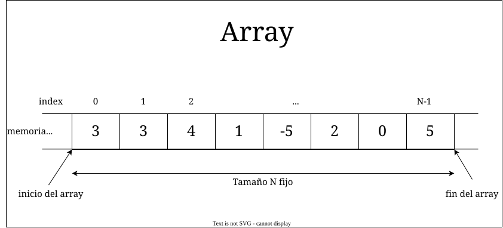

```java
// Declaración e inicialización de un array
int[] numeros = new int[5];  // Array de 5 enteros
String[] nombres = {"Ana", "Juan", "Carlos"};  // Array inicializado con valores

// Acceso a elementos
numeros[0] = 42;  // Modificar el primer elemento
String primerNombre = nombres[0];  // Obtener el primer elemento
```

Características principales:

- Tamaño fijo definido en la creación
- Acceso directo a cualquier elemento mediante índice (numérico, empezando en 0)
- Elementos almacenados en posiciones contiguas de memoria
- Todos los elementos deben ser del mismo tipo

#### 3.1.2. Arrays multidimensionales (matrices)

Los arrays multidimensionales son arrays de arrays, permitiendo crear estructuras de datos con múltiples dimensiones.

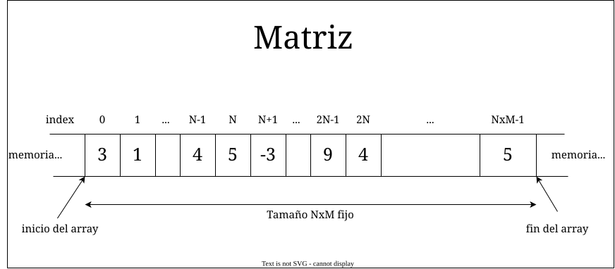

Podemos verlos como matrices accesibles por filas y columnas (aunque en memoria se organicen de manera lineal):

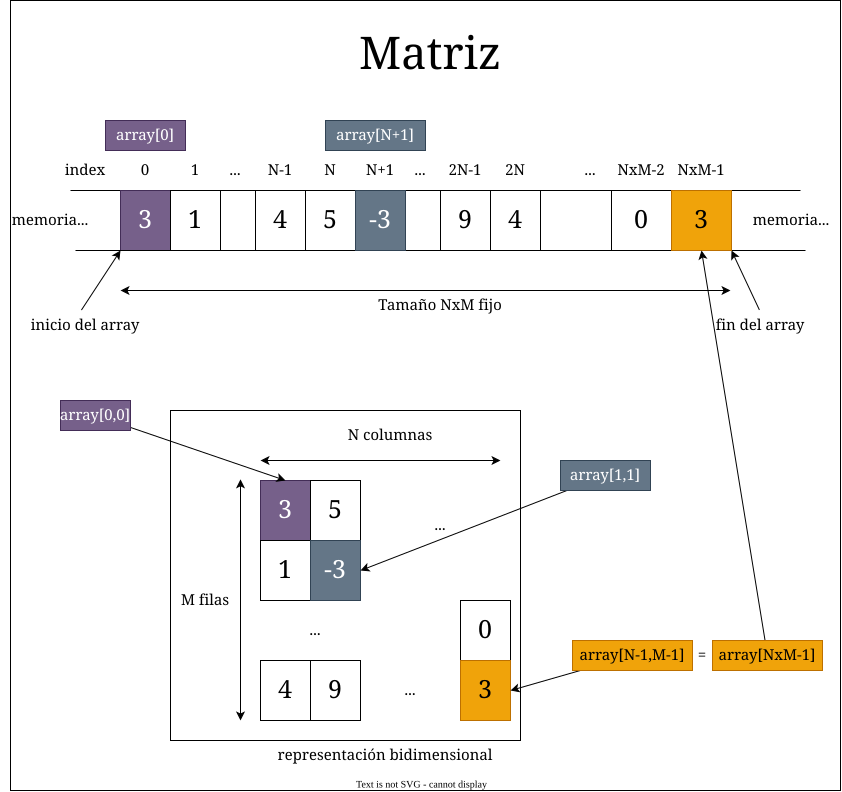

```java
// Matriz bidimensional (tabla)
int[][] matriz = new int[3][4];  // 3 filas, 4 columnas

// Matriz inicializada con valores
int[][] tablero = {
    {1, 2, 3},
    {4, 5, 6},
    {7, 8, 9}
};

// Acceso a elementos
matriz[0][0] = 42;  // Primera fila, primera columna
int valor = tablero[1][1];  // Segunda fila, segunda columna
```

#### 3.1.3. Operaciones con arrays

A continuación se presentan algunis ejemplos de operaciones con arrays (en este caso, de números enteros):

```java
public class OperacionesArray {
    // Recorrer un array
    public static void recorrer(int[] array) {
        for (int elemento : array) {
            System.out.println(elemento);
        }
    }
    
    // Buscar un elemento
    public static int buscar(int[] array, int elemento) {
        for (int i = 0; i < array.length; i++) {
            if (array[i] == elemento) {
                return i;
            }
        }
        return -1;
    }
    
    // Insertar en una posición (requiere desplazar elementos)
    public static void insertar(int[] array, int posicion, int valor) {
        for (int i = array.length - 1; i > posicion; i--) {
            array[i] = array[i-1];
        }
        array[posicion] = valor;
    }
    
    // Eliminar de una posición (requiere desplazar elementos)
    public static void eliminar(int[] array, int posicion) {
        for (int i = posicion; i < array.length - 1; i++) {
            array[i] = array[i+1];
        }
        array[array.length - 1] = 0;  // Valor por defecto
    }
}
```

#### 3.1.4. Ventajas y limitaciones

Ventajas:

1. Acceso directo a elementos (O(1))
2. Eficiencia en memoria al ser contiguos
3. Rápidos de recorrer
4. Fáciles de entender y usar

Limitaciones:

1. Tamaño fijo
2. Inserción y eliminación costosas (O(n))
3. Desperdicio de memoria si se sobredimensiona
4. No puede crecer dinámicamente

Consideraciones de rendimiento:

```java
// Ejemplo de complejidad de operaciones
public class RendimientoArray {
    public static void main(String[] args) {
        int[] array = new int[1000];
        
        // Acceso directo - O(1)
        int elemento = array[500];
        
        // Inserción en medio - O(n)
        insertar(array, 500, 42);  // Debe desplazar 499 elementos
        
        // Búsqueda secuencial - O(n)
        int posicion = buscar(array, 42);
        
        // Recorrido completo - O(n)
        recorrer(array);
    }
}
```

Casos de uso típicos:

1. Cuando se conoce el tamaño de antemano
2. Cuando se necesita acceso aleatorio rápido
3. Para implementar algoritmos que requieren acceso indexado
4. Para representar datos tabulares (matrices)
5. En situaciones donde el rendimiento es crítico y los datos son estáticos

### 3.2. Estructuras lineales de acceso secuencial

Las estructuras de acceso secuencial son aquellas en las que los elementos se organizan de manera secuencial, pero no se accede directamente a ellos mediante un índice numérico. En su lugar, se accede a los elementos de manera secuencial, uno detrás de otro.

Esto significa que para acceder a un elemento en una estructura secuencial, primero hay que recorrer los elementos anteriores en orden. Aunque esto puede ser menos eficiente que el acceso directo, las estructuras secuenciales tienen otras ventajas, como la flexibilidad y la eficiencia en la inserción y eliminación de elementos.

#### 3.2.1. Listas enlazadas (linked lists)

Una lista enlazada es una estructura de datos que consiste en una secuencia de nodos, donde cada nodo contiene un valor y una referencia al siguiente nodo. La lista enlazada comienza con un nodo especial llamado "cabeza" (head) que apunta al primer nodo.

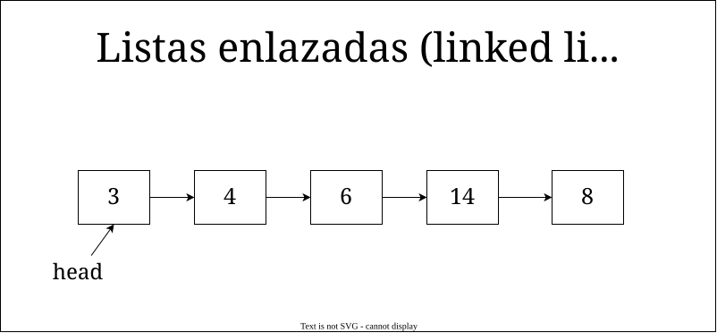

Características principales:

- No tiene un tamaño fijo
- Acceso secuencial a los elementos
- Inserción y eliminación rápidas (O(1)) (siempre que conozcamos el nodo anterior)
- Uso eficiente de memoria al hacer uso de ella dinámicamente, cuando hace falta
- No requiere desplazamiento de elementos en inserciones y eliminaciones
- Puede ser simple o doblemente enlazada --> Listas doblemente enlazadas
- Puede ser circular --> Listas circulares
- Puede tener nodos especiales (cabeza, cola) --> Pilas y colas
- Puede tener operaciones específicas (insertar, eliminar, buscar)
- Puede tener recorridos específicos (al principio, al final, en orden)

##### Listas simplemente enlazadas

En una lista simplemente enlazada, cada nodo tiene una referencia al siguiente nodo, pero no al anterior. Esto hace que el recorrido sea más sencillo, pero la eliminación de nodos sea más compleja.

```java
// Definición de un nodo
class Nodo {
    int valor;
    Nodo siguiente;
    
    public Nodo(int valor) {
        this.valor = valor;
        this.siguiente = null;
    }
}

// Creación de una lista enlazada
Nodo cabeza = new Nodo(1);
cabeza.siguiente = new Nodo(2);
cabeza.siguiente.siguiente = new Nodo(3);
```

##### Listas doblemente enlazadas

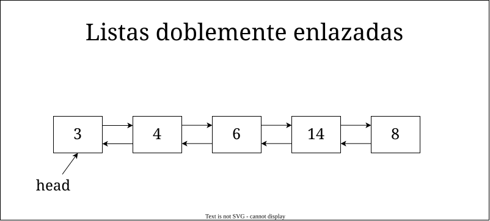

En una lista doblemente enlazada, cada nodo tiene una referencia tanto al nodo anterior como al siguiente. Esto facilita la eliminación de nodos, pero aumenta la complejidad de la estructura.

```java
// Definición de un nodo doble
class NodoDoble {
    int valor;
    NodoDoble anterior;
    NodoDoble siguiente;
    
    public NodoDoble(int valor) {
        this.valor = valor;
        this.anterior = null;
        this.siguiente = null;
    }
}

// Creación de una lista doblemente enlazada

NodoDoble cabeza = new NodoDoble(1);
NodoDoble segundo = new NodoDoble(2);
NodoDoble tercero = new NodoDoble(3);
cabeza.siguiente = segundo;
segundo.anterior = cabeza;
segundo.siguiente = tercero;
tercero.anterior = segundo;
```

En comparacion con las listas simplemente enlazadas, las listas doblemente enlazadas permiten recorrer la lista en ambas direcciones, lo que facilita la eliminación de nodos así como la inserción en cualquier punto de la lista. En general, las listas doblemente enlazadas son más versátiles y flexibles, pero también más complejas de implementar y mantener.

##### Listas circulares

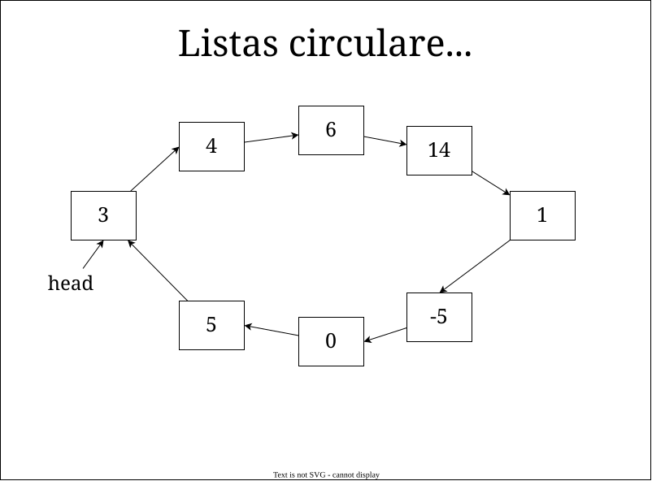

Las listas circulares son aquellas en las que el último nodo apunta al primer nodo, creando un bucle continuo. Esto permite recorrer la lista de manera indefinida sin llegar al final.

```java
// Creación de una lista circular
Nodo primero = new Nodo(1);
Nodo segundo = new Nodo(2);
Nodo tercero = new Nodo(3);
primero.siguiente = segundo;
segundo.siguiente = tercero;
tercero.siguiente = primero;  // El último nodo apunta al primero
```

Las listas circulares pueden ser simplemente enlazadas o doblemente enlazadas, y pueden tener múltiples usos, como la implementación de colas circulares, la representación de círculos o anillos, o la creación de estructuras de datos cíclicas.

Un ejemplo práctico de uso sería una lista de reproducción de música, donde las canciones se organizan en una lista circular para que al llegar al final, la siguiente canción sea la primera de la lista.

##### Operaciones con listas

Las operaciones básicas con listas enlazadas incluyen:

- **Insertar**: Añadir un nuevo nodo en una posición específica
- **Eliminar**: Eliminar un nodo de una posición específica
- **Buscar**: Encontrar un nodo con un valor específico
- **Recorrer**: Visitar cada nodo de la lista en orden
- **Ordenar**: Organizar los nodos según un criterio específico
- **Dividir**: Separar la lista en dos o más partes
- **Mezclar**: Combinar dos listas en una sola

```java
// Ejemplo de operaciones con listas

public class OperacionesLista {
    // Insertar un nodo en una posición
    public static void insertar(Nodo cabeza, int posicion, int valor) {
        Nodo nuevo = new Nodo(valor);
        Nodo actual = cabeza;
        for (int i = 0; i < posicion - 1; i++) {
            actual = actual.siguiente;
        }
        nuevo.siguiente = actual.siguiente;
        actual.siguiente = nuevo;
    }
    
    // Eliminar un nodo en una posición
    public static void eliminar(Nodo cabeza, int posicion) {
        Nodo actual = cabeza;
        for (int i = 0; i < posicion - 1; i++) {
            actual = actual.siguiente;
        }
        actual.siguiente = actual.siguiente.siguiente;
    }
    
    // Buscar un nodo con un valor específico
    public static Nodo buscar(Nodo cabeza, int valor) {
        Nodo actual = cabeza;
        while (actual != null) {
            if (actual.valor == valor) {
                return actual;
            }
            actual = actual.siguiente;
        }
        return null;
    }
    
    // Recorrer la lista
    public static void recorrer(Nodo cabeza) {
        Nodo actual = cabeza;
        while (actual != null) {
            System.out.println(actual.valor);
            actual = actual.siguiente;
        }
    }
}
```

#### 3.2.2. Pilas (stacks)

Una pila es una estructura de datos lineal que sigue el principio LIFO (Last In, First Out), es decir, el último elemento en entrar es el primero en salir. Las pilas se utilizan en situaciones donde el orden de procesamiento es importante y se necesita un acceso rápido al último elemento.

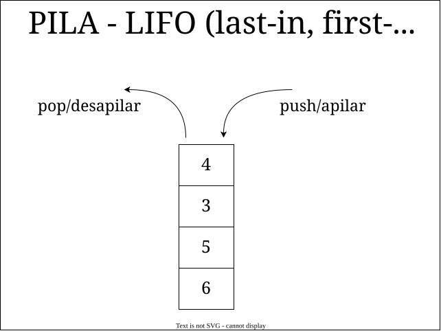

##### Concepto LIFO

El principio LIFO (Last In, First Out) significa que el último elemento en entrar en la pila es el primero en salir. Esto se asemeja a una pila de platos, donde el último plato que se coloca es el primero en ser retirado, o una pila de papeles, donde el último papel que se añade es el primero en ser leído.

##### Operaciones básicas

Las operaciones básicas con pilas incluyen:

- **Push**: Añadir un nuevo elemento al tope de la pila
- **Pop**: Eliminar el elemento del tope de la pila
- **Peek**: Obtener el elemento del tope sin eliminarlo
- **Empty**: Comprobar si la pila está vacía
- **Size**: Obtener el número de elementos en la pila
- **Clear**: Vaciar la pila eliminando todos los elementos

##### Implementaciones

Las pilas se pueden implementar de varias maneras, siendo las más comunes:

- **Con arrays**: Utilizando un array y un índice para el tope
- **Con listas enlazadas**: Utilizando una lista enlazada y un puntero al tope

#### 3.2.3. Colas (queues)

Una cola es una estructura de datos linea quqe sigue el principio FIFIO (First In, First Out), es decir, el primer elemento en entrar es el primero en salir. Las colas se utilizan en situaciones donde el orden de llegada es importante y se necesita un acceso rápido al primer elemento en entrar a la cola.

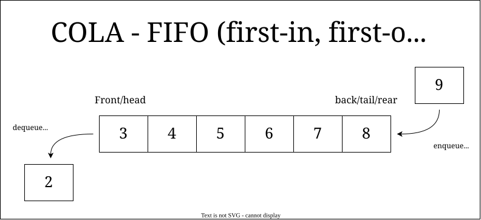

Las operaciones básicas con colas incluyen:

- **Enqueue**: Añadir un nuevo elemento al final de la cola
- **Dequeue**: Eliminar el primer elemento de la cola
- **Peek**: Obtener el primer elemento de la cola sin eliminarlo
- **Empty**: Comprobar si la cola está vacía
- **Size**: Obtener el número de elementos en la cola
- **Clear**: Vaciar la cola eliminando todos los elementos

Las colas se pueden implementar de varias maneras, siendo las más comunes:

- **Con arrays**: Utilizando un array y dos índices para el inicio y el final
- **Con listas enlazadas**: Utilizando una lista enlazada y dos punteros al inicio y al final

## 4. Estructuras no lineales

Las estructuras no lineales son aquellas en las que los elementos no se organizan de manera secuencial, sino que forman relaciones más complejas y jerárquicas. Estas estructuras permiten representar datos de manera más flexible y eficiente, y se utilizan en situaciones donde los datos tienen relaciones más complejas.

Imaginemos por ejemplo un diccionario, donde para obtener el significado de una palabra, no basta con recorrer una lista de palabras en orden, sino que hay que buscar en una estructura más compleja que relaciona palabras con definiciones. Otro escenario podría ser el organigrama de una empresa, donde los empleados tienen jefes, subordinados y compañeros, formando una estructura jerárquica. Este tipo de relaciones no se pueden representar fácilmente con estructuras lineales, por lo que se utilizan estructuras no lineales como las que vamos a presentar a continuación.

Dentro de las estructuras no lineales, podemos distinguir:

- Estructuras jerárquicas: Árboles
- Estructuras desordenadas: Grafos, conjuntos, tablas hash

### 4.1. Estructuras jerárquicas: árboles (trees)


Un árbol es una estructura de datos no lineal que representa una jerarquía. Está compuesto por **nodos**, donde cada nodo tiene un valor (pueden ser de tipos primitivos, por ejemplo, números enteros, booleanos... o no primitivos, como objetos de una clase). Esos nodos puede tener hijos (nodos dependientes). Para estos nodos hijos, llamamos nodo padre a su nodo superior.

El nodo superior se llama raíz (root), y se caracteriza porque no tiene nodos padre. Por su parte, todos los nodos sin hijos se llaman hojas (leaves). En una representación como la de la imagen anterior, normalmente el nodo raíz es el superior, y los nodos hoja los inferiores,

Ejemplo de la vida real: Un árbol genealógico o un organigrama de una empresa.

#### 4.1.1. Conceptos básicos

- **Nodo**: Elemento básico de un árbol, que puede tener un valor y referencias a otros nodos.
- **Raíz (root)**: Nodo superior del árbol, que no tiene nodos padre.
- **Hoja (leaf)**: Nodo inferior del árbol, que no tiene nodos hijos.
- **Nodo padre**: Nodo que tiene uno o más nodos hijos.
- **Nodo hijo**: Nodo que tiene un nodo padre.
- **Nodo hermano**: Nodos que tienen el mismo nodo padre.
- **Nivel**: Distancia de un nodo a la raíz (la raíz está en el nivel 0).
- **Altura**: Número máximo de niveles en el árbol.
- **Grado**: Número de hijos de un nodo.
- **Grado de un árbol**: Número máximo de hijos de un nodo en el árbol.

#### 4.1.2. Tipos de árboles

Teniendo en cuenta los conceptos anteriores, podemos distinguir diferentes tipos de árboles (no son los únicos):

- **Árbol binario**: Cada nodo tiene como máximo dos hijos. Nos referimos a ellos como nodo izquierdo y nodo derecho.
  
  ```mermaid
  graph TD
    A((10)) --> B((16))
    A --> C((15))
    B --> D((2))
    B --> E((7))
    C --> F((12))
    C --> G((20))
    ```

- **Árbol binario de búsqueda (BST)**: Árbol binario en el que cada nodo cumple la propiedad de que el valor de los nodos del subárbol izquierdo es menor que el valor del nodo, y el valor de los nodos del subárbol derecho es mayor que el valor del nodo.
  
  ```mermaid
  graph TD
    A((8)) --> B((3))
    A --> C((10))
    B --> D((1))
    B --> E((6))
    C --> F((9))
    C --> G((14))
    E --> H((4))
    E --> I((7))
    ```

  En contraposicion, el arbol inicial no es un árbol binario de busqueda, ya que el nodo B (16) es el nodo hijo derecho del nodo A (10), y el nodo C (15) es el nodo hijo izquierdo del nodo A (10). Al ser el nodo izquierdo mayor que el nodo padre o el nodo derecho, no cumple con la propiedad de un árbol binario de busqueda.

- **Arbol balanceado**: Árbol en el que la altura de los subárboles de cada nodo difiere en un máximo de una unidad.
  
  ```mermaid
  graph TD
    A((10)) --> B((5))
    A --> C((20))
    A --> U((15))
    B --> D((2))
    B --> M((9))
    B --> E((7))
    C --> F((15))
    C --> G((25))
    D --> H((1))
    D --> I((3))
    E --> J((6))
    E --> K((8))
    U --> V((12))
    U --> W((17))
    U --> X((22))
  ```

  En contraposicion, a continuación se muestra un arbon que NO es balanceado:

  ```mermaid
  graph TD
    A((10)) --> B((5))
    A --> C((20))
    B --> D((2))
    B --> E((7))
    C --> F((15))
    C --> G((25))
    D --> H((1))
    D --> I((3))
    E --> J((6))
    E --> K((8))
    K --> L((9))
    K --> M((10))
    L --> N((11))
  ```

- **Árbol AVL**: Árbol binario de búsqueda balanceado en el que la diferencia de alturas entre los subárboles izquierdo y derecho de cada nodo es como máximo 1.
  
  ```mermaid
  graph TD
    A((10)) --> B((5))
    A --> C((20))
    B --> D((2))
    B --> E((7))
    C --> F((15))
    C --> G((25))
    D --> H((1))
    D --> I((3))
    E --> J((6))
    E --> K((8))
  ```

#### 4.1.3. Operaciones con árboles

Las operaciones básicas con árboles incluyen:

- **Insertar**: Añadir un nuevo nodo al árbol
- **Eliminar**: Eliminar un nodo del árbol
- **Buscar**: Encontrar un nodo con un valor específico
- **Recorrer**: Visitar cada nodo del árbol en orden
- **Ordenar**: Organizar los nodos según un criterio específico

Sobre la operacion de recorrer, debemos definir diferentes tipos de formas de recorrer un árbol:

- **Recorrido en preorden**: Visitar primero el nodo raíz, luego el subárbol izquierdo y finalmente el subárbol derecho.
- **Recorrido en inorden**: Visitar primero el subárbol izquierdo, luego el nodo raíz y finalmente el subárbol derecho.
- **Recorrido en postorden**: Visitar primero el subárbol izquierdo, luego el subárbol derecho y finalmente el nodo raíz.
- **Recorrido en anchura o por niveles**: Visitar los nodos por niveles, empezando por la raíz y siguiendo por los nodos de cada nivel de izquierda a derecha.

Para el siguiente ejemplo de árbol:

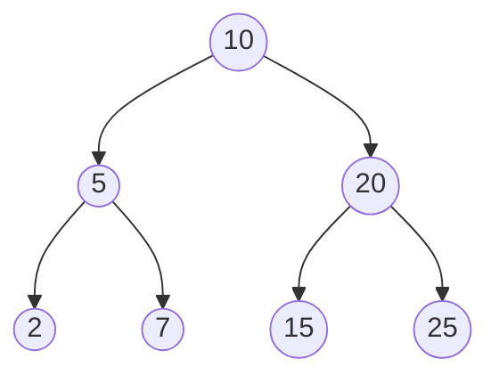

El recorrido en preorden sería: 10, 5, 2, 7, 20, 15, 25
El recorrido en inorden sería: 2, 5, 7, 10, 15, 20, 25
El recorrido en postorden sería: 25, 15, 20, 7, 2, 5, 10
El recorrido en anchura sería: 10, 5, 20, 2, 7, 15, 25

### 4.2. Estructuras desordenadas

Las estructuras desordenadas son aquellas en las que los elementos no siguen un orden específico, sino que se organizan de manera más flexible y arbitraria. Estas estructuras permiten representar datos de manera más dinámica y compleja, y se utilizan en situaciones donde las relaciones entre los datos son más complejas. Entre ellas podemos distinguir los grafos, los conjuntos y las tablas hash.

#### 4.2.1. Grafos (graphs)

Un grafo es una estructura de datos no lineal que consiste en un conjunto de nodos (vértices) y un conjunto de aristas (arcos) que conectan los nodos. Los grafos se utilizan para representar relaciones entre elementos de manera más general y flexible que los árboles.

Los grafos se pueden clasificar en diferentes tipos según sus características y propiedades:

- **Grafo dirigido**: Grafo en el que las aristas tienen una dirección, es decir, van de un nodo origen a un nodo destino. A la hora de recorrer el grafo, solo podremos hacerlo respetando la dirección de las aristas.

  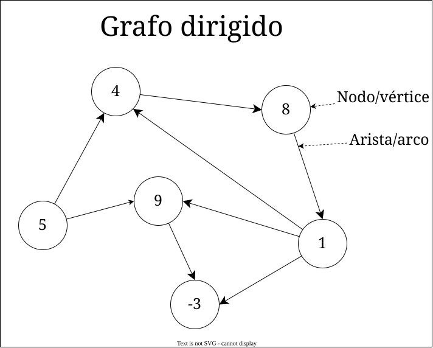

- **Grafo no dirigido**: Grafo en el que las aristas no tienen una dirección, es decir, van de un nodo a otro sin distinción de origen y destino. Por tanto, al recorrer el grafo, podemos hacerlo en cualquier dirección, sin restriccion alguna.

  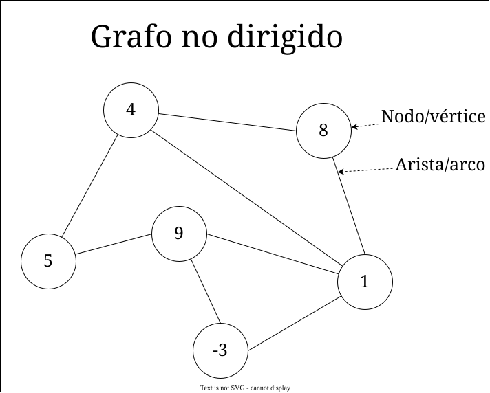

Además, los arcos pueden tener un peso asociado, que representa una medida o una distancia entre los nodos. Estos grafos se llaman **grafos ponderados**.

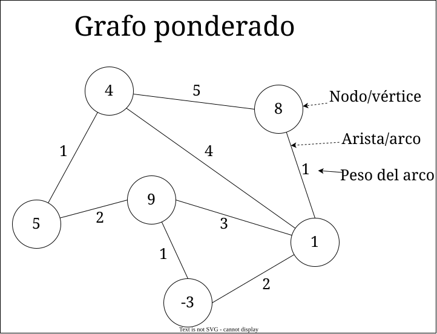

Los grafos pueden representarse de diferentes maneras, como una matriz de adyacencia, una lista de adyacencia o una matriz de incidencia.

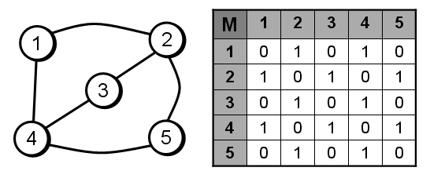

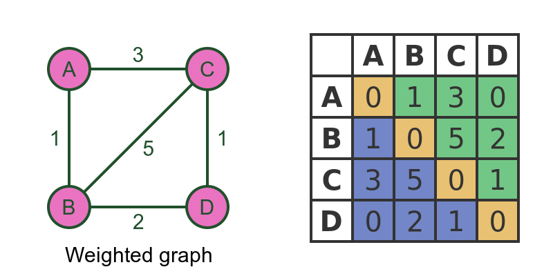

Las funciones básicas que se pueden realizar con un grafo son:

- **Insertar un nodo**: Añadir un nuevo nodo al grafo.
- **Eliminar un nodo**: Eliminar un nodo del grafo.
- **Insertar una arista**: Añadir una arista que conecta dos nodos.
- **Eliminar una arista**: Eliminar una arista que conecta dos nodos.
- **Obtener vecinos de un nodo**: Encontrar los nodos conectados a un nodo dado.
- **Recorrer el grafo**: Visitar cada nodo y arista del grafo en orden.
- **Buscar un camino**: Encontrar un camino entre dos nodos del grafo.
- **Calcular la distancia**: Calcular la distancia entre dos nodos del grafo.
- **Calcular el camino más corto**: Encontrar el camino más corto entre dos nodos del grafo. Este problema se puede resolver con algoritmos como Dijkstra o Floyd-Warshall.
- **Verificar si el grafo es conexo**: Comprobar si todos los nodos del grafo están conectados entre sí.

#### 4.2.2. Conjuntos (sets)

Un conjunto es una estructura de datos que almacena elementos únicos, es decir, sin duplicados. Los conjuntos se utilizan para representar colecciones de elementos donde el orden no es importante y la unicidad es clave.

Por ejemplo, los números de la lotería dentro del bombo representan un conjunto, ya que no se repiten y el orden no importa (no hay un orden como tal).

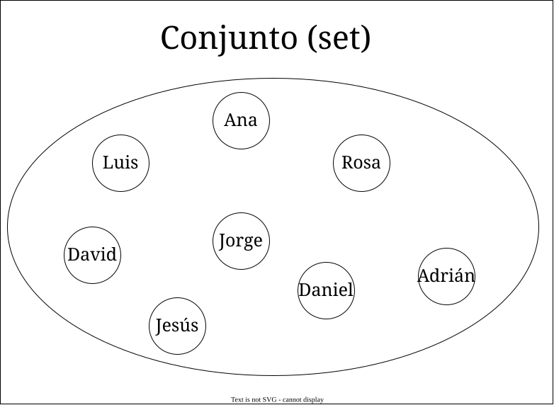

Los conjuntos se pueden implementar de diferentes maneras, como con arrays, listas enlazadas, árboles o tablas hash. Las operaciones básicas con conjuntos incluyen:

- **Insertar**: Añadir un nuevo elemento al conjunto.
- **Eliminar**: Eliminar un elemento del conjunto.
- **Buscar**: Encontrar un elemento en el conjunto.
- **Unión**: Combinar dos conjuntos en uno solo.
- **Intersección**: Encontrar los elementos comunes entre dos conjuntos.
- **Diferencia**: Encontrar los elementos que están en un conjunto pero no en otro.
- **Subconjunto**: Comprobar si un conjunto es un subconjunto de otro.
- **Igualdad**: Comprobar si dos conjuntos son iguales.
- **Vaciar**: Eliminar todos los elementos del conjunto.
- **Tamaño**: Obtener el número de elementos en el conjunto.
- **Verificar si está vacío**: Comprobar si el conjunto no tiene elementos.

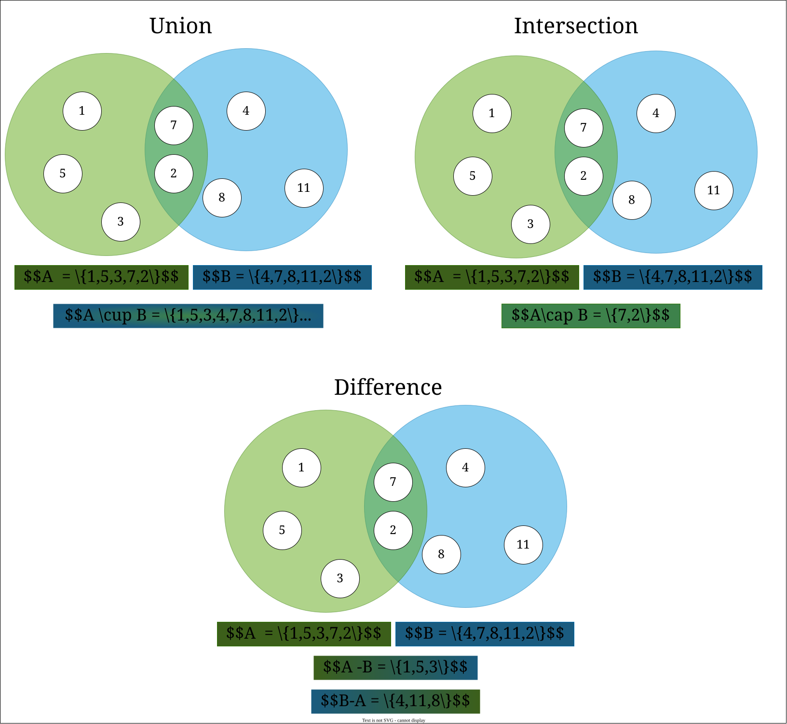

#### 4.2.3. Estructuras clave-valor

Las estructuras clave-valor asocian claves con valores, permitiendo una búsqueda rápida de los valores a partir de las claves, y se utilizan para representar diccionarios, bases de datos, cachés y otros tipos de asociaciones clave-valor.

Existen diferentes conceptos relacionados con las estructuras clave-valor, como mapa, las tabla hash o mapa.

- Un array asociativo es una estructura de datos genérica que asocia claves con valores, permitiendo una búsqueda rápida de los valores a partir de las claves.
- Una tabla hash es una implementación concreta de un array asociativo que utiliza una **función hash** para calcular la posición de cada clave en el array.
- Un mapa es una interfaz genérica que define operaciones comunes para estructuras de datos clave-valor, como los arrays asociativos y las tablas hash.

Un ejemplo muy claro de estructura clave-valor es un diccionario, donde las palabras son las claves y los significados son los valores asociados.

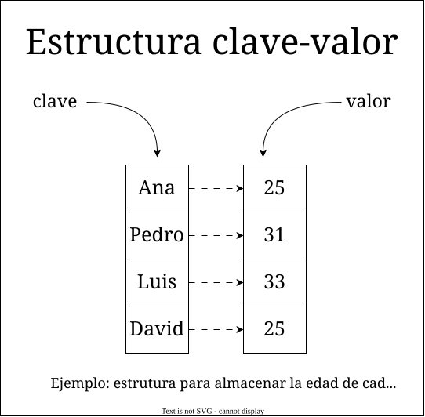

Podemos ver los arrays como una estructura clave-valor, donde los índices son las claves y los valores son los elementos almacenados. De hecho, los arrays son una implementación simple de un array asociativo, donde las claves son números enteros y los valores son los elementos del array.

Entre las funciones que se pueden realizar con una estructura clave-valor se encuentran:

- **Insertar**: Añadir una nueva clave con su valor asociado.
- **Eliminar**: Eliminar una clave y su valor asociado.
- **Buscar**: Encontrar el valor asociado a una clave.
- **Actualizar**: Modificar el valor asociado a una clave.
- **Vaciar**: Eliminar todas las claves y valores.
- **Tamaño**: Obtener el número de claves en la estructura.
- **Verificar si está vacía**: Comprobar si la estructura no tiene claves.
- **Verificar si contiene una clave**: Comprobar si la estructura contiene una clave específica.
- **Obtener todas las claves**: Obtener una lista de todas las claves.
- **Obtener todos los valores**: Obtener una lista de todos los valores.
- **Obtener todas las parejas clave-valor**: Obtener una lista de todas las parejas clave-valor.
- **Verificar si contiene un valor**: Comprobar si la estructura contiene un valor específico.
- **Obtener todas las claves que contienen un valor**: Obtener una lista de todas las claves que contienen un valor específico.

##### Concepto de hash

Una función hash es una función matemática que convierte un valor en una clave única, permitiendo una búsqueda rápida y eficiente de los valores asociados. Las funciones hash se utilizan en estructuras de datos como las tablas hash y los mapas para calcular la posición de las claves en el array subyacente.

Las funciones hash deben cumplir las siguientes propiedades:

- **Determinismo**: Dado un valor de entrada, la función hash debe devolver siempre la misma clave.
- **Unicidad**: Dos valores diferentes deben tener claves diferentes.
- **Eficiencia**: La función hash debe ser rápida de calcular.
- **Distribución uniforme**: Las claves deben distribuirse de manera uniforme en el array.
- **Resistencia a colisiones**: Las colisiones deben ser raras y manejables.
- **Inversibilidad**: Dada una clave, no se debe poder obtener el valor original.

### 4.3. Tabla Comparativa de Estructuras de Datos

A continuación se presenta una tabla comparativa de las estructuras de datos más comunes, con sus características y usos principales:

| **Estructura de Datos** | **Organización**         | **Elementos Repetidos** | **Acceso**               | **Inserción/Eliminación** | **Uso Común**                          |
|--------------------------|--------------------------|--------------------------|--------------------------|---------------------------|----------------------------------------|
| **Array**                | Secuencial (orden fijo) | Sí                       | O(1) (por índice)        | O(n) (costoso)            | Almacenamiento estático               |
| **Lista Enlazada**       | Secuencial (nodos enlazados) | Sí                       | O(n) (secuencial)        | O(1) (si se tiene el nodo)| Inserción/eliminación frecuente       |
| **Pila (Stack)**         | LIFO (Último en entrar, primero en salir) | Sí                       | O(1) (solo el tope)      | O(1) (tope)               | Evaluación de expresiones, backtracking |
| **Cola (Queue)**         | FIFO (Primero en entrar, primero en salir) | Sí                       | O(1) (solo el frente)    | O(1) (frente y final)     | Planificación de tareas, buffers      |
| **Árbol Binario**        | Jerárquica (nodos con hasta 2 hijos) | Sí                       | O(n) (en el peor caso)   | O(n) (en el peor caso)    | Representación de jerarquías          |
| **Árbol BST**            | Jerárquica (ordenado)   | No                       | O(log n) (en equilibrio) | O(log n) (en equilibrio)  | Búsquedas rápidas en datos ordenados  |
| **Árbol AVL**            | Jerárquica (balanceado) | No                       | O(log n)                 | O(log n)                  | Búsquedas rápidas con autoequilibrio  |
| **Grafo**                | No lineal (nodos y aristas) | Sí                       | O(1) a O(n) (depende de la representación) | O(1) a O(n) | Redes, rutas, relaciones complejas    |
| **Conjunto (Set)**       | No ordenado (o ordenado) | No                       | O(1) (hash) o O(log n) (árbol) | O(1) o O(log n) | Elementos únicos, verificación rápida |
| **Mapa (Hash Table)**    | Pares clave-valor       | Claves únicas, valores pueden repetirse | O(1) (hash) | O(1) (hash)               | Asociación de claves con valores      |
| **Heap (Montículo)**     | Jerárquica (orden parcial) | Sí                       | O(1) (solo el máximo/mínimo) | O(log n)               | Colas de prioridad, algoritmos de ordenación |

1. **Organización**:
   - Describe cómo se estructuran los datos (secuencial, jerárquica, no lineal, etc.).

2. **Elementos Repetidos**:
   - Indica si la estructura permite elementos duplicados o no.

3. **Acceso**:
   - Describe la eficiencia para acceder a un elemento específico.

4. **Inserción/Eliminación**:
   - Describe la eficiencia para añadir o eliminar elementos.

5. **Uso Común**:
   - Proporciona ejemplos prácticos de cuándo usar cada estructura.
