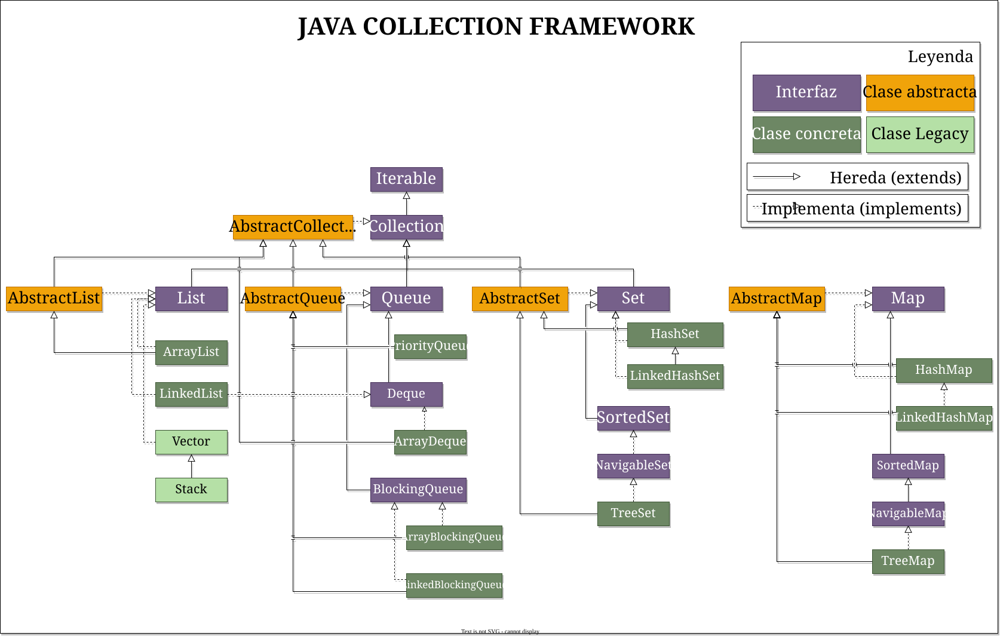
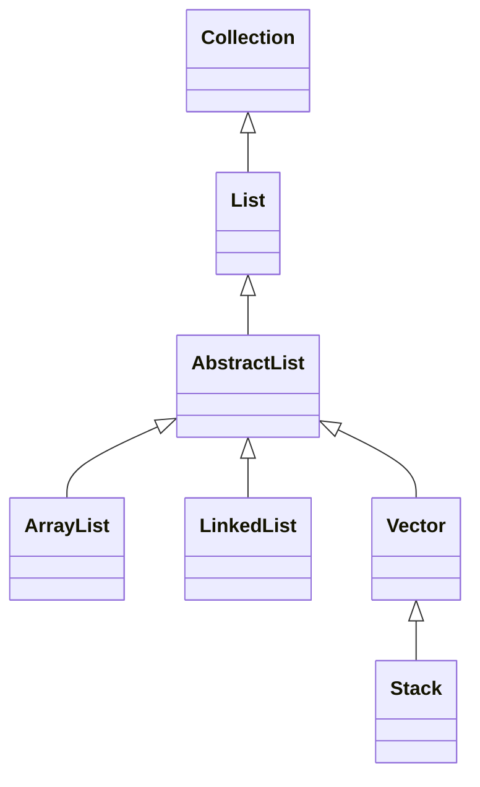
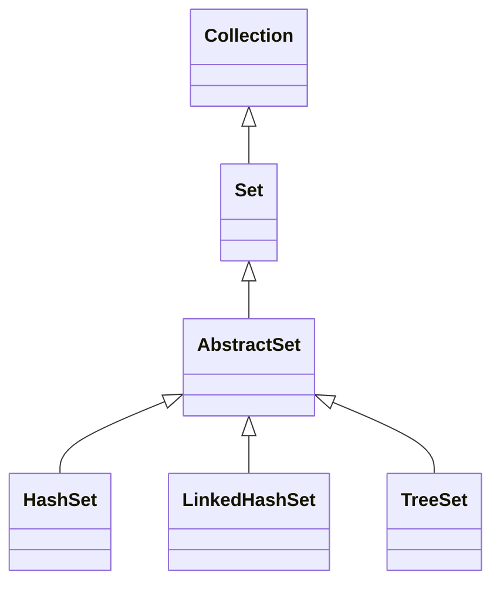
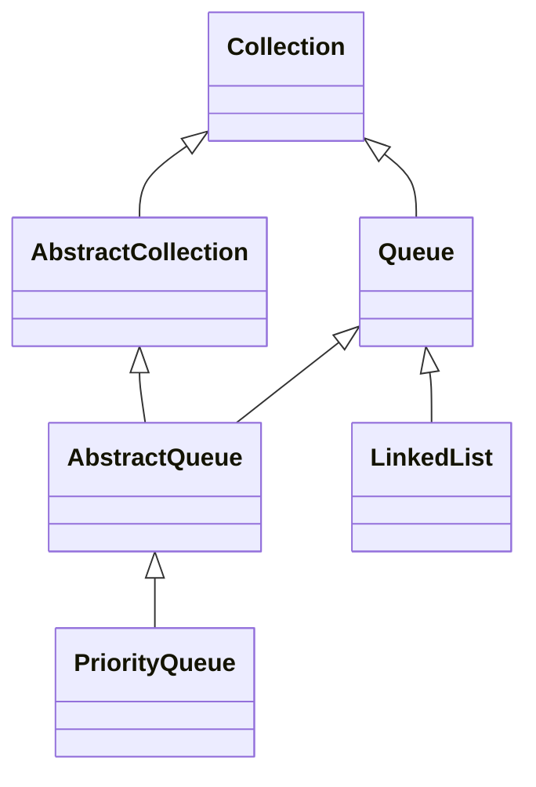
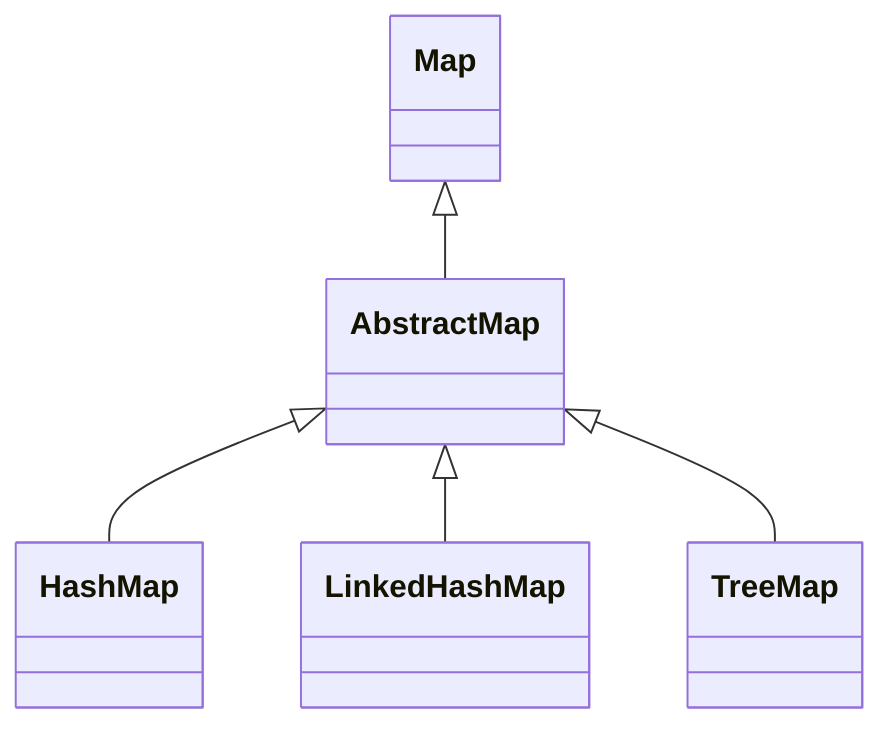

# Java Collection Framework



- [1. Colecciones en Java](#1-colecciones-en-java)
  - [1.1. El Framework Collections](#11-el-framework-collections)
- [2. Interfaz `Collection` y clase abstracta `AbstractCollection`](#2-interfaz-collection-y-clase-abstracta-abstractcollection)
  - [2.1. Interfaz `Collection`](#21-interfaz-collection)
  - [2.2. Clase Abstracta `AbstractCollection`](#22-clase-abstracta-abstractcollection)
  - [2.3. Diferencias entre `Collection` y `AbstractCollection`](#23-diferencias-entre-collection-y-abstractcollection)
- [3. Interfaz `List` y clase abstracta `AbstractList`](#3-interfaz-list-y-clase-abstracta-abstractlist)
  - [3.1. Interfaz `List`](#31-interfaz-list)
    - [3.1.1. Métodos clave de `List`](#311-métodos-clave-de-list)
  - [3.2. Clase abstracta `AbstractList`](#32-clase-abstracta-abstractlist)
    - [3.2.1. Propósito de `AbstractList`](#321-propósito-de-abstractlist)
  - [3.3. Jerarquía de `List` en Java](#33-jerarquía-de-list-en-java)
  - [3.4. Ejemplo de implementación de `AbstractList`](#34-ejemplo-de-implementación-de-abstractlist)
  - [3.5. Diferencias entre `List` y `AbstractList`](#35-diferencias-entre-list-y-abstractlist)
  - [3.6. Cuándo usar `AbstractList`](#36-cuándo-usar-abstractlist)
- [4. Clases `ArrayList` y `LinkedList`](#4-clases-arraylist-y-linkedlist)
  - [4.1. ArrayList: Lista basada en Array Dinámico](#41-arraylist-lista-basada-en-array-dinámico)
    - [4.1.1. Características clave de `ArrayList`](#411-características-clave-de-arraylist)
    - [4.1.2. Ejemplo de uso de `ArrayList`](#412-ejemplo-de-uso-de-arraylist)
  - [4.2. LinkedList: Lista doblemente enlazada](#42-linkedlist-lista-doblemente-enlazada)
    - [4.2.1. Características clave de `LinkedList`](#421-características-clave-de-linkedlist)
    - [4.2.2. Ejemplo de uso de `LinkedList`](#422-ejemplo-de-uso-de-linkedlist)
  - [4.3. Comparación de `ArrayList` y `LinkedList`](#43-comparación-de-arraylist-y-linkedlist)
  - [4.4. ¿Por qué `ArrayList` y `LinkedList` implementan `List`?](#44-por-qué-arraylist-y-linkedlist-implementan-list)
  - [4.5. Cuándo usar `ArrayList` o `LinkedList`](#45-cuándo-usar-arraylist-o-linkedlist)
- [5. Clase Vector y clase Stack](#5-clase-vector-y-clase-stack)
  - [5.1. ¿Cuándo usar Vector?](#51-cuándo-usar-vector)
  - [5.2. ¿Cuándo usar Stack?](#52-cuándo-usar-stack)
  - [5.3. Vector y Stack en aplicaciones modernas](#53-vector-y-stack-en-aplicaciones-modernas)
- [6. Interfaz `Set` y clase abstracta `AbstractSet`](#6-interfaz-set-y-clase-abstracta-abstractset)
  - [6.1. Características principales de `Set`](#61-características-principales-de-set)
  - [6.2. Métodos principales de `Set`](#62-métodos-principales-de-set)
  - [6.3. Clase abstracta `AbstractSet`](#63-clase-abstracta-abstractset)
- [7. Clases `HashSet` y `TreeSet`](#7-clases-hashset-y-treeset)
  - [7.1. `HashSet`: Implementación basada en tablas hash\*\*](#71-hashset-implementación-basada-en-tablas-hash)
  - [7.2. `TreeSet`: Implementación basada en árboles](#72-treeset-implementación-basada-en-árboles)
  - [7.3. Comparación entre `HashSet` y `TreeSet`](#73-comparación-entre-hashset-y-treeset)
  - [7.4. ¿Cuándo usar `HashSet` o `TreeSet`?](#74-cuándo-usar-hashset-o-treeset)
- [8. Interfaz `Queue` y clase abstracta `AbstractQueue`](#8-interfaz-queue-y-clase-abstracta-abstractqueue)
  - [8.1. Interfaz `Queue`](#81-interfaz-queue)
  - [8.2. Clase abstracta `AbstractQueue<E>`](#82-clase-abstracta-abstractqueuee)
  - [8.3. Código simplificado de `AbstractQueue<E>`](#83-código-simplificado-de-abstractqueuee)
- [9. Clase `PriorityQueue<E>`](#9-clase-priorityqueuee)
  - [9.1. Cuándo usar `PriorityQueue<E>`](#91-cuándo-usar-priorityqueuee)
- [10. Interfaz `Deque` y clase `ArrayDeque`](#10-interfaz-deque-y-clase-arraydeque)
  - [10.1. Interfaz `Deque`](#101-interfaz-deque)
  - [10.2. Clase `ArrayDeque`](#102-clase-arraydeque)
- [11. Comparación entre `ArrayDeque` y `LinkedList` como `Deque`](#11-comparación-entre-arraydeque-y-linkedlist-como-deque)
- [12. Interfaz `Map` y clase abstracta `AbstractMap`](#12-interfaz-map-y-clase-abstracta-abstractmap)
  - [12.1. Interfaz `Map<K, V>`](#121-interfaz-mapk-v)
  - [12.2. Clase abstracta `AbstractMap<K, V>`](#122-clase-abstracta-abstractmapk-v)
    - [12.2.1. Código simplificado de `AbstractMap<K, V>`](#1221-código-simplificado-de-abstractmapk-v)
  - [12.3. Implementación personalizada de `AbstractMap<K, V>`](#123-implementación-personalizada-de-abstractmapk-v)
  - [12.4. Cuándo usar `Map` y `AbstractMap`](#124-cuándo-usar-map-y-abstractmap)
- [13. Clases `HashMap` y `TreeMap`](#13-clases-hashmap-y-treemap)
  - [13.1. `HashMap`: Implementación basada en tabla hash](#131-hashmap-implementación-basada-en-tabla-hash)
  - [13.2. `TreeMap`: Implementación basada en árbol rojo-negro\*\*](#132-treemap-implementación-basada-en-árbol-rojo-negro)
  - [13.3. `LinkedHashMap`: Implementación basada en `HashMap` con orden de inserción](#133-linkedhashmap-implementación-basada-en-hashmap-con-orden-de-inserción)
- [14. Tabla comparativa de las principales clases de colecciones en Java](#14-tabla-comparativa-de-las-principales-clases-de-colecciones-en-java)
- [15. Algoritmos, utilidades y manipulación de colecciones](#15-algoritmos-utilidades-y-manipulación-de-colecciones)
  - [15.1. Operaciones básicas en colecciones](#151-operaciones-básicas-en-colecciones)
    - [15.1.1. Añadir, eliminar y consultar elementos en colecciones](#1511-añadir-eliminar-y-consultar-elementos-en-colecciones)
    - [15.1.2. Iteradores: `Iterator`, `ListIterator` y el bucle `for-each`](#1512-iteradores-iterator-listiterator-y-el-bucle-for-each)
  - [15.2. Ordenación y búsqueda en colecciones](#152-ordenación-y-búsqueda-en-colecciones)
    - [15.2.1. Uso de `Comparable` y `Comparator`](#1521-uso-de-comparable-y-comparator)
    - [15.2.2. Métodos de la clase `Collections` para ordenar y buscar](#1522-métodos-de-la-clase-collections-para-ordenar-y-buscar)
  - [15.3. Uso de tipos parametrizados en colecciones](#153-uso-de-tipos-parametrizados-en-colecciones)
    - [15.3.1. Introducción a los genéricos en colecciones](#1531-introducción-a-los-genéricos-en-colecciones)
    - [15.3.2. Uso de genéricos en colecciones](#1532-uso-de-genéricos-en-colecciones)
  - [15.4. Clases utilitarias en colecciones (`Collections`, `Arrays`, `Collectors`)](#154-clases-utilitarias-en-colecciones-collections-arrays-collectors)
    - [15.4.1. Métodos clave de la clase `Collections`](#1541-métodos-clave-de-la-clase-collections)
    - [15.4.2. Métodos clave de la clase `Arrays`](#1542-métodos-clave-de-la-clase-arrays)
    - [15.4.3. Métodos clave de la clase `Collectors`](#1543-métodos-clave-de-la-clase-collectors)
  - [15.5. Filtrado y transformación con Streams y Lambdas](#155-filtrado-y-transformación-con-streams-y-lambdas)
    - [15.5.1. Introducción a Streams y programación funcional en Java](#1551-introducción-a-streams-y-programación-funcional-en-java)
    - [15.5.2. Comparación entre iteración tradicional y Streams](#1552-comparación-entre-iteración-tradicional-y-streams)
    - [15.5.3. Fuentes de datos en Streams](#1553-fuentes-de-datos-en-streams)
    - [15.5.4. Operaciones intermedias en Streams](#1554-operaciones-intermedias-en-streams)
    - [15.5.5. Operaciones terminales en Streams](#1555-operaciones-terminales-en-streams)
- [16. Uso avanzado de String](#16-uso-avanzado-de-string)
  - [16.1. Concepto de inmutabilidad](#161-concepto-de-inmutabilidad)
    - [16.1.1. ¿Podemos crear clases inmutables personalizadas?](#1611-podemos-crear-clases-inmutables-personalizadas)
    - [16.1.2. Reglas para crear una clase inmutable en Java](#1612-reglas-para-crear-una-clase-inmutable-en-java)
    - [16.1.3. Ejemplo de una clase inmutable en Java](#1613-ejemplo-de-una-clase-inmutable-en-java)
    - [16.1.4. ¿Qué pasa si la clase tiene un atributo mutable?](#1614-qué-pasa-si-la-clase-tiene-un-atributo-mutable)
  - [16.2. Fundamentos de `String`](#162-fundamentos-de-string)
    - [16.2.1. Creación de cadenas](#1621-creación-de-cadenas)
    - [16.2.2. Métodos clave de `String`](#1622-métodos-clave-de-string)
  - [16.3. `StringBuilder` y `StringBuffer`](#163-stringbuilder-y-stringbuffer)
    - [16.3.1. Métodos clave de `StringBuilder`](#1631-métodos-clave-de-stringbuilder)
    - [16.3.2. Conversión entre `String`, `StringBuilder` y otras estructuras](#1632-conversión-entre-string-stringbuilder-y-otras-estructuras)
  - [16.4. Buenas prácticas y optimización con Strings](#164-buenas-prácticas-y-optimización-con-strings)
  - [16.5. Conclusión](#165-conclusión)
- [17. Problemas resueltos](#17-problemas-resueltos)
  - [17.1. Cálculo de la media con `ArrayList`](#171-cálculo-de-la-media-con-arraylist)
  - [17.2. Contar palabras únicas con `HashSet`](#172-contar-palabras-únicas-con-hashset)
  - [17.3. Ordenar productos por precio con `TreeMap`](#173-ordenar-productos-por-precio-con-treemap)
  - [17.4. Simulación de una cola de atención con `PriorityQueue`](#174-simulación-de-una-cola-de-atención-con-priorityqueue)
  - [17.5. Filtrado de usuarios con Streams y `filter()`](#175-filtrado-de-usuarios-con-streams-y-filter)
- [18. Ejercicios propuestos](#18-ejercicios-propuestos)
  - [18.1. Recuento de caracteres con `Map`](#181-recuento-de-caracteres-con-map)
  - [18.2. Gestión de una agenda con `TreeSet`](#182-gestión-de-una-agenda-con-treeset)
  - [18.3. Transformación de una lista con `Stream.map()`](#183-transformación-de-una-lista-con-streammap)
  - [18.4. Agrupación de datos con `Collectors.groupingBy()`\*\*](#184-agrupación-de-datos-con-collectorsgroupingby)
- [19. Recursos y referencias](#19-recursos-y-referencias)

## 1. Colecciones en Java

Una vez hemos revisado los diferentes tipos de estructuras de datos que existen, podemos desarrollar como se implementan y utilizan dichas estructuras de datos en el lenguaje de programación Java.

En Java, las colecciones son un conjunto de clases e interfaces que permiten almacenar y manipular grupos de objetos de manera eficiente. Las colecciones proporcionan una forma flexible y dinámica de trabajar con datos, y se utilizan en una amplia variedad de aplicaciones y escenarios. Las colecciones en Java se basan en el Framework Collections, que proporciona una jerarquía de interfaces y clases para representar diferentes tipos de colecciones.

### 1.1. El Framework Collections

El Framework Collections de Java proporciona una jerarquía de interfaces y clases para representar diferentes tipos de colecciones. Las interfaces definen los métodos y operaciones comunes que deben tener las colecciones, mientras que las clases concretas implementan estas interfaces y proporcionan implementaciones específicas de las colecciones. El Framework Collections se basa en los siguientes principios:

- **Jerarquía de interfaces**: Las interfaces definen los métodos comunes que deben tener las colecciones, como añadir, eliminar, buscar y recorrer elementos.
- **Interfaces principales**: Las interfaces principales del Framework Collections son List, Set, Queue y Map, que representan diferentes tipos de colecciones.
- **Implementaciones concretas**: Las clases concretas proporcionan implementaciones específicas de las colecciones, como ArrayList, HashSet, PriorityQueue y HashMap.
- **Algoritmos y utilidades**: El Framework Collections incluye clases y métodos para trabajar con colecciones, como Collections y Arrays.


Esta jerarquía de clases e interfaces puede ser un poco abrumadora, así que la iremos abordando y desgranando poco a poco.

## 2. Interfaz `Collection` y clase abstracta `AbstractCollection`

El **Java Collections Framework** proporciona una jerarquía bien estructurada para manejar colecciones de datos de manera eficiente y flexible. En la cúspide de esta jerarquía se encuentra la interfaz `Collection`, que define el comportamiento básico de todas las estructuras de datos agrupadas dentro del framework. Para facilitar la implementación de nuevas colecciones, Java proporciona la clase abstracta `AbstractCollection`, que ofrece implementaciones predeterminadas de algunos métodos de `Collection`.

### 2.1. Interfaz `Collection`

La interfaz `Collection` es la **superinterfaz de todas las colecciones** en Java (excepto `Map`, que tiene su propia jerarquía independiente). Define un conjunto de operaciones esenciales que cualquier estructura de datos debe implementar si quiere comportarse como una colección.

Algunos de los métodos clave de `Collection` son:

- **Añadir elementos:**  

  ```java
  boolean add(E e);  // Añade un elemento a la colección
  boolean addAll(Collection<? extends E> c); // Añade todos los elementos de otra colección
  ```

- **Eliminar elementos:**  

  ```java
  boolean remove(Object o);  // Elimina un elemento de la colección
  boolean removeAll(Collection<?> c);  // Elimina todos los elementos de una colección dada
  ```

- **Consultar elementos:**  

  ```java
  boolean contains(Object o); // Comprueba si la colección contiene un elemento
  boolean containsAll(Collection<?> c); // Comprueba si contiene todos los elementos de otra colección
  ```

- **Información sobre la colección:**  

  ```java
  int size();  // Devuelve el número de elementos
  boolean isEmpty();  // Comprueba si está vacía
  ```

- **Iteración sobre los elementos:**  

  ```java
  Iterator<E> iterator();  // Devuelve un iterador para recorrer la colección
  ```

- **Conversión a array:**  

  ```java
  Object[] toArray();  // Devuelve un array con los elementos de la colección
  ```

Dado que `Collection` es solo una interfaz, **no puede ser instanciada directamente**. Su propósito es servir como un contrato que las clases concretas (`ArrayList`, `HashSet`, `LinkedList`, etc.) deben seguir.

Ejemplo de uso de `Collection` con una implementación concreta (`ArrayList`):

```java
import java.util.*;

public class EjemploCollection {
    public static void main(String[] args) {
        Collection<String> nombres = new ArrayList<>();
        nombres.add("Ana");
        nombres.add("Carlos");
        nombres.add("Beatriz");

        System.out.println("Elementos en la colección: " + nombres);
        System.out.println("Contiene 'Carlos'? " + nombres.contains("Carlos"));

        nombres.remove("Carlos");
        System.out.println("Después de eliminar 'Carlos': " + nombres);
    }
}
```

### 2.2. Clase Abstracta `AbstractCollection`

Dado que `Collection` es una interfaz y **todas sus implementaciones deben definir los métodos especificados**, Java proporciona la clase **`AbstractCollection`**, que facilita la creación de nuevas colecciones al ofrecer implementaciones por defecto de algunos métodos.

**Propósito de `AbstractCollection`:**  

- Actúa como una **base común** para implementar colecciones personalizadas sin tener que definir todos los métodos desde cero.
- Proporciona **implementaciones parciales** de métodos, como `toString()` o `removeAll()`, pero deja otros como `add()` o `iterator()` sin implementar (deben ser definidos en las subclases).
- Se encuentra en la **parte intermedia** de la jerarquía de colecciones, entre `Collection` y clases concretas como `ArrayList` o `HashSet`.

Ejemplo de jerarquía:

```plaintext
Collection (Interfaz)
 ├── AbstractCollection (Clase abstracta)
 │    ├── AbstractList (Para listas)
 │    ├── AbstractSet (Para conjuntos)
 │    ├── AbstractQueue (Para colas)
 │    └── AbstractMap (Para mapas)
 └── Clases concretas (ArrayList, HashSet, LinkedList...)
```

Métodos predeterminados en `AbstractCollection`:

```java
public abstract class AbstractCollection<E> implements Collection<E> {
    public boolean isEmpty() {
        return size() == 0;
    }

    public boolean contains(Object o) {
        Iterator<E> it = iterator();
        while (it.hasNext())
            if (o.equals(it.next()))
                return true;
        return false;
    }

    public String toString() {
        Iterator<E> it = iterator();
        if (!it.hasNext())
            return "[]";
        
        StringBuilder sb = new StringBuilder();
        sb.append('[');
        for (;;) {
            E e = it.next();
            sb.append(e == this ? "(this Collection)" : e);
            if (!it.hasNext())
                return sb.append(']').toString();
            sb.append(',').append(' ');
        }
    }
}
```

**Ejemplo de implementación personalizada con `AbstractCollection`:**

Supongamos que queremos definir una colección que solo permita almacenar números pares.

```java
import java.util.*;

class ColeccionPares extends AbstractCollection<Integer> {
    private List<Integer> datos = new ArrayList<>();

    @Override
    public boolean add(Integer e) {
        if (e % 2 == 0) {
            return datos.add(e);
        }
        return false; // Solo permite números pares
    }

    @Override
    public Iterator<Integer> iterator() {
        return datos.iterator();
    }

    @Override
    public int size() {
        return datos.size();
    }
}

public class Main {
    public static void main(String[] args) {
        Collection<Integer> pares = new ColeccionPares();
        pares.add(2);
        pares.add(4);
        pares.add(5); // No se añade porque no es par

        System.out.println(pares); // [2, 4]
    }
}
```

### 2.3. Diferencias entre `Collection` y `AbstractCollection`

| Característica            | `Collection` (Interfaz) | `AbstractCollection` (Clase abstracta) |
|---------------------------|-------------------------|--------------------------------|
| ¿Es instanciable?         | ❌ No                    | ❌ No                          |
| ¿Proporciona implementación? | ❌ No, solo define métodos | ✅ Sí, implementa algunos métodos |
| Propósito                 | Define el comportamiento de una colección | Facilita la creación de nuevas colecciones |
| ¿Obliga a implementar métodos? | ✅ Sí, todas las clases deben implementarlos | ⚠️ Solo los métodos abstractos |

En conclusión, la interfaz `Collection` define el comportamiento base de todas las colecciones en Java, mientras que `AbstractCollection` proporciona una implementación parcial para reducir el esfuerzo al crear nuevas colecciones. Entender esta jerarquía es clave para aprovechar al máximo el **Java Collections Framework** y, en caso necesario, extender sus funcionalidades mediante colecciones personalizadas.

## 3. Interfaz `List` y clase abstracta `AbstractList`

Como ya vimos en apartados anteriores, las listas son estructuras de datos secuenciales que permiten almacenar y manipular grupos de elementos de manera ordenada. Dentro del **Java Collections Framework**, la interfaz `List` es una de las más utilizadas, ya que permite almacenar elementos en un **orden secuencial** y acceder a ellos mediante un índice. Para facilitar la implementación de nuevas listas, Java proporciona la clase abstracta `AbstractList`, que ofrece implementaciones predeterminadas de algunos métodos.

### 3.1. Interfaz `List`

La interfaz `List` **hereda de `Collection`** y representa una **colección ordenada de elementos**, donde cada elemento tiene una **posición** específica dentro de la lista. A diferencia de `Set`, una `List` permite **elementos duplicados** y proporciona métodos adicionales para acceder a los datos de manera indexada.

#### 3.1.1. Métodos clave de `List`

- **Acceso mediante índice:**

  ```java
  E get(int index);  // Devuelve el elemento en la posición indicada
  ```

- **Modificación de elementos:**

  ```java
  E set(int index, E element);  // Modifica un elemento en la posición indicada
  ```

- **Añadir elementos en una posición específica:**

  ```java
  void add(int index, E element);  // Inserta un elemento en la posición indicada
  ```

- **Eliminar elementos mediante índice o referencia:**

  ```java
  E remove(int index);  // Elimina y devuelve el elemento en la posición indicada
  boolean remove(Object o);  // Elimina la primera ocurrencia de un objeto
  ```

- **Búsqueda dentro de la lista:**

  ```java
  int indexOf(Object o);  // Devuelve el índice de la primera aparición del objeto o -1 si no está
  int lastIndexOf(Object o);  // Devuelve el índice de la última aparición del objeto o -1 si no está
  ```

- **Sublistas y ordenación:**

  ```java
  List<E> subList(int fromIndex, int toIndex);  // Devuelve una vista de una parte de la lista
  void sort(Comparator<? super E> c);  // Ordena la lista según un comparador
  ```

### 3.2. Clase abstracta `AbstractList`

Dado que `List` es solo una **interfaz**, todas sus implementaciones deben definir los métodos obligatorios. Para reducir el esfuerzo de implementación, Java proporciona la clase **`AbstractList`**, que ofrece una **implementación parcial** de `List`, dejando algunos métodos sin definir.

#### 3.2.1. Propósito de `AbstractList`

- Actúa como una **base común** para implementar listas personalizadas sin necesidad de escribir todos los métodos desde cero.
- Proporciona una **implementación eficiente de algunos métodos** (`size()`, `contains()`, `iterator()`, `indexOf()`), pero deja `get(int index)` y `set(int index, E element)` sin definir.
- Se encuentra en la **parte intermedia** de la jerarquía entre `List` y clases concretas (`ArrayList`, `LinkedList`).

### 3.3. Jerarquía de `List` en Java



### 3.4. Ejemplo de implementación de `AbstractList`

Supongamos que queremos definir una lista que **solo almacene números impares**.

```java
import java.util.AbstractList;
import java.util.Iterator;
import java.util.NoSuchElementException;

class ListaImpares extends AbstractList<Integer> {
    private final int[] datos;
    
    public ListaImpares(int... numeros) {
        this.datos = new int[numeros.length];
        int count = 0;
        for (int num : numeros) {
            if (num % 2 != 0) {
                datos[count++] = num;
            }
        }
    }

    @Override
    public Integer get(int index) {
        if (index < 0 || index >= datos.length) {
            throw new IndexOutOfBoundsException("Índice fuera de rango");
        }
        return datos[index];
    }

    @Override
    public int size() {
        return datos.length;
    }
}

public class Main {
    public static void main(String[] args) {
        List<Integer> impares = new ListaImpares(1, 2, 3, 4, 5, 6, 7, 8);
        System.out.println(impares); // [1, 3, 5, 7]
    }
}
```

### 3.5. Diferencias entre `List` y `AbstractList`

| Característica            | `List` (Interfaz) | `AbstractList` (Clase abstracta) |
|---------------------------|------------------|----------------------------------|
| ¿Es instanciable?         | ❌ No            | ❌ No                            |
| ¿Proporciona implementación? | ❌ No, solo define métodos | ✅ Sí, implementa algunos métodos |
| Propósito                 | Define el comportamiento de una lista | Facilita la implementación de listas |
| Métodos obligatorios a implementar | **Todos** | `get(int index)`, `size()` |

### 3.6. Cuándo usar `AbstractList`

- Si queremos crear una **lista personalizada** sin escribir todos los métodos de `List`.
- Cuando queremos **controlar** qué elementos se pueden almacenar en la lista (ejemplo: solo números impares).
- Para extender el comportamiento de listas estándar con validaciones adicionales.

Por otro lado, **si solo necesitamos almacenar datos sin restricciones específicas, es mejor usar `ArrayList` o `LinkedList` directamente** en lugar de implementar nuestra propia estructura.

Aquí tienes el apartado **5.4. Clases `ArrayList` y `LinkedList`** mejorado, con explicaciones más detalladas, ejemplos prácticos y una comparación estructurada.  

## 4. Clases `ArrayList` y `LinkedList`

Las clases `ArrayList` y `LinkedList` son **dos implementaciones principales de la interfaz `List`**, pero con diferencias fundamentales en su estructura interna y rendimiento. Mientras que `ArrayList` utiliza un **array dinámico** para almacenar los elementos, `LinkedList` usa una **lista doblemente enlazada**, lo que hace que cada una tenga ventajas y desventajas según el tipo de operación que se realice.

### 4.1. ArrayList: Lista basada en Array Dinámico

`ArrayList` almacena sus elementos en un **array interno**, el cual se redimensiona automáticamente cuando se alcanza su capacidad máxima. Debido a esto, proporciona **acceso rápido a los elementos por índice**, pero las inserciones y eliminaciones pueden ser costosas si requieren desplazamiento de elementos.

#### 4.1.1. Características clave de `ArrayList`

✅ **Acceso rápido por índice**: La operación `get(index)` tiene una complejidad **O(1)**, ya que los elementos están almacenados en posiciones contiguas en memoria.  
✅ **Buena eficiencia en búsquedas** si se accede de forma secuencial o aleatoria.  
⚠️ **Inserciones y eliminaciones más lentas** en posiciones intermedias, ya que requieren mover elementos.  
⚠️ **Coste de redimensionamiento**: Cuando el array interno se llena, se crea un nuevo array más grande y se copian los elementos, lo que tiene un impacto en el rendimiento.  

#### 4.1.2. Ejemplo de uso de `ArrayList`

```java
import java.util.*;

public class EjemploArrayList {
    public static void main(String[] args) {
        List<String> nombres = new ArrayList<>();
        nombres.add("Ana");
        nombres.add("Carlos");
        nombres.add("Beatriz");

        System.out.println("Lista original: " + nombres);
        System.out.println("Primer elemento: " + nombres.get(0));

        nombres.add(1, "David"); // Inserta en la posición 1
        System.out.println("Lista después de inserción: " + nombres);

        nombres.remove(2); // Elimina el elemento en la posición 2
        System.out.println("Lista después de eliminación: " + nombres);
    }
}
```

### 4.2. LinkedList: Lista doblemente enlazada

`LinkedList` almacena sus elementos en **nodos enlazados**, donde cada nodo contiene una referencia al **elemento anterior y siguiente**. Esta estructura permite **inserciones y eliminaciones eficientes** en cualquier posición, pero a costa de un acceso más lento por índice.

#### 4.2.1. Características clave de `LinkedList`

✅ **Inserciones y eliminaciones rápidas**: No es necesario mover elementos, solo actualizar referencias.  
✅ **Eficiente para manipulación de datos** en estructuras que requieren muchas operaciones de inserción/eliminación en cualquier posición.  
⚠️ **Acceso lento por índice**: Para acceder a un elemento, se debe recorrer la lista desde el inicio o el final (`O(n)`).  
⚠️ **Mayor uso de memoria**: Cada nodo ocupa más espacio al almacenar referencias adicionales.  

#### 4.2.2. Ejemplo de uso de `LinkedList`

```java
import java.util.*;

public class EjemploLinkedList {
    public static void main(String[] args) {
        List<String> nombres = new LinkedList<>();
        nombres.add("Ana");
        nombres.add("Carlos");
        nombres.add("Beatriz");

        System.out.println("Lista original: " + nombres);
        System.out.println("Primer elemento: " + nombres.get(0));

        nombres.add(1, "David");
        System.out.println("Lista después de inserción: " + nombres);

        nombres.remove(2);
        System.out.println("Lista después de eliminación: " + nombres);
    }
}
```

### 4.3. Comparación de `ArrayList` y `LinkedList`

| Operación        | `ArrayList` (Array Dinámico) | `LinkedList` (Lista Enlazada) |
|-----------------|-----------------------------|------------------------------|
| **Acceso (`get(index)`)** | ✅ **O(1)** (rápido) | ⚠️ **O(n)** (lento) |
| **Inserción al final (`add(e)`)** | ⚠️ Puede ser **O(n)** si hay redimensionamiento | ✅ **O(1)** (rápido) |
| **Inserción en el medio (`add(index, e)`)** | ⚠️ **O(n)** (desplazamiento) | ✅ **O(1)** (solo actualización de referencias) |
| **Eliminación (`remove(index)`)** | ⚠️ **O(n)** (desplazamiento) | ✅ **O(1)** (ajuste de enlaces) |
| **Búsqueda de un elemento (`contains(e)`)** | ⚠️ **O(n)** en el peor caso | ⚠️ **O(n)** (debe recorrer la lista) |
| **Uso de memoria** | ✅ Eficiente | ⚠️ Mayor uso de memoria (referencias extras) |

### 4.4. ¿Por qué `ArrayList` y `LinkedList` implementan `List`?

Viendo la jerarquía de `List`, podemos notar que ambas clases extienden la clase abstracta `AbstractList` e implementan la interfaz `List`.  

La **interfaz `List`** define un conjunto común de operaciones para listas (como `add()`, `get()`, `remove()`, etc.), asegurando que `ArrayList` y `LinkedList` puedan usarse indistintamente en código genérico.  

La **clase abstracta `AbstractList`** proporciona implementaciones predeterminadas de algunos métodos (`contains()`, `size()`, `toString()`), reduciendo el esfuerzo al implementar listas personalizadas.  

Si observamos la jerarquía inicial de esta sección, vemos que **`ArrayList` y `LinkedList` no necesitan declarar todos los métodos de `List`**, ya que muchos ya están implementados en `AbstractList`.

Sin embargo, **Java sigue declarando que `ArrayList` y `LinkedList` implementan `List` explícitamente** para que el programador tenga claro que pueden usarse como listas.

Ejemplo de polimorfismo:

```java
public class Main {
    public static void imprimirLista(List<String> lista) {
        for (String elemento : lista) {
            System.out.print(elemento + " ");
        }
        System.out.println();
    }

    public static void main(String[] args) {
        List<String> arrayList = new ArrayList<>(List.of("A", "B", "C"));
        List<String> linkedList = new LinkedList<>(List.of("X", "Y", "Z"));

        imprimirLista(arrayList);
        imprimirLista(linkedList);
    }
}
```

**Aquí `imprimirLista()` funciona con cualquier implementación de `List`, sin importar si es `ArrayList` o `LinkedList`.**  

### 4.5. Cuándo usar `ArrayList` o `LinkedList`

- Usa `ArrayList` si necesitas acceso rápido a los elementos y realizas pocas inserciones/eliminaciones en el medio.
- Usa `LinkedList` si realizas muchas inserciones y eliminaciones en cualquier posición de la lista.
- Si la memoria es un factor crítico, `ArrayList` es más eficiente.
- Si necesitas recorrer la lista de manera secuencial frecuentemente, `LinkedList` puede ser una mejor opción.

## 5. Clase Vector y clase Stack  

Dentro del **Java Collections Framework**, `Vector` y `Stack` son dos clases heredadas de versiones antiguas de Java (anteriores a Java 2) y, aunque siguen formando parte de la API estándar, su uso ha quedado relegado en favor de estructuras más modernas como `ArrayList` y `Deque`.  

Ambas clases pertenecen al paquete `java.util` y tienen un comportamiento similar a `ArrayList` y `Deque` respectivamente, pero con la diferencia de que `Vector` es **sincronizado** de manera predeterminada, lo que lo hace seguro para entornos con múltiples hilos (thread-safe); por su parte, `Stack` extiende directamente `Vector` para implementar una estructura de pila (*LIFO*), solo permite acceder al último elemento insertado y proporciona métodos específicos para manipular la pila.  

### 5.1. ¿Cuándo usar Vector?

- **En entornos concurrentes**, si se necesita una lista sincronizada y no se quiere usar `Collections.synchronizedList(new ArrayList<>())`.  
- **Cuando se trabaja con código heredado**, ya que algunas APIs antiguas aún dependen de `Vector`.  
- **En aplicaciones modernas, se recomienda usar `ArrayList` y manejar la sincronización manualmente si es necesaria.**  

### 5.2. ¿Cuándo usar Stack?

- Si se necesita una pila sincronizada y simple.
- Cuando se trabaja con código antiguo que usa Stack.
- Para aplicaciones modernas, se recomienda `Deque` en su lugar.*

### 5.3. Vector y Stack en aplicaciones modernas  

Ambas clases fueron diseñadas en **Java 1.0** y han sido reemplazadas en gran parte por implementaciones más eficientes en el **Java Collections Framework** introducido en Java 2.  

**¿Por qué no se recomienda usar Vector y Stack en Java moderno?**

1. **Sincronización innecesaria**: `Vector` y `Stack` sincronizan todos sus métodos, lo que **ralentiza** el rendimiento en comparación con `ArrayList` o `ArrayDeque` en entornos de un solo hilo.  
2. **Alternativas más eficientes**: En la mayoría de los casos, es mejor usar:  
   - `ArrayList` en lugar de `Vector`.  
   - `ArrayDeque` en lugar de `Stack`.  
3. **Flexibilidad y optimización**: `Deque` permite implementar pilas y colas de manera más eficiente, mientras que `ArrayList` tiene un mejor rendimiento sin la sobrecarga de la sincronización.  

## 6. Interfaz `Set` y clase abstracta `AbstractSet`

En el **Java Collections Framework**, la interfaz `Set` representa una **colección que no permite elementos duplicados**. A diferencia de `List`, `Set` no mantiene un orden específico de los elementos y está diseñada para operaciones rápidas de búsqueda y eliminación.  

### 6.1. Características principales de `Set`

✅ **No permite elementos duplicados**.  
✅ **Puede estar desordenado o seguir un orden específico** dependiendo de la implementación (`HashSet`, `TreeSet`).  
✅ **Las operaciones de búsqueda y eliminación son rápidas**, especialmente en `HashSet`.  
⚠️ **No permite acceso por índice** como `List`.  

### 6.2. Métodos principales de `Set`

```java
boolean add(E e);       // Añade un elemento si no está presente
boolean remove(Object o); // Elimina un elemento si está presente
boolean contains(Object o); // Comprueba si un elemento está en el conjunto
int size();              // Devuelve el número de elementos en el conjunto
```

Ejemplo de uso de `Set` con `HashSet`:

```java
import java.util.Set;
import java.util.HashSet;

public class EjemploSet {
    public static void main(String[] args) {
        Set<String> nombres = new HashSet<>();
        nombres.add("Ana");
        nombres.add("Carlos");
        nombres.add("Ana"); // No se añade porque ya existe

        System.out.println("Elementos en el conjunto: " + nombres);
    }
}
```

### 6.3. Clase abstracta `AbstractSet`

La clase `AbstractSet` facilita la creación de implementaciones personalizadas de `Set` al proporcionar implementaciones predeterminadas de algunos métodos comunes.  

Los **propósito de `AbstractSet`** son:

- Extiende `AbstractCollection` e implementa `Set`, asegurando que la colección **no permita elementos duplicados**.  
- Implementa eficientemente `equals()` y `hashCode()` para garantizar que dos conjuntos con los mismos elementos sean considerados iguales.  
- No almacena los datos por sí misma, sino que delega la implementación a clases concretas como `HashSet` o `TreeSet`.  

Jerarquía de `Set` en Java:



Ejemplo de implementación personalizada con `AbstractSet`:

```java
import java.util.AbstractSet;
import java.util.Iterator;
import java.util.HashMap;
import java.util.Map;

class ConjuntoUnico<T> extends AbstractSet<T> {
    private final Map<T, Boolean> datos = new HashMap<>();

    @Override
    public boolean add(T e) {
        return datos.put(e, Boolean.TRUE) == null;
    }

    @Override
    public Iterator<T> iterator() {
        return datos.keySet().iterator();
    }

    @Override
    public int size() {
        return datos.size();
    }
}

public class Main {
    public static void main(String[] args) {
        ConjuntoUnico<String> conjunto = new ConjuntoUnico<>();
        conjunto.add("A");
        conjunto.add("B");
        conjunto.add("A"); // No se añade

        System.out.println(conjunto); // [A, B]
    }
}
```

## 7. Clases `HashSet` y `TreeSet`

Ambas clases concretas implementan `Set`, pero con diferencias clave en el almacenamiento y el rendimiento.  

### 7.1. `HashSet`: Implementación basada en tablas hash**

`HashSet` utiliza una **tabla hash interna** para almacenar los elementos, lo que permite operaciones rápidas de búsqueda e inserción.  

**Características de `HashSet`:**  
✅ **Operaciones O(1) en promedio** (`add()`, `remove()`, `contains()`).  
✅ **No mantiene un orden específico de los elementos**.  
⚠️ **Puede haber colisiones en la tabla hash**, degradando el rendimiento a **O(n)** en el peor caso.  
⚠️ **Los elementos deben implementar correctamente `hashCode()` y `equals()`** para evitar inconsistencias.  

Ejemplo de uso de `HashSet`:

```java
import java.util.HashSet;
import java.util.Set;

public class EjemploHashSet {
    public static void main(String[] args) {
        Set<Integer> numeros = new HashSet<>();
        numeros.add(10);
        numeros.add(20);
        numeros.add(10); // No se añade porque ya existe

        System.out.println("Elementos en HashSet: " + numeros);
    }
}
```

### 7.2. `TreeSet`: Implementación basada en árboles

`TreeSet` está basado en un **árbol rojo-negro**, un tipo de árbol binario de búsqueda equilibrado, lo que permite mantener los elementos ordenados de manera natural o según un comparador definido.  

Características de `TreeSet`:
✅ **Los elementos se mantienen ordenados**.  
✅ **Permite operaciones de navegación (`first()`, `last()`, `higher()`, `lower()`)**.  
⚠️ **Operaciones más lentas** (`O(log n)`) en comparación con `HashSet` (`O(1)`).  
⚠️ **Requiere que los elementos sean comparables (`Comparable` o `Comparator`)**.  

Ejemplo de uso de `TreeSet`:

```java
import java.util.TreeSet;
import java.util.Set;

public class EjemploTreeSet {
    public static void main(String[] args) {
        Set<String> nombres = new TreeSet<>();
        nombres.add("Carlos");
        nombres.add("Ana");
        nombres.add("Beatriz");

        System.out.println("Elementos en TreeSet (ordenados): " + nombres);
    }
}
```

### 7.3. Comparación entre `HashSet` y `TreeSet`

| Característica       | `HashSet` (Tabla Hash) | `TreeSet` (Árbol Rojo-Negro) |
|----------------------|----------------------|----------------------------|
| **Ordenación**      | ❌ No mantiene orden | ✅ Orden natural o por `Comparator` |
| **Búsqueda (`contains`)** | ✅ O(1) en promedio | ⚠️ O(log n) |
| **Inserción (`add`)** | ✅ O(1) en promedio | ⚠️ O(log n) |
| **Eliminación (`remove`)** | ✅ O(1) en promedio | ⚠️ O(log n) |
| **Consumo de memoria** | ⚠️ Mayor debido a la tabla hash | ✅ Menor, estructura balanceada |

### 7.4. ¿Cuándo usar `HashSet` o `TreeSet`?

✔️ Usa `HashSet` cuando **la rapidez es más importante que el orden**.  
✔️ Usa `TreeSet` cuando **necesitas mantener los elementos ordenados** o realizar búsquedas de rango (`higher()`, `lower()`).  

Ejemplo de comparación:

```java
import java.util.*;

public class ComparacionSet {
    public static void main(String[] args) {
        Set<Integer> hashSet = new HashSet<>(List.of(50, 10, 30, 20, 40));
        Set<Integer> treeSet = new TreeSet<>(List.of(50, 10, 30, 20, 40));

        System.out.println("HashSet (sin orden): " + hashSet);
        System.out.println("TreeSet (ordenado): " + treeSet);
    }
}
```

**Salida esperada:**

```java
HashSet (sin orden): [50, 20, 40, 10, 30]  
TreeSet (ordenado): [10, 20, 30, 40, 50]  
```

Sobre las formas de ordenar o el uso de las clases Comparator y Comparable hablaremos en apartados posteriores.

## 8. Interfaz `Queue` y clase abstracta `AbstractQueue`

La **interfaz `Queue`** es una de las estructuras de datos más utilizadas en Java y representa una **colección de tipo FIFO (First-In, First-Out)**, donde los elementos se insertan en un extremo y se eliminan en el otro.  

Java proporciona la clase **`AbstractQueue`** para facilitar la implementación de colas personalizadas.

### 8.1. Interfaz `Queue`

`Queue<E>` **extiende `Collection<E>`** e introduce métodos específicos para manejar colas. A diferencia de `List<E>`, `Queue<E>` **no permite acceso aleatorio a los elementos** y está diseñada para procesar elementos en un orden determinado (FIFO o basado en prioridad).  

**Características clave de `Queue<E>`:**

✅ **Inserción y eliminación estructurada**: Elementos agregados al final y eliminados desde el inicio.  
✅ **Métodos específicos para evitar excepciones (`offer()` y `poll()`).**  
✅ **Puede admitir prioridad en algunas implementaciones (`PriorityQueue`).**  
⚠️ **No tiene acceso por índice como `List<E>`.**  

**Principales métodos de `Queue<E>`:**

| Método | Descripción | Lanza excepción si falla | Alternativa sin excepción |
|--------|------------|-------------------------|---------------------------|
| `add(E e)` | Inserta un elemento | `IllegalStateException` | `offer(E e)` (devuelve `false` si falla) |
| `remove()` | Elimina y devuelve el primer elemento | `NoSuchElementException` | `poll()` (devuelve `null` si está vacía) |
| `element()` | Devuelve el primer elemento sin eliminarlo | `NoSuchElementException` | `peek()` (devuelve `null` si está vacía) |

Ejemplo de uso de `Queue<E>` con `LinkedList`:

```java
import java.util.Queue;
import java.util.LinkedList;

public class EjemploQueue {
    public static void main(String[] args) {
        Queue<String> cola = new LinkedList<>();
        cola.offer("Ana");
        cola.offer("Carlos");
        cola.offer("Beatriz");

        System.out.println("Cola: " + cola);
        System.out.println("Elemento en cabeza: " + cola.peek());

        cola.poll(); // Elimina "Ana"
        System.out.println("Después de poll: " + cola);
    }
}
```

### 8.2. Clase abstracta `AbstractQueue<E>`

Dado que `Queue<E>` es solo una **interfaz**, sus implementaciones deben definir todos sus métodos. Para reducir el esfuerzo al crear nuevas estructuras de colas, Java proporciona **`AbstractQueue<E>`**, que implementa parcialmente `Queue<E>` y delega algunas operaciones a métodos abstractos.  

**Características clave de `AbstractQueue<E>`:**

✅ **Extiende `AbstractCollection<E>` e implementa `Queue<E>`.**  
✅ **Proporciona implementaciones por defecto de `add()`, `remove()` y `element()`.**  
✅ **Obliga a implementar `offer()`, `poll()` y `peek()`.**  

Jerarquía de `Queue<E>` en Java:



### 8.3. Código simplificado de `AbstractQueue<E>`

```java
public abstract class AbstractQueue<E> extends AbstractCollection<E> implements Queue<E> {
    
    protected AbstractQueue() {} // Constructor protegido

    @Override
    public boolean add(E e) {
        if (offer(e))
            return true;
        else
            throw new IllegalStateException("No se puede añadir el elemento a la cola");
    }

    @Override
    public E remove() {
        E x = poll();
        if (x != null)
            return x;
        else
            throw new NoSuchElementException("La cola está vacía");
    }

    @Override
    public E element() {
        E x = peek();
        if (x != null)
            return x;
        else
            throw new NoSuchElementException("La cola está vacía");
    }
}
```

**Observaciones clave:**

- `add()` usa `offer()`, permitiendo lanzar excepciones si no se puede insertar un elemento.  
- `remove()` y `element()` dependen de `poll()` y `peek()` respectivamente, pero lanzan excepciones si la cola está vacía.  

## 9. Clase `PriorityQueue<E>`

`PriorityQueue<E>` es una implementación especial de `Queue<E>` en la que **los elementos no se procesan en orden FIFO, sino según una prioridad definida**. Internamente, usa un **montículo binario (heap mínimo)** para mantener el orden de los elementos.  

**Características clave de `PriorityQueue<E>`**:

✅ Los elementos se procesan en función de su prioridad, no en orden de inserción.
✅ Si `E` no es `Comparable<E>`, es obligatorio proporcionar un `Comparator<E>`.
✅ Orden dinámico: cada vez que se inserta un nuevo elemento, se reordena.
⚠️ No garantiza orden absoluto cuando se recorre con `iterator()`.
⚠️ Complejidad de `O(log n)` para inserción y eliminación.

Ejemplo de `PriorityQueue<E>` con enteros (orden natural):

```java
import java.util.PriorityQueue;

public class EjemploPriorityQueue {
    public static void main(String[] args) {
        PriorityQueue<Integer> colaPrioridad = new PriorityQueue<>();
        colaPrioridad.add(30);
        colaPrioridad.add(10);
        colaPrioridad.add(50);
        colaPrioridad.add(20);

        System.out.println(colaPrioridad.poll()); // 10 (mínimo primero)
        System.out.println(colaPrioridad.poll()); // 20
    }
}
```

**Por defecto, `PriorityQueue<E>` usa el orden natural (`Comparable<E>`).**  

### 9.1. Cuándo usar `PriorityQueue<E>`

✔️ Cuando se requiere procesar elementos en un orden de prioridad en lugar de FIFO.
✔️ Para gestionar colas de tareas donde algunas tienen mayor prioridad.
✔️ Para implementar algoritmos como Dijkstra (ruta más corta en grafos).

Ejemplo de comparación con `Queue<E>` normal:

```java
import java.util.*;

public class ComparacionQueue {
    public static void main(String[] args) {
        Queue<Integer> queue = new LinkedList<>();
        Queue<Integer> priorityQueue = new PriorityQueue<>(List.of(50, 10, 30, 20, 40));

        queue.offer(50);
        queue.offer(10);
        queue.offer(30);
        queue.offer(20);
        queue.offer(40);

        System.out.println("Queue (FIFO): " + queue);
        System.out.println("PriorityQueue (ordenado): " + priorityQueue);
    }
}
```

## 10. Interfaz `Deque` y clase `ArrayDeque`

La interfaz `Deque` (doble cola o **double-ended queue**) es una extensión de `Queue` que permite **inserción y eliminación de elementos en ambos extremos**. Esto la hace más flexible que `Queue`, que solo permite operaciones FIFO (*First-In, First-Out*).  

`ArrayDeque` es una implementación eficiente de `Deque`, basada en un **array dinámico**. A diferencia de `LinkedList`, `ArrayDeque` evita la sobrecarga de los punteros usados en listas enlazadas y ofrece mejor rendimiento en la mayoría de los casos.  

### 10.1. Interfaz `Deque`

`Deque<E>` extiende `Queue<E>` e introduce nuevos métodos para trabajar con ambos extremos de la cola. Se puede usar en dos modos:

- **Cola FIFO** (*First-In, First-Out*): Funciona como `Queue`, con operaciones en los extremos.  
- **Pila LIFO** (*Last-In, First-Out*): Similar a `Stack`, donde los elementos se agregan y eliminan desde el mismo extremo.  

**Principales métodos de `Deque<E>`**:  

| Método | Descripción |
|--------|------------|
| `addFirst(E e)`, `offerFirst(E e)` | Inserta un elemento al inicio |
| `addLast(E e)`, `offerLast(E e)` | Inserta un elemento al final |
| `removeFirst()`, `pollFirst()` | Elimina y devuelve el primer elemento |
| `removeLast()`, `pollLast()` | Elimina y devuelve el último elemento |
| `getFirst()`, `peekFirst()` | Devuelve el primer elemento sin eliminarlo |
| `getLast()`, `peekLast()` | Devuelve el último elemento sin eliminarlo |

✔️ **Diferencia entre métodos `add/remove/get` y `offer/poll/peek`**:

- Los métodos `add`, `remove` y `get` **lanzan excepciones** si la operación falla.  
- Los métodos `offer`, `poll` y `peek` **devuelven valores especiales (`false` o `null`) en lugar de lanzar excepciones**.  

**Ejemplo de uso de `Deque<E>` como cola y pila**:

```java
import java.util.Deque;
import java.util.LinkedList;

public class EjemploDeque {
    public static void main(String[] args) {
        Deque<String> deque = new LinkedList<>();

        // Uso como cola FIFO
        deque.offerLast("A");
        deque.offerLast("B");
        deque.offerLast("C");
        System.out.println("Deque (FIFO): " + deque);

        System.out.println("Eliminado: " + deque.pollFirst()); // A
        System.out.println("Después de pollFirst(): " + deque);

        // Uso como pila LIFO
        deque.push("X"); // Equivalente a addFirst()
        System.out.println("Deque (LIFO): " + deque);

        System.out.println("Eliminado: " + deque.pop()); // X
        System.out.println("Después de pop(): " + deque);
    }
}
```

### 10.2. Clase `ArrayDeque`

`ArrayDeque` es una implementación eficiente de `Deque` basada en **arrays dinámicos**. Es más rápida que `LinkedList` para la mayoría de los casos de uso y una alternativa moderna a `Stack`.  

**Características de `ArrayDeque`**:

✔️ **Operaciones O(1)** para inserciones y eliminaciones en ambos extremos.  
✔️ **Mejor rendimiento que `LinkedList`**, ya que no usa referencias de nodo.  
✔️ **Alternativa eficiente a `Stack`** sin sincronización innecesaria.  
✔️ **No tiene límite de capacidad**, se redimensiona automáticamente.  
❌ **No permite elementos `null`**.  

**Ejemplo de uso de `ArrayDeque` como pila y cola**:

```java
import java.util.Deque;
import java.util.ArrayDeque;

public class EjemploArrayDeque {
    public static void main(String[] args) {
        Deque<Integer> pila = new ArrayDeque<>();
        
        // Uso como pila (LIFO)
        pila.push(10);
        pila.push(20);
        pila.push(30);
        System.out.println("Pila: " + pila);

        System.out.println("Desapilado: " + pila.pop()); // 30
        System.out.println("Después de pop(): " + pila);

        // Uso como cola (FIFO)
        Deque<String> cola = new ArrayDeque<>();
        cola.offer("Ana");
        cola.offer("Carlos");
        cola.offer("Beatriz");
        System.out.println("Cola: " + cola);

        System.out.println("Desencolado: " + cola.poll()); // Ana
        System.out.println("Después de poll(): " + cola);
    }
}
```

## 11. Comparación entre `ArrayDeque` y `LinkedList` como `Deque`

| Característica | `ArrayDeque` | `LinkedList` |
|--------------|-------------|-------------|
| **Estructura** | Array dinámico | Lista doblemente enlazada |
| **Velocidad en inserción/eliminación** | ✔️ Más rápida en general | ❌ Más lenta (sobrecarga de nodos) |
| **Acceso aleatorio** | ❌ No permitido | ❌ No permitido |
| **Consumo de memoria** | ✔️ Más eficiente (sin nodos) | ❌ Mayor consumo (referencias extras) |
| **Uso recomendado** | Uso general en colas y pilas | Solo si necesitas `List` y `Deque` en una estructura |

✔️ **Conclusión:**

- `ArrayDeque` es la mejor opción en la mayoría de los casos, ya que es **más rápida y eficiente**.  
- `LinkedList` solo es útil si necesitas métodos de `List` además de `Deque`.  

**Cuándo usar `Deque` y `ArrayDeque`**:

✔️ **Usa `Deque` si necesitas una estructura flexible** que pueda actuar como **cola y pila**.  
✔️ **Usa `ArrayDeque` en lugar de `Stack` y `LinkedList` para mejorar rendimiento**.  
✔️ **Si necesitas un `Queue` sin prioridad, `ArrayDeque` es una opción más rápida que `LinkedList`**.  
❌ **Evita `ArrayDeque` si necesitas acceso aleatorio a los elementos** (usa `ArrayList`).  

Ejemplo de comparación:

```java
import java.util.*;

public class ComparacionDeque {
    public static void main(String[] args) {
        Deque<Integer> linkedListDeque = new LinkedList<>();
        Deque<Integer> arrayDeque = new ArrayDeque<>();

        long inicio, fin;

        // Prueba con LinkedList
        inicio = System.nanoTime();
        for (int i = 0; i < 100000; i++) {
            linkedListDeque.offer(i);
        }
        fin = System.nanoTime();
        System.out.println("Tiempo con LinkedList: " + (fin - inicio) + " ns");

        // Prueba con ArrayDeque
        inicio = System.nanoTime();
        for (int i = 0; i < 100000; i++) {
            arrayDeque.offer(i);
        }
        fin = System.nanoTime();
        System.out.println("Tiempo con ArrayDeque: " + (fin - inicio) + " ns");
    }
}
```

✔️ **ArrayDeque es considerablemente más rápido en inserciones y eliminaciones**.  

## 12. Interfaz `Map` y clase abstracta `AbstractMap`

La interfaz `Map<K, V>` representa una estructura de datos **clave-valor**, donde cada clave (`K`) está asociada a un único valor (`V`). A diferencia de `Collection`, `Map` **no hereda de `Collection`**, ya que no es una colección de elementos individuales, sino una asociación de pares clave-valor.  

Para facilitar la implementación de `Map`, Java proporciona la clase abstracta `AbstractMap<K, V>`, que implementa parcialmente `Map<K, V>`, dejando algunos métodos como abstractos.  

### 12.1. Interfaz `Map<K, V>`  

La interfaz `Map<K, V>` define las operaciones básicas para trabajar con asociaciones clave-valor.  

**Características de `Map<K, V>`**:

✔️ **Cada clave es única**, pero los valores pueden repetirse.  
✔️ **Permite operaciones eficientes de búsqueda, inserción y eliminación**, dependiendo de la implementación (`HashMap`, `TreeMap`, `LinkedHashMap`).  
✔️ **No forma parte de `Collection`**, ya que trabaja con pares (`K, V`) en lugar de elementos individuales.  
✔️ **Ofrece métodos especializados** para iterar sobre claves (`keySet()`), valores (`values()`) o pares (`entrySet()`).  

**Principales métodos de `Map<K, V>`**:

| Método | Descripción |
|--------|------------|
| `put(K key, V value)` | Inserta un par clave-valor. Si la clave ya existe, sobrescribe el valor. |
| `get(K key)` | Devuelve el valor asociado a una clave. Devuelve `null` si no existe. |
| `containsKey(K key)` | Retorna `true` si la clave está presente. |
| `containsValue(V value)` | Retorna `true` si el valor está presente. |
| `remove(K key)` | Elimina una clave y su valor. |
| `keySet()` | Retorna un `Set<K>` con todas las claves. |
| `values()` | Retorna una colección con todos los valores. |
| `entrySet()` | Retorna un `Set<Map.Entry<K, V>>` con todos los pares clave-valor. |

Ejemplo de uso de `Map<K, V>` con `HashMap`:

```java
import java.util.Map;
import java.util.HashMap;

public class EjemploMap {
    public static void main(String[] args) {
        Map<String, Integer> edades = new HashMap<>();
        edades.put("Carlos", 30);
        edades.put("Ana", 25);
        edades.put("Beatriz", 28);

        System.out.println("Edad de Ana: " + edades.get("Ana")); // 25
        System.out.println("Claves en el mapa: " + edades.keySet());
        System.out.println("Valores en el mapa: " + edades.values());
    }
}
```

### 12.2. Clase abstracta `AbstractMap<K, V>`

Dado que `Map<K, V>` es solo una **interfaz**, las clases que implementan `Map` deben definir todos sus métodos. Para reducir la complejidad, Java proporciona **`AbstractMap<K, V>`**, que implementa parcialmente `Map<K, V>`, dejando algunos métodos abstractos.  

**Características de `AbstractMap<K, V>`**:

✔️ **Implementa la mayoría de los métodos de `Map<K, V>`, excepto `entrySet()`**, que debe ser definido por las subclases.  
✔️ **Proporciona una implementación eficiente de `equals()`, `hashCode()` y `toString()`.**  
✔️ **Reduce el esfuerzo de implementar `Map<K, V>` desde cero.**  

Jerarquía de `Map<K, V>` en Java:



#### 12.2.1. Código simplificado de `AbstractMap<K, V>`

```java
public abstract class AbstractMap<K, V> implements Map<K, V> {
    
    protected AbstractMap() {} // Constructor protegido

    @Override
    public int size() {
        return entrySet().size();
    }

    @Override
    public boolean isEmpty() {
        return size() == 0;
    }

    @Override
    public boolean containsKey(Object key) {
        for (Entry<K, V> entry : entrySet()) {
            if (entry.getKey().equals(key))
                return true;
        }
        return false;
    }

    @Override
    public boolean containsValue(Object value) {
        for (Entry<K, V> entry : entrySet()) {
            if (entry.getValue().equals(value))
                return true;
        }
        return false;
    }

    @Override
    public V get(Object key) {
        for (Entry<K, V> entry : entrySet()) {
            if (entry.getKey().equals(key))
                return entry.getValue();
        }
        return null;
    }
}
```

✔️ **Observaciones clave:**

- `entrySet()` **debe ser implementado** por las subclases (`HashMap`, `TreeMap`, etc.).  
- Métodos como `size()`, `isEmpty()`, `containsKey()` y `containsValue()` **se implementan usando `entrySet()`**.  

### 12.3. Implementación personalizada de `AbstractMap<K, V>`

Si queremos crear un `Map<K, V>` con una implementación propia, podemos extender `AbstractMap<K, V>` y definir `entrySet()`.  

Ejemplo de un `Map<K, V>` basado en `ArrayList`:

```java
import java.util.*;

class MapaLista<K, V> extends AbstractMap<K, V> {
    private final List<Entry<K, V>> datos = new ArrayList<>();

    @Override
    public Set<Entry<K, V>> entrySet() {
        return new HashSet<>(datos);
    }

    @Override
    public V put(K key, V value) {
        for (Entry<K, V> entry : datos) {
            if (entry.getKey().equals(key)) {
                V oldValue = entry.getValue();
                entry.setValue(value);
                return oldValue;
            }
        }
        datos.add(new AbstractMap.SimpleEntry<>(key, value));
        return null;
    }
}

public class Main {
    public static void main(String[] args) {
        Map<String, Integer> mapa = new MapaLista<>();
        mapa.put("Ana", 30);
        mapa.put("Carlos", 25);

        System.out.println("Edad de Ana: " + mapa.get("Ana")); // 30
        System.out.println("Claves en el mapa: " + mapa.keySet());
    }
}
```

✔️ **Aquí `MapaLista<K, V>` usa `ArrayList` internamente para almacenar los pares clave-valor.**  

### 12.4. Cuándo usar `Map` y `AbstractMap`  

✔️ **Usa `Map<K, V>` si necesitas almacenar datos clave-valor de forma eficiente.**  
✔️ **Usa `AbstractMap<K, V>` si necesitas crear una implementación personalizada de `Map<K, V>` sin definir todos los métodos desde cero.**  
✔️ **Si necesitas un `Map<K, V>` eficiente, usa `HashMap`, `TreeMap` o `LinkedHashMap`.**
✔️ **`TreeMap` mantiene las claves ordenadas**, mientras que `HashMap` no.  

## 13. Clases `HashMap` y `TreeMap`

Las implementaciones más utilizadas de `Map<K, V>` en Java son `HashMap`, `TreeMap` y `LinkedHashMap`. Cada una tiene características específicas que las hacen adecuadas para distintos casos de uso.  

### 13.1. `HashMap`: Implementación basada en tabla hash

`HashMap<K, V>` es la implementación más común de `Map<K, V>`. Utiliza una **tabla hash** para almacenar los pares clave-valor, lo que permite una búsqueda rápida.  

**Características de `HashMap`**:

✔️ **Inserción, eliminación y búsqueda en tiempo O(1) en promedio** (gracias a la función hash).  
✔️ **No garantiza orden en las claves** (pueden aparecer en cualquier orden).  
✔️ **Permite `null` como clave y múltiples valores `null`**.  
❌ **El rendimiento puede degradarse a O(n) en el peor caso si hay demasiadas colisiones**.  

Ejemplo de uso de `HashMap`:

```java
import java.util.HashMap;
import java.util.Map;

public class EjemploHashMap {
    public static void main(String[] args) {
        Map<String, Integer> edades = new HashMap<>();
        edades.put("Carlos", 30);
        edades.put("Ana", 25);
        edades.put("Beatriz", 28);

        System.out.println("Mapa: " + edades);
        System.out.println("Edad de Ana: " + edades.get("Ana")); // 25
    }
}
```

✔️ **La salida no garantiza un orden específico de las claves.**  

### 13.2. `TreeMap`: Implementación basada en árbol rojo-negro**

`TreeMap<K, V>` es una implementación de `Map<K, V>` basada en un **árbol rojo-negro**, lo que significa que **mantiene las claves ordenadas de manera natural** (o según un `Comparator<K>` proporcionado).  

**Características de `TreeMap`**:

✔️ **Mantiene las claves ordenadas de menor a mayor (`Comparable<K>` o `Comparator<K>`).**  
✔️ **Búsqueda, inserción y eliminación en tiempo O(log n)**.  
✔️ **Ideal cuando se necesita acceso ordenado o rangos de claves (`subMap()`, `headMap()`, `tailMap()`).**  
❌ **Es más lento que `HashMap` para operaciones individuales** debido a la estructura de árbol.  
❌ **No permite `null` como clave** (pero sí valores `null`).  

Ejemplo de uso de `TreeMap`:

```java
import java.util.Map;
import java.util.TreeMap;

public class EjemploTreeMap {
    public static void main(String[] args) {
        Map<String, Integer> edades = new TreeMap<>();
        edades.put("Carlos", 30);
        edades.put("Ana", 25);
        edades.put("Beatriz", 28);

        System.out.println("TreeMap (ordenado): " + edades);
    }
}
```

✔️ **Las claves aparecen ordenadas alfabéticamente (`Ana`, `Beatriz`, `Carlos`).**  

### 13.3. `LinkedHashMap`: Implementación basada en `HashMap` con orden de inserción

`LinkedHashMap<K, V>` es similar a `HashMap`, pero **mantiene el orden en el que se insertaron las claves**.  

**Características de `LinkedHashMap`**:

✔️ **Mantiene el orden de inserción** (o de acceso si se configura como *access-order*).  
✔️ **Operaciones O(1) en promedio**, igual que `HashMap`.  
✔️ **Útil cuando se necesita un `Map<K, V>` con orden predecible.**  
❌ **Ligeramente más lento que `HashMap` por el uso de una lista doblemente enlazada.**  

Ejemplo de uso de `LinkedHashMap`:

```java
import java.util.LinkedHashMap;
import java.util.Map;

public class EjemploLinkedHashMap {
    public static void main(String[] args) {
        Map<String, Integer> edades = new LinkedHashMap<>();
        edades.put("Carlos", 30);
        edades.put("Ana", 25);
        edades.put("Beatriz", 28);

        System.out.println("LinkedHashMap (orden de inserción): " + edades);
    }
}
```

✔️ **El orden de salida será el mismo en que se insertaron los elementos.**  

**Comparación entre `HashMap`, `TreeMap` y `LinkedHashMap`**:

| Característica | `HashMap` | `TreeMap` | `LinkedHashMap` |
|--------------|----------|----------|--------------|
| **Estructura interna** | Tabla hash | Árbol rojo-negro | Tabla hash + lista enlazada |
| **Orden de las claves** | ❌ No garantizado | ✔️ Ordenado (natural o `Comparator`) | ✔️ Orden de inserción |
| **Velocidad de búsqueda** | ✔️ O(1) en promedio | ❌ O(log n) | ✔️ O(1) en promedio |
| **Permite `null` como clave?** | ✔️ Sí | ❌ No | ✔️ Sí |
| **Uso recomendado** | General, acceso rápido | Ordenado, rangos de claves | Orden de inserción predecible |

✔️ **`HashMap` es la mejor opción para acceso rápido sin orden.**  
✔️ **`TreeMap` es ideal cuando se necesita orden o búsqueda de rangos.**  
✔️ **`LinkedHashMap` es útil si se necesita mantener el orden de inserción.**  

## 14. Tabla comparativa de las principales clases de colecciones en Java

| **Tipo** | **Clase** | **Estructura interna** | **Orden de elementos** | **Permite duplicados?** | **Complejidad promedio** | **Uso recomendado** |
|----------|----------|------------------|-----------------|-----------------|-----------------|------------------|
| **List** | `ArrayList` | Array dinámico | Mantiene el orden de inserción | ✔️ Sí | O(1) acceso, O(n) inserción | Acceso rápido, pocas inserciones/eliminaciones |
|  | `LinkedList` | Lista doblemente enlazada | Mantiene el orden de inserción | ✔️ Sí | O(n) acceso, O(1) inserción | Muchas inserciones/eliminaciones, acceso secuencial |
| **Set** | `HashSet` | Tabla hash | No garantiza orden | ❌ No | O(1) inserción/búsqueda | Eliminación de duplicados, acceso rápido |
|  | `LinkedHashSet` | HashSet + lista enlazada | Mantiene el orden de inserción | ❌ No | O(1) inserción/búsqueda | Eliminación de duplicados, con orden |
|  | `TreeSet` | Árbol rojo-negro | Ordenado (natural o `Comparator`) | ❌ No | O(log n) inserción/búsqueda | Conjuntos ordenados, búsqueda de rangos |
| **Queue** | `PriorityQueue` | Montículo binario (heap) | Ordenado por prioridad | ✔️ Sí | O(log n) inserción/eliminación | Cola con prioridad (tareas, eventos) |
|  | `ArrayDeque` | Array circular | Mantiene el orden de inserción | ✔️ Sí | O(1) inserción/eliminación | Alternativa eficiente a `Stack` y `Queue` |
| **Map** | `HashMap` | Tabla hash | No garantiza orden | ❌ No (claves únicas) | O(1) inserción/búsqueda | Asociación clave-valor con acceso rápido |
|  | `LinkedHashMap` | HashMap + lista enlazada | Mantiene el orden de inserción | ❌ No (claves únicas) | O(1) inserción/búsqueda | Acceso rápido con orden de inserción |
|  | `TreeMap` | Árbol rojo-negro | Ordenado por clave | ❌ No (claves únicas) | O(log n) inserción/búsqueda | Asociación clave-valor ordenada |

**Observaciones clave**:

✔️ **Si necesitas acceso rápido sin importar el orden**, usa `ArrayList`, `HashSet` o `HashMap`.  
✔️ **Si necesitas orden de inserción**, usa `LinkedList`, `LinkedHashSet` o `LinkedHashMap`.  
✔️ **Si necesitas orden natural o personalizado**, usa `TreeSet` o `TreeMap`.  
✔️ **Si trabajas con colas**, usa `ArrayDeque` o `PriorityQueue`.  

## 15. Algoritmos, utilidades y manipulación de colecciones

Hasta ahora hemos explorado las principales **estructuras de datos** en Java y sus implementaciones dentro del **Framework Collections**. Sin embargo, conocer las estructuras no es suficiente: es fundamental saber cómo **manipularlas eficientemente**.  

En este apartado veremos cómo trabajar con las colecciones de Java, incluyendo:  

- **Operaciones básicas**, como agregar, eliminar y consultar elementos.  
- **Iteración sobre colecciones** con diferentes técnicas (`Iterator`, `ListIterator`, `for-each`).  
- **Ordenación y búsqueda** utilizando `Comparable`, `Comparator` y los métodos de `Collections`.  
- **Uso de tipos genéricos** y el concepto de **comodines (`? extends`, `? super`)** en colecciones parametrizadas.  
- **Filtrado y transformación con Streams y Lambdas**, aprovechando la programación funcional en Java.  

Estos conceptos son fundamentales para manejar eficientemente cualquier colección de datos y aprovechar al máximo las funcionalidades que ofrece Java.  

### 15.1. Operaciones básicas en colecciones

#### 15.1.1. Añadir, eliminar y consultar elementos en colecciones

La forma más básica de interactuar con las colecciones en Java es **agregando, eliminando y consultando elementos**. Aunque cada tipo de colección (`List`, `Set`, `Map`, etc.) tiene particularidades, existen métodos comunes para estas operaciones.  

##### Añadir elementos

- **Listas (`List<E>`)**: las listas (`ArrayList`, `LinkedList`) permiten agregar elementos **al final** o en una posición específica:  

    ```java
    import java.util.ArrayList;
    import java.util.List;

    public class EjemploList {
        public static void main(String[] args) {
            List<String> lista = new ArrayList<>();

            lista.add("A");  // Añadir al final
            lista.add("B");
            lista.add(1, "X"); // Añadir en la posición 1

            System.out.println(lista); // [A, X, B]
        }
    }
    ```

- **Conjuntos (`Set<E>`)**: los conjuntos (`HashSet`, `TreeSet`) no permiten duplicados. La operación `add(E e)` retorna `true` si el elemento se añadió correctamente y `false` si ya existía.  

    ```java
    import java.util.HashSet;
    import java.util.Set;

    public class EjemploSet {
        public static void main(String[] args) {
            Set<String> conjunto = new HashSet<>();

            conjunto.add("A");
            conjunto.add("B");
            conjunto.add("A"); // No se añadirá porque ya existe

            System.out.println(conjunto); // [A, B] (orden no garantizado)
        }
    }
    ```

- **Mapas (`Map<K, V>`)**: en un `Map<K, V>`, la inserción se realiza mediante `put(K key, V value)`. Si la clave ya existe, se **sobreescribe** su valor.  

    ```java
    import java.util.HashMap;
    import java.util.Map;

    public class EjemploMap {
        public static void main(String[] args) {
            Map<String, Integer> mapa = new HashMap<>();

            mapa.put("Ana", 25);
            mapa.put("Carlos", 30);
            mapa.put("Ana", 26); // Sobreescribe el valor anterior

            System.out.println(mapa); // {Ana=26, Carlos=30}
        }
    }
    ```

##### Eliminar elementos

Cada estructura tiene su propio método para eliminar elementos.  

- **Listas (`List<E>`)**: las listas permiten eliminar por **índice** (`remove(int index)`) o por **valor** (`remove(Object o)`).  

    ```java
    List<String> lista = new ArrayList<>(List.of("A", "B", "C"));

    lista.remove(1); // Elimina "B"
    lista.remove("C"); // Elimina "C"

    System.out.println(lista); // [A]
    ```

- **Conjuntos (`Set<E>`)**: los conjuntos solo permiten eliminar por **valor** (`remove(Object o)`).  

    ```java
    Set<String> conjunto = new HashSet<>(Set.of("A", "B", "C"));

    conjunto.remove("B"); // Elimina "B"

    System.out.println(conjunto); // [A, C]
    ```

- **Mapas (`Map<K, V>`)**: en los mapas, `remove(K key)` elimina la clave y su valor asociado.  

    ```java
    Map<String, Integer> mapa = new HashMap<>(Map.of("Ana", 25, "Carlos", 30));

    mapa.remove("Ana"); // Elimina la clave "Ana"

    System.out.println(mapa); // {Carlos=30}
    ```

##### Consultar elementos

Las colecciones permiten verificar la presencia de elementos con métodos como `contains()`, `containsKey()` y `containsValue()`.  

- **Listas y conjuntos**: ambos tipos de colección soportan `contains(E e)`:  

    ```java
    List<String> lista = List.of("A", "B", "C");
    System.out.println(lista.contains("B")); // true

    Set<Integer> conjunto = Set.of(10, 20, 30);
    System.out.println(conjunto.contains(25)); // false
    ```

- **Mapas**: para verificar si una clave o un valor están en un `Map<K, V>`:  

    ```java
    Map<String, Integer> mapa = Map.of("Ana", 25, "Carlos", 30);

    System.out.println(mapa.containsKey("Ana")); // true
    System.out.println(mapa.containsValue(40)); // false
    ```

#### 15.1.2. Iteradores: `Iterator`, `ListIterator` y el bucle `for-each`

Para recorrer una colección en Java, podemos usar **iteradores** o el **bucle `for-each`**.  

##### Uso de `Iterator`

El `Iterator<E>` permite recorrer una colección de forma segura, eliminando elementos sin causar errores.  

```java
import java.util.*;

public class EjemploIterator {
    public static void main(String[] args) {
        List<String> lista = new ArrayList<>(List.of("A", "B", "C"));

        Iterator<String> iterador = lista.iterator();
        while (iterador.hasNext()) {
            String elemento = iterador.next();
            System.out.println(elemento);

            if (elemento.equals("B")) {
                iterador.remove(); // Elimina "B" sin errores
            }
        }

        System.out.println(lista); // [A, C]
    }
}
```

##### Uso de `ListIterator`

`ListIterator<E>` permite recorrer listas en ambas direcciones (`hasPrevious()`).  

```java
List<String> lista = new ArrayList<>(List.of("A", "B", "C"));
ListIterator<String> it = lista.listIterator(lista.size());

while (it.hasPrevious()) {
    System.out.println(it.previous());
}
// Imprime "C B A" en orden inverso
```

##### Uso del bucle `for-each`

La forma más sencilla de recorrer colecciones es con `for-each`, que internamente usa un `Iterator`.  

```java
List<String> lista = List.of("A", "B", "C");

for (String elemento : lista) {
    System.out.println(elemento);
}
```

✔️ **Ventaja:** Código más simple.  
❌ **Desventaja:** No permite eliminar elementos durante la iteración.  

### 15.2. Ordenación y búsqueda en colecciones

Uno de los aspectos más importantes al trabajar con colecciones es la **ordenación** y la **búsqueda eficiente** de elementos. Java proporciona varias formas de ordenar y buscar elementos en listas y conjuntos, ya sea mediante **orden natural** (`Comparable`), **orden personalizado** (`Comparator`) o utilizando los métodos de la clase `Collections`.  

En este apartado veremos:  

- Uso de **`Comparable`** para definir un orden natural.  
- Uso de **`Comparator`** para definir órdenes personalizados.  
- Métodos de la clase `Collections` para **ordenar y buscar** elementos.  

#### 15.2.1. Uso de `Comparable` y `Comparator`

##### 15.3.1. `Comparable<T>`: Orden natural de los objetos

La interfaz `Comparable<T>` permite definir un **orden natural** para los objetos de una clase, implementando el método:  

```java
int compareTo(T otro);
```

✔️ **Si `this < otro`, devuelve un número negativo.**  
✔️ **Si `this == otro`, devuelve `0`.**  
✔️ **Si `this > otro`, devuelve un número positivo.**  

Ejemplo: Ordenación de objetos `Persona` por edad de menor a mayor.  

```java
import java.util.*;

class Persona implements Comparable<Persona> {
    private String nombre;
    private int edad;

    public Persona(String nombre, int edad) {
        this.nombre = nombre;
        this.edad = edad;
    }

    @Override
    public int compareTo(Persona otra) {
        return Integer.compare(this.edad, otra.edad);
    }

    @Override
    public String toString() {
        return nombre + " (" + edad + ")";
    }
}

public class OrdenacionComparable {
    public static void main(String[] args) {
        List<Persona> personas = new ArrayList<>();
        personas.add(new Persona("Carlos", 30));
        personas.add(new Persona("Ana", 25));
        personas.add(new Persona("Beatriz", 28));

        Collections.sort(personas); // Ordena usando compareTo()
        System.out.println(personas); // [Ana (25), Beatriz (28), Carlos (30)]
    }
}
```

✔️ **Ventaja**: Los objetos se pueden ordenar sin necesidad de un `Comparator` adicional.  
❌ **Limitación**: Solo permite **un criterio de ordenación** por clase.  

##### 15.3.2. `Comparator<T>`: Orden personalizado

Si necesitamos múltiples criterios de ordenación o no queremos modificar la clase original, usamos `Comparator<T>`.  

Ejemplo: Ordenar `Persona` por nombre en orden alfabético.  

```java
import java.util.*;

class ComparadorPorNombre implements Comparator<Persona> {
    @Override
    public int compare(Persona p1, Persona p2) {
        return p1.nombre.compareTo(p2.nombre);
    }
}

public class OrdenacionComparator {
    public static void main(String[] args) {
        List<Persona> personas = Arrays.asList(
            new Persona("Carlos", 30),
            new Persona("Ana", 25),
            new Persona("Beatriz", 28)
        );

        Collections.sort(personas, new ComparadorPorNombre());
        System.out.println(personas); // [Ana (25), Beatriz (28), Carlos (30)]
    }
}
```

✔️ **Ventaja**: Se pueden definir múltiples criterios de ordenación sin modificar la clase original.  
✔️ **Java 8+** permite definir comparadores **directamente con `Comparator.comparing()`**.  

```java
Collections.sort(personas, Comparator.comparing(p -> p.nombre));
```

#### 15.2.2. Métodos de la clase `Collections` para ordenar y buscar

La clase `Collections` proporciona métodos estáticos para ordenar y buscar elementos en listas.  

##### Ordenación con `Collections.sort()`

✔️ **Si los elementos implementan `Comparable`, se ordenan por su orden natural**.  
✔️ **Si se pasa un `Comparator`, se usa el orden definido por él**.  

```java
Collections.sort(lista); // Usa compareTo()
Collections.sort(lista, Comparator.comparing(p -> p.nombre)); // Usa un Comparator
```

##### Búsqueda con `Collections.binarySearch()`

Para buscar un elemento en una lista **ordenada**, se usa `binarySearch()`, que **retorna el índice del elemento o un número negativo si no está presente**.  

```java
List<Integer> numeros = Arrays.asList(10, 20, 30, 40, 50);
int indice = Collections.binarySearch(numeros, 30);
System.out.println(indice); // 2
```

❌ **Importante**: La lista **debe estar ordenada** antes de llamar a `binarySearch()`.  

### 15.3. Uso de tipos parametrizados en colecciones

Las **colecciones genéricas** en Java permiten definir estructuras de datos **fuertemente tipadas**, lo que evita errores en tiempo de ejecución y hace el código más seguro y reutilizable.  

En este apartado veremos:

- **Genéricos en colecciones**: cómo funcionan y por qué son útiles.  
- **Tipos comodín (`? extends`, `? super`)**: cómo permitir flexibilidad sin perder seguridad.  

#### 15.3.1. Introducción a los genéricos en colecciones  

Antes de Java 5, las colecciones **almacenaban objetos de tipo `Object`**, lo que obligaba a hacer **casting** y podía producir errores en tiempo de ejecución.  

Ejemplo sin genéricos (Java 1.4):

```java
List lista = new ArrayList();
lista.add("Hola");
lista.add(10); // Se permite porque usa Object

String s = (String) lista.get(1); // Error en tiempo de ejecución
```

❌ **Problema**: No hay garantía de que los elementos sean del mismo tipo.  

#### 15.3.2. Uso de genéricos en colecciones

Desde Java 5, las colecciones permiten **definir un tipo específico de datos**, eliminando la necesidad de `Object` y el **casting**.  

Ejemplo con genéricos:

```java
List<String> lista = new ArrayList<>();
lista.add("Hola");
// lista.add(10); // Error de compilación: no es un String
String s = lista.get(0); // No necesita casting
```

✔️ **Ventajas de los genéricos**:

- **Mayor seguridad en tiempo de compilación** (evita errores en ejecución).  
- **Código más limpio y sin necesidad de casting**.  
- **Reutilización**: Se pueden definir clases y métodos que funcionan con cualquier tipo de datos.  

##### Uso de tipos comodín (`? extends`, `? super`) en colecciones

Los **comodines genéricos** (`?`) permiten flexibilidad al trabajar con **colecciones de tipos desconocidos o relacionados**.  

Existen dos tipos principales:

- **`? extends T`** → Acepta `T` y cualquier subclase de `T`.
- **`? super T`** → Acepta `T` y cualquier superclase de `T`.  

###### `? extends T`: Permite solo lectura

Se usa cuando **queremos procesar elementos de una colección sin modificarlos**.  

Ejemplo: Método que suma números de una lista de cualquier subtipo de `Number`.

```java
import java.util.List;

public class EjemploExtends {
    public static double suma(List<? extends Number> numeros) {
        double suma = 0;
        for (Number n : numeros) {
            suma += n.doubleValue();
        }
        return suma;
    }

    public static void main(String[] args) {
        List<Integer> enteros = List.of(10, 20, 30);
        List<Double> decimales = List.of(1.5, 2.5, 3.5);

        System.out.println(suma(enteros));   // 60.0
        System.out.println(suma(decimales)); // 7.5
    }
}
```

✔️ **Ventaja**: Funciona con `List<Integer>`, `List<Double>`, etc.  
❌ **Limitación**: **No se pueden añadir elementos**, solo leerlos.  

###### **`? super T`: Permite solo escritura**

Se usa cuando **queremos agregar elementos, pero no nos importa el tipo exacto de la colección**.  

Ejemplo: Método que añade elementos a una lista de `Number` o cualquier superclase.  

```java
import java.util.List;
import java.util.ArrayList;

public class EjemploSuper {
    public static void agregarCeros(List<? super Integer> lista) {
        lista.add(0);
        lista.add(0);
    }

    public static void main(String[] args) {
        List<Number> numeros = new ArrayList<>();
        agregarCeros(numeros);
        System.out.println(numeros); // [0, 0]
    }
}
```

✔️ **Ventaja**: Permite **modificar la colección**.  
❌ **Limitación**: **No se pueden leer elementos sin hacer casting**, porque `? super Integer` puede contener `Object`.  

**Comparación `? extends` vs `? super`**:

| Comodín         | Propósito                        | Permite lectura? | Permite escritura? |
|----------------|--------------------------------|-----------------|------------------|
| `? extends T`  | Colección de `T` o subclases   | ✔️ Sí | ❌ No |
| `? super T`    | Colección de `T` o superclases | ❌ No (sin casting) | ✔️ Sí |

**Regla general**:

- Si **solo lees**, usa `? extends`.  
- Si **solo escribes**, usa `? super`.  
- Si **lees y escribes**, usa un tipo genérico fijo (`List<T>`).  

### 15.4. Clases utilitarias en colecciones (`Collections`, `Arrays`, `Collectors`)

En Java, existen varias clases utilitarias diseñadas para facilitar la manipulación de colecciones y arrays. Estas clases proporcionan métodos estáticos que permiten ordenar, buscar, modificar y transformar datos de manera eficiente.  

Las tres principales clases utilitarias son:  
✔ **`Collections`** → Métodos para manipular colecciones (`List`, `Set`, `Queue`, etc.).  
✔ **`Arrays`** → Métodos para trabajar con arrays (`sort()`, `asList()`, `binarySearch()`, etc.).  
✔ **`Collectors`** → Métodos para recolectar datos desde Streams (`groupingBy()`, `toList()`, `joining()`, etc.).

Podemos consultar la documentacion oficial para encontrar todos los métodos de [Collections](https://docs.oracle.com/javase/8/docs/api/java/util/Collections.html), [Arrays](https://docs.oracle.com/javase/8/docs/api/java/util/Arrays.html) y [Collectors](https://docs.oracle.com/javase/8/docs/api/java/util/stream/Collectors.html).

#### 15.4.1. Métodos clave de la clase `Collections`

La clase `Collections` proporciona métodos para trabajar con colecciones, como ordenación, búsqueda y sincronización.  

##### `Collections.sort()`

`Collections.sort()` permite ordenar una lista de elementos. Podemos usarlo con el orden natural (`Comparable`) o con un `Comparator`.  

```java
import java.util.ArrayList;
import java.util.Collections;
import java.util.List;

public class CollectionsSortEjemplo {
    public static void main(String[] args) {
        List<String> nombres = new ArrayList<>(List.of("Carlos", "Ana", "Beatriz"));

        Collections.sort(nombres); // Orden alfabético
        System.out.println(nombres); // [Ana, Beatriz, Carlos]
    }
}
```

✔ **También se puede ordenar con un `Comparator`:**  

```java
Collections.sort(nombres, (a, b) -> b.compareTo(a)); // Orden inverso
```

##### `Collections.binarySearch()`

`Collections.binarySearch()` permite buscar un elemento en una lista **ordenada**.

```java
import java.util.Collections;
import java.util.List;

public class CollectionsBinarySearch {
    public static void main(String[] args) {
        List<Integer> numeros = List.of(10, 20, 30, 40, 50);

        int index = Collections.binarySearch(numeros, 30);
        System.out.println("Posición del 30: " + index); // 2
    }
}
```

✔ **Requiere que la lista esté ordenada previamente.**  

##### `Collections.shuffle()`

`Collections.shuffle()` permite **mezclar aleatoriamente** los elementos de una lista.

```java
import java.util.ArrayList;
import java.util.Collections;
import java.util.List;

public class CollectionsShuffle {
    public static void main(String[] args) {
        List<Integer> numeros = new ArrayList<>(List.of(1, 2, 3, 4, 5));

        Collections.shuffle(numeros);
        System.out.println(numeros);
    }
}
```

✔ **Útil para generar listas en orden aleatorio.**  

#### 15.4.2. Métodos clave de la clase `Arrays`

La clase `Arrays` proporciona métodos para manipular arrays de forma eficiente.  

##### Conversión de array a `List` con `Arrays.asList()`

```java
import java.util.Arrays;
import java.util.List;

public class ArraysAsList {
    public static void main(String[] args) {
        String[] nombresArray = {"Ana", "Carlos", "Beatriz"};
        List<String> nombresLista = Arrays.asList(nombresArray);

        System.out.println(nombresLista);
    }
}
```

✔ **Importante:** `asList()` devuelve una lista fija, no modificable.  

##### Ordenación con `Arrays.sort()`

```java
import java.util.Arrays;

public class ArraysSort {
    public static void main(String[] args) {
        int[] numeros = {5, 3, 8, 1, 2};
        
        Arrays.sort(numeros);
        System.out.println(Arrays.toString(numeros)); // [1, 2, 3, 5, 8]
    }
}
```

##### 15.4.2.3. Búsqueda binaria con `Arrays.binarySearch()`

```java
import java.util.Arrays;

public class ArraysBinarySearch {
    public static void main(String[] args) {
        int[] numeros = {10, 20, 30, 40, 50};

        int index = Arrays.binarySearch(numeros, 30);
        System.out.println("Posición del 30: " + index); // 2
    }
}
```

✔ **El array debe estar ordenado previamente.**  

#### 15.4.3. Métodos clave de la clase `Collectors`

La clase `Collectors` proporciona métodos para recolectar datos de un `Stream`.  

##### Convertir `Stream` en `List` con `Collectors.toList()`

```java
import java.util.List;
import java.util.stream.Collectors;
import java.util.stream.Stream;

public class CollectorsToList {
    public static void main(String[] args) {
        Stream<String> stream = Stream.of("Ana", "Carlos", "Beatriz");

        List<String> lista = stream.collect(Collectors.toList());
        System.out.println(lista);
    }
}
```

##### Concatenar elementos con `Collectors.joining()`

```java
import java.util.List;
import java.util.stream.Collectors;

public class CollectorsJoining {
    public static void main(String[] args) {
        List<String> nombres = List.of("Ana", "Carlos", "Beatriz");

        String resultado = nombres.stream().collect(Collectors.joining(", "));
        System.out.println(resultado); // Ana, Carlos, Beatriz
    }
}
```

##### Agrupar elementos con `Collectors.groupingBy()`

```java
import java.util.List;
import java.util.Map;
import java.util.stream.Collectors;

public class CollectorsGroupingBy {
    public static void main(String[] args) {
        List<Usuario> usuarios = List.of(
            new Usuario("Ana", 20),
            new Usuario("Carlos", 25),
            new Usuario("Beatriz", 20),
            new Usuario("David", 25)
        );

        Map<Integer, List<Usuario>> agrupados = usuarios.stream()
                                                        .collect(Collectors.groupingBy(u -> u.edad));

        System.out.println(agrupados);
    }

    static class Usuario {
        String nombre;
        int edad;
        Usuario(String nombre, int edad) {
            this.nombre = nombre;
            this.edad = edad;
        }
    }
}
```

✔ **Permite agrupar elementos por una propiedad específica.**  

### 15.5. Filtrado y transformación con Streams y Lambdas

Desde Java 8, el uso de **Streams** y **expresiones lambda** ha revolucionado la forma en que se manipulan colecciones en Java, proporcionando un enfoque **más funcional, conciso y eficiente**.  

En este apartado veremos:

- **Introducción a Streams y programación funcional en Java**  
- **Uso de `filter()`, `map()` y `collect()` en colecciones**  
- **Comparación entre iteración tradicional y Streams**  

#### 15.5.1. Introducción a Streams y programación funcional en Java

Los [**Streams**](https://docs.oracle.com/javase/8/docs/api/java/util/stream/package-summary.html) fueron introducidos en **Java 8** como una forma **funcional** y eficiente de **procesar colecciones de datos**. A diferencia de los bucles tradicionales, los Streams permiten **operar sobre colecciones de manera declarativa**, mejorando la legibilidad y el rendimiento del código.  

##### ¿Qué es un Stream en Java?

Un **Stream** es una secuencia de elementos que se pueden **filtrar, transformar y reducir** utilizando una serie de operaciones encadenadas.  

✔️ **No almacenan datos**, solo los procesan de forma **inmutable**.  
✔️ **Pueden ser secuenciales o paralelos**, permitiendo el procesamiento en múltiples hilos (`parallelStream()`).  
✔️ **Usan un pipeline de datos**, separando operaciones en **intermedias y terminales**.  

Ejemplo básico:

```java
List<String> nombres = List.of("Ana", "Carlos", "Beatriz");

// Filtrar y mostrar nombres que empiezan por "C"
nombres.stream()
       .filter(n -> n.startsWith("C"))
       .forEach(System.out::println);
```

**Ventaja**: Código más conciso y expresivo en comparación con un bucle `for`.  

##### Estructura de un Stream: Cómo funcionan internamente

Un Stream en Java **se compone de tres fases principales**:  

1️⃣ **Fuente de datos**: Puede ser una colección (`List`, `Set`, `Map`), un array, un archivo, etc.  
2️⃣ **Operaciones intermedias**: Transformaciones como `filter()`, `map()`, `sorted()`, etc. (Se ejecutan de forma **perezosa**, solo si hay una operación terminal).  
3️⃣ **Operación terminal**: Devuelve un resultado (`collect()`, `forEach()`, `count()`, etc.) y cierra el Stream.  

**Ejemplo detallado**:

```java
import java.util.List;
import java.util.stream.Collectors;

public class EjemploStream {
    public static void main(String[] args) {
        List<String> nombres = List.of("Ana", "Carlos", "Beatriz", "Cristina");

        List<String> nombresProcesados = nombres.stream() // 🔹 1. Fuente de datos
                .filter(n -> n.startsWith("C"))  // 🔹 2. Filtrar nombres que inician con "C"
                .map(String::toUpperCase)        // 🔹 2. Convertir a mayúsculas
                .sorted()                        // 🔹 2. Ordenar alfabéticamente
                .collect(Collectors.toList());   // 🔹 3. Recolectar en una lista

        System.out.println(nombresProcesados); // [CARLOS, CRISTINA]
    }
}
```

✔️ **Las operaciones `filter()`, `map()`, `sorted()` son intermedias**.  
✔️ **`collect()` es la operación terminal**, obligando a ejecutar todo el Stream.  

##### Sintaxis y métodos clave de Streams

| Categoría | Método | Descripción |
|------------|------------|------------------|
| **Fuente de datos** | `stream()` | Convierte una colección en un Stream |
| **Filtrado** | `filter(Predicate<T>)` | Filtra elementos que cumplen una condición |
| **Transformación** | `map(Function<T,R>)` | Transforma elementos a otro tipo |
| **Ordenación** | `sorted()` | Ordena los elementos |
| **Eliminación de duplicados** | `distinct()` | Deja solo elementos únicos |
| **Operaciones terminales** | `collect()`, `forEach()`, `count()` | Recopilan resultados o los imprimen |

Ejemplo de uso de los principales métodos:

```java
List<Integer> numeros = List.of(5, 10, 5, 20, 15, 10);

// Filtrar, ordenar, eliminar duplicados y mostrar los números
numeros.stream()
       .distinct()
       .filter(n -> n > 5)
       .sorted()
       .forEach(System.out::println);
```

✔️ **Salida esperada**:

```plaintext
10
15
20
```

##### Streams secuenciales vs paralelos (`parallelStream()`)

Los Streams en Java pueden ejecutarse de forma **secuencial o paralela**.  

- `stream()`: **Secuencial**, se procesa elemento a elemento en un solo hilo.  
- `parallelStream()`: **Paralelo**, divide los datos en múltiples hilos (puede mejorar rendimiento en grandes volúmenes de datos).  

Ejemplo:

```java
List<String> nombres = List.of("Ana", "Carlos", "Beatriz", "Cristina");

// Procesamiento secuencial
nombres.stream()
       .forEach(System.out::println);

// Procesamiento paralelo (los resultados pueden salir en distinto orden)
nombres.parallelStream()
       .forEach(System.out::println);
```

Recomendación: **Usar `parallelStream()` solo cuando haya suficiente carga de trabajo** (listas grandes).

##### Ejemplo de iteración tradicional vs Streams

**Forma tradicional (Imperativa):**

```java
List<String> nombres = List.of("Ana", "Carlos", "Beatriz");
for (String nombre : nombres) {
    if (nombre.startsWith("B")) {
        System.out.println(nombre);
    }
}
```

**Forma con Streams (Declarativa):**

```java
nombres.stream()
       .filter(n -> n.startsWith("B"))
       .forEach(System.out::println);
```

✔️ **Ventaja**: Código más corto, más legible y sin necesidad de bucles.

#### 15.5.2. Comparación entre iteración tradicional y Streams

| Característica      | Iteración tradicional | Streams |
|---------------------|----------------------|---------|
| **Código conciso**  | ❌ No | ✔️ Sí |
| **Fácil de leer**   | ❌ No | ✔️ Sí |
| **Eficiencia**      | Depende | ✔️ Optimizado |
| **Paralelización**  | ❌ No | ✔️ Con `parallelStream()` |

#### 15.5.3. Fuentes de datos en Streams

Los **Streams** en Java pueden obtener sus datos de diversas fuentes, como colecciones, arrays, líneas de un archivo o incluso generadores de valores infinitos. Esta flexibilidad los hace una herramienta poderosa para manipular datos de manera declarativa.  

##### Streams a partir de colecciones

La forma más común de obtener un `Stream` es desde una colección (`List`, `Set`, `Map`).  

```java
import java.util.List;
import java.util.stream.Stream;

public class StreamDesdeColeccion {
    public static void main(String[] args) {
        List<String> nombres = List.of("Ana", "Carlos", "Beatriz");

        Stream<String> stream = nombres.stream();
        stream.forEach(System.out::println);
    }
}
```

✔ Se usa el método `stream()` sobre la colección para obtener un Stream secuencial.  
✔ También se puede usar `parallelStream()` para obtener un Stream en paralelo.  

##### Streams a partir de arrays

También podemos crear Streams a partir de arrays usando `Arrays.stream()`.  

```java
import java.util.Arrays;
import java.util.stream.Stream;

public class StreamDesdeArray {
    public static void main(String[] args) {
        String[] nombres = {"Ana", "Carlos", "Beatriz"};

        Stream<String> stream = Arrays.stream(nombres);
        stream.forEach(System.out::println);
    }
}
```

✔ Permite procesar los elementos del array sin convertirlos en una lista.  

##### Streams generados con `Stream.of()`

Cuando no tenemos una colección o array, podemos crear un Stream manualmente con `Stream.of()`.  

```java
import java.util.stream.Stream;

public class StreamOfEjemplo {
    public static void main(String[] args) {
        Stream<String> stream = Stream.of("Ana", "Carlos", "Beatriz");
        stream.forEach(System.out::println);
    }
}
```

##### Streams infinitos con `Stream.generate()` y `Stream.iterate()`

Podemos generar Streams infinitos si necesitamos valores calculados dinámicamente.  

```java
import java.util.stream.Stream;

public class StreamInfinito {
    public static void main(String[] args) {
        // Genera números aleatorios infinitos (limitado a 5)
        Stream.generate(Math::random)
                .limit(5)
                .forEach(System.out::println);

        // Genera una secuencia de números (0, 2, 4, 6...)
        Stream.iterate(0, n -> n + 2)
                .limit(5)
                .forEach(System.out::println);
    }
}
```

✔ `Stream.generate()` genera valores sin necesidad de un valor inicial.  
✔ `Stream.iterate()` usa un valor inicial y una función para generar el siguiente.  

#### 15.5.4. Operaciones intermedias en Streams

Las operaciones intermedias transforman el Stream **sin consumir sus elementos**. Solo se ejecutan cuando se invoca una operación terminal.  

##### `filter()`: Filtrar elementos según una condición

```java
import java.util.List;

public class StreamFilter {
    public static void main(String[] args) {
        List<Integer> numeros = List.of(10, 15, 20, 25, 30);

        numeros.stream()
               .filter(n -> n % 2 == 0) // Solo números pares
               .forEach(System.out::println); // 10, 20, 30
    }
}
```

##### `map()`: Transformar cada elemento 

```java
import java.util.List;

public class StreamMap {
    public static void main(String[] args) {
        List<String> nombres = List.of("ana", "carlos", "beatriz");

        nombres.stream()
               .map(String::toUpperCase) // Convertir a mayúsculas
               .forEach(System.out::println);
    }
}
```

##### `sorted()`: Ordenar los elementos

```java
import java.util.List;

public class StreamSorted {
    public static void main(String[] args) {
        List<Integer> numeros = List.of(30, 10, 20, 40);

        numeros.stream()
               .sorted() // Orden natural
               .forEach(System.out::println);
    }
}
```

✔ También se puede ordenar con un `Comparator`.  

```java
numeros.stream()
       .sorted((a, b) -> b - a) // Orden descendente
       .forEach(System.out::println);
```

##### `distinct()`: Eliminar duplicados

```java
import java.util.List;

public class StreamDistinct {
    public static void main(String[] args) {
        List<Integer> numeros = List.of(10, 20, 10, 30, 20);

        numeros.stream()
               .distinct()
               .forEach(System.out::println);
    }
}
```

#### 15.5.5. Operaciones terminales en Streams

Las operaciones terminales **consumen el Stream** y producen un resultado. Una vez invocadas, el Stream no puede usarse de nuevo.  

##### `forEach()`: Iterar sobre los elementos

```java
import java.util.List;

public class StreamForEach {
    public static void main(String[] args) {
        List<String> nombres = List.of("Ana", "Carlos", "Beatriz");

        nombres.stream().forEach(System.out::println);
    }
}
```

✔ Itera sobre cada elemento del Stream y aplica una acción.  

##### `collect()`: Convertir a otra estructura de datos

```java
import java.util.List;
import java.util.stream.Collectors;

public class StreamCollect {
    public static void main(String[] args) {
        List<String> nombres = List.of("Ana", "Carlos", "Beatriz");

        List<String> enMayusculas = nombres.stream()
                                           .map(String::toUpperCase)
                                           .collect(Collectors.toList());

        System.out.println(enMayusculas);
    }
}
```

✔ Convierte el resultado en una lista, set o mapa.  

##### `count()`: Contar elementos

```java
import java.util.List;

public class StreamCount {
    public static void main(String[] args) {
        List<String> nombres = List.of("Ana", "Carlos", "Beatriz");

        long total = nombres.stream().count();
        System.out.println("Total de elementos: " + total);
    }
}
```

##### `reduce()`: Reducir un Stream a un único valor

```java
import java.util.List;

public class StreamReduce {
    public static void main(String[] args) {
        List<Integer> numeros = List.of(1, 2, 3, 4, 5);

        int suma = numeros.stream().reduce(0, Integer::sum);

        System.out.println("Suma total: " + suma);
    }
}
```

✔ `reduce()` combina elementos en un solo resultado.  

Los Streams ofrecen una serie de **operaciones intermedias y terminales** que permiten **filtrar, transformar y reducir** datos de manera eficiente.  

## 16. Uso avanzado de String

Las cadenas de texto (`String`) son una de las estructuras más utilizadas en Java. Anque ya hemos visto sus fundamentos y operaciones más habituales en la UD4, vamos a ver algunos conceptos más profundos relacionados con las cadenas de texto.

Aunque `String` es inmutable, Java proporciona clases como `StringBuilder` y `StringBuffer` para la manipulación eficiente de texto en situaciones donde se requiere modificar el contenido de la cadena repetidamente.  

### 16.1. Concepto de inmutabilidad

En Java, los objetos `String` son **inmutables**, lo que significa que una vez creados, su contenido no puede modificarse. Cada operación que modifica un `String` genera un nuevo objeto en memoria. La inmutabilidad de `String` en Java no significa que no puedas modificar la referencia de la variable, sino que cada vez que modificas un `String`, se crea un nuevo objeto en memoria.

**Ejemplo para comprobarlo:**  

```java
String cadena1 = "Hola";
String cadena2 = cadena1; // Ambas apuntan al mismo objeto inicial
cadena1 += " mundo"; // Se crea un nuevo objeto "Hola mundo"

System.out.println(cadena1); // "Hola mundo"
System.out.println(cadena2); // "Hola"
```

✔ `cadena2` sigue apuntando al `String` original `"Hola"`, demostrando que `String` es inmutable.  

**La inmutabilidad de `String` en Java se garantiza de varias maneras:**  
✔ **Uso de `final` en la clase `String`** → Evita que otras clases hereden de `String` y lo modifiquen.  
✔ **Atributo interno `char[]` declarado como `private final`** → No se puede modificar después de la creación.  
✔ **Métodos que parecen modificar `String` realmente crean nuevos objetos** (`concat()`, `replace()`, `substring()`, etc.).  

#### 16.1.1. ¿Podemos crear clases inmutables personalizadas?

Sí, podemos crear nuestras propias **clases inmutables** siguiendo estas reglas:  

#### 16.1.2. Reglas para crear una clase inmutable en Java

1️⃣ **Declarar la clase como `final`** → Para evitar la herencia.  
2️⃣ **Declarar todos los atributos como `private final`** → Para evitar modificaciones.  
3️⃣ **No proporcionar métodos *setters*** → Solo métodos *getters* para acceder a los valores.  
4️⃣ **Si hay atributos que son objetos mutables, devolver copias en los *getters*** → Para evitar que el estado interno pueda ser modificado.  

#### 16.1.3. Ejemplo de una clase inmutable en Java

```java
public final class Persona {
    private final String nombre;
    private final int edad;

    public Persona(String nombre, int edad) {
        this.nombre = nombre;
        this.edad = edad;
    }

    public String getNombre() {
        return nombre;
    }

    public int getEdad() {
        return edad;
    }
}
```

✔ **No hay setters** → No se puede modificar el objeto después de la creación.  
✔ **Atributos `final` y `private`** → No pueden cambiar después de ser asignados en el constructor.  
✔ **Clase `final`** → No se puede extender.  

#### 16.1.4. ¿Qué pasa si la clase tiene un atributo mutable?

Si la clase contiene un objeto mutable (como una `List` o `Date`), debemos devolver una **copia** en lugar de la referencia original.  

```java
import java.util.ArrayList;
import java.util.Collections;
import java.util.List;

public final class Estudiante {
    private final String nombre;
    private final List<String> asignaturas;

    public Estudiante(String nombre, List<String> asignaturas) {
        this.nombre = nombre;
        this.asignaturas = new ArrayList<>(asignaturas); // Copia defensiva
    }

    public String getNombre() {
        return nombre;
    }

    public List<String> getAsignaturas() {
        return Collections.unmodifiableList(asignaturas); // Devuelve una lista no modificable
    }
}
```

✔ **La copia defensiva en el constructor evita que se modifique desde fuera.**  
✔ **El `getter` devuelve una vista de solo lectura (`unmodifiableList()`).**  

### 16.2. Fundamentos de `String`

La clase `String` en Java representa una secuencia de caracteres y es **inmutable**, lo que significa que una vez creada, su contenido no puede cambiar.  

```java
String saludo = "Hola";
saludo = saludo + " mundo"; // Se crea un nuevo objeto "Hola mundo"
```

✔ **Cada operación que modifica un `String` genera un nuevo objeto en memoria.**  

#### 16.2.1. Creación de cadenas

Las cadenas pueden declararse de dos formas:  

1️⃣ **Usando literales (`String pool`)**  

```java
String cadena1 = "Hola";
String cadena2 = "Hola"; // Apunta al mismo objeto en el pool de Strings
```

✔ Más eficiente, ya que reutiliza el mismo objeto en memoria.  

2️⃣ **Usando `new` (fuera del `String pool`)**  

```java
String cadena3 = new String("Hola"); // Crea un nuevo objeto en memoria
```

✔ Menos eficiente, ya que genera una nueva instancia.  

#### 16.2.2. Métodos clave de `String`  

| **Categoría**        | **Método**                           | **Descripción** | **Ejemplo** |
|----------------------|-----------------------------------|---------------|------------|
| **Longitud** | `length()` | Devuelve el número de caracteres de la cadena. | `"Java".length()` → `4` |
| **Comparación** | `equals(String s)` | Compara el contenido de dos `String`. | `"Java".equals("java")` → `false` |
| | `equalsIgnoreCase(String s)` | Compara ignorando mayúsculas/minúsculas. | `"Java".equalsIgnoreCase("java")` → `true` |
| | `compareTo(String s)` | Compara lexicográficamente. Devuelve `0` si son iguales, un número negativo si `this` es menor, positivo si es mayor. | `"Java".compareTo("Python")` → negativo |
| **Búsqueda** | `indexOf(String s)` | Devuelve la primera posición de `s` en la cadena o `-1` si no la encuentra. | `"Hola mundo".indexOf("mundo")` → `5` |
| | `lastIndexOf(String s)` | Devuelve la última posición de `s` en la cadena. | `"ababc".lastIndexOf("ab")` → `2` |
| | `contains(String s)` | Devuelve `true` si la cadena contiene `s`. | `"Hola mundo".contains("mundo")` → `true` |
| **Subcadenas** | `substring(int beginIndex)` | Devuelve una subcadena desde `beginIndex` hasta el final. | `"Hola mundo".substring(5)` → `"mundo"` |
| | `substring(int beginIndex, int endIndex)` | Devuelve una subcadena entre `beginIndex` y `endIndex - 1`. | `"Hola mundo".substring(0, 4)` → `"Hola"` |
| **Transformación** | `toUpperCase()` | Convierte la cadena a mayúsculas. | `"java".toUpperCase()` → `"JAVA"` |
| | `toLowerCase()` | Convierte la cadena a minúsculas. | `"JAVA".toLowerCase()` → `"java"` |
| | `trim()` | Elimina espacios en blanco al inicio y al final. | `"  hola  ".trim()` → `"hola"` |
| | `replace(String old, String new)` | Reemplaza todas las ocurrencias de `old` por `new`. | `"Hola mundo".replace("mundo", "Java")` → `"Hola Java"` |
| **Conversión** | `valueOf(T valor)` | Convierte un valor numérico, booleano o `char` en `String`. | `String.valueOf(10)` → `"10"` |
| **División** | `split(String regex)` | Divide la cadena en partes usando una expresión regular. | `"a,b,c".split(",")` → `["a", "b", "c"]` |
| **Formato** | `format(String formato, Object... args)` | Devuelve una cadena formateada. | `String.format("Hola, %s", "Mundo")` → `"Hola, Mundo"` |

### 16.3. `StringBuilder` y `StringBuffer`

`StringBuilder` y `StringBuffer` son **mutables**, lo que permite modificar su contenido sin crear nuevos objetos en memoria. Con ellas, podemos realizar operaciones de concatenación, inserción, reemplazo y eliminación de texto de forma eficiente. 

```java
StringBuilder sb = new StringBuilder("Hola");
sb.append(" mundo");
System.out.println(sb); // "Hola mundo"
```

**Diferencias clave:**  
✔ `StringBuilder` es más rápido pero no es seguro para múltiples hilos.  
✔ `StringBuffer` es sincronizado (seguro para múltiples hilos), pero más lento.  

#### 16.3.1. Métodos clave de `StringBuilder`

**Añadir texto con `append()`:**  

```java
StringBuilder sb = new StringBuilder("Hola");
sb.append(" mundo");
System.out.println(sb); // "Hola mundo"
```

**Insertar texto en una posición específica con `insert()`:**

```java
StringBuilder sb = new StringBuilder("Java");
sb.insert(4, " es genial");
System.out.println(sb); // "Java es genial"
```

**Reemplazar parte del texto con `replace()`:**

```java
StringBuilder sb = new StringBuilder("Hola mundo");
sb.replace(5, 10, "Java");
System.out.println(sb); // "Hola Java"
```

**Eliminar caracteres con `delete()`:**

```java
StringBuilder sb = new StringBuilder("Hola mundo");
sb.delete(5, 10);
System.out.println(sb); // "Hola"
```

**Invertir el contenido con `reverse()`:**

```java
StringBuilder sb = new StringBuilder("Java");
sb.reverse();
System.out.println(sb); // "avaJ"
```

**Obtener longitud y capacidad:**

```java
StringBuilder sb = new StringBuilder("Hola");
System.out.println(sb.length()); // 4
System.out.println(sb.capacity()); // 20 (valor inicial por defecto)
```

A continuación se muestran las operaciones más comunes que se pueden realizar con `StringBuilder`:

| **Retorno**       | **Método**                                      | **Explicación** |
|------------------|-----------------------------------------------|----------------|
| `StringBuilder`  | `append(...)`                                 | Añade al final del `StringBuilder` un `String` o la representación en `String` de un dato primitivo. |
| `int`           | `capacity()`                                  | Devuelve la capacidad del `StringBuilder`. |
| `int`           | `length()`                                    | Devuelve el número de caracteres del `StringBuilder`. |
| `StringBuilder`  | `reverse()`                                  | Invierte el orden de los caracteres del `StringBuilder`. |
| `void`          | `setCharAt(int indice, char ch)`              | Cambia el carácter en la posición indicada por otro carácter especificado. |
| `char`          | `charAt(int indice)`                          | Devuelve el carácter en la posición indicada. |
| `void`          | `setLength(int nuevaLongitud)`                | Modifica la longitud del `StringBuilder` (no puede ser menor que la actual). |
| `String`        | `toString()`                                  | Convierte un `StringBuilder` en un `String`. |
| `StringBuilder`  | `insert(int indiceIni, String cadena)`       | Inserta una cadena en la posición indicada. |
| `StringBuilder`  | `delete(int indiceIni, int indiceFin)`       | Borra los caracteres comprendidos entre los dos índices. |
| `StringBuilder`  | `deleteCharAt(int indice)`                   | Borra el carácter en la posición indicada. |
| `StringBuilder`  | `replace(int indiceIni, int indiceFin, String str)` | Reemplaza los caracteres entre los dos índices por la cadena proporcionada. |
| `int`           | `indexOf(String str)`                         | Encuentra el primer índice donde aparece la cadena buscada. |
| `String`        | `substring(int indiceIni, int indiceFin)`     | Devuelve una subcadena comprendida entre los dos índices. |

#### 16.3.2. Conversión entre `String`, `StringBuilder` y otras estructuras

**De `String` a `StringBuilder`**

```java
String texto = "Hola";
StringBuilder sb = new StringBuilder(texto);
```

**De `StringBuilder` a `String`**

```java
String cadena = sb.toString();
```

**De `String` a `char[]`**

```java
char[] caracteres = texto.toCharArray();
```

**De `char[]` a `String`**

```java
String nuevoTexto = new String(caracteres);
```

### 16.4. Buenas prácticas y optimización con Strings

**Cuándo usar `String` vs. `StringBuilder`:**  
✔ Usa `String` cuando los valores sean constantes y no cambien.  
✔ Usa `StringBuilder` cuando debas modificar el texto repetidamente (bucles, concatenaciones).  

**Evitar concatenaciones dentro de bucles:**

❌ **Mala práctica:**  

```java
String resultado = "";
for (int i = 0; i < 1000; i++) {
    resultado += i; // Ineficiente: crea 1000 objetos nuevos
}
```

✔ **Buena práctica:**  

```java
StringBuilder sb = new StringBuilder();
for (int i = 0; i < 1000; i++) {
    sb.append(i); // Eficiente: modifica el mismo objeto
}
String resultado = sb.toString();
```

**Uso eficiente en Streams y colecciones**  
Si necesitas transformar múltiples cadenas, usa Streams en combinación con `Collectors.joining()`.  

```java
import java.util.List;
import java.util.stream.Collectors;

public class JoinStrings {
    public static void main(String[] args) {
        List<String> palabras = List.of("Java", "es", "genial");
        String resultado = palabras.stream().collect(Collectors.joining(" "));
        System.out.println(resultado); // "Java es genial"
    }
}
```

### 16.5. Conclusión

✔ **`String` es inmutable, `StringBuilder` y `StringBuffer` son mutables.**  
✔ **`StringBuilder` es más rápido que `StringBuffer` en entornos de un solo hilo.**  
✔ **Evitar concatenaciones con `+` en bucles, usar `StringBuilder` en su lugar.**  
✔ **Usar `Collectors.joining()` para unir Strings en Streams.**  

## 17. Problemas resueltos

### 17.1. Cálculo de la media con `ArrayList`

**Enunciado:**  
Crea un programa que almacene una lista de números enteros en una Lista y calcule la media aritmética haciendo uso de Streams.

✔ **Solución:**  

```java
import java.util.ArrayList;
import java.util.List;

public class MediaArrayList {
    public static void main(String[] args) {
        List<Integer> numeros = List.of(10, 20, 30, 40, 50);
        double media = numeros.stream().mapToInt(Integer::intValue).average().orElse(0);
        System.out.println("La media es: " + media);
    }
}
```

### 17.2. Contar palabras únicas con `HashSet`

**Enunciado:**  
Dado un texto, cuenta cuántas palabras únicas tiene usando un `HashSet`.  

✔ **Solución:**  

```java
import java.util.HashSet;
import java.util.Set;

public class ContarPalabrasUnicas {
    public static void main(String[] args) {
        String texto = "Java es un lenguaje de programación y Java es muy popular";
        String[] palabras = texto.toLowerCase().split("\\s+");
        Set<String> palabrasUnicas = new HashSet<>(Set.of(palabras));

        System.out.println("Número de palabras únicas: " + palabrasUnicas.size());
    }
}
```

### 17.3. Ordenar productos por precio con `TreeMap`

**Enunciado:**  
Crea un `TreeMap` que almacene productos (represetados mediante un String con su nomnre) con su precio y muestre los productos ordenados por precio. Utiliza `forEach()` para iterar sobre los productos.  

✔ **Solución:**

```java
import java.util.Map;
import java.util.TreeMap;

public class OrdenarProductosTreeMap {
    public static void main(String[] args) {
        Map<String, Double> productos = new TreeMap<>();
        productos.put("Manzana", 1.2);
        productos.put("Banana", 0.8);
        productos.put("Naranja", 1.5);

        productos.forEach((producto, precio) ->
            System.out.println(producto + ": $" + precio)
        );
    }
}
```

### 17.4. Simulación de una cola de atención con `PriorityQueue`

**Enunciado:**  
Simula un sistema de atención al cliente donde los clientes con mayor prioridad son atendidos primero.  

✔ **Solución:**

```java
import java.util.PriorityQueue;
import java.util.Queue;

public class ColaPrioridad {
    public static void main(String[] args) {
        Queue<Integer> cola = new PriorityQueue<>();
        cola.add(3); // Baja prioridad
        cola.add(1); // Alta prioridad
        cola.add(2); // Media prioridad

        while (!cola.isEmpty()) {
            System.out.println("Atendiendo cliente con prioridad: " + cola.poll());
        }
    }
}
```

### 17.5. Filtrado de usuarios con Streams y `filter()`

**Enunciado:**  
Filtra una lista de usuarios (de los cuales almacenes su nombre y edad) y muestra solo aquellos mayores de 18 años. Utiliza Streams y las funciones intermedias o terminales necesarias.

✔ **Solución:**

```java
import java.util.List;
import java.util.stream.Collectors;

public class FiltrarUsuarios {
    public static void main(String[] args) {
        List<Usuario> usuarios = List.of(
            new Usuario("Ana", 17),
            new Usuario("Carlos", 22),
            new Usuario("Beatriz", 19)
        );

        List<Usuario> adultos = usuarios.stream()
                                        .filter(u -> u.edad >= 18)
                                        .collect(Collectors.toList());

        adultos.forEach(u -> System.out.println(u.nombre));
    }

    static class Usuario {
        String nombre;
        int edad;
        Usuario(String nombre, int edad) {
            this.nombre = nombre;
            this.edad = edad;
        }
    }
}
```

## 18. Ejercicios propuestos

### 18.1. Recuento de caracteres con `Map`

**Enunciado:**  

Crea un programa que cuente cuántas veces aparece cada letra en una cadena usando un `HashMap`.  

### 18.2. Gestión de una agenda con `TreeSet`

**Enunciado:**

Crea una agenda donde los contactos se ordenen automáticamente al agregarlos.  

### 18.3. Transformación de una lista con `Stream.map()`

**Enunciado:**

Dada una lista de nombres, convierte todos los nombres a mayúsculas usando `Stream`y `map()`.  

### 18.4. Agrupación de datos con `Collectors.groupingBy()`**  

**Enunciado:**

Agrupa una lista de personas según su edad usando `groupingBy()`.  

## 19. Recursos y referencias

A continuación, se presentan algunos recursos y referencias adicionales para aprender más sobre el **Java Collections Framework** y las colecciones en Java:

- [Java Collections Framework](https://docs.oracle.com/en/java/javase/17/docs/api/java.base/java/util/package-summary.html)
- [Java Collections Framework Tutorial](https://www.javatpoint.com/collections-in-java)
- [Java Collection Framework - GeeksforGeeks](https://www.geeksforgeeks.org/collections-in-java-2/)
- [Java Collection Framework - Tutorialspoint](https://www.tutorialspoint.com/java/java_collections.htm)
- [Java Collection Framework - Baeldung](https://www.baeldung.com/java-collections)

Algunas referencias específicas sobre ejercicios para practicar:

- [Java Collection: Exercises, Practice, Solution](https://www.w3resource.com/java-exercises/collection/index.php)
- [w3schools Java Exercises](https://www.w3schools.com/java/java_exercises.asp). Tiene secciones específicas para ArrayList, LinkedList, HashMap, etc.
