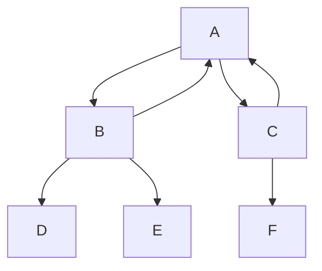

# Algoritmos 

- [1. Introducción a los algoritmos](#1-introducción-a-los-algoritmos)
  - [1.1. ¿Qué es un algoritmo?](#11-qué-es-un-algoritmo)
  - [1.2. Importancia de los algoritmos en estructuras de datos](#12-importancia-de-los-algoritmos-en-estructuras-de-datos)
  - [1.3. Complejidad temporal y notación Big-O](#13-complejidad-temporal-y-notación-big-o)
  - [1.4. Diferencias entre algoritmos iterativos y recursivos](#14-diferencias-entre-algoritmos-iterativos-y-recursivos)
  - [1.5. Conclusión](#15-conclusión)
- [2. Algoritmos de búsqueda](#2-algoritmos-de-búsqueda)
  - [2.1. Búsqueda lineal (`O(n)`)](#21-búsqueda-lineal-on)
  - [2.2. Búsqueda binaria (`O(log n)`)](#22-búsqueda-binaria-olog-n)
  - [2.3. Búsqueda binaria en java con `collections.binarySearch()`](#23-búsqueda-binaria-en-java-con-collectionsbinarysearch)
  - [2.4. Búsqueda en estructuras especializadas](#24-búsqueda-en-estructuras-especializadas)
    - [2.4.1. Búsqueda en tablas hash (`O(1)`)](#241-búsqueda-en-tablas-hash-o1)
    - [2.4.2. Búsqueda en árboles (`O(log n)`)](#242-búsqueda-en-árboles-olog-n)
  - [2.5. Conclusión](#25-conclusión)
- [3. Algoritmos de ordenación](#3-algoritmos-de-ordenación)
  - [3.1. Algoritmos de ordenación básicos (`O(n²)`)](#31-algoritmos-de-ordenación-básicos-on)
    - [3.1.1. Bubble sort](#311-bubble-sort)
    - [3.1.2. Insertion sort](#312-insertion-sort)
  - [3.2. Algoritmos de ordenación eficientes (`O(n log n)`)](#32-algoritmos-de-ordenación-eficientes-on-log-n)
    - [3.2.1. Merge sort](#321-merge-sort)
    - [3.2.2. Quicksort](#322-quicksort)
  - [3.3. Ordenación en java](#33-ordenación-en-java)
    - [3.3.1. Ordenación con `Arrays.sort()`](#331-ordenación-con-arrayssort)
    - [3.3.2. Ordenación con `Collections.sort()`](#332-ordenación-con-collectionssort)
    - [3.3.3. Ordenación con `Stream.sorted()`](#333-ordenación-con-streamsorted)
- [4. Algoritmos de grafos](#4-algoritmos-de-grafos)
  - [4.1. Representación de grafos en java](#41-representación-de-grafos-en-java)
    - [4.1.1. Lista de adyacencia](#411-lista-de-adyacencia)
    - [4.1.2. Matriz de adyacencia](#412-matriz-de-adyacencia)
  - [4.2. Recorridos en grafos](#42-recorridos-en-grafos)
    - [4.2.1. BFS (búsqueda en anchura)](#421-bfs-búsqueda-en-anchura)
    - [4.2.2. DFS (búsqueda en profundidad)](#422-dfs-búsqueda-en-profundidad)
  - [4.3. Algoritmos de caminos más cortos](#43-algoritmos-de-caminos-más-cortos)
    - [4.3.1. Algoritmo de Dijkstra (`O(V log V)`)](#431-algoritmo-de-dijkstra-ov-log-v)
  - [Algoritmo de Floyd-Warshall (`O(V³)`)](#algoritmo-de-floyd-warshall-ov)
- [5. Conclusión y selección de algoritmos](#5-conclusión-y-selección-de-algoritmos)
  - [5.1. Consejos para elegir el mejor algoritmo](#51-consejos-para-elegir-el-mejor-algoritmo)

## 1. Introducción a los algoritmos

### 1.1. ¿Qué es un algoritmo?

Un algoritmo es una secuencia finita de pasos o instrucciones bien definidas que resuelven un problema o realizan una tarea específica. En el contexto de la programación, un algoritmo representa la lógica necesaria para manipular datos y obtener un resultado deseado.  

Los algoritmos pueden expresarse en distintos formatos, como pseudocódigo, diagramas de flujo o directamente en un lenguaje de programación como Java.  

Ejemplo de un algoritmo simple: determinar si un número es par o impar.  

1. Leer un número.  
2. Si el número es divisible por 2, imprimir "Es par".  
3. En caso contrario, imprimir "Es impar".  
4. Fin del algoritmo.  

En Java, este algoritmo se podría expresar así:  

```java
public class ParImpar {
    public static void main(String[] args) {
        int numero = 10;
        if (numero % 2 == 0) {
            System.out.println("Es par");
        } else {
            System.out.println("Es impar");
        }
    }
}
```  

### 1.2. Importancia de los algoritmos en estructuras de datos  

El rendimiento de una aplicación depende en gran medida de la eficiencia de los algoritmos utilizados para manipular sus estructuras de datos. Elegir un algoritmo adecuado puede marcar la diferencia entre una aplicación rápida y una lenta, especialmente cuando se manejan grandes volúmenes de datos.  

Por ejemplo, en una lista de 10 elementos, buscar un dato con un recorrido secuencial puede parecer eficiente. Sin embargo, si la lista tiene un millón de elementos, una búsqueda binaria en una lista ordenada será significativamente más rápida que una búsqueda lineal.  

Los algoritmos de ordenación, búsqueda y recorrido de estructuras como listas, pilas, colas, conjuntos y grafos son fundamentales en la optimización del rendimiento en el desarrollo de software.  

### 1.3. Complejidad temporal y notación Big-O

La complejidad temporal de un algoritmo mide cuántas operaciones se realizan en función del tamaño de la entrada. La notación Big-O se usa para expresar este crecimiento en términos matemáticos.  

Algunas complejidades comunes son:  

- **O(1) - Tiempo constante**: la cantidad de operaciones es siempre la misma, sin importar el tamaño de los datos. Ejemplo: acceso directo a un elemento de un array por índice.  
- **O(log n) - Tiempo logarítmico**: cada operación reduce el problema a la mitad. Ejemplo: búsqueda binaria.  
- **O(n) - Tiempo lineal**: el tiempo de ejecución crece proporcionalmente al tamaño de los datos. Ejemplo: búsqueda secuencial en un array.  
- **O(n log n) - Tiempo casi lineal**: común en algoritmos de ordenación eficientes como Merge Sort y QuickSort.  
- **O(n²) - Tiempo cuadrático**: el tiempo de ejecución crece con el cuadrado del tamaño de los datos. Ejemplo: Bubble Sort.  
- **O(2ⁿ) - Tiempo exponencial**: el tiempo de ejecución se duplica con cada incremento en la entrada. Ejemplo: resolución de problemas de la serie Fibonacci con recursión sin optimización.  

Ejemplo en Java de una búsqueda lineal (`O(n)`) en una lista:  

```java
public class BusquedaLineal {
    public static int buscarElemento(int[] array, int objetivo) {
        for (int i = 0; i < array.length; i++) {
            if (array[i] == objetivo) {
                return i; // Devuelve la posición si encuentra el elemento
            }
        }
        return -1; // Devuelve -1 si no se encuentra
    }

    public static void main(String[] args) {
        int[] numeros = {1, 3, 5, 7, 9};
        int resultado = buscarElemento(numeros, 5);
        System.out.println("Índice del elemento: " + resultado);
    }
}
```  

### 1.4. Diferencias entre algoritmos iterativos y recursivos  

Los algoritmos pueden implementarse de dos formas principales: iterativa y recursiva.  

- **Iteración**: utiliza estructuras repetitivas (`for`, `while`) para repetir pasos hasta alcanzar la solución.  
- **Recursión**: un algoritmo se llama a sí mismo con una versión más pequeña del problema hasta llegar a un caso base.  

Ejemplo de un factorial en versión iterativa:  

```java
public class FactorialIterativo {
    public static int factorial(int n) {
        int resultado = 1;
        for (int i = 1; i <= n; i++) {
            resultado *= i;
        }
        return resultado;
    }

    public static void main(String[] args) {
        System.out.println(factorial(5)); // 120
    }
}
```  

Ejemplo del mismo algoritmo en versión recursiva:  

```java
public class FactorialRecursivo {
    public static int factorial(int n) {
        if (n == 0) return 1; // Caso base
        return n * factorial(n - 1);
    }

    public static void main(String[] args) {
        System.out.println(factorial(5)); // 120
    }
}
```  

La recursión puede ser más elegante y sencilla, pero **consume más memoria** debido a las llamadas anidadas en la pila de ejecución.  

### 1.5. Conclusión  

Los algoritmos son esenciales para la manipulación eficiente de datos en programación. Comprender la notación Big-O permite evaluar la eficiencia de diferentes soluciones. La elección entre enfoques iterativos y recursivos depende del problema, pero siempre debe considerarse el impacto en el rendimiento y el consumo de memoria.  

## 2. Algoritmos de búsqueda

Los algoritmos de búsqueda permiten encontrar un elemento dentro de una colección de datos. La eficiencia de cada algoritmo depende de la estructura en la que se busque y del orden en el que se encuentren los elementos.  

Existen varios tipos de búsqueda, pero los más utilizados en estructuras de datos son:  

- **búsqueda lineal (`O(n)`)**: recorre secuencialmente todos los elementos hasta encontrar el objetivo.  
- **búsqueda binaria (`O(log n)`)**: busca en una colección ordenada dividiendo el rango a la mitad en cada iteración.  
- **búsqueda en estructuras especializadas**: como tablas hash, árboles de búsqueda o grafos.  

### 2.1. Búsqueda lineal (`O(n)`)  

La búsqueda lineal es el método más simple: revisa cada elemento hasta encontrar el deseado o recorrer toda la colección. Se usa cuando los datos no están ordenados o cuando la estructura no permite una búsqueda más eficiente.  

**ejemplo en un array:**  

```java
public class BusquedaLineal {
    public static int buscar(int[] array, int objetivo) {
        for (int i = 0; i < array.length; i++) {
            if (array[i] == objetivo) {
                return i; // Devuelve la posición si encuentra el elemento
            }
        }
        return -1; // Devuelve -1 si no se encuentra
    }

    public static void main(String[] args) {
        int[] numeros = {4, 2, 9, 5, 1};
        System.out.println(buscar(numeros, 9)); // 2
    }
}
```  

✔ **ventaja**: funciona en cualquier estructura, ordenada o no.  
❌ **desventaja**: ineficiente en colecciones grandes, ya que en el peor caso debe recorrer todos los elementos.  

### 2.2. Búsqueda binaria (`O(log n)`)  

La búsqueda binaria es mucho más eficiente, pero requiere que los datos estén **ordenados previamente**. Funciona dividiendo el rango de búsqueda a la mitad en cada iteración.  

Pasos del algoritmo:  

1. Comparar el elemento buscado con el valor central.  
2. Si son iguales, se ha encontrado el elemento.  
3. Si el valor buscado es menor, continuar en la mitad izquierda.  
4. Si es mayor, continuar en la mitad derecha.  
5. Repetir hasta encontrar el elemento o agotar la búsqueda.  

**implementación iterativa:**  

```java
import java.util.Arrays;

public class BusquedaBinaria {
    public static int buscar(int[] array, int objetivo) {
        int izquierda = 0, derecha = array.length - 1;
        
        while (izquierda <= derecha) {
            int medio = izquierda + (derecha - izquierda) / 2;

            if (array[medio] == objetivo) {
                return medio; // Elemento encontrado
            } else if (array[medio] < objetivo) {
                izquierda = medio + 1; // Buscar en la mitad derecha
            } else {
                derecha = medio - 1; // Buscar en la mitad izquierda
            }
        }
        
        return -1; // No encontrado
    }

    public static void main(String[] args) {
        int[] numeros = {1, 2, 4, 5, 9};
        System.out.println(buscar(numeros, 4)); // 2
    }
}
```  

✔ **ventaja**: mucho más eficiente que la búsqueda lineal en datos ordenados (`O(log n)`).  
❌ **desventaja**: requiere que los datos estén ordenados previamente.  

### 2.3. Búsqueda binaria en java con `collections.binarySearch()`  

Java proporciona un método optimizado para búsqueda binaria en listas ordenadas (si la lista no está previamente ordenada, el resultado será indefinido):  

```java
import java.util.*;

public class BusquedaBinariaJava {
    public static void main(String[] args) {
        List<Integer> lista = Arrays.asList(1, 2, 4, 5, 9);
        int indice = Collections.binarySearch(lista, 4);
        System.out.println(indice); // 2
    }
}
```  

Si el elemento **no está en la lista**, el método devuelve `-(punto de inserción) - 1`, indicando en qué posición debería insertarse.  

### 2.4. Búsqueda en estructuras especializadas  

#### 2.4.1. Búsqueda en tablas hash (`O(1)`)  

Las estructuras como `HashMap` y `HashSet` permiten búsquedas rápidas en tiempo constante (`O(1)`) utilizando funciones hash.  

```java
import java.util.*;

public class BusquedaHash {
    public static void main(String[] args) {
        Map<String, Integer> edades = new HashMap<>();
        edades.put("Ana", 25);
        edades.put("Juan", 30);
        edades.put("Pedro", 35);

        System.out.println(edades.get("Juan")); // 30
    }
}
```  

✔ **ventaja**: extremadamente rápido para búsquedas.  
❌ **desventaja**: no garantiza orden de los elementos.  

#### 2.4.2. Búsqueda en árboles (`O(log n)`)  

Estructuras como `TreeSet` y `TreeMap` utilizan árboles balanceados para realizar búsquedas eficientes en `O(log n)`.  

```java
import java.util.*;

public class BusquedaTreeMap {
    public static void main(String[] args) {
        TreeMap<String, Integer> edades = new TreeMap<>();
        edades.put("Ana", 25);
        edades.put("Juan", 30);
        edades.put("Pedro", 35);

        System.out.println(edades.get("Pedro")); // 35
    }
}
```  

✔ **ventaja**: mantiene los elementos ordenados.  
❌ **desventaja**: más lento que `HashMap` en búsquedas (`O(log n)`).  

### 2.5. Conclusión  

Los algoritmos de búsqueda son esenciales para manipular estructuras de datos de manera eficiente.  

- **Para listas desordenadas**, la búsqueda lineal es la única opción.  
- **Si la lista está ordenada**, la búsqueda binaria es mucho más rápida.  
- **En estructuras especializadas**, `HashMap` ofrece búsquedas rápidas, mientras que `TreeMap` permite ordenar los elementos.  

## 3. Algoritmos de ordenación

Los algoritmos de ordenación permiten organizar elementos dentro de una colección de datos en un orden específico (ascendente o descendente). Dependiendo de la cantidad de datos y la estructura utilizada, algunos algoritmos pueden ser más eficientes que otros.  

Los principales tipos de ordenación se dividen en dos grandes categorías:  

- **Algoritmos básicos (`O(n²)`)**: adecuados para pequeñas colecciones de datos. Incluyen Bubble Sort, Insertion Sort y Selection Sort.  
- **Algoritmos eficientes (`O(n log n)`)**: recomendados para grandes volúmenes de datos. Ejemplos incluyen Merge Sort, QuickSort y HeapSort.  
- **Algoritmos de ordenación en Java**: mediante `Arrays.sort()`, `Collections.sort()` y `Stream.sorted()`.  

### 3.1. Algoritmos de ordenación básicos (`O(n²)`)  

Estos algoritmos son fáciles de entender e implementar, pero ineficientes en colecciones grandes.  

#### 3.1.1. Bubble sort  

**Bubble Sort** compara pares de elementos consecutivos y los intercambia si están en el orden incorrecto, repitiendo este proceso hasta que la lista esté ordenada.  

```java
public class BubbleSort {
    public static void ordenar(int[] array) {
        int n = array.length;
        boolean intercambiado;

        do {
            intercambiado = false;
            for (int i = 0; i < n - 1; i++) {
                if (array[i] > array[i + 1]) {
                    int temp = array[i];
                    array[i] = array[i + 1];
                    array[i + 1] = temp;
                    intercambiado = true;
                }
            }
        } while (intercambiado);
    }

    public static void main(String[] args) {
        int[] numeros = {5, 2, 9, 1, 5};
        ordenar(numeros);
        System.out.println(Arrays.toString(numeros)); // [1, 2, 5, 5, 9]
    }
}
```  

✔ **fácil de implementar**  
❌ **ineficiente en listas grandes (`O(n²)`)**  

#### 3.1.2. Insertion sort  

Insertion Sort ordena una lista como si estuviera ordenando un mazo de cartas: toma cada elemento y lo inserta en la posición correcta dentro de la parte ya ordenada.  

```java
public class InsertionSort {
    public static void ordenar(int[] array) {
        for (int i = 1; i < array.length; i++) {
            int clave = array[i];
            int j = i - 1;
            while (j >= 0 && array[j] > clave) {
                array[j + 1] = array[j];
                j--;
            }
            array[j + 1] = clave;
        }
    }

    public static void main(String[] args) {
        int[] numeros = {5, 2, 9, 1, 5};
        ordenar(numeros);
        System.out.println(Arrays.toString(numeros)); // [1, 2, 5, 5, 9]
    }
}
```  

✔ **efectivo en listas pequeñas o casi ordenadas**  
❌ **mala elección en listas grandes (`O(n²)`)**  

### 3.2. Algoritmos de ordenación eficientes (`O(n log n)`)  

Para colecciones grandes, los algoritmos de ordenación eficientes son preferibles.  

#### 3.2.1. Merge sort  

Merge Sort es un algoritmo basado en el paradigma **divide y vencerás**:

1. Divide el array en dos mitades hasta que cada sublista tenga un solo elemento.  
2. Combina las sublistas en orden.  

```java
public class MergeSort {
    public static void mergeSort(int[] array, int izquierda, int derecha) {
        if (izquierda < derecha) {
            int medio = izquierda + (derecha - izquierda) / 2;
            mergeSort(array, izquierda, medio);
            mergeSort(array, medio + 1, derecha);
            merge(array, izquierda, medio, derecha);
        }
    }

    private static void merge(int[] array, int izquierda, int medio, int derecha) {
        int[] aux = Arrays.copyOfRange(array, izquierda, derecha + 1);
        int i = 0, j = medio - izquierda + 1, k = izquierda;

        while (i <= medio - izquierda && j < aux.length) {
            if (aux[i] <= aux[j]) {
                array[k++] = aux[i++];
            } else {
                array[k++] = aux[j++];
            }
        }

        while (i <= medio - izquierda) array[k++] = aux[i++];
        while (j < aux.length) array[k++] = aux[j++];
    }

    public static void main(String[] args) {
        int[] numeros = {5, 2, 9, 1, 5};
        mergeSort(numeros, 0, numeros.length - 1);
        System.out.println(Arrays.toString(numeros)); // [1, 2, 5, 5, 9]
    }
}
```  

✔ **ideal para listas grandes (`O(n log n)`)**  
❌ **requiere memoria adicional para la fusión**  

#### 3.2.2. Quicksort  

QuickSort selecciona un **pivote**, divide los elementos en **menores y mayores**, y repite el proceso en cada partición.  

```java
public class QuickSort {
    public static void quickSort(int[] array, int izquierda, int derecha) {
        if (izquierda < derecha) {
            int pivote = particionar(array, izquierda, derecha);
            quickSort(array, izquierda, pivote - 1);
            quickSort(array, pivote + 1, derecha);
        }
    }

    private static int particionar(int[] array, int izquierda, int derecha) {
        int pivote = array[derecha];
        int i = izquierda - 1;

        for (int j = izquierda; j < derecha; j++) {
            if (array[j] <= pivote) {
                i++;
                int temp = array[i];
                array[i] = array[j];
                array[j] = temp;
            }
        }

        int temp = array[i + 1];
        array[i + 1] = array[derecha];
        array[derecha] = temp;
        return i + 1;
    }

    public static void main(String[] args) {
        int[] numeros = {5, 2, 9, 1, 5};
        quickSort(numeros, 0, numeros.length - 1);
        System.out.println(Arrays.toString(numeros)); // [1, 2, 5, 5, 9]
    }
}
```  

✔ **uno de los algoritmos más rápidos en la práctica (`O(n log n)`)**  
❌ **peor caso `O(n²)` si los datos están desordenados de forma desfavorable**  

### 3.3. Ordenación en java  

Java ofrece métodos optimizados para ordenar listas y arrays:  

- **`Arrays.sort(array)`** → ordena arrays de forma eficiente (QuickSort, Timsort).  
- **`Collections.sort(lista)`** → ordena listas basadas en `Comparable` o `Comparator`.  
- **`Stream.sorted()`** → ordena flujos de datos de manera funcional.  

#### 3.3.1. Ordenación con `Arrays.sort()`  

```java
import java.util.Arrays;

public class OrdenarArray {
    public static void main(String[] args) {
        int[] numeros = {5, 2, 9, 1, 5};
        Arrays.sort(numeros);
        System.out.println(Arrays.toString(numeros)); // [1, 2, 5, 5, 9]
    }
}
```  

#### 3.3.2. Ordenación con `Collections.sort()`  

```java
import java.util.*;

public class OrdenarLista {
    public static void main(String[] args) {
        List<Integer> lista = Arrays.asList(5, 2, 9, 1, 5);
        Collections.sort(lista);
        System.out.println(lista); // [1, 2, 5, 5, 9]
    }
}
```  

#### 3.3.3. Ordenación con `Stream.sorted()`  

```java
import java.util.*;
import java.util.stream.Collectors;

public class OrdenarStream {
    public static void main(String[] args) {
        List<Integer> lista = Arrays.asList(5, 2, 9, 1, 5);
        List<Integer> ordenada = lista.stream().sorted().collect(Collectors.toList());
        System.out.println(ordenada); // [1, 2, 5, 5, 9]
    }
}
```  

## 4. Algoritmos de grafos

Los grafos son estructuras de datos que modelan relaciones entre elementos. Están formados por **nodos (vértices)** y **conexiones (aristas)**. Se utilizan en redes de computadoras, sistemas de navegación, análisis de redes sociales, inteligencia artificial y muchos otros campos.  

Los principales algoritmos de grafos incluyen:  

- **Representación de grafos**: cómo almacenar un grafo en Java.  
- **Recorridos en grafos**:  
  - BFS (Breadth-First Search) – búsqueda en anchura.  
  - DFS (Depth-First Search) – búsqueda en profundidad.  
- **Algoritmos de caminos más cortos**:  
  - Dijkstra – camino más corto desde un nodo origen.  
  - Floyd-Warshall – caminos más cortos entre todos los nodos.  

### 4.1. Representación de grafos en java  

Existen dos formas principales de representar un grafo:  

#### 4.1.1. Lista de adyacencia  

Usa un `Map<Vértice, List<Vértices adyacentes>>` para almacenar los nodos y sus conexiones. Es eficiente en memoria y adecuado para grafos dispersos.  

```java
import java.util.*;

public class GrafoListaAdyacencia {
    private Map<String, List<String>> adyacencias;

    public GrafoListaAdyacencia() {
        this.adyacencias = new HashMap<>();
    }

    public void agregarVertice(String vertice) {
        adyacencias.putIfAbsent(vertice, new ArrayList<>());
    }

    public void agregarArista(String origen, String destino) {
        adyacencias.get(origen).add(destino);
        adyacencias.get(destino).add(origen); // Si el grafo es no dirigido
    }

    public List<String> obtenerAdyacentes(String vertice) {
        return adyacencias.getOrDefault(vertice, new ArrayList<>());
    }

    public static void main(String[] args) {
        GrafoListaAdyacencia grafo = new GrafoListaAdyacencia();
        grafo.agregarVertice("A");
        grafo.agregarVertice("B");
        grafo.agregarArista("A", "B");

        System.out.println("Nodos adyacentes a A: " + grafo.obtenerAdyacentes("A"));
    }
}
```  

✔ **ventaja**: eficiente en memoria para grafos dispersos.  
❌ **desventaja**: acceso más lento (`O(V)`) para verificar si hay una arista.  

#### 4.1.2. Matriz de adyacencia  

Usa una matriz `n x n`, donde `n` es el número de nodos. Es eficiente para grafos densos.  

```java
public class GrafoMatrizAdyacencia {
    private int[][] matriz;
    private int numVertices;

    public GrafoMatrizAdyacencia(int numVertices) {
        this.numVertices = numVertices;
        matriz = new int[numVertices][numVertices];
    }

    public void agregarArista(int origen, int destino) {
        matriz[origen][destino] = 1;
        matriz[destino][origen] = 1; // Si el grafo es no dirigido
    }

    public boolean hayArista(int origen, int destino) {
        return matriz[origen][destino] == 1;
    }

    public static void main(String[] args) {
        GrafoMatrizAdyacencia grafo = new GrafoMatrizAdyacencia(3);
        grafo.agregarArista(0, 1);
        System.out.println("Existe arista entre 0 y 1: " + grafo.hayArista(0, 1));
    }
}
```  

✔ **ventaja**: acceso rápido a una arista (`O(1)`).  
❌ **desventaja**: ocupa más memoria en grafos dispersos (`O(V²)`).  

### 4.2. Recorridos en grafos  

Los recorridos permiten explorar un grafo a partir de un nodo inicial.  

#### 4.2.1. BFS (búsqueda en anchura)  

El **BFS** recorre el grafo nivel por nivel, explorando todos los vecinos de un nodo antes de avanzar a los siguientes. Utiliza una **cola** (`Queue`) para gestionar los nodos pendientes.  

```java
import java.util.*;

public class BFS {
    public static void bfs(Map<String, List<String>> grafo, String inicio) {
        Queue<String> cola = new LinkedList<>();
        Set<String> visitados = new HashSet<>();

        cola.add(inicio);
        visitados.add(inicio);

        while (!cola.isEmpty()) {
            String nodo = cola.poll();
            System.out.print(nodo + " ");

            for (String vecino : grafo.getOrDefault(nodo, new ArrayList<>())) {
                if (!visitados.contains(vecino)) {
                    cola.add(vecino);
                    visitados.add(vecino);
                }
            }
        }
    }

    public static void main(String[] args) {
        Map<String, List<String>> grafo = new HashMap<>();
        grafo.put("A", Arrays.asList("B", "C"));
        grafo.put("B", Arrays.asList("A", "D", "E"));
        grafo.put("C", Arrays.asList("A", "F"));

        bfs(grafo, "A"); // A B C D E F
    }
}
```  

El grafo del ejemplo anterior se vería así:  



✔ **útil para encontrar caminos más cortos en grafos no ponderados**.  

#### 4.2.2. DFS (búsqueda en profundidad)  

El **DFS** explora un camino lo más profundo posible antes de retroceder. Usa una **pila** (`Stack`) o recursión.  

```java
import java.util.*;

public class DFS {
    public static void dfs(Map<String, List<String>> grafo, String nodo, Set<String> visitados) {
        visitados.add(nodo);
        System.out.print(nodo + " ");

        for (String vecino : grafo.getOrDefault(nodo, new ArrayList<>())) {
            if (!visitados.contains(vecino)) {
                dfs(grafo, vecino, visitados);
            }
        }
    }

    public static void main(String[] args) {
        Map<String, List<String>> grafo = new HashMap<>();
        grafo.put("A", Arrays.asList("B", "C"));
        grafo.put("B", Arrays.asList("A", "D", "E"));
        grafo.put("C", Arrays.asList("A", "F"));

        dfs(grafo, "A", new HashSet<>()); // A B D E C F
    }
}
```  

✔ **útil para encontrar componentes conexas y detección de ciclos**.  

### 4.3. Algoritmos de caminos más cortos  

#### 4.3.1. Algoritmo de Dijkstra (`O(V log V)`)  

El algoritmo de **Dijkstra** encuentra el camino más corto desde un nodo origen a todos los demás en un grafo ponderado con pesos positivos. Usa una **cola de prioridad (`PriorityQueue`)**.  

```java
import java.util.*;

public class Dijkstra {
    public static Map<String, Integer> dijkstra(Map<String, Map<String, Integer>> grafo, String inicio) {
        PriorityQueue<Map.Entry<String, Integer>> cola = new PriorityQueue<>(Map.Entry.comparingByValue());
        Map<String, Integer> distancias = new HashMap<>();
        Set<String> visitados = new HashSet<>();

        grafo.keySet().forEach(nodo -> distancias.put(nodo, Integer.MAX_VALUE));
        distancias.put(inicio, 0);
        cola.add(new AbstractMap.SimpleEntry<>(inicio, 0));

        while (!cola.isEmpty()) {
            String nodoActual = cola.poll().getKey();
            if (visitados.contains(nodoActual)) continue;
            visitados.add(nodoActual);

            for (Map.Entry<String, Integer> vecino : grafo.getOrDefault(nodoActual, new HashMap<>()).entrySet()) {
                int nuevaDistancia = distancias.get(nodoActual) + vecino.getValue();
                if (nuevaDistancia < distancias.get(vecino.getKey())) {
                    distancias.put(vecino.getKey(), nuevaDistancia);
                    cola.add(new AbstractMap.SimpleEntry<>(vecino.getKey(), nuevaDistancia));
                }
            }
        }

        return distancias;
    }

    public static void main(String[] args) {
        Map<String, Map<String, Integer>> grafo = new HashMap<>();
        grafo.put("A", Map.of("B", 4, "C", 2));
        grafo.put("B", Map.of("D", 5));
        grafo.put("C", Map.of("D", 8));

        System.out.println(dijkstra(grafo, "A")); // {A=0, B=4, C=2, D=9}
    }
}
```  

✔ **eficiente en grafos grandes con pesos positivos**.  

### Algoritmo de Floyd-Warshall (`O(V³)`)

El algoritmo de **Floyd-Warshall** encuentra todos los caminos más cortos entre todos los pares de nodos en un grafo ponderado. Es eficiente para grafos pequeños (`O(V³)`).  

```java
import java.util.*;

public class FloydWarshall {
    public static int[][] floydWarshall(int[][] grafo) {
        int n = grafo.length;
        int[][] distancias = Arrays.stream(grafo).map(int[]::clone).toArray(int[][]::new);

        for (int k = 0; k < n; k++) {
            for (int i = 0; i < n; i++) {
                for (int j = 0; j < n; j++) {
                    if (distancias[i][k] != Integer.MAX_VALUE && distancias[k][j] != Integer.MAX_VALUE) {
                        distancias[i][j] = Math.min(distancias[i][j], distancias[i][k] + distancias[k][j]);
                    }
                }
            }
        }

        return distancias;
    }

    public static void main(String[] args) {
        int[][] grafo = {
            {0, 4, Integer.MAX_VALUE, 2},
            {Integer.MAX_VALUE, 0, 5, Integer.MAX_VALUE},
            {Integer.MAX_VALUE, Integer.MAX_VALUE, 0, 8},
            {Integer.MAX_VALUE, Integer.MAX_VALUE, Integer.MAX_VALUE, 0}
        };

        int[][] distancias = floydWarshall(grafo);
        for (int[] fila : distancias) {
            System.out.println(Arrays.toString(fila));
        }
    }
}
```

## 5. Conclusión y selección de algoritmos  

Los algoritmos de búsqueda, ordenación y grafos son esenciales para optimizar el rendimiento en estructuras de datos. Su correcta elección depende del tipo de problema y la cantidad de datos a manejar.  

| **Categoría**            | **Algoritmo**    | **Complejidad** |
|--------------------------|-----------------|-----------------|
| **búsqueda**            | lineal (`O(n)`) | colecciones pequeñas y no ordenadas |
|                          | binaria (`O(log n)`) | listas ordenadas |
|                          | en tablas hash (`O(1)`) | búsqueda rápida en `HashMap` |
|                          | en árboles (`O(log n)`) | estructuras ordenadas (`TreeMap`) |
| **ordenación**          | bubble sort (`O(n²)`) | enseñanza y casos muy pequeños |
|                          | quicksort (`O(n log n)`) | listas grandes y desordenadas |
|                          | merge sort (`O(n log n)`) | grandes volúmenes de datos |
|                          | `Arrays.sort()` | arrays en Java |
|                          | `Collections.sort()` | listas en Java |
| **grafos**              | bfs (`O(V + E)`) | búsqueda de caminos más cortos en grafos no ponderados |
|                          | dfs (`O(V + E)`) | detección de ciclos, recorrido de componentes conexas |
|                          | dijkstra (`O(V log V)`) | caminos más cortos en grafos con pesos positivos |
|                          | floyd-warshall (`O(V³)`) | todas las rutas más cortas en grafos pequeños |

### 5.1. Consejos para elegir el mejor algoritmo  

1. **Si los datos son pocos**, un algoritmo simple puede ser suficiente.  
2. **Si los datos están ordenados**, usa búsqueda binaria o `TreeSet`.  
3. **Si necesitas búsqueda rápida**, un `HashMap` es la mejor opción.  
4. **Para ordenación eficiente**, `Arrays.sort()` y `Collections.sort()` están optimizados.  
5. **En grafos pequeños**, BFS y DFS son rápidos y fáciles de implementar.  
6. **En grafos con pesos**, Dijkstra es ideal para caminos más cortos.  
