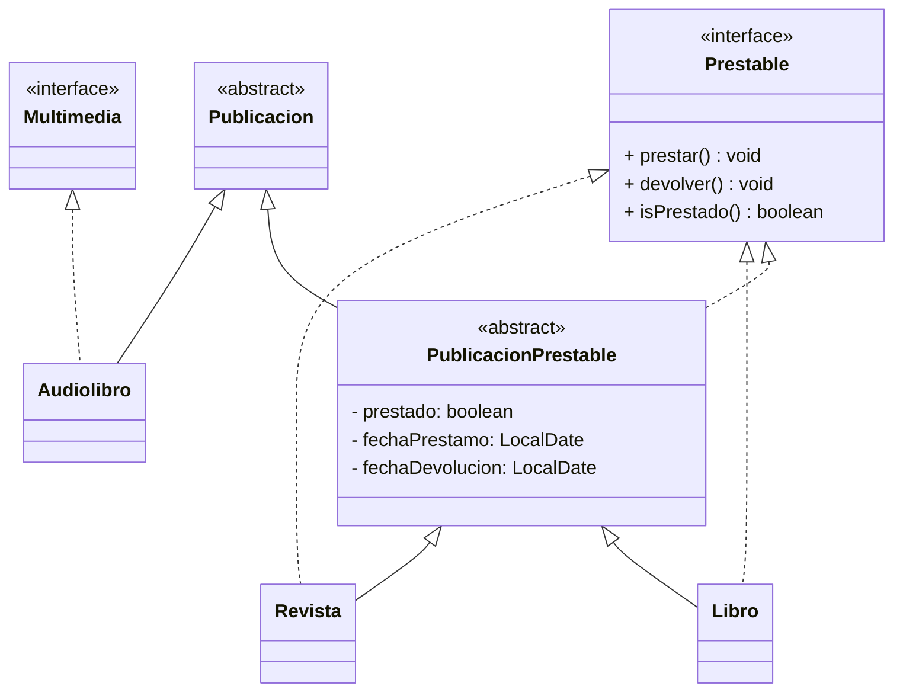

# Actividad 7.1: Proyecto Gestor de Bibliotecas. Aplicación de Estructuras de Datos y Colecciones en Java

## Introducción

En esta práctica, mejorarás la gestión de la biblioteca aplicando estructuras de datos y colecciones en Java. Hasta ahora, las publicaciones se almacenaban en arrays estáticos. Ahora reemplazarás estos arrays por colecciones dinámicas, permitiendo una gestión más eficiente y flexible.

Implementarás nuevas funcionalidades como la ordenación de publicaciones, la gestión de préstamos mediante colas y la organización de publicaciones en mapas. También crearemos una clase `Usuario` que modele a los usuarios de la biblioteca y permita gestionar y registrar los préstamos y devoluciones de publicaciones.

Para ello, se propone una refactorización en cuanto a las clases e interfaces creadas en la práctica anterior, y la implementación de nuevas clases y estructuras de datos.

## Refactorización de clases

En la práctica anterior, se implementaron las clases `Publicacion`, `Libro`, `Revista`, `Audiolibro`. A continuación se propone el diagrama de clases (simplificado) que se espera implementar en esta práctica:



Como vemos en el diagrama anterior, **creamos una nueva clase abstracta** `PublicacionPrestable` intermedia, de la que hereden clases como `Revista` o `Libro`, de manera que se centraliza la gestión de los préstamos en esta clase intermedia. En ella definiremos los atributos y métodos que heredarán todas las clases prestables.

Las clases `Libro` y `Revista` implementarán la interfaz `Prestable`. Esto es redundante, pero sirve para reflejar explícitamente que estas clases son prestables.

## Implementación de la clase `PublicacionPrestable`

- **Crea una clase** `PublicacionPrestable` que herede de `Publicacion` e implemente la interfaz `Prestable`.
  - **Añade los atributos** `prestado` (boolean), `fechaPrestamo` y `fechaDevolucion` (LocalDate).
  - **Implementa** un método `isPrestado()` que devuelva `true` si la publicación está prestada.
  - **No implementes** los métodos `prestar()` y `devolver()` en esta clase, ya que no se pueden prestar publicaciones genéricas. Estos métodos se implementarán en las clases hijas.

## Modificaciones en la clase `Libro` y `Revista`

- **Modifica** las clases `Libro` y `Revista` para que hereden de `PublicacionPrestable` y **implementen** la interfaz `Prestable`.
- **Implementa** los métodos `prestar()` y `devolver()` en las clases `Libro` y `Revista`.
  - En el método `prestar()`, asigna `true` a `prestado` y calcula la fecha de préstamo (la actual) y devolución.
    - Ten en cuenta que los libros se prestan por un periodo de 21 dias, y las revistas por 7 días.
  - En el método `devolver()`, asigna `false` a `prestado` y pon a `null` las fechas de préstamo y devolución. 
    - Si la fecha de devolución es anterior a la fecha actual, muestra un mensaje de advertencia al usuario (no hace falta implementar un sistema de multas o similar).
  - **No permitas** que se presten publicaciones que ya estén prestadas.

## Modificaciones en la clase `Publicación`

- Implementa la **interfaz** `Comparable<Publicacion>` en la clase `Publicacion` para ordenar por título (orden natural).
  - Implementa el **método** `compareTo` para comparar dos publicaciones por título.
- Implementa una **clase** `ComparadorPorAutor` para ordenar por autor.

   ```java
   public static class ComparadorPorAutor implements Comparator<Publicacion> {
      // Implementa el método compare
   }
   ```

   Puedes crearla como **clase estática** interna dentro de la clase `Publicacion`.

- Añade un **identificador único** a la clase `Publicacion` que permita identificar de manera únivoca a cada objeto de la clase. Para ello, crea un atributo `int uuid` que se incremente automáticamente cada vez que se crea una nueva publicación.

   ```java
   private static int contador = 1;
   private int uuid;
   ```

  - **Modifica el constructor** o constructores para asignar un valor único a `id` cada vez que se crea una nueva publicación.
  
      ```java
      public Publicacion(String titulo, String autor, String isbn) {
         ...
         this.uuid = contador++;
      }
      ```

## Implementación de la clase `Usuario`

- Define una clase `Usuario` que represente a los **usuarios de la biblioteca**, y que pueden pedir préstamos o devolver libros que tienen prestados. Deben contanr con un identificador único, nombre (obligatorio), email, direccion y telefono (opcionales), y una colección de publicaciones prestadas. **Justifica el tipo de colección utilizada y qué objetos puede almacenar dicha colección**.
  - El usuario puede tener en préstamo como máximo 5 publicaciones prestables. No debe poder almacenar publicaciones que no se puedan prestar (por ejemplo, audiolibros).

## Modificaciones en la Clase `Biblioteca`

1. **Sustituir arrays por colecciones**
   - Reemplaza el array de `Publicacion` por una estructura dinámica adecuada (`List<Publicacion>`, `Set<Publicacion>`, según corresponda).
   - Justifica en la memoria la elección de la estructura utilizada.
2. **Ordenación de publicaciones**
   - Implementa métodos en `Biblioteca` para obtener publicaciones ordenadas según título o autor, haciendo uso de las funcionalidades implementadas en `Publicacion`.
3. **Colección de usuarios**
   - Implementa una colección de usuarios en la clase `Biblioteca`.
   - Justifica la elección de la estructura utilizada.
4. **Gestión de préstamos con una cola (`Queue`)**
   - Implementa un `Map<Integer, List<Publicacion>>` para registrar los préstamos activos de cada usuario. Utiliza el identificador único de cada usuario como clave.
   - Implementa una `Queue<Prestable>` para gestionar las solicitudes de préstamo que no se puedan cursar al estar la Publicación solicitada ya prestada.
   - Cuando se devuelva una publicación prestada, se comprobará la cola de préstamos pendientes y, en caso de encontrarse en petición de préstamo, se asignará al primer usuario que la haya solicitado.
  
## Modificación del Menú Principal

Amplía el menú para reflejar las nuevas funcionalidades:

**Nuevas Opciones:**

1. Agregar una publicación
2. Listar publicaciones ordenadas por título
3. Listar publicaciones ordenadas por autor
4. Registrar préstamo de una publicación para un usuario
   - En esta opción, si la publicación se encuentra prestada se deberá añadir la petición a la cola de préstamos.
5. Registrar devolución de una publicación para un usuario
   - En esta opción, debe procesar el siguiente préstamo en la cola si hay préstamos pendientes para la publicación devuelta
6. Mostrar préstamos activos por usuario
7. Salir

## Calificación

- **Uso adecuado de estructuras de datos (3 puntos)**
  - Elección correcta de colecciones para cada caso.
  - Justificación en la memoria.
- **Ordenación y búsqueda (2 puntos)**
  - Implementación de `Comparable` y `Comparator`.
  - Uso correcto de `Map` para almacenamiento eficiente.
- **Gestión de préstamos (3 puntos)**
  - Implementación de la cola para préstamos.
  - Correcta asociación entre `Usuario` y `Publicacion`.
- **Menú funcional (1 punto)**
  - Implementación completa y sin errores.
- **Memoria y justificación de decisiones (1 punto)**
  - Explicación de decisiones de diseño y dificultades encontradas.
