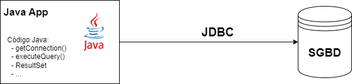
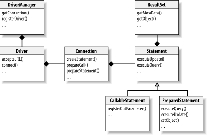
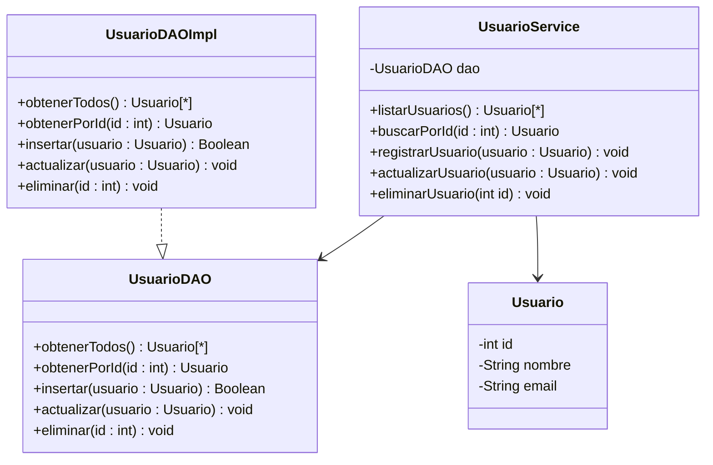

# Introducción al acceso a bases de datos desde Java

- [1. Introducción](#1-introducción)
  - [1.1. ¿Qué es una base de datos?](#11-qué-es-una-base-de-datos)
  - [1.2. Tipos de bases de datos](#12-tipos-de-bases-de-datos)
  - [1.3. ¿Qué es un SGBD?](#13-qué-es-un-sgbd)
  - [1.4. ¿Qué es SQL?](#14-qué-es-sql)
  - [1.5. ¿Por qué necesitamos conectar Java con bases de datos?](#15-por-qué-necesitamos-conectar-java-con-bases-de-datos)
  - [1.6. Conclusión](#16-conclusión)
- [2. Bases de datos relacionales](#2-bases-de-datos-relacionales)
  - [2.1. ¿Qué es una base de datos relacional?](#21-qué-es-una-base-de-datos-relacional)
    - [2.1.1. Ejemplo de modelo relacional](#211-ejemplo-de-modelo-relacional)
  - [2.2. Ventajas del modelo relacional](#22-ventajas-del-modelo-relacional)
  - [2.3. Principales SGBD relacionales](#23-principales-sgbd-relacionales)
- [3. Introducción a JDBC](#3-introducción-a-jdbc)
  - [3.1. ¿Qué es JDBC?](#31-qué-es-jdbc)
  - [3.2. ¿Cómo funciona JDBC?](#32-cómo-funciona-jdbc)
  - [3.3. Clases principales de JDBC](#33-clases-principales-de-jdbc)
  - [3.4. Ejemplo básico del flujo JDBC](#34-ejemplo-básico-del-flujo-jdbc)
  - [3.5. Conclusión](#35-conclusión)
- [4. Establecimiento de conexión a una base de datos desde Java](#4-establecimiento-de-conexión-a-una-base-de-datos-desde-java)
  - [4.1. Requisitos previos](#41-requisitos-previos)
  - [4.2. ¿Que es un conector JDBC?](#42-que-es-un-conector-jdbc)
  - [4.3. Instalación del conector JDBC](#43-instalación-del-conector-jdbc)
    - [4.3.1. Opción 1: Uso de Maven (recomendado si se usa Maven)](#431-opción-1-uso-de-maven-recomendado-si-se-usa-maven)
    - [4.3.2. Opción 2: Manual (sin Maven)](#432-opción-2-manual-sin-maven)
  - [4.4. Registro del controlador JDBC](#44-registro-del-controlador-jdbc)
  - [4.5. Establecimiento de conexión](#45-establecimiento-de-conexión)
    - [4.5.1. Componentes de la URL de conexión](#451-componentes-de-la-url-de-conexión)
  - [4.6. Buenas prácticas](#46-buenas-prácticas)
- [5. Clases y métodos principales de JDBC](#5-clases-y-métodos-principales-de-jdbc)
  - [5.1. `DriverManager`](#51-drivermanager)
  - [5.2. `Driver`](#52-driver)
  - [5.3. `Connection`](#53-connection)
  - [5.4. `Statement`](#54-statement)
  - [5.5. `PreparedStatement`](#55-preparedstatement)
  - [5.6. `ResultSet`](#56-resultset)
- [6. Ejecución de sentencias SQL](#6-ejecución-de-sentencias-sql)
  - [6.1. Consultas con `Statement`](#61-consultas-con-statement)
  - [6.2. Consultas con parámetros: `PreparedStatement`](#62-consultas-con-parámetros-preparedstatement)
    - [6.2.1. ¿Que es la inyección SQL?](#621-que-es-la-inyección-sql)
    - [6.2.2. Consultas con `PreparedStatement`](#622-consultas-con-preparedstatement)
  - [6.3. Inserción, modificación y eliminación de datos](#63-inserción-modificación-y-eliminación-de-datos)
    - [6.3.1. Recuperación de claves generadas (`getGeneratedKeys()`)](#631-recuperación-de-claves-generadas-getgeneratedkeys)
  - [6.4. Cierre de la conexión](#64-cierre-de-la-conexión)
  - [6.5. Excepciones JDBC](#65-excepciones-jdbc)
- [7. Gestión de transacciones](#7-gestión-de-transacciones)
- [8. Operaciones DDL desde Java](#8-operaciones-ddl-desde-java)
  - [8.1. Crear una tabla desde Java](#81-crear-una-tabla-desde-java)
  - [8.2. Eliminar una tabla desde Java](#82-eliminar-una-tabla-desde-java)
  - [8.3. Consideraciones importantes](#83-consideraciones-importantes)
  - [8.4. Buenas prácticas](#84-buenas-prácticas)
- [9. El desfase objeto-relacional](#9-el-desfase-objeto-relacional)
  - [9.1. El "desfase objeto-relacional" (Object-Relational Impedance Mismatch) ¿En qué consiste exactamente este desfase?](#91-el-desfase-objeto-relacional-object-relational-impedance-mismatch-en-qué-consiste-exactamente-este-desfase)
  - [9.2. Ejemplo simple](#92-ejemplo-simple)
  - [9.3. Estrategias para mapear herencia](#93-estrategias-para-mapear-herencia)
  - [9.4. Soluciones al desfase objeto-relacional](#94-soluciones-al-desfase-objeto-relacional)
    - [9.4.1. Mapeo Objeto-Relacional (ORM)](#941-mapeo-objeto-relacional-orm)
    - [9.4.2. Bases de datos orientadas a objetos (OODBMS)](#942-bases-de-datos-orientadas-a-objetos-oodbms)
  - [9.5. Conclusión](#95-conclusión)
- [10. Buenas prácticas en el acceso a bases de datos](#10-buenas-prácticas-en-el-acceso-a-bases-de-datos)
  - [10.1. Uso del patrón DAO (Data Access Object)](#101-uso-del-patrón-dao-data-access-object)
    - [10.1.1. Ejemplo simple de DAO](#1011-ejemplo-simple-de-dao)
  - [10.2. No mezclar lógica de negocio y lógica de acceso](#102-no-mezclar-lógica-de-negocio-y-lógica-de-acceso)
  - [10.3. Evitar consultas dentro de bucles](#103-evitar-consultas-dentro-de-bucles)
  - [10.4. Uso de logs y control de errores](#104-uso-de-logs-y-control-de-errores)
    - [10.4.1. Ejemplo simple de control de errores](#1041-ejemplo-simple-de-control-de-errores)
  - [10.5. Resumen de buenas prácticas](#105-resumen-de-buenas-prácticas)
- [11. Conclusión](#11-conclusión)
- [12. Referencias](#12-referencias)

## 1. Introducción

### 1.1. ¿Qué es una base de datos?

Una **base de datos** es un conjunto organizado de datos que pueden ser fácilmente almacenados, gestionados y recuperados. Imagina una base de datos como una gran biblioteca donde cada libro representa un conjunto de información (por ejemplo, clientes, productos, pedidos...).

Los datos en una base de datos no están guardados de forma caótica: están estructurados y organizados para que puedan ser consultados de forma rápida y eficiente mediante un lenguaje específico.

### 1.2. Tipos de bases de datos

Existen varios tipos de bases de datos, pero los más comunes son:

- **Bases de datos relacionales (RDBMS)**: utilizan tablas (como hojas de cálculo) para almacenar los datos, y se relacionan entre sí mediante claves. Son las más utilizadas y las que estudiaremos en este tema. Ejemplos: MySQL, PostgreSQL, Oracle, SQL Server.

- **Bases de datos no relacionales (NoSQL)**: no siguen el modelo de tablas. Suelen usarse para grandes volúmenes de datos sin una estructura fija (por ejemplo, redes sociales, sistemas de recomendación, etc.). Ejemplos: MongoDB, Redis.

- **Bases de datos orientadas a objetos**: almacenan directamente objetos del lenguaje de programación, en vez de registros en tablas. Son menos comunes, pero útiles en algunos contextos muy concretos.

> Nosotros nos centraremos en **bases de datos relacionales**, ya que son las más utilizadas en entornos empresariales y en aplicaciones Java tradicionales.

### 1.3. ¿Qué es un SGBD?

Un **Sistema de Gestión de Bases de Datos** (SGBD) es un software que nos permite crear, modificar y consultar una base de datos. Se encarga de gestionar:

- El almacenamiento de los datos.
- El acceso seguro y concurrente.
- La recuperación en caso de error.
- La ejecución de consultas SQL.

Ejemplos de SGBD:

| SGBD       | Descripción breve                       |
|------------|------------------------------------------|
| MySQL      | Muy popular, de código abierto. Rápido y fiable. |
| PostgreSQL | Potente, orientado a estándares, muy usado en entornos profesionales. |
| MariaDB    | Fork de MySQL, también de código abierto. Compatible. |

Todos estos SGBD **hablan el mismo idioma**: **SQL**.

### 1.4. ¿Qué es SQL?

**SQL (Structured Query Language)** es el lenguaje estándar para consultar y manipular bases de datos relacionales. Nos permite:

- **Crear** bases de datos y tablas.
- **Insertar** datos.
- **Consultar** datos mediante `SELECT`.
- **Actualizar** registros.
- **Eliminar** información.
- **Definir relaciones** entre tablas, restricciones, índices, etc.

SQL incluye los denominados DDL (Data Definition Language) para definir la estructura de la base de datos, y DML (Data Manipulation Language) para manipular los datos.

Ejemplo básico de SQL:

```sql
-- Crear tabla de productos
CREATE TABLE productos (
    id INT PRIMARY KEY,
    nombre VARCHAR(100),
    precio DECIMAL(10, 2)
);

-- Insertar un producto
INSERT INTO productos VALUES (1, 'Ratón inalámbrico', 19.95);

-- Consultar productos
SELECT * FROM productos;
```

En [este anexo](ud9_anexo_resumen_sql.md) puedes ver un resumen de las instrucciones SQL más comunes.

### 1.5. ¿Por qué necesitamos conectar Java con bases de datos?

Una aplicación real no guarda sus datos en memoria: necesita **persistirlos**, es decir, almacenarlos de forma que no se pierdan cuando cerramos el programa.

Gracias a la conexión con bases de datos, nuestras aplicaciones Java podrán:

- Guardar información sobre las entidades o clases de nuestro contexto.
- Consultar información según filtros o condiciones.
- Permitir a múltiples usuarios acceder a la información simultáneamente.
- Gestionar grandes volúmenes de datos de forma eficiente.

> A lo largo de este tema, aprenderás a conectar tu código Java con una base de datos real utilizando JDBC, ejecutar consultas SQL, y tratar la información obtenida desde Java.

<div style="text-align: center;">
  
  <p>Conexión entre Java y un SGBD relacional</p>
</div>

### 1.6. Conclusión

Comprender cómo interactuar con bases de datos es esencial para el desarrollo de aplicaciones completas y funcionales. Este tema te dotará de los conocimientos básicos para establecer conexiones con bases de datos relacionales desde Java, ejecutar consultas SQL y manejar los datos de forma segura y eficiente.

## 2. Bases de datos relacionales

### 2.1. ¿Qué es una base de datos relacional?

Una **base de datos relacional** es un sistema de almacenamiento de datos basado en el **modelo relacional**, propuesto por E. F. Codd en 1970. En este modelo:

- Los datos se organizan en **tablas** (también llamadas relaciones).
- Cada tabla contiene **filas** (registros) y **columnas** (campos).
- Se pueden establecer **relaciones** entre distintas tablas mediante **claves primarias y foráneas**.

Este enfoque permite representar datos complejos de forma estructurada, mantener la integridad de la información y consultar datos de manera flexible usando SQL.

#### 2.1.1. Ejemplo de modelo relacional

Supongamos una base de datos para una librería con dos tablas:

**Tabla `clientes`**

| id_cliente | nombre     | email              |
|------------|------------|--------------------|
| 1          | Ana López  | ana@email.com      |
| 2          | Juan Pérez | juan@email.com     |

**Tabla `pedidos`**

| id_pedido | id_cliente | fecha      | total |
|-----------|------------|------------|-------|
| 101       | 1          | 2024-10-01 | 45.50 |
| 102       | 2          | 2024-10-02 | 12.95 |

- La columna `id_cliente` en `pedidos` **se relaciona** con `id_cliente` en `clientes`.
- De esta forma, podemos saber quién hizo cada pedido sin duplicar datos del cliente.

### 2.2. Ventajas del modelo relacional

- ✔️ **Estructura clara y normalizable.**  
- ✔️ **Independencia entre datos y aplicaciones.**
- ✔️ **Integridad referencial.**
- ✔️ **Flexibilidad en las consultas** mediante SQL.
- ✔️ **Transacciones seguras** y control de concurrencia.

### 2.3. Principales SGBD relacionales

| SGBD       | Características |
|------------|-----------------|
| **MySQL**      | Muy usado en entornos web, rápido y eficiente. |
| **MariaDB**    | Versión libre y 100% compatible con MySQL. |
| **PostgreSQL** | Potente, con soporte completo a estándares SQL, extensible y orientado a integridad y consistencia. |

Todos estos sistemas permiten interactuar desde Java usando **JDBC**, que veremos a continuación.

## 3. Introducción a JDBC

### 3.1. ¿Qué es JDBC?

**JDBC (Java Database Connectivity)** es una **API** (Interfaz de Programación de Aplicaciones) incluida en Java que permite a las aplicaciones Java conectarse y trabajar con bases de datos relacionales utilizando SQL.

JDBC actúa como un **puente** entre el lenguaje Java y el sistema gestor de base de datos (SGBD). Proporciona clases e interfaces que nos permiten:

- **Establecer una conexión** con la base de datos.
- **Ejecutar sentencias SQL** (consultas, inserciones, actualizaciones, borrados).
- **Procesar los resultados** obtenidos.
- **Cerrar la conexión** correctamente.

> JDBC es parte del paquete estándar de Java desde JDK 1.1 (`java.sql`), por lo que no es necesario instalar nada adicional para empezar (aunque sí necesitaremos el "driver" específico de cada SGBD).

### 3.2. ¿Cómo funciona JDBC?

El funcionamiento de JDBC puede entenderse como un **flujo de pasos secuenciales**:

1. **Carga del driver JDBC**  
   Se carga en memoria el driver específico que permite a Java comunicarse con el SGBD.

2. **Establecimiento de conexión**  
   Se conecta al servidor de base de datos mediante una URL que identifica su ubicación, el usuario y la contraseña.

3. **Creación de sentencias SQL**  
   Se prepara y ejecuta una instrucción SQL (por ejemplo: `SELECT`, `INSERT`, `UPDATE`, `DELETE`).

4. **Procesamiento de resultados**  
   Si la consulta genera resultados (por ejemplo, un `SELECT`), se recorren utilizando la clase `ResultSet`.

5. **Cierre de recursos**  
   Es fundamental cerrar `ResultSet`, `Statement` y `Connection` al finalizar, para evitar fugas de memoria.

### 3.3. Clases principales de JDBC

| Clase / Interfaz      | Descripción |
|------------------------|-------------|
| `DriverManager`        | Clase que gestiona los drivers y permite obtener una conexión (`Connection`). |
| `Connection`           | Representa una conexión activa con la base de datos. |
| `Statement`            | Permite ejecutar sentencias SQL simples (sin parámetros). |
| `PreparedStatement`    | Sentencia SQL parametrizada, evita errores y ataques de inyección SQL. |
| `ResultSet`            | Representa los resultados de una consulta (`SELECT`). |

### 3.4. Ejemplo básico del flujo JDBC

```java
import java.sql.*;

public class EjemploConexion {
    public static void main(String[] args) {
        String url = "jdbc:mysql://localhost:3306/tienda";
        String usuario = "root";
        String contraseña = "1234";

        try (Connection conexion = DriverManager.getConnection(url, usuario, contraseña);
             Statement stmt = conexion.createStatement();
             ResultSet rs = stmt.executeQuery("SELECT * FROM productos")) {

            while (rs.next()) {
                System.out.println("Producto: " + rs.getString("nombre") + ", Precio: " + rs.getDouble("precio"));
            }

        } catch (SQLException e) {
            e.printStackTrace();
        }
    }
}
```

Este ejemplo establece una conexión con una base de datos `tienda`, ejecuta una consulta y muestra el nombre y precio de los productos.

### 3.5. Conclusión

JDBC es el mecanismo estándar que permite a Java trabajar con bases de datos. Es **flexible, extensible y multiplataforma**, y sirve de base para bibliotecas más complejas como Hibernate o JPA. En el siguiente apartado veremos comos instalar y configurar un driver JDBC para conectarnos a una base de datos específica.

## 4. Establecimiento de conexión a una base de datos desde Java

Para poder trabajar con bases de datos desde una aplicación Java, necesitamos establecer una conexión utilizando JDBC (**Java Database Connectivity**). Este apartado muestra paso a paso cómo conectar una aplicación con una base de datos como MySQL o MariaDB.

### 4.1. Requisitos previos

- Tener instalado un **SGBD** como MySQL, MariaDB o PostgreSQL.
- Crear una base de datos y al menos una tabla.
- Tener acceso a un **conector JDBC** (driver) compatible con el SGBD.

Si no estás cursando o no has cursado el módulo de **Bases de datos**, puedes encontrar un tutorial básico de instalación y configuración de MySQL [aquí](./ud9_anexo_instalacion_mysql.md) o en el siguiente enlace: [Instalación y configuración de MySQL](https://www.mysqltutorial.org/install-mysql/).

### 4.2. ¿Que es un conector JDBC?

Un **conector JDBC** es un driver que permite a Java comunicarse con un SGBD específico. Cada SGBD tiene su propio driver JDBC, que traduce las llamadas de Java a comandos SQL que el SGBD puede entender. Por ejemplo, para MySQL se utiliza el **MySQL Connector/J**, mientras que para PostgreSQL se usa el **PostgreSQL JDBC Driver**.

Es importante descargar el driver correcto para el SGBD que estés utilizando, ya que cada uno tiene su propia implementación y características específicas.

### 4.3. Instalación del conector JDBC

Java no incluye por defecto los conectores a bases de datos. Es necesario descargar el **driver JDBC** correspondiente. Aquí nos centramos en MySQL o MariaDB.

#### 4.3.1. Opción 1: Uso de Maven (recomendado si se usa Maven)

Si estás usando un proyecto Maven en IntelliJ o Eclipse, añade esta dependencia al archivo `pom.xml`:

```xml
<dependency>
    <groupId>mysql</groupId>
    <artifactId>mysql-connector-java</artifactId>
    <version>8.0.33</version> <!-- Revisa la versión actual -->
</dependency>
```

#### 4.3.2. Opción 2: Manual (sin Maven)

1. Descarga el conector desde:  
   [https://dev.mysql.com/downloads/connector/j/](https://dev.mysql.com/downloads/connector/j/)

2. Copia el archivo `.jar` en tu proyecto.

3. Configura la ruta del `.jar` en el classpath del proyecto (en IntelliJ: File > Project Structure > Modules > Dependencies).

### 4.4. Registro del controlador JDBC

Desde Java 6, el driver se registra automáticamente al cargarlo con el classpath. Sin embargo, aún se puede hacer explícitamente:

```java
try {
    Class.forName("com.mysql.cj.jdbc.Driver");
} catch (ClassNotFoundException e) {
    e.printStackTrace();
}
```

> Nota: Esto ya no es obligatorio si el `.jar` está correctamente añadido al proyecto.

### 4.5. Establecimiento de conexión

Para establecer una conexión con la base de datos, se utiliza la clase `DriverManager` y el método `getConnection()`. Este método requiere tres parámetros: la URL de la base de datos, el usuario y la contraseña.

```java
import java.sql.Connection;
import java.sql.DriverManager;
import java.sql.SQLException;

public class ConexionEjemplo {
    public static void main(String[] args) {
        String url = "jdbc:mysql://localhost:3306/tienda";
        String usuario = "root";
        String contraseña = "1234";

        try (Connection conexion = DriverManager.getConnection(url, usuario, contraseña)) {
            System.out.println("Conexión establecida con éxito.");
        } catch (SQLException e) {
            System.out.println("Error al conectar: " + e.getMessage());
        }
    }
}
```

#### 4.5.1. Componentes de la URL de conexión

- `jdbc:mysql://` → protocolo y subprotocolo.
- `localhost:3306` → host y puerto.
- `tienda` → nombre de la base de datos.

Estos parámetros pueden variar según el SGBD y la configuración del servidor. Por ejemplo, si usas PostgreSQL, la URL sería `jdbc:postgresql://localhost:5432/tienda`.

**¿Como revisar la conexión con MySQL?**

Si tienes instalado MySQL Workbench, puedes abrirlo y conectarte a la base de datos. En la sección de "Schemas" podrás ver las bases de datos disponibles. Si no tienes Workbench, puedes usar la línea de comandos:

```bash
mysql -u root -p
```

Al introducir el comando, nos pedirá la contraseña para el usuario `root`. Una vez dentro, puedes usar el comando `SHOW DATABASES;` para ver las bases de datos disponibles.

Si no consigues conectarte, debes revisar que el servidor de MySQL esté en ejecución y que la URL, usuario y contraseña sean correctos.

- En Windows, puedes comprobar el estado del servicio de MySQL desde el panel de servicios (services.msc) o desde la línea de comandos con `net start mysql`.
- En Linux, puedes usar el comando `systemctl status mysql` o `service mysql status` para verificar el estado del servicio.

### 4.6. Buenas prácticas

- Cierra siempre las conexiones al finalizar.
- Usa `try-with-resources` para liberar recursos automáticamente.
- Controla correctamente las excepciones de tipo `SQLException`.

## 5. Clases y métodos principales de JDBC

En este apartado profundizaremos en cada una de las clases e interfaces más importantes de JDBC, explicando su función y cómo se utilizan en la práctica.

<div style="text-align: center;">
  
  <p>Jerarquía de clases e interfaces de JDBC</p>
</div>

### 5.1. `DriverManager`

`DriverManager` es la clase que gestiona los drivers JDBC y permite establecer conexiones con bases de datos. Proporciona métodos para registrar drivers y obtener conexiones.

- `getConnection(String url, String user, String password)`: Establece una conexión con la base de datos especificada en la URL.
- `getDrivers()`: Devuelve una enumeración de los drivers registrados.
- `registerDriver(Driver driver)`: Registra un nuevo driver JDBC.
- `deregisterDriver(Driver driver)`: Desregistra un driver JDBC previamente registrado.
- `getDriver(String url)`: Devuelve el driver correspondiente a la URL especificada.
- `getLoginTimeout()`: Devuelve el tiempo de espera para establecer una conexión.

Puedes encontrar más información en la [documentación oficial de Java](https://docs.oracle.com/en/java/javase/23/docs/api/java.sql/java/sql/DriverManager.html).

### 5.2. `Driver`

La interfaz `Driver` representa un driver JDBC que permite a Java comunicarse con un SGBD específico. Cada SGBD tiene su propio driver, que implementa esta interfaz.

- `connect(String url, Properties info)`: Establece una conexión con la base de datos utilizando la URL y propiedades especificadas.
- `acceptsURL(String url)`: Indica si el driver puede manejar la URL especificada.
- `getPropertyInfo(String url, Properties info)`: Devuelve información sobre las propiedades del driver.
- `getMajorVersion()`: Devuelve la versión mayor del driver.
- `getMinorVersion()`: Devuelve la versión menor del driver.

Puedes encontrar más información en la [documentación oficial de Java](https://docs.oracle.com/en/java/javase/23/docs/api/java.sql/java/sql/Driver.html).

### 5.3. `Connection`

La interfaz `Connection` representa una conexión activa con una base de datos. Permite ejecutar sentencias SQL y gestionar transacciones.

- `createStatement()`: Crea un objeto `Statement` para ejecutar sentencias SQL.
- `prepareStatement(String sql)`: Crea un objeto `PreparedStatement` para ejecutar sentencias SQL parametrizadas.
- `createStatement(int resultSetType, int resultSetConcurrency)`: Crea un objeto `Statement` con tipos de resultado y concurrencia específicos.
- `setAutoCommit(boolean autoCommit)`: Establece el modo de autocommit para la conexión.
- `commit()`: Realiza una transacción.
- `rollback()`: Revierte una transacción.
- `close()`: Cierra la conexión.

Puedes encontrar más información en la [documentación oficial de Java](https://docs.oracle.com/en/java/javase/23/docs/api/java.sql/java/sql/Connection.html).

### 5.4. `Statement`

`Statement` es una interfaz que permite ejecutar sentencias SQL simples (sin parámetros) en la base de datos. Se utiliza para consultas que no requieren parámetros o para ejecutar instrucciones DDL (Data Definition Language).

- `executeQuery(String sql)`: Ejecuta una consulta SQL y devuelve un objeto `ResultSet` con los resultados.
- `executeUpdate(String sql)`: Ejecuta una sentencia SQL de actualización (INSERT, UPDATE, DELETE) y devuelve el número de filas afectadas.
- `execute(String sql)`: Ejecuta una sentencia SQL y devuelve un valor booleano que indica si se trata de un `ResultSet` o una actualización.
- `addBatch(String sql)`: Añade una sentencia SQL a un lote de sentencias para ejecutar en bloque.
- `executeBatch()`: Ejecuta todas las sentencias SQL añadidas al lote y devuelve un array con el número de filas afectadas por cada sentencia.
- `clearBatch()`: Limpia el lote de sentencias SQL.

Puedes encontrar más información en la [documentación oficial de Java](https://docs.oracle.com/en/java/javase/23/docs/api/java.sql/java/sql/Statement.html).

### 5.5. `PreparedStatement`

`PreparedStatement` es una interfaz que permite ejecutar sentencias SQL parametrizadas. Es más eficiente y seguro que `Statement`, ya que evita inyecciones SQL y mejora el rendimiento al reutilizar la misma sentencia con diferentes parámetros.

- `executeQuery()`: Ejecuta la sentencia SQL y devuelve un objeto `ResultSet` con los resultados.
- `executeUpdate()`: Ejecuta una sentencia SQL de actualización y devuelve el número de filas afectadas.
- `execute()`: Ejecuta la sentencia SQL y devuelve un valor booleano que indica si se trata de un `ResultSet` o una actualización.
- `addBatch()`: Añade la sentencia SQL al lote de sentencias para ejecutar en bloque.
- `executeBatch()`: Ejecuta todas las sentencias SQL añadidas al lote y devuelve un array con el número de filas afectadas por cada sentencia.
- `clearParameters()`: Limpia los parámetros establecidos en la sentencia.
- `setXXX(int parameterIndex, XXX value)`: Establece el valor de un parámetro en la sentencia SQL. `XXX` puede ser, entre otros:
    - `setString(int parameterIndex, String value)`: Establece un parámetro de tipo `String`.
    - `setInt(int parameterIndex, int value)`: Establece un parámetro de tipo `int`.
    - `setDouble(int parameterIndex, double value)`: Establece un parámetro de tipo `double`.
    - `setBoolean(int parameterIndex, boolean value)`: Establece un parámetro de tipo `boolean`.
    - `setDate(int parameterIndex, Date value)`: Establece un parámetro de tipo `Date`.
    - `setTime(int parameterIndex, Time value)`: Establece un parámetro de tipo `Time`.  

Puedes encontrar más información en la [documentación oficial de Java](https://docs.oracle.com/en/java/javase/23/docs/api/java.sql/java/sql/PreparedStatement.html).

### 5.6. `ResultSet`

`ResultSet` es una interfaz que representa el resultado de una consulta SQL. Permite recorrer los resultados fila por fila y acceder a los valores de cada columna.

- `next()`: Mueve el cursor al siguiente registro del `ResultSet`. Devuelve `true` si hay más registros, `false` si no.
- `getXxx(int columnIndex)`: Devuelve el valor de la columna especificada en el índice. `Xxx` puede ser
    - `String` (columna definida como VARCHAR o CHAR)
    - `int` (columna definida como INT o INTEGER)
    - `double` (columna definida como DECIMAL o FLOAT)
    - `boolean` (columna definida como BOOLEAN o TINYINT)
    - `Date` (columna definida como DATE)
    - `Time` (columna definida como TIME)
- `getXxx(String columnLabel)`: Devuelve el valor de la columna especificada por su etiqueta (nombre). `Xxx` puede ser el mismo que en `getXxx(int columnIndex)`.
- `getMetaData()`: Devuelve un objeto `ResultSetMetaData` que contiene información sobre las columnas del `ResultSet`.
- `close()`: Cierra el `ResultSet` y libera los recursos asociados.
- `absolute(int row)`: Mueve el cursor a la fila especificada (1-indexed).
- `relative(int rows)`: Mueve el cursor una cantidad de filas relativa a su posición actual.
- `first()`: Mueve el cursor a la primera fila del `ResultSet`.
- `last()`: Mueve el cursor a la última fila del `ResultSet`.
- `beforeFirst()`: Mueve el cursor antes de la primera fila del `ResultSet`.
- `afterLast()`: Mueve el cursor después de la última fila del `ResultSet`.
- `isBeforeFirst()`: Devuelve `true` si el cursor está antes de la primera fila.
- `isAfterLast()`: Devuelve `true` si el cursor está después de la última fila.

Puedes encontrar más información en la [documentación oficial de Java](https://docs.oracle.com/en/java/javase/23/docs/api/java.sql/java/sql/ResultSet.html).

## 6. Ejecución de sentencias SQL

Una vez abierta una conexión a la base de datos, podemos comenzar a realizar consultas y manipulaciones de datos. En este apartado, veremos cómo ejecutar sentencias SQL utilizando JDBC, así como las diferencias entre `Statement` y `PreparedStatement`, y cómo manejar excepciones.

### 6.1. Consultas con `Statement`

`Statement` se utiliza para ejecutar sentencias SQL simples, sin parámetros. Los pasos a seguir son los siguientes:

- Crear un objeto `Statement` a partir de la conexión.
- Ejecutar la sentencia SQL utilizando el método `executeQuery()` para consultas o `executeUpdate()` para actualizaciones.
- Procesar los resultados devueltos (si es una consulta).

```java
import java.sql.Connection;
import java.sql.DriverManager;
import java.sql.ResultSet;
import java.sql.SQLException;
import java.sql.Statement;

public class EjemploStatement {
    public static void main(String[] args) {
        String url = "jdbc:mysql://localhost:3306/tienda";
        String usuario = "root";
        String contraseña = "1234";

        try (Connection conexion = DriverManager.getConnection(url, usuario, contraseña);
             Statement stmt = conexion.createStatement()) {

            // Ejecutar una consulta SQL
            ResultSet rs = stmt.executeQuery("SELECT * FROM productos");

            // Procesar los resultados
            while (rs.next()) {
                System.out.println("Producto: " + rs.getString("nombre") + ", Precio: " + rs.getDouble("precio"));
            }

            // Ahora realizamos un insert
            String sqlInsert = "INSERT INTO productos (id, nombre, precio) VALUES (3, 'Teclado mecánico', 49.99)";
            int filasAfectadas = stmt.executeUpdate(sqlInsert);
            System.out.println("Filas afectadas: " + filasAfectadas); // Debería ser 1 si se inserta correctamente. Podemos añadir lógica adicional para manejar errores.

            // Cerrar el ResultSet
            rs.close();
            // Cerrar el Statement (opcional, se cierra automáticamente al cerrar la conexión)
            // stmt.close(); // No es necesario, se cierra automáticamente

        } catch (SQLException e) {
            e.printStackTrace();
        }
    }
}
```

### 6.2. Consultas con parámetros: `PreparedStatement`

`PreparedStatement` es una interfaz que permite ejecutar sentencias SQL parametrizadas. Esto es útil para evitar **inyecciones SQL** y mejorar el rendimiento al reutilizar la misma sentencia con diferentes parámetros.

#### 6.2.1. ¿Que es la inyección SQL?

La **inyección SQL** es un tipo de ataque en el que un atacante inserta o "inyecta" código SQL malicioso en una consulta SQL. Esto puede permitir al atacante acceder, modificar o eliminar datos de la base de datos sin autorización. Vamos a ilustrarlo con un ejemplo:

```java
import java.sql.Connection;
import java.sql.DriverManager;
import java.sql.PreparedStatement;
import java.sql.ResultSet;
import java.sql.SQLException;

public class EjemploInyeccionSql {
    public static void main(String[] args) {
        String url = "jdbc:mysql://localhost:3306/tienda";
        String usuario = "root";
        String contraseña = "1234";
    
        // Simulamos un ataque de inyección SQL. Pedimos al usuario su nombre de usuario y contraseña.
        Scanner scanner = new Scanner(System.in);
        System.out.print("Nombre de usuario: ");
        String nombreUsuario = scanner.nextLine();
        System.out.print("Contraseña: ");
        String contraseñaUsuario = scanner.nextLine();

        // Simulamos un ataque de inyección SQL con los datos introducidos por el atacante
        nombreUsuario = "admin";
        contraseñaUsuario = "contraseña123' OR '1'='1"; // Inyección SQL

        try (Connection conexion = DriverManager.getConnection(url, usuario, contraseña)) {
            // Consulta vulnerable a inyección SQL
            String sql = "SELECT * FROM usuarios WHERE nombre = '" + nombreUsuario + "' AND contrasena = '" + contraseñaUsuario + "'";
            // La consulta quedaría:
            // SELECT * FROM usuarios WHERE nombre = 'admin' AND contraseña = 'contraseña123' OR '1'='1';
            // Esto devolvería todos los usuarios, ya que '1'='1' siempre es verdadero.
            Statement stmt = conexion.createStatement();
            ResultSet rs = stmt.executeQuery(consulta);

            if (rs.next()) {
                System.out.println("¡Inicio de sesión exitoso!");
            } else {
                System.out.println("Usuario o contraseña incorrectos.");
            }

            rs.close();
            stmt.close();
            conexion.close();

        } catch (SQLException e) {
            e.printStackTrace();
        }
    }
}
```

Si ejecutamos el código anterior, podremos comprobar que el atacante ha conseguido acceder a la base de datos sin conocer la contraseña real. Esto es un grave problema de seguridad.
Para evitar la inyección SQL, debemos utilizar `PreparedStatement`, que permite establecer parámetros de forma segura:

#### 6.2.2. Consultas con `PreparedStatement`

```java
import java.sql.Connection;
import java.sql.DriverManager;
import java.sql.PreparedStatement;
import java.sql.ResultSet;
import java.sql.SQLException;
import java.util.Scanner;

public class PruebaPreparedStatement {
    public static void main(String[] args) {
        String url = "jdbc:mysql://localhost:3306/tienda";
        String usuario = "root";
        String contraseña = "1234";

        // Pedimos al usuario su nombre de usuario y contraseña.
        Scanner scanner = new Scanner(System.in);
        System.out.print("Nombre de usuario: ");
        String nombreUsuario = scanner.nextLine();
        System.out.print("Contraseña: ");
        String contraseñaUsuario = scanner.nextLine();

        try (Connection conexion = DriverManager.getConnection(url, usuario, contraseña)) {
            // Consulta segura con PreparedStatement
            String sql = "SELECT * FROM usuarios WHERE nombre = ? AND contrasena = ?";
            PreparedStatement pstmt = conexion.prepareStatement(sql);
            pstmt.setString(1, nombreUsuario); // Establecemos el primer parámetro
            pstmt.setString(2, contraseñaUsuario); // Establecemos el segundo parámetro

            // Visualizamos la consulta
            System.out.println("Consulta SQL: " + pstmt.toString());


            ResultSet rs = pstmt.executeQuery(); // Ejecutamos la consulta

            if (rs.next()) {
                System.out.println("¡Inicio de sesión exitoso!");
            } else {
                System.out.println("Usuario o contraseña incorrectos.");
            }

            rs.close();
            pstmt.close();
            conexion.close();

        } catch (SQLException e) {
            e.printStackTrace();
        }
    }
}
```

Fijate que a la hora de crear la consulta SQL, no se concatenan los parámetros directamente en la cadena SQL. En su lugar, se utilizan **marcadores de posición** (`?`) que serán reemplazados por los valores reales al ejecutar la consulta. Esto evita que un atacante pueda inyectar código SQL malicioso.

```java
String sql = "SELECT * FROM usuarios WHERE nombre = ? AND contrasena = ?";
```

En este caso, la consulta tiene 2 marcadores de posición (`?`). Para establecer los valores de los parámetros, utilizamos los métodos `setString()`, `setInt()`, etc., según el tipo de dato que estemos utilizando. En todos los métodos `setXxx()`, el primer parámetro es el índice del marcador de posición (comenzando desde 1) y el segundo es el valor que queremos establecer.

```java
pstmt.setString(1, nombreUsuario); // Establecemos el primer parámetro
pstmt.setString(2, contraseñaUsuario); // Establecemos el segundo parámetro
```

¿Qué pasa si ahora introducimos `admin` como nombre de usuario y `contraseña123' OR '1'='1` como contraseña? En este caso, la inyección SQL no funcionará, ya que los parámetros se establecen de forma segura y no se interpretan como parte de la consulta SQL. Internamente, se realiza un **escape de caracteres** para evitar que el código malicioso se ejecute. Esto significa que los caracteres especiales se tratan como literales y no como parte de la consulta SQL.

### 6.3. Inserción, modificación y eliminación de datos

Para realizar operaciones de inserción, modificación o eliminación de datos, utilizamos el método `executeUpdate()` de `Statement` o `PreparedStatement`. Este método devuelve el número de filas afectadas por la operación.

```java
import java.sql.Connection;
import java.sql.DriverManager;
import java.sql.PreparedStatement;
import java.sql.ResultSet;
import java.sql.SQLException;
import java.util.Scanner;

public class PruebaModificacionesSql{
    public static void main(String[] args) {
        String url = "jdbc:mysql://localhost:3306/tienda";
        String usuario = "root";
        String contraseña = "1234";

        try (Connection conexion = DriverManager.getConnection(url, usuario, contraseña)) {
            // Insertar un nuevo producto
            String sqlInsert = "INSERT INTO productos (id, nombre, precio) VALUES (?, ?, ?)";
            PreparedStatement pstmtInsert = conexion.prepareStatement(sqlInsert);
            pstmtInsert.setInt(1, 4); // ID del producto
            pstmtInsert.setString(2, "Monitor 24\""); // Nombre del producto
            pstmtInsert.setDouble(3, 199.99); // Precio del producto

            int filasInsertadas = pstmtInsert.executeUpdate(); // Ejecutar la inserción
            System.out.println("Filas insertadas: " + filasInsertadas);

            // Actualizar el precio de un producto
            String sqlUpdate = "UPDATE productos SET precio = ? WHERE id = ?";
            PreparedStatement pstmtUpdate = conexion.prepareStatement(sqlUpdate);
            pstmtUpdate.setDouble(1, 179.99); // Nuevo precio
            pstmtUpdate.setInt(2, 4); // ID del producto a actualizar

            int filasActualizadas = pstmtUpdate.executeUpdate(); // Ejecutar la actualización
            System.out.println("Filas actualizadas: " + filasActualizadas);

            // Eliminar un producto
            String sqlDelete = "DELETE FROM productos WHERE id = ?";
            PreparedStatement pstmtDelete = conexion.prepareStatement(sqlDelete);
            pstmtDelete.setInt(1, 4); // ID del producto a eliminar

            int filasEliminadas = pstmtDelete.executeUpdate(); // Ejecutar la eliminación
            System.out.println("Filas eliminadas: " + filasEliminadas);

        } catch (SQLException e) {
            e.printStackTrace();
        }
    }
}
```

#### 6.3.1. Recuperación de claves generadas (`getGeneratedKeys()`)

Cuando insertamos un nuevo registro en una tabla con una clave primaria autogenerada (por ejemplo, un campo `AUTO_INCREMENT`), podemos recuperar el valor generado utilizando el método `getGeneratedKeys()` de `PreparedStatement`.

```java
...
String sqlInsert = "INSERT INTO productos (nombre, precio) VALUES (?, ?)";
PreparedStatement pstmtInsert = conexion.prepareStatement(sqlInsert, Statement.RETURN_GENERATED_KEYS);
pstmtInsert.setString(1, "Teclado mecánico");
pstmtInsert.setDouble(2, 49.99);

int filasInsertadas = pstmtInsert.executeUpdate(); // Ejecutar la inserción

System.out.println("Filas insertadas: " + filasInsertadas);

// Recuperar la clave generada
ResultSet rsKeys = pstmtInsert.getGeneratedKeys();
if (rsKeys.next()) {
    int idGenerado = rsKeys.getInt(1); // Obtener la clave generada
    System.out.println("ID generado: " + idGenerado);
}
...
```

### 6.4. Cierre de la conexión

Como hemos visto en ejemplos anteriores, es fundamental cerrar la conexión y los recursos utilizados al finalizar. Esto se puede hacer utilizando el bloque `try-with-resources`, que cierra automáticamente los recursos al salir del bloque, o utilizando el método `close()` de cada recurso.

### 6.5. Excepciones JDBC

Al trabajar con JDBC, es importante manejar las excepciones que pueden surgir durante la conexión y ejecución de sentencias SQL. La clase `SQLException` se utiliza para manejar errores relacionados con la base de datos.

```java
...
try (Connection conexion = DriverManager.getConnection(url, usuario, contraseña)) {
    // Código para ejecutar sentencias SQL
} catch (SQLException e) {
    System.out.println("Error al conectar: " + e.getMessage());
    System.out.println("Código de error: " + e.getErrorCode());
    System.out.println("Estado SQL: " + e.getSQLState());
}
```

En este ejemplo, capturamos la excepción `SQLException` y mostramos información útil como el mensaje de error, el código de error y el estado SQL. Esto nos ayuda a identificar y solucionar problemas en la conexión o ejecución de sentencias SQL.

## 7. Gestión de transacciones

Una transacción es un conjunto de operaciones que se ejecutan como una unidad indivisible, de forma atómica. En JDBC, las transacciones se gestionan utilizando los métodos `setAutoCommit()`, `commit()` y `rollback()` de la interfaz `Connection`.

En MySQL, podemos indicar el inicio y el final de una transacción utilizando las palabras clave `START TRANSACTION`, `COMMIT` y `ROLLBACK`. Sin embargo, en JDBC, la gestión de transacciones se realiza de forma diferente.

```java
import java.sql.Connection;
import java.sql.DriverManager;
import java.sql.PreparedStatement;
import java.sql.SQLException;

public class TransaccionSql {
    public static void main(String[] args) {
        String url = "jdbc:mysql://localhost:3306/tienda";
        String usuario = "root";
        String contraseña = "1234";

        try (Connection conexion = DriverManager.getConnection(url, usuario, contraseña)) {
            // Desactivamos el autocommit para gestionar la transacción manualmente
            conexion.setAutoCommit(false);

            // Realizamos varias operaciones en la base de datos
            String sqlInsert = "INSERT INTO productos (nombre, precio) VALUES (?, ?)";
            PreparedStatement pstmtInsert = conexion.prepareStatement(sqlInsert);
            pstmtInsert.setString(1, "Ratón inalámbrico");
            pstmtInsert.setDouble(2, 29.99);
            pstmtInsert.executeUpdate();

            // Simulamos un error al insertar otro producto
            String sqlError = "INSERT INTO productos (nombre, precio) VALUES (?, ?)";
            PreparedStatement pstmtError = conexion.prepareStatement(sqlError);
            pstmtError.setString(1, "Producto con error"); // Aquí podríamos provocar un error intencionadamente
            pstmtError.setDouble(2, -10.00); // Precio negativo no permitido
            pstmtError.executeUpdate();

            // Si todo va bien, hacemos commit de la transacción
            conexion.commit();
            System.out.println("Transacción completada con éxito.");

        } catch (SQLException e) {
            System.out.println("Error en la transacción: " + e.getMessage());
            try {
                if (conexion != null) {
                    conexion.rollback(); // Revertimos los cambios si hay un error
                    System.out.println("Transacción revertida.");
                }
            } catch (SQLException rollbackEx) {
                System.out.println("Error al revertir la transacción: " + rollbackEx.getMessage());
            }
        }
    }
}
```

Como vemos en el ejemplo, lo primero que hacemos es deshabilitar el autocommit, es decir, que las operaciones no se confirmen automáticamente. Esto nos permite agrupar varias operaciones en una sola transacción. A continuación realizamos las operaciones que queremos que se ejecuten de manera atómica. Si en alguna de ellas hay algún problema, el bloque `catch` incluye un `rollback()` que revertirá todos los cambios realizados en la transacción. Si todo va bien, se ejecuta el `commit()` que confirma los cambios.

## 8. Operaciones DDL desde Java

Aunque lo habitual al acceder a bases de datos desde Java es realizar operaciones de tipo DML (manipulación de datos: `SELECT`, `INSERT`, `UPDATE`, `DELETE`), también es posible ejecutar operaciones de tipo DDL (Data Definition Language), como `CREATE`, `DROP` o `ALTER`, mediante JDBC.

Este tipo de operaciones pueden resultar útiles en ciertos escenarios, como:

- Aplicaciones que crean estructuras de base de datos durante la instalación o la primera ejecución.
- Herramientas de inicialización o reseteo de bases de datos para pruebas.
- Sistemas que gestionan esquemas de forma dinámica o temporal.

### 8.1. Crear una tabla desde Java

```java
import java.sql.Connection;
import java.sql.DriverManager;
import java.sql.Statement;

public class CrearTablaEjemplo {
    public static void main(String[] args) {
        String url = "jdbc:mysql://localhost:3306/ejemplo_db";
        String usuario = "root";
        String contraseña = "1234";

        String sql = """
            CREATE TABLE IF NOT EXISTS categoria (
                id INT PRIMARY KEY,
                nombre VARCHAR(100) NOT NULL
            )
            """;

        try (Connection conn = DriverManager.getConnection(url, usuario, contraseña);
             Statement stmt = conn.createStatement()) {

            stmt.execute(sql);
            System.out.println("Tabla 'categoria' creada correctamente.");

        } catch (Exception e) {
            e.printStackTrace();
        }
    }
}
```

### 8.2. Eliminar una tabla desde Java

```java
String dropSQL = "DROP TABLE IF EXISTS categoria";
stmt.execute(dropSQL);
```

### 8.3. Consideraciones importantes

- Estas operaciones **modifican la estructura de la base de datos**, por lo que deben usarse con precaución.
- No suelen usarse en aplicaciones finales, sino en scripts de inicialización o tareas de administración.
- Algunas operaciones DDL pueden requerir permisos especiales del usuario de base de datos.

### 8.4. Buenas prácticas

- **No mezcles lógica DDL con lógica de negocio.**
- Si necesitas ejecutar muchas operaciones DDL, considera usar **herramientas de migración como Flyway o Liquibase**, que están diseñadas para manejar cambios de esquema de forma controlada.
- Usa `IF NOT EXISTS` o `IF EXISTS` en las sentencias para evitar errores si la estructura ya existe o ha sido eliminada.

## 9. El desfase objeto-relacional

Cuando programamos en Java u otros lenguajes orientados a objetos, modelamos el mundo a través de **clases** y **objetos**, con propiedades, herencia, encapsulamiento, etc. Sin embargo, cuando almacenamos estos objetos en una base de datos relacional (como MySQL, PostgreSQL o MariaDB), nos encontramos con un sistema que representa la información en forma de **tablas**, **filas**, **columnas** y **claves externas**.

Este choque entre dos mundos —**el mundo orientado a objetos** y **el modelo relacional**— es lo que se conoce como **desfase objeto-relacional** (Object-Relational Impedance Mismatch).

### 9.1. El "desfase objeto-relacional" (Object-Relational Impedance Mismatch) ¿En qué consiste exactamente este desfase?

Se trata de una serie de **incompatibilidades conceptuales** y técnicas al intentar mapear objetos de un lenguaje como Java a tablas de una base de datos relacional. A continuación se resumen algunas diferencias clave:

| Concepto Java                        | Equivalente en Base de Datos Relacional         | Dificultad o desfase                                  |
|--------------------------------------|--------------------------------------------------|--------------------------------------------------------|
| Clases                               | Tablas                                           | Sencillo si la clase es simple                        |
| Objetos                              | Filas (registros)                                | Requiere conversión bidireccional                     |
| Atributos (campos)                   | Columnas                                         | Tipos de datos no siempre equivalentes                |
| Referencias entre objetos            | Claves foráneas                                  | Hay que gestionarlas explícitamente                   |
| Herencia entre clases                | No existe equivalente directo                    | Requiere estrategias específicas                      |
| Colecciones (List, Set, etc.)        | Tablas relacionadas (1:N o N:M)                  | Requiere crear tablas intermedias                     |
| Constructores, métodos y lógica      | No representables                                | Lógica debe implementarse en la capa de negocio       |

### 9.2. Ejemplo simple

Clase en Java:

```java
public class Persona {
    private int id;
    private String nombre;
    private int edad;
}
```

Tabla en SQL:

```sql
CREATE TABLE persona (
    id INT PRIMARY KEY,
    nombre VARCHAR(100),
    edad INT
);
```

Hasta aquí, el mapeo es directo. Pero ¿qué pasa si ahora añadimos herencia?

```java
public class Empleado extends Persona {
    private double salario;
}
```

Las bases de datos relacionales **no tienen herencia**, por lo que debemos aplicar una estrategia para modelar esto.

### 9.3. Estrategias para mapear herencia

Hay varias formas de traducir una jerarquía de clases a una base de datos:

1. **Una tabla por clase (table-per-class)**
   - Cada clase se convierte en una tabla.
   - Requiere joins para recuperar objetos completos.
2. **Una tabla por jerarquía (single-table strategy)**
   - Toda la jerarquía en una única tabla, con una columna discriminadora.
   - Simpler, pero puede generar muchas columnas vacías.
3. **Una tabla por clase concreta**
   - Solo se mapean las clases que se pueden instanciar.
   - Puede duplicar columnas comunes.

### 9.4. Soluciones al desfase objeto-relacional

#### 9.4.1. Mapeo Objeto-Relacional (ORM)

Es una técnica que permite **automatizar** el proceso de conversión entre objetos y registros de base de datos. Un ORM permite que el programador trabaje con objetos Java mientras que el framework se encarga de la persistencia en la base de datos.

Ejemplos de ORMs en Java:

- **Hibernate**
- **JPA (Java Persistence API)** — una especificación estándar implementada por múltiples librerías.
- **Spring Data JPA** (una extensión de JPA con integración en Spring)

Ventajas:

- Reducción del código repetitivo (select, insert, update...).
- Facilita el mantenimiento.
- Permite trabajar a alto nivel con objetos.

Desventajas:

- Añade complejidad y requiere aprender el framework.
- Puede ser menos eficiente que consultas SQL optimizadas manualmente.
- Menor control en algunos casos de rendimiento crítico.

#### 9.4.2. Bases de datos orientadas a objetos (OODBMS)

Son sistemas de bases de datos diseñados para **almacenar objetos directamente**, con soporte para herencia, referencias, encapsulamiento, etc.

Ejemplos:

- **db4o** (discontinuado)
- **ObjectDB**
- **Versant**, **GemStone**, etc.

Ventajas:

- No hay desfase objeto-relacional, ya que los datos se almacenan como objetos.
- Muy útil para aplicaciones complejas y especializadas.

Desventajas:

- Mucho menos extendidas que las bases de datos relacionales.
- Escasa compatibilidad con estándares como SQL.
- Menor madurez y soporte general.

### 9.5. Conclusión

El desfase objeto-relacional es un problema común al desarrollar aplicaciones con lenguajes orientados a objetos y bases de datos relacionales. Entender estas diferencias permite tomar mejores decisiones a la hora de:

- Diseñar la estructura de clases y tablas.
- Escoger entre SQL puro, ORM o incluso bases orientadas a objetos.
- Anticipar posibles problemas de rendimiento o complejidad.

## 10. Buenas prácticas en el acceso a bases de datos

Al trabajar con bases de datos desde Java (o cualquier otro lenguaje), es muy importante seguir una serie de **buenas prácticas** para garantizar que nuestras aplicaciones sean **mantenibles**, **seguras**, **eficientes** y **fáciles de depurar**. A continuación se describen algunas de las más relevantes:

### 10.1. Uso del patrón DAO (Data Access Object)

El patrón **DAO (Data Access Object)** consiste en **separar** la lógica de acceso a datos de la lógica de negocio. La idea es que todo el código que realiza operaciones con la base de datos (consultas, inserciones, actualizaciones…) se agrupe en una clase específica.

Esto proporciona múltiples ventajas:

- Se **centraliza** el acceso a la base de datos, facilitando su mantenimiento.
- Permite **cambiar la base de datos** o la forma de acceso (por ejemplo, de JDBC a Hibernate) sin afectar al resto de la aplicación.
- Mejora la **reutilización** del código.

#### 10.1.1. Ejemplo simple de DAO

Supongamos que tenemos una clase `Usuario` y queremos acceder a ella desde la base de datos. Podríamos crear un DAO como el siguiente:



Explicación:

- `Usuario`: clase **POJO** (*Plain Old Java Object*) con los atributos del usuario.
- `UsuarioDAO`: **interfaz** que define las operaciones de acceso a datos.
- `UsuarioDAOImpl`: **implementación concreta de la interfaz** `UsuarioDAO` con JDBC. Tener implementaciones concretas nos permite definir múltiples formas de acceder a los datos (por ejemplo, una implementación para MySQL y otra para PostgreSQL) sin cambiar el resto de la aplicación.
- `UsuarioService`: clase que contiene la lógica de negocio y depende del DAO para acceder a la base de datos. En `UsuarioService` disponemos de una referencia a `UsuarioDAO` (interface) y no a `UsuarioDAOImpl` (implementación concreta). Esto permite cambiar la implementación del DAO sin afectar al resto de la aplicación. Además, tiene las funcionalidades de negocio que no tienen que ver con el acceso a datos.

```java
public class Usuario {
    private int id;
    private String nombre;
    private String email;

    // Getters y setters
}
```

```java
import java.sql.*;
import java.util.ArrayList;
import java.util.List;

public interface UsuarioDAO {
    List<Usuario> obtenerTodos();
    Usuario obtenerPorId(int id);
    void insertar(Usuario usuario);
    void actualizar(Usuario usuario);
    void eliminar(int id);
}

public class UsuarioDaoImpl implements UsuarioDao {
    private final String url = "jdbc:mysql://localhost:3306/mi_base_datos";
    private final String user = "root";
    private final String password = "1234";

    private Connection conectar() throws SQLException {
        return DriverManager.getConnection(url, user, password);
    }

    @Override
    public List<Usuario> obtenerTodos() {
        List<Usuario> usuarios = new ArrayList<>();
        String sql = "SELECT * FROM usuarios";

        try (Connection conn = conectar();
             Statement stmt = conn.createStatement();
             ResultSet rs = stmt.executeQuery(sql)) {

            while (rs.next()) {
                usuarios.add(new Usuario(
                    rs.getInt("id"),
                    rs.getString("nombre"),
                    rs.getString("email")
                ));
            }
        } catch (SQLException e) {
            e.printStackTrace();
        }
        return usuarios;
    }

    @Override
    public Usuario obtenerPorId(int id) {
        String sql = "SELECT * FROM usuarios WHERE id = ?";
        try (Connection conn = conectar();
             PreparedStatement pstmt = conn.prepareStatement(sql)) {

            pstmt.setInt(1, id);
            ResultSet rs = pstmt.executeQuery();

            if (rs.next()) {
                return new Usuario(
                    rs.getInt("id"),
                    rs.getString("nombre"),
                    rs.getString("email")
                );
            }
        } catch (SQLException e) {
            e.printStackTrace();
        }
        return null;
    }

    @Override
    public void insertar(Usuario usuario) {
        String sql = "INSERT INTO usuarios (id, nombre, email) VALUES (?, ?, ?)";
        try (Connection conn = conectar();
             PreparedStatement pstmt = conn.prepareStatement(sql)) {

            pstmt.setInt(1, usuario.id());
            pstmt.setString(2, usuario.nombre());
            pstmt.setString(3, usuario.email());
            pstmt.executeUpdate();
        } catch (SQLException e) {
            e.printStackTrace();
        }
    }

    @Override
    public void actualizar(Usuario usuario) {
        String sql = "UPDATE usuarios SET nombre = ?, email = ? WHERE id = ?";
        try (Connection conn = conectar();
             PreparedStatement pstmt = conn.prepareStatement(sql)) {

            pstmt.setString(1, usuario.nombre());
            pstmt.setString(2, usuario.email());
            pstmt.setInt(3, usuario.id());
            pstmt.executeUpdate();
        } catch (SQLException e) {
            e.printStackTrace();
        }
    }

    @Override
    public void eliminar(int id) {
        String sql = "DELETE FROM usuarios WHERE id = ?";
        try (Connection conn = conectar();
             PreparedStatement pstmt = conn.prepareStatement(sql)) {

            pstmt.setInt(1, id);
            pstmt.executeUpdate();
        } catch (SQLException e) {
            e.printStackTrace();
        }
    }
}
```

```java
import java.util.List;

public class UsuarioService {

    private final UsuarioDao usuarioDao;

    public UsuarioService(UsuarioDao usuarioDao) {
        this.usuarioDao = usuarioDao;
    }

    public List<Usuario> listarUsuarios() {
        return usuarioDao.obtenerTodos();
    }

    public Usuario buscarPorId(int id) {
        return usuarioDao.obtenerPorId(id);
    }

    public void registrarUsuario(Usuario usuario) {
        if (usuarioDao.obtenerPorId(usuario.id()) != null) {
            throw new IllegalArgumentException("Ya existe un usuario con ese ID");
        }
        usuarioDao.insertar(usuario);
    }

    public void actualizarUsuario(Usuario usuario) {
        if (usuarioDao.obtenerPorId(usuario.id()) == null) {
            throw new IllegalArgumentException("No existe un usuario con ese ID");
        }
        usuarioDao.actualizar(usuario);
    }

    public void eliminarUsuario(int id) {
        usuarioDao.eliminar(id);
    }
}
```

Este enfoque puede parecer excesivo para aplicaciones pequeñas, pero es muy útil en aplicaciones grandes o complejas, donde el acceso a datos puede ser complicado y donde la reutilización y la separación de responsabilidades son clave.

### 10.2. No mezclar lógica de negocio y lógica de acceso

Una práctica habitual pero **peligrosa** es mezclar en la misma clase (o método) operaciones que gestionan la **lógica del programa** (validaciones, cálculos, etc.) con el **acceso a la base de datos**.

Esto genera un código:

- Difícil de entender y mantener.
- Con mayor riesgo de errores.
- Dificultad para reutilizar componentes.

Lo ideal es que:

- El DAO se encargue **únicamente del acceso a datos**.
- LA clase intermedia (*service*) aplique la **lógica de negocio** y llame a los DAO cuando lo necesite.

### 10.3. Evitar consultas dentro de bucles

Una de las causas más comunes de bajo rendimiento en aplicaciones que acceden a bases de datos es ejecutar **una consulta dentro de un bucle**, especialmente cuando el bucle se ejecuta muchas veces.

**Ejemplo problemático**:

```java
for (int id : listaIds) {
    Statement stmt = conn.createStatement();
    ResultSet rs = stmt.executeQuery("SELECT * FROM producto WHERE id = " + id);
    // procesar resultado...
}
```

Esto genera **una conexión con la base de datos por cada iteración**, lo cual es muy ineficiente. En su lugar, es mejor:

- **Traer todos los datos en una sola consulta.**
- O usar una **cláusula IN** en SQL.

**Solución más eficiente**:

```java
String ids = listaIds.stream()
    .map(String::valueOf)
    .collect(Collectors.joining(","));

String sql = "SELECT * FROM producto WHERE id IN (" + ids + ")";
Statement stmt = conn.createStatement();
ResultSet rs = stmt.executeQuery(sql);
// procesar todos los resultados de una vez
```

### 10.4. Uso de logs y control de errores

Es fundamental controlar adecuadamente los errores y registrar lo que ocurre durante la ejecución:

- **Captura de excepciones** específicas (`SQLException`) para poder informar al usuario o actuar en consecuencia.
- **No ocultar errores silenciosamente** (no usar `catch (Exception e) {}` sin hacer nada).
- **Registrar errores importantes** mediante un sistema de logging (por ejemplo, `java.util.logging` o frameworks como `Log4j` o `SLF4J`).
- Mostrar mensajes de error **informativos pero seguros**, sin revelar detalles sensibles (como nombres de tablas, rutas o contraseñas).

#### 10.4.1. Ejemplo simple de control de errores

```java
try {
    Connection conn = DriverManager.getConnection(url, user, pass);
    // consulta SQL...
} catch (SQLException e) {
    System.err.println("Error de conexión a la base de datos: " + e.getMessage());
    // También se puede registrar en un archivo de log
}
```

### 10.5. Resumen de buenas prácticas

| Práctica | ¿Por qué es importante? |
|----------|--------------------------|
| Separar lógica de negocio y lógica de acceso a datos | Claridad y mantenimiento |
| Aplicar el patrón DAO | Reutilización, testabilidad y desacoplamiento |
| Evitar consultas dentro de bucles | Rendimiento |
| Usar logs y capturar errores adecuadamente | Depuración y robustez |
| Cerrar recursos (`Connection`, `Statement`, `ResultSet`) | Evita fugas de memoria y bloqueos |

## 11. Conclusión

A lo largo de esta unidad didáctica hemos aprendido a acceder a bases de datos desde Java utilizando JDBC. Hemos visto cómo establecer conexiones, ejecutar consultas SQL, manejar excepciones y aplicar buenas prácticas en el acceso a datos. También hemos abordado el desfase objeto-relacional y cómo mitigarlo mediante patrones de diseño como DAO y el uso de ORMs.

No es objetivo de este módulo profundizar en el uso de ORMs, pero es importante que tengas en cuenta que existen herramientas que facilitan el acceso a bases de datos y que pueden ser muy útiles en proyectos más grandes o complejos. Te animo a investigar sobre Hibernate, JPA y Spring Data JPA si te interesa profundizar en este tema.

## 12. Referencias

- [Documentación oficial de JDBC](https://docs.oracle.com/javase/tutorial/jdbc/index.html)
- [Documentación de Java Persistence API (JPA)](https://docs.oracle.com/javaee/7/tutorial/persistence-intro.htm)
- [Documentación de Hibernate](https://hibernate.org/orm/documentation/)
- [Documentación de Spring Data JPA](https://docs.spring.io/spring-data/jpa/docs/current/reference/html/#reference)
- [Patrón DAO](https://en.wikipedia.org/wiki/Data_access_object)
- [Documentación MySQL](https://dev.mysql.com/doc/)
- [Documentación PostgreSQL](https://www.postgresql.org/docs/)
- [Documentación MariaDB](https://mariadb.com/kb/en/documentation/)
- [Introducción a la inyección SQL](https://owasp.org/www-community/attacks/SQL_Injection)
- [Tutorial de JDBC](https://www.tutorialspoint.com/jdbc/jdbc-rowset.htm)
- [Clases POJO](https://en.wikipedia.org/wiki/Plain_old_Java_object)