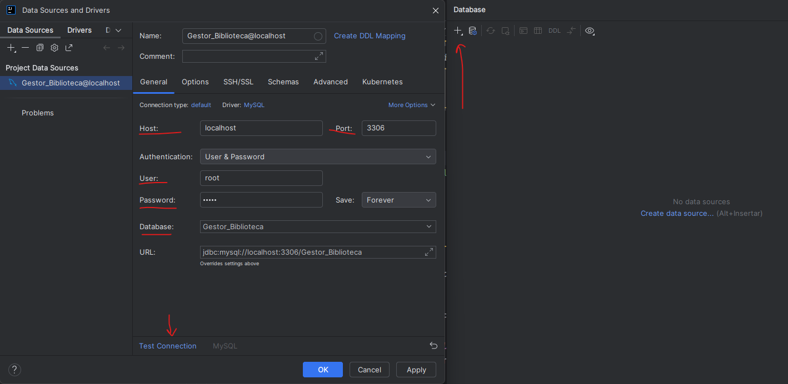
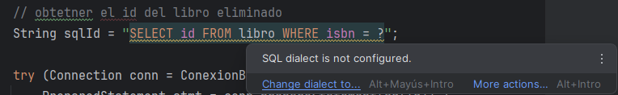
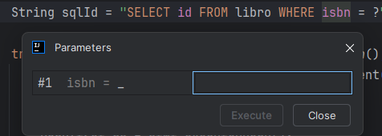
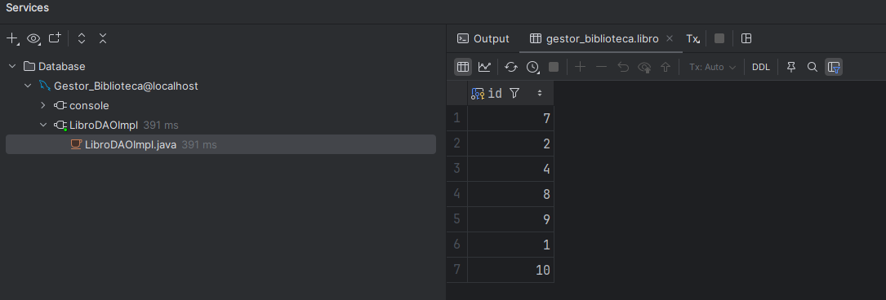
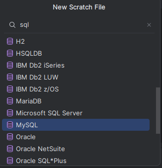
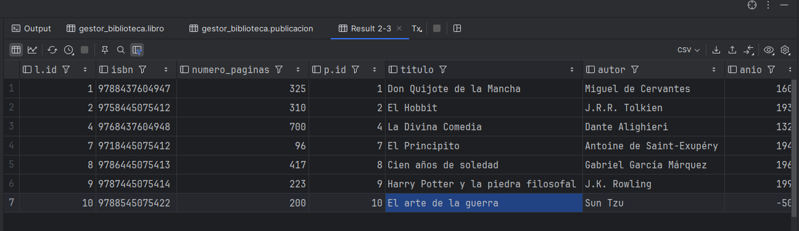
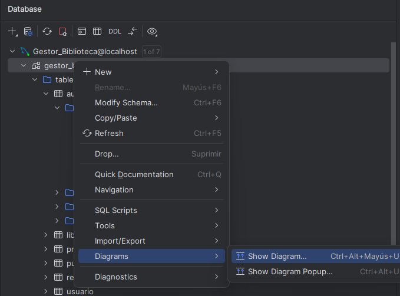
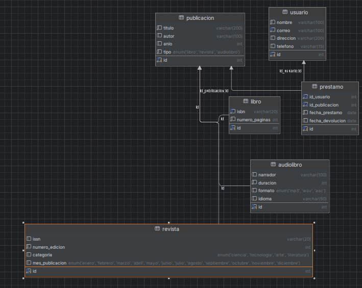

# Introducción al acceso a bases de datos desde Java

## Configuración de IntelliJ para conectarse a MySQL

Cuando estamos trabajando con MySQL desde un programa en Java, utilizando Intellij, es interesante configurar el IDE para que nos facilite el trabajo con la base de datos.

Puedes configurar IntelliJ para que se conecte a tu base de datos real o de desarrollo:

### Pasos para configurar una data source

- Ve al menú: **View > Tool Windows > Database** (o atajo: Alt + 1 → Database)
- Haz clic en + > Data Source > MySQL
- Introduce los datos de conexión:
  - Host, puerto
  - Nombre de la Base de datos
  - Usuario y contraseña

Puedes probar la conexión haciendo clic en el botón **Test Connection**. Si todo está correcto, verás un mensaje de éxito.

## Ventajas de conectar IntelliJ a MySQL

Una vez conectado, IntelliJ puede:

- Validar las sentencias SQL que escribas en strings Java
- Darte autocompletado de tablas y columnas
- Mostrarte un árbol de la estructura de tu base de datos
- Permitirte ejecutar sentencias SQL directamente desde el IDE

## 3. Autocompletado y validación de SQL en Java

Una de las grandes ventajas de tener una base de datos conectada al proyecto es que IntelliJ puede **reconocer y validar las sentencias SQL escritas como cadenas dentro del código Java**.

### ¿Cómo se activa?

Una vez configurada la conexión con la base de datos:

1. Asegúrate de que IntelliJ reconoce la cadena como SQL:
   - Coloca el cursor sobre la cadena SQL en el código Java
   - Presiona `Alt+Enter` y selecciona:  
     **"Inject language or reference" > SQL**

2. Opcionalmente, puedes establecer el dialecto SQL (MySQL):
   - Coloca el cursor sobre la cadena SQL
   - Presiona `Ctrl+Shift+A` y busca: **"Change dialect to..."**

    

    Puedes cambiar el dialecto a nivel de sistema, proyecto o archivo. En nuestro caso, vamos a seleccionar el dialecto **MySQL** tanto a nivel de sistema como de proyecto.

### ¿Qué ventajas ofrece?

- ✔️ Autocompletado de nombres de tablas y columnas
- ✔️ Validación de sintaxis en tiempo real
- ✔️ Detección de errores en queries antes de compilar
- ✔️ Navegación desde nombres de tablas hacia el panel de base de datos

## Ejecutar consultas SQL desde el IDE

Una vez configurado el IDE, podemos ejecutar consultas SQL directamente desde IntelliJ, lo que es muy útil para:

- Probar consultas sin necesidad de un cliente externo
- Ver resultados de forma rápida
- Acelerar el desarrollo y pruebas

Para ello, sobre la consulta SQL, podemos hacer `alt + enter`para abrir el menú contextual y ejecutar `Run query in console`, o bien hacer `ctrl + enter`. En caso de que la consulta sea preparada, nos pedirá los parámetros necesarios para ejecutarla.

Al ejecutarse la consulta, se abrirá una consola presentando los resultados obtenidos.

## Ejecutar scripts SQL desde el IDE

IntelliJ permite crear y ejecutar directamente scripts SQL (.sql) conectados a una base de datos, lo cual es útil para:

- Crear o modificar la estructura de la base de datos
- Insertar datos iniciales
- Probar consultas

### ¿Cómo hacerlo?

1. Crea un archivo `.sql` en tu proyecto (clic derecho > New > Scratch File) y selecciona el tipo `SQL` (en nuestro caso, `MySQL`)
   
   
   O bien importa un archivo SQL existente (puedes arrastrar el archivo al directorio deseado, copiar (Ctrl + C) y pegar (Ctrl + V) ...)
2. Escribe tus sentencias SQL en el archivo
3. Con las sentencias escritas, puedes ejecutarlas de manera idependiente o todo el archivo:
   1. Haciendo clic en el botón de ejecutar (play) en la parte superior derecha del editor.
   2. Desplegando el menú contextual (alt + enter) y seleccionando `Run query in console`

Sobre los resultados, puedes copiarlos al portapapeles, exportarlos a csv...

## 5. Diagramas ER y explorador de estructura

Una vez conectado a una base de datos, IntelliJ ofrece una vista visual del esquema:

### Explorador de estructura

- Panel izquierdo (`View > Tool Windows > Database`)
- Desde ahí puedes:
  - Ver tablas, columnas, claves primarias y foráneas
  - Ejecutar consultas rápidas
  - Ver el diagrama ER de la base de datos

#### Diagramas ER

- Clic derecho sobre la conexión o el esquema > `Diagrams > Show Diagram...`
- IntelliJ generará automáticamente un diagrama con:
  - Relaciones entre tablas
  - Claves primarias y foráneas
  - Posibilidad de exportarlo o imprimirlo

Esto es especialmente útil para comprender o explicar gráficamente el modelo relacional de tu proyecto.

## 6. Consejos de seguridad (usuarios y contraseñas)

Cuando configures conexiones en IntelliJ, ten en cuenta las siguientes buenas prácticas:

### No guardar contraseñas en texto plano

- Usa el **almacén de contraseñas seguro de IntelliJ** (por defecto)
- Puedes forzar esto en `Settings > Appearance & Behavior > System Settings > Passwords`

### Uso de variables de entorno

Si compartes tu proyecto o trabajas en equipo:

- No incluyas archivos `.idea/dataSources.xml` con credenciales
- Considera configurar las conexiones de forma local y dejar la URL sin usuario/clave en el repositorio

### Usa usuarios limitados en desarrollo

- Evita usar cuentas con privilegios `root`
- Crea un usuario específico para la aplicación, con solo acceso a la base correspondiente
